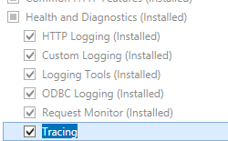
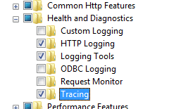

Areas &lt;areas&gt;
====================

## Overview

The `<areas>` collection specifies a list of functional areas for a provider to trace.

## Compatibility

| Version | Notes |
| --- | --- |
| IIS 10.0 | The `<areas>` element was not modified in IIS 10.0. |
| IIS 8.5 | The `<areas>` element was not modified in IIS 8.5. |
| IIS 8.0 | The `<areas>` element was not modified in IIS 8.0. |
| IIS 7.5 | The `<areas>` element was not modified in IIS 7.5. |
| IIS 7.0 | The `<areas>` element of the `<traceProviderDefinitions>` collection was introduced in IIS 7.0. |
| IIS 6.0 | N/A |

## Setup

After you finish the default installation of IIS 7 and later, you must install the tracing role service to use failed request tracing. After you install the role service, you still must enable failed request tracing at the site level, application level, or directory level.

### Windows Server 2012 or Windows Server 2012 R2

1. On the taskbar, click **Server Manager**.
2. In **Server Manager**, click the **Manage** menu, and then click **Add Roles and Features**.
3. In the **Add Roles and Features** wizard, click **Next**. Select the installation type and click **Next**. Select the destination server and click **Next**.
4. On the **Server Roles** page, expand **Web Server (IIS)**, expand **Web Server**, expand **Health and Diagnostics**, and then select **Tracing**. Click **Next**.  
     .
5. On the **Select features** page, click **Next**.
6. On the **Confirm installation selections** page, click **Install**.
7. On the **Results** page, click **Close**.

### Windows 8 or Windows 8.1

1. On the **Start** screen, move the pointer all the way to the lower left corner, right-click the **Start** button, and then click **Control Panel**.
2. In **Control Panel**, click **Programs and Features**, and then click **Turn Windows features on or off**.
3. Expand **Internet Information Services**, expand **World Wide Web Services**, expand **Health and Diagnostics**, and then select **Tracing**.  
    - Click **OK**.
- Click **Close**.

### Windows Server 2008 or Windows Server 2008 R2

1. On the taskbar, click **Start**, point to **Administrative Tools**, and then click **Server Manager**.
2. In the **Server Manager** hierarchy pane, expand **Roles**, and then click **Web Server (IIS)**.
3. In the **Web Server (IIS)** pane, scroll to the **Role Services** section, and then click **Add Role Services**.
4. On the **Select Role Services** page of the **Add Role Services Wizard**, select **Tracing**, and then click **Next**.  
    
5. On the **Confirm Installation Selections** page, click **Install**.
6. On the **Results** page, click **Close**.

### Windows Vista or Windows 7

1. On the taskbar, click **Start**, and then click **Control Panel**.
2. In **Control Panel**, click **Programs and Features**, and then click **Turn Windows Features on or off**.
3. Expand **Internet Information Services**, then **World Wide Web Services**, then **Health and Diagnostics**.
4. Select **Tracing**, and then click **OK**.  
    
 

## How To

There is no user interface for adding trace providers for IIS 7. For examples of how to add trace providers programmatically, see the [Code Samples](#006) section of this document.

## Configuration

### Attributes

None

### Child Elements

| Element | Description |
| --- | --- |
| [`add`](add.md) | Optional element. Adds a functional area to the collection of functional areas to trace. |
| `clear` | Optional element. Removes all references to functional areas from the functional areas to trace collection. |
| `remove` | Optional element. Removes a reference to a functional area from the functional areas to trace collection. |

### Configuration Sample

The following default `<traceProviderDefinitions>` element is configured in the root ApplicationHost.config file in IIS 7.0.

[!code-xml[Main](index/samples/sample1.xml)]

## Sample Code

The following examples add a custom trace provider with two trace areas to the list that is defined in the global `<traceProviderDefinitions>` collection.

### AppCmd.exe

[!code-console[Main](index/samples/sample2.cmd)]

> [!NOTE]
> You must be sure to set the **commit** parameter to `apphost` when you use AppCmd.exe to configure these settings. This commits the configuration settings to the appropriate location section in the ApplicationHost.config file.

### C#

[!code-csharp[Main](index/samples/sample3.cs)]

### VB.NET

[!code-vb[Main](index/samples/sample4.vb)]

### JavaScript

[!code-javascript[Main](index/samples/sample5.js)]

### VBScript

[!code-vb[Main](index/samples/sample6.vb)]