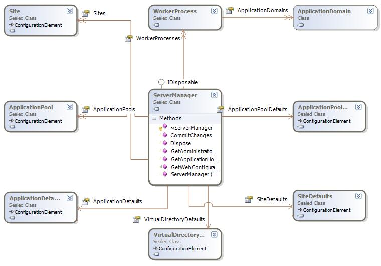
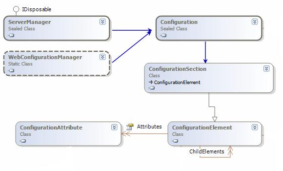
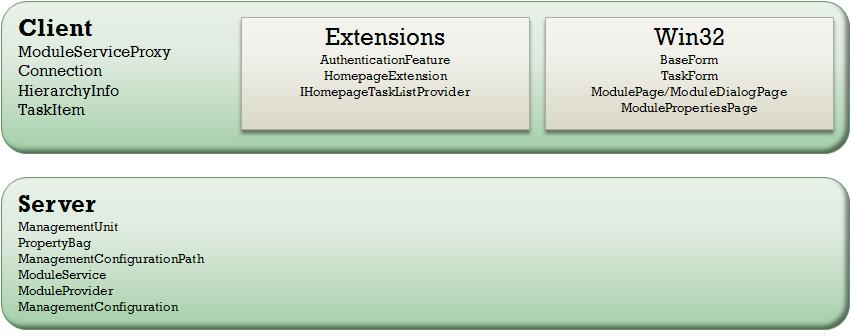

Overview of MWA and MWM for IIS 7.0
====================
by [Janani Ravi](https://twitter.com/LoonyJanani)

## Abstract

Extending the IIS Manager tool to manage custom configuration (in the distributed configuration files) on the IIS 7.0 and above server involves use of APIs from two different assemblies, the Microsoft.Web.Administration.dll and the Microsoft.Web.Management.dll. These APIs should be used for very different actions and have fundamentally different purposes. This document provides a quick overview of what functionality these APIs provide and the relationship between them.

## Introduction

If you are planning to add UI to the IIS Manager (InetMgr) to manage custom settings on the server configuration files, you will use APIs from Microsoft.Web.Administration.dll and Microsoft.Web.Management.dll. The functionality provided by APIs from these assemblies is fundamentally different and could be confusing for a developer using it for the very first time. This article will provide a brief overview of what each of these assemblies offers.

This document contains:

- What is Microsoft.Web.Administration and Microsoft.Web.Management?
- Overview of Microsoft.Web.Administration
- Overview of Microsoft.Web.Management

## What Are Microsoft.Web.Administration and Microsoft.Web.Management?

This section provides a brief introduction to each of these.

### Microsoft.Web.Administration

The Microsoft.Web.Administration (MWA) APIs are built as a managed code wrapper over the Application Host Administration API (AHADMIN) which is a native code interface library. It provides a programmatic way to access and update the web server configuration and administration information.

The Microsoft.Web.Administration.dll is an easy way for users to adjust settings on the server. It does **not** support adding any UI extensibility or functionality. In fact, several UI features in the IIS Manager use this API to manage configuration settings on the back end.

The MWA API is used when a developer wants to write a program in managed code (C#, VB etc) to configure the server in order in a particular manner order. This API is used from standalone console applications or from within a UI feature in the IIS Manager.

These APIs also have support to access configuration at runtime (for example, from a managed module in the IIS pipeline).

### Microsoft.Web.Management

The Microsoft.Web.Management.dll has the framework to add new UI features to the IIS Manager tool. The framework has the extensibility to develop new features and provides the base classes and other functionality. This allows user defined extensions to be first-class citizens in the UI, and they have a look and feel identical to the built-in IIS and ASP.Net features.

The IIS Manager has a modular infrastructure where every UI feature is its own entity and has to be individually registered with the tool. The client-server architecture of IIS Manager separates the logic, which manipulates server settings from the code. This displays these settings in a user-friendly manner. Each feature in the tool follows this client-server paradigm. This is enforced by providing well-defined base classes for server-side and client UI code in the IIS manager.

This API also provides the extensibility mechanism to develop UI features represented as lists, property grids, custom designed Actions panes, modal wizards and dialogs (to name a few).

Many of the existing UI features which ship with the tool use the MWA APIs (in the server-side code) to access configuration.

## Microsoft.Web.Administration

As mentioned earlier, the MWA APIs can be used to manipulate settings on the server. They provide built-in strongly typed access to sites, applications and virtual directories configured for IIS. These APIs also allow users to generate their own strongly-typed classes representing specific configuration sections and thus build an easy way to access properties and other information stored in these sections.

This is by no means a comprehensive list and this assembly offers much more than what is described here.

### ServerManager and Sites, Applications and Virtual Directories

The entry point to administering the server properties is the ServerManager class. The ServerManager has a reference to the list of all the sites on that IIS server and individual sites are accessed by indexing into the sites collection.

Applications and virtual directories are accessed in a similar manner. These entities also provide runtime state information (e.g. whether a site is started/stopped). Updates are made to the default settings for the entire server or to properties which belong to an individual entity (e.g. updates to a particular site).

The server settings are updated when CommitChanges is called on the ServerManager.

Here is an overview of some of the strongly typed classes offered by this assembly:

### Accessing Individual Configuration Files

The distributed configuration file model that IIS uses allows a site, application, virtual directory or even a folder to have its configuration in a web.config file.

It is possible to access individual configuration files in order to adjust the settings for a particular entity. The ServerManager method GetApplicationHostConfiguration is used to access the applicationHost.config, while the method GetWebConfiguration accepts parameters to get specific configuration files.

### Generic Base Classes for Extensibility

The IIS configuration system allows you to create a section where you specify properties relevant to your application. Using the MWA APIs, create strongly-typed classes in managed code in order to manipulate these settings. Some of the base classes which facilitate this are:

- **Configuration:** represents a single configuration file (applicationHost.config or the web.config files for sites and applications)
- **ConfigurationElement:** a generic entity used to represent an element in a configuration file. This is the base class for configuration sections, collection entries, nested elements in a section etc.
- **ConfigurationAttribute:** represents a property within a ConfigurationElement
- **ConfigurationSection:** derives from ConfigurationElement and represents a section defined in the IIS schema files. Used to access the various properties of a section.
- **ConfigurationElementCollection:** A collection class comprising of ConfigurationElements. Also derives from ConfigurationElement.

A simple overview of generic configuration extensibility is shown below:

### Runtime Access to Configuration

The WebConfigurationManager is used for runtime access to the server's configuration settings. A managed module loaded into the IIS pipeline accesses the configuration settings in its particular context (e.g. a request to a particular site) by referencing this class.

## Microsoft.Web.Management

The Microsoft.Web.Management (MWM) APIs are the building blocks for developing server-side code to manipulate administration settings and the client side user interface features (which allow users to view and manipulate these settings in a friendly manner).

Brief descriptions of some of the important classes in each namespace are given below. Again, this is not a comprehensive list and this assembly offers much more that what is discussed here.

A high level view of what this assembly offers:

### Microsoft.Web.Management.Server

Classes deriving from the **ModuleProvider** base class form the entry point for the IIS Manager to identify a UI module. This is the class which must be registered in the administration.config for IIS Manager to display it as a part of its feature set.

Classes deriving from the **ModuleService** base class form the meat of the server side administration. These classes perform the actual server settings manipulation. Methods in the class which must be visible to the UI client are marked with the **ModuleServiceMethod** attribute.

The **ManagementUnit** gives the developer the context in which the server is administered. For example, the SiteManagementUnit and the ApplicationManagementUnit correspond to site connections and application connections in the IIS Manager tool. The ModuleService base class exposes the current ManagementUnit which can be used to access information about the current context.

**ManagementConfigurationPath** is a class which represents a path (to the current server, site, application or folder). If you are administering a site, then this holds the site name and other relevant information about the site. The ManagementUnit exposes the current ManagementConfigurationPath.

The **ManagementConfiguration** is a helper class to access and manipulate configuration settings at the server. This is a very powerful abstraction for the Configuration class in the MWA API defined earlier and allows you to query for sections without worrying about whether these sections are defined in applicationHost.config or in the root web.config.

The **PropertyBag** is a kind of container used to hold information which is transferred between the client and server. This is implemented as a generic dictionary.The dictionary is serialized to a string while transferring data in scenarios in which the server is administered remotely.

### Microsoft.Web.Management.Client

Classes derived from the **Module** base class form the entry point for a feature to register its UI components. This indicates whether the UI for this module is a page (displayed in the center pane of the IIS Manager), a node in the tree or simply a task in the Actions pane (to list a few examples).

The **ModuleServiceProxy** is the base class for the method stubs used to access the actual service methods specified in the **ModuleService** on the server.

The **HierarchyInfo** represents a node in the tree view and supports several actions on the node.

The **Connection** class has all the context information for the current management session (a management session defining a connection to a server, site or an application). It provides helpers to access services, create proxies, etc.

The **TaskItem** is the base class for the tasks added to the Actions pane in the IIS Manager. Classes like **MethodTaskItem**, **TextTaskItem** etc. derive from this base class and display links, labels, alerts and other information in the Actions pane. The developer does not have to write any additional UI code in order to display these actions.

### Microsoft.Web.Management.Client.Win32

The **ModulePage** is the base class for all features which display a "page" in the center pane of the IIS Manager tool. Classes such as ModuleListPage, ModuleDialogPage and ModulePropertiesPage all derive from the ModulePage. These are base classes which provide an easy way to develop pages that display lists, dialogs and property grids.

The **TaskForm** base class allows developers to create forms which are shown as a modal dialog.

The **WizardForm** forms the base classes of all dialogs. Developers can specify several **WizardPage** derived classes to plug into the wizard.

### Microsoft.Web.Management.Client.Extensions

The classes in this namespace provide client-side extensibility using the IExtensibilityManager. For example, the AuthenticationFeature has the tasks for every entry in the Authentication feature in the InetMgr tool.

This is a brief overview of the functionality that the Microsoft.Web.Administration and the Microsoft.Web.Management APIs offer a developer who wishes to extend the configuration and the UI to add his own features. For more in-depth descriptions of how configuration extensibility and UI extensibility work, see the individual articles which cover these topics.
  
  
[Discuss in IIS Forums](https://forums.iis.net/1042.aspx)