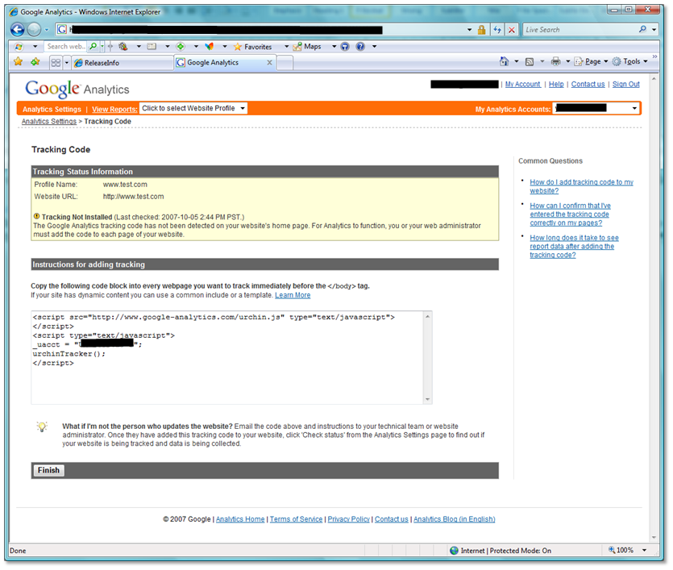
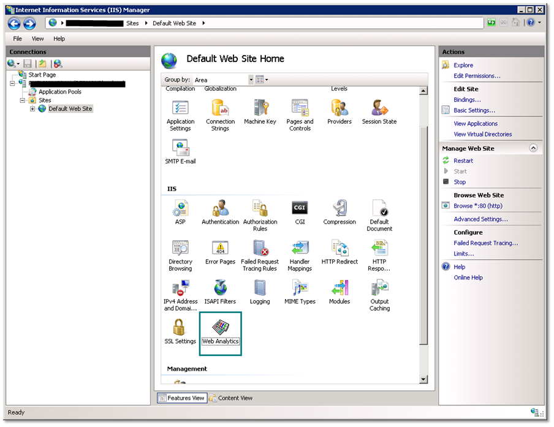
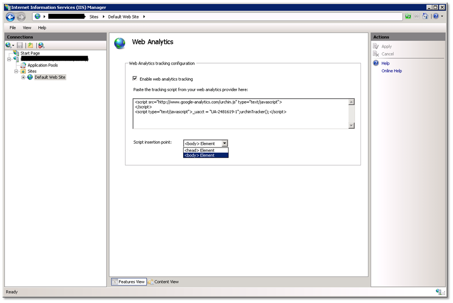
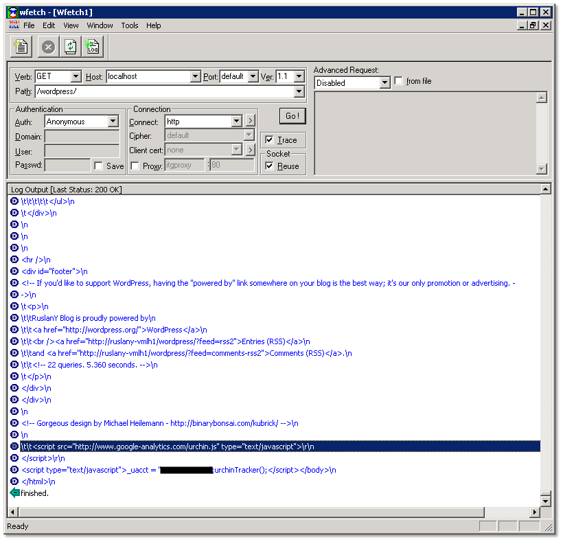

Sample: Web Analytics Tracking Module
====================
by [Ruslan Yakushev](https://github.com/ruslany)

The Web Analytics is a popular technology space today. Its purpose is to provide web site owners with statistical information about visitors to their sites, so that site publisher can optimize the content, advertisement and service offering to increate the customer satisfaction and ROI.

The web analytics services have been around for a while but they have become very popular after Google has made its [analytics service](https://www.google.com/analytics) a free offering to everybody. Now any site owner – from personal hobbyists to big commercial portals – got access to a free and feature rich web analytics service. Microsoft is also providing a free Web Analytics service that is offered as part of [Microsoft AdCenter](https://adcenter.microsoft.com/).

The Web Analytics Module for IIS allows web site publishers to easily enable basic web analytics tracking of their web sites, without touching the actual web application code.

The source code for the sample is available [here](sample-web-analytics-tracking-module/_static/sample-web-analytics-tracking-module-480-webanalyticsmodule1.zip "WebAnalyticsModule").

## Problems with current web analytics services

The basic purpose of Web Analytics Service is to collect data about web site visitors, then process this data and present it to site owners in a nice, easy to digest form. In order to collect the data, web site owner has to instrument all the pages on his web site with the tracking script issued by the web analytics service provider:

The main pain point with asking user to do this is that it may potentially require considerable amount of work to modify all the web pages. In some cases this can be mitigated by using templates and master pages, but in many cases user would still need to go through his html pages and add the tracking script at the end of every document.

## Web Analytics Module benefits and features

The Web Analytics Module for IIS tries to solve the above mentioned problem by allowing users to separate the tracking logic from the actual web site implementation. Instead of modifying the web site pages, now user can just configure the IIS setting and the tracking script will be automatically inserted into all html responses, produced by his web site. The main benefit provided by this module is that Web Analytics instrumentation becomes very easy. Another benefit is that user can easily turn the analytics tracking on/off, which is useful for development/testing scenarios.

Web Analytics module sample demonstrates the following:

- How to implement a .NET module that inserting tracking script into the HTTP responses.
- How to extend IIS configuration and provide UI for the module in IIS manager. The module UI and configuration allow user to specify the tracking script and to enable/disable web analytics tracking. It also allows user to choose where the tracking code should be placed to (&lt;head&gt; or &lt;body&gt; element of HTML document).

## Module setup

To start using the module, first compile it from this Visual Studio solution. You can use VS 2005, VS2008 or Visual C# Express 2005 and 2008 to compile the solution. You may also use the precompiled versions in the bin\release folder.

To install the module follow these steps:

1. Copy the WebAnalyticsModule.dll to a bin folder within your web site or application
2. Copy the WebAnalytics\_schema.xml to "%windir%\system32\inetsrv\config\schema" folder.
3. Add the following to the "%windir%\system32\inetsrv\config\applicationhost.config" file: In the sectionGroup for "system.webServer", add the section definition: &lt;section name="webAnalytics" overrideModeDefault="Allow"&gt;
4. Add module to a web site or an application by opening corresponding web.config file and adding the following section to the &lt;system.webServer&gt; element:  

    [!code-xml[Main](sample-web-analytics-tracking-module/samples/sample1.xml)]
5. Next, use the gacutil tool to put the module to the Global Assembly Cache so that IIS Manager can use them:  

    [!code-console[Main](sample-web-analytics-tracking-module/samples/sample2.cmd)]
6. Add the module to the IIS Manager configuration in the "%windir%\system32\inetsrv\config\administration.config" file:  

    - In the &lt;moduleProviders&gt; collection, add the following entry:  

        [!code-xml[Main](sample-web-analytics-tracking-module/samples/sample3.xml)]
    - And add the following line to the &lt;modules&gt; collection:  

        [!code-xml[Main](sample-web-analytics-tracking-module/samples/sample4.xml)]
7. Open the IIS Manager. You should see the "Web Analytics Tracking" icon in the feature view for your web site or application.

## Module walkthrough

After module is installed you will see Web Analytics configuration in the main IIS control panel. This will be available on site and application level.

The configuration UI for the Web Analytics module looks as below:

After the module has been configured, we can see how it works by requesting the web page from the server by using [WFetch](https://www.microsoft.com/downloads/details.aspx?FamilyID=b134a806-d50e-4664-8348-da5c17129210&amp;displaylang=en). The output from web server contains the tracking script before the closing &lt;body /&gt; tag:

[Discuss in IIS Forums](https://forums.iis.net/1042.aspx)