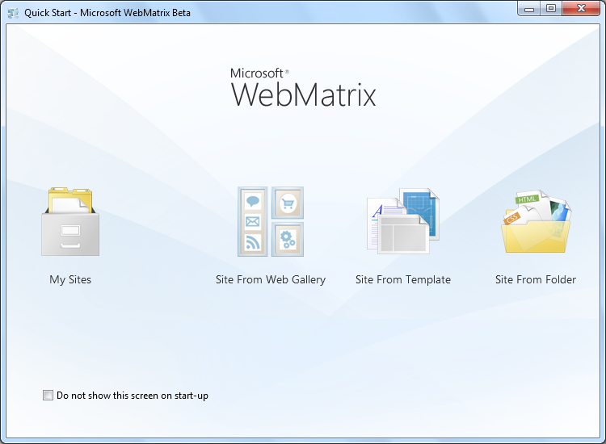
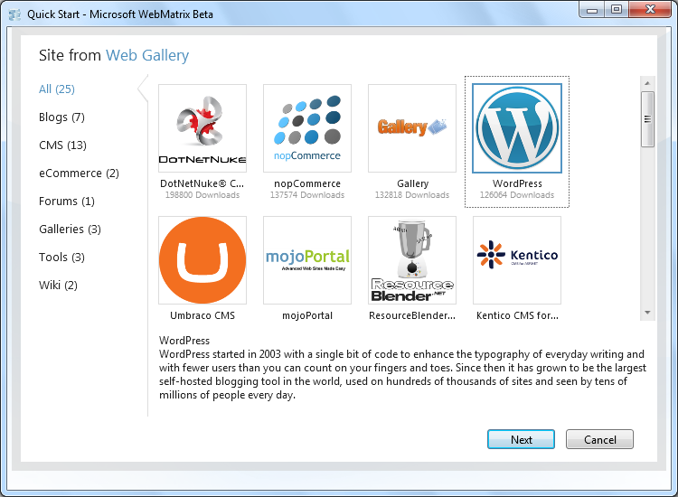
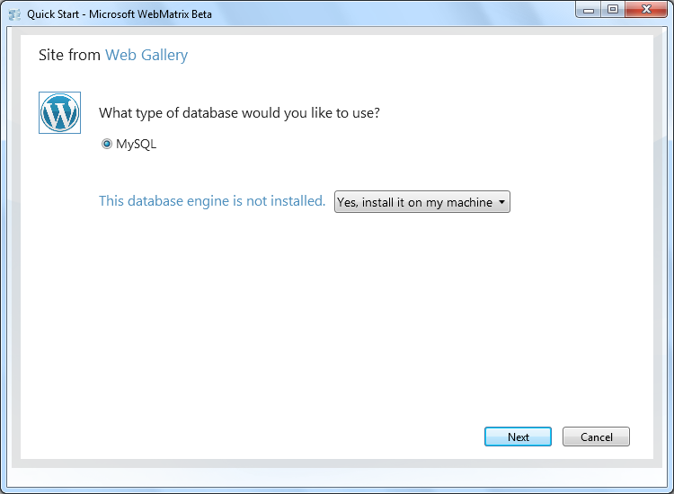
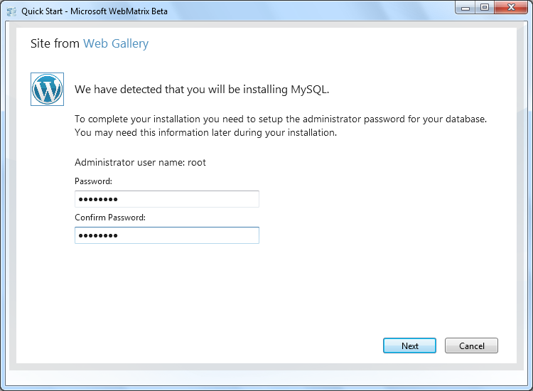
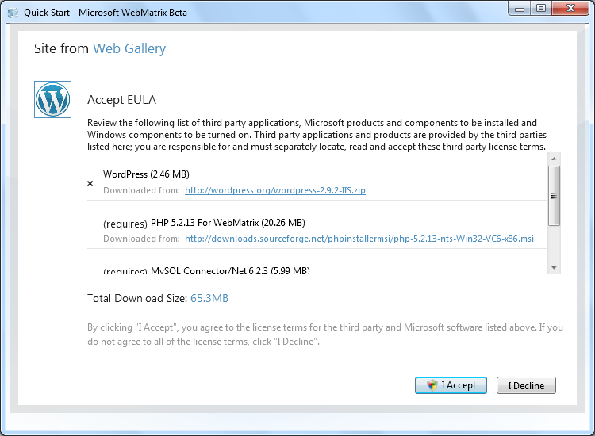
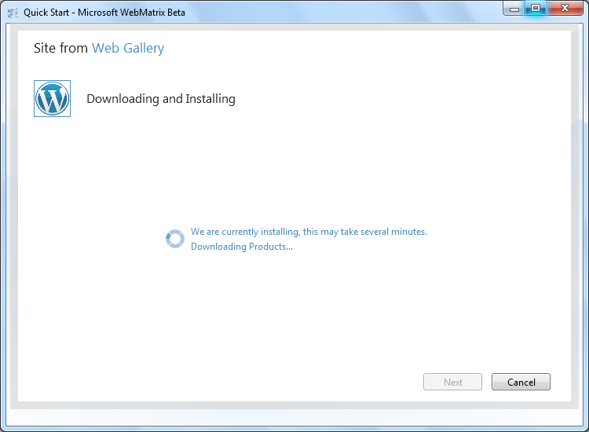
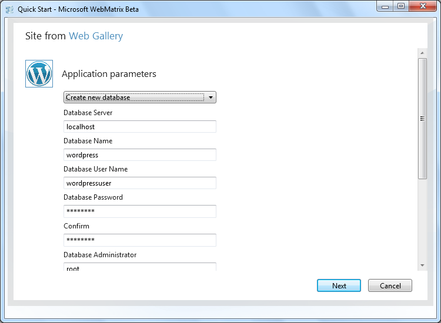
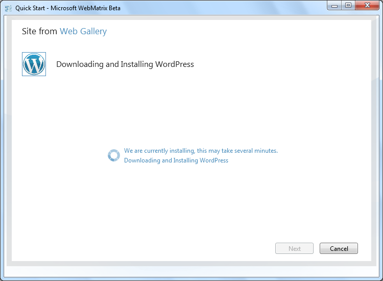
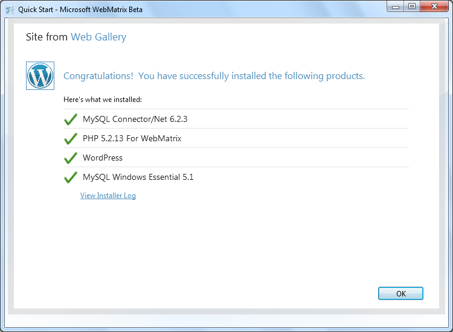
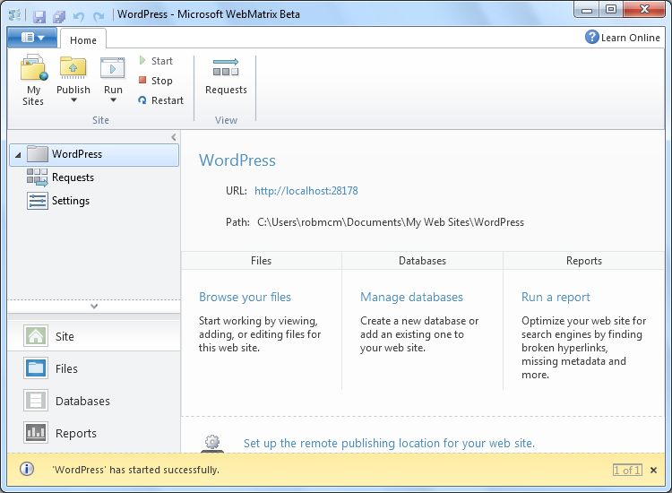

Download and Install a PHP Application
====================
by [Robert McMurray](https://github.com/rmcmurray)

[This is preliminary documentation and is subject to change.]

## Overview

This walkthrough shows the steps to download and install a PHP application using WebMatrix Beta, and includes an example that uses the WordPress application.

### Prerequisites

The following items are required to complete the procedures in this walkthrough:

- You must be using a computer with one of the following operating systems installed: 

    - Windows 7, Windows Vista, or Windows XP SP2 or a later version of Windows XP.
    - Windows Server 2008 or Windows Server 2008 R2.
    - Windows Server 2003 SP1 or later.
- You must have WebMatrix Beta installed. For information about how to install WebMatrix Beta, see [Microsoft Web Platform Installer 3.0](https://go.microsoft.com/fwlink/?LinkID=145510).

## Downloading and Installing WordPress

To install WordPress using WebMatrix Beta, open WebMatrix. Then on the WebMatrix Beta **Quick Start** page, click **Site from Web Gallery**.

When the **Site from Web Gallery** wizard opens, you will see a wide selection of applications to choose from. Click **WordPress**, and then click **Next**.

You need a MySQL database service to run WordPress. If MySQL is not installed on your local computer, you'll be prompted to install it. If you would like to use a local installation of MySQL on your computer, choose **Yes, install it on my machine** and then click **Next**. To use a remote instance of MySQL server, choose **No, use a remote server**.

If you are prompted to enter the root password for the MySQL database engine, you will need to enter a password and then click **Next**.

> [!NOTE]
> The root account is used for administering an instance of the MySQL database engine.

On the **Accept EULA** page, read the terms, and if you accept them, click **I Accept**.

On the next page, WebMatrix will keep you informed of the download status.

When you are prompted, enter the following information:

- Enter the name of your MySQL database server. You can use "localhost" if you are using your local computer, or you can enter the name of a remote MySQL server.
- Enter the name of the database for your WordPress application. You can choose any name for your database, but you might want to try something as simple as "wordpress" if you are creating your first WordPress site on your local computer.
- Enter a database user name and password for the database that you are creating. This is not the root password that you entered earlier when you installed MySQL; the WordPress application will use this account to access the information for the database that WebMatrix will create for your WordPress application.
- Enter the administrator name and password for your database server. If you install MySQL on your local computer, you'll need to specify the MySQL root user name and password that you entered.

Once you have entered all of the required information, click **Next**.

On the next page, WebMatrix keeps you informed of the installation status.

When the installation has completed, WebMatrix lists everything that was installed. Click **OK** to close the **Site from Web Gallery** wizard.

When the **Site from Web Gallery** wizard has closed, WebMatrix automatically opens the WordPress application.

You can customize the WordPress application for your use, test your website locally using the IIS Express Web server that comes with WebMatrix, or publish it to a public website.
  
  
[Discuss in IIS Forums](https://forums.iis.net/1166.aspx)