Download and Install an ASP.NET Application
====================
by [Robert McMurray](https://github.com/rmcmurray)

[This is preliminary documentation and is subject to change.]

## Overview

This walkthrough shows the steps to download and install an ASP.NET application using WebMatrix Beta, and includes an example that uses the ScrewTurn Wiki application.

### Prerequisites

The following items are required to complete the procedures in this walkthrough:

- You must be using a computer with one of the following operating systems installed: 

    - Windows 7, Windows Vista, or Windows XP SP2 or a later version of Windows XP.
    - Windows Server 2008 or Windows Server 2008 R2.
    - Windows Server 2003 SP1 or later.
- You must have WebMatrix Beta installed. For information about how to install WebMatrix Beta, see [Microsoft Web Platform Installer 3.0](https://go.microsoft.com/fwlink/?LinkID=145510).

## Downloading and Installing ScrewTurn Wiki

To install ScrewTurn Wiki using WebMatrix Beta, first open WebMatrix. Then on the WebMatrix Beta **Quick Start** page, click **Site from Web Gallery**.

[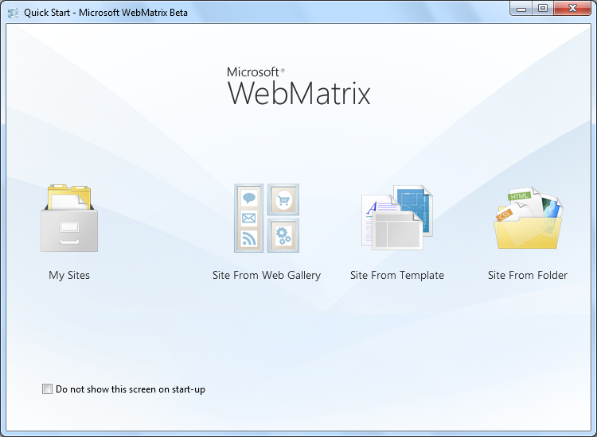](download-and-install-an-aspnet-application/_static/image2.png)

When the **Site from Web Gallery** wizard opens, click **ScrewTurn Wiki**, and then click **Next**.

[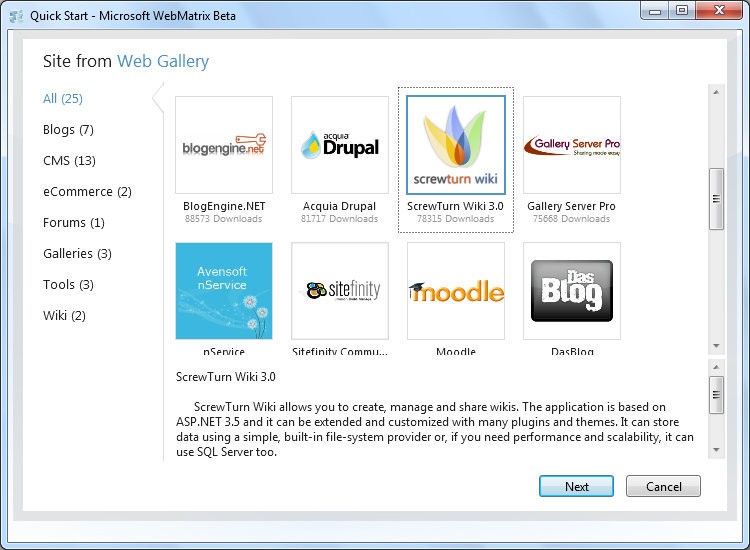](download-and-install-an-aspnet-application/_static/image6.png)

WebMatrix uses a SQL Server database as part of ScrewTurn Wiki. If SQL Server is not installed on your local computer, you'll be prompted to install SQL Server Express. If you would like to use a local installation of SQL Server, choose **Yes, install it on my machine**, and then click **Next**. To use a remote installation of SQL Server, choose **No, use a remote server**.

[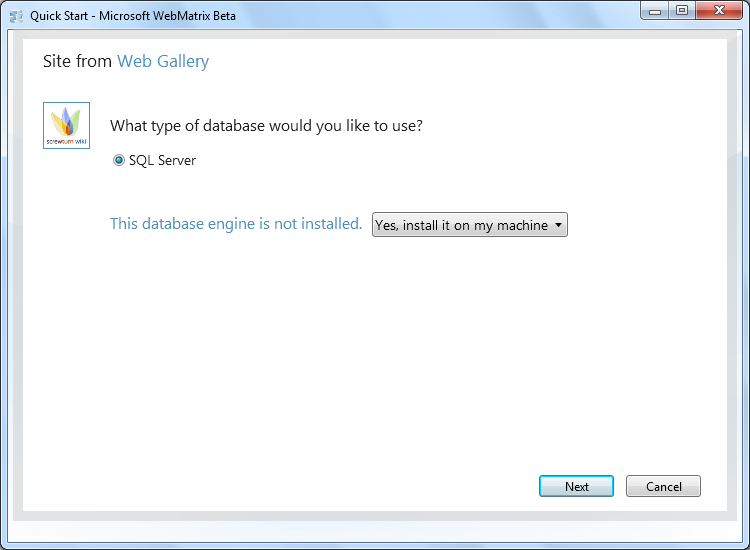](download-and-install-an-aspnet-application/_static/image10.png)

If you are prompted to enter the SQL Server administrator password, enter a password and then click **Next**.

> [!NOTE]
> The SQL Server administrator account is used for administering the SQL Server database.

[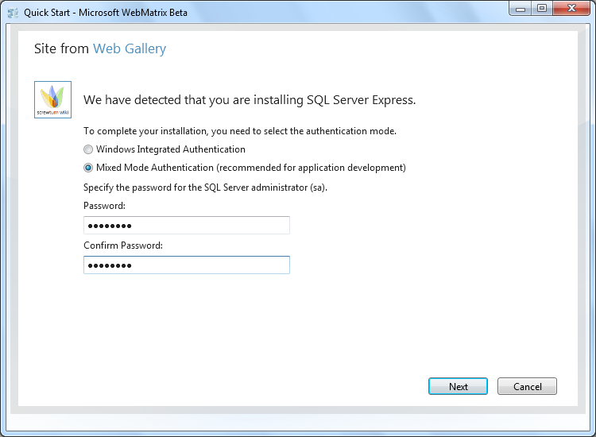](download-and-install-an-aspnet-application/_static/image14.png)

On the **Accept EULA** page, click **I Accept**.

[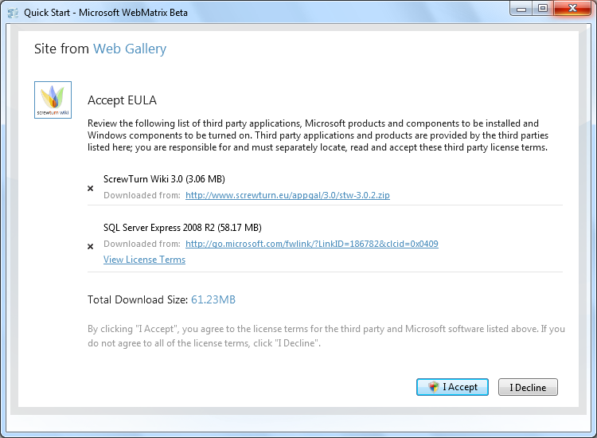](download-and-install-an-aspnet-application/_static/image18.png)

On the next page, WebMatrix keeps you informed of the download and installation status.

[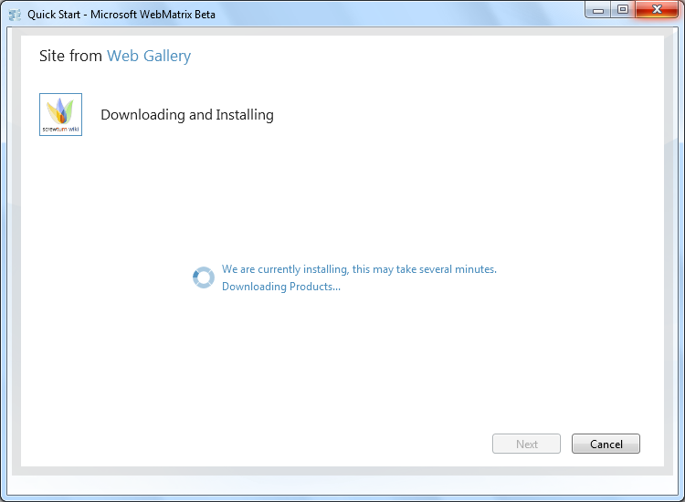](download-and-install-an-aspnet-application/_static/image22.png)

When you are prompted, enter the following information:

- Enter the instance name of your copy of SQL Server. For example, if you are using SQL Server Express on your local computer, you can use the name ".\SQLEXPRESS".
- Enter a database name for your ScrewTurn Wiki application. You can choose any name for your database, such as "ScrewTurnWiki" if you are creating your first ScrewTurn Wiki site on your local computer.
- Enter the database administrator name and password – the SQL Server administrator account and password for your instance of SQL  
 Server.
- Scroll down to enter a user name and password for the Wiki database that you are creating. This is not the administrator password   
 for SQL Server; it's the account for the database that WebMatrix will create for the ScrewTurn Wiki application.

Once you have entered all of the required information, click **Next**.

[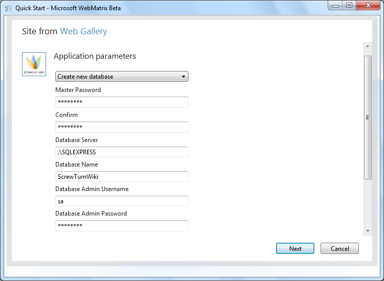](download-and-install-an-aspnet-application/_static/image26.png)

[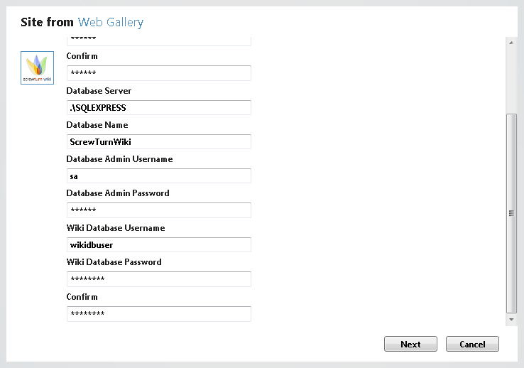](download-and-install-an-aspnet-application/_static/image30.png)

On the next page, WebMatrix will keep you informed of the installation status.

[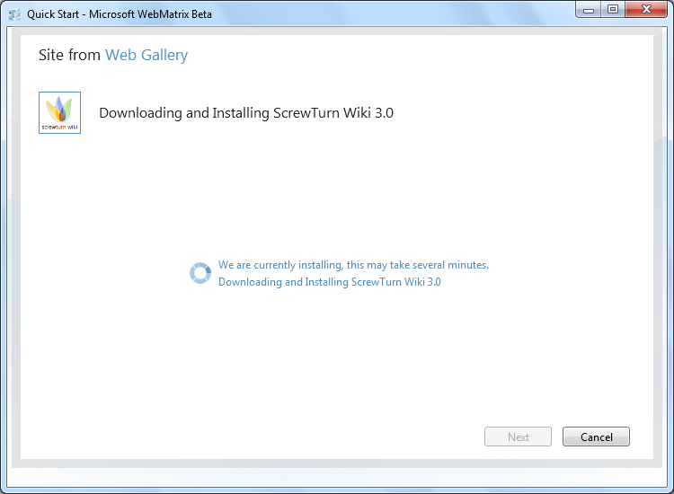](download-and-install-an-aspnet-application/_static/image32.png)

After the installation has completed, WebMatrix lists everything that was installed. Click **OK** to close the **Site from Web Gallery** wizard.

[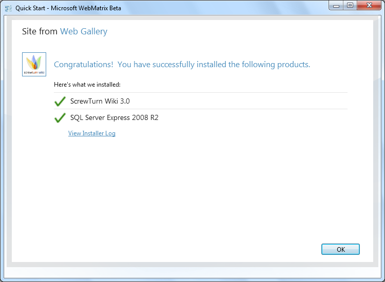](download-and-install-an-aspnet-application/_static/image36.png)

After the **Site from Web Gallery** wizard has closed, WebMatrix automatically opens your ScrewTurn Wiki application.

[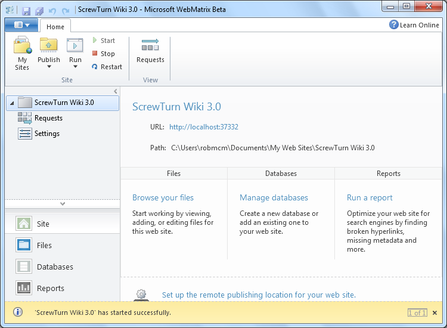](download-and-install-an-aspnet-application/_static/image40.png)

You can customize the ScrewTurn Wiki application for your use, test your website locally using the IIS Express Web server that comes with WebMatrix Beta, or publish it to a public website.
  
  
[Discuss in IIS Forums](https://forums.iis.net/1166.aspx)