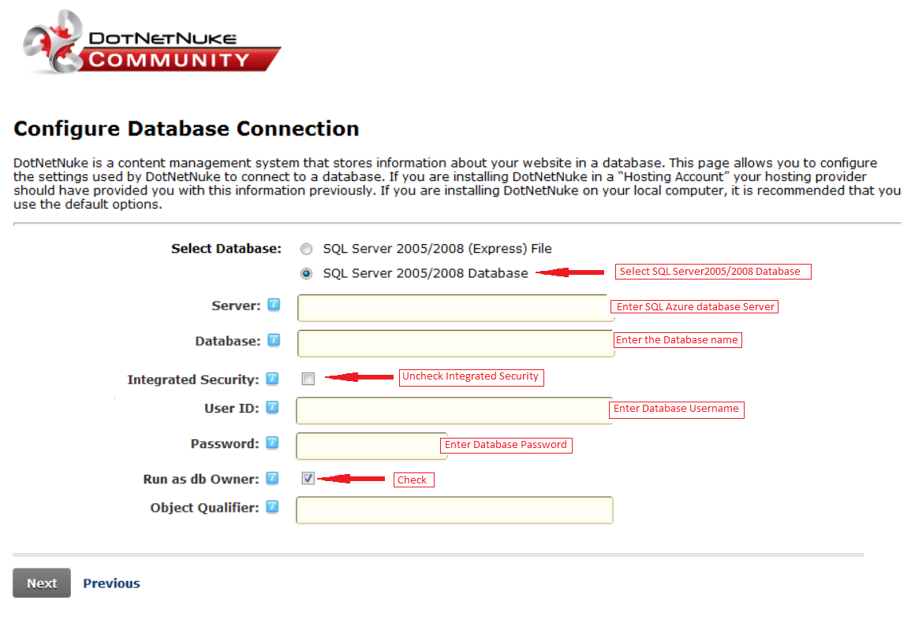
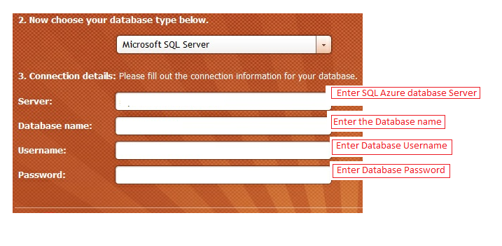
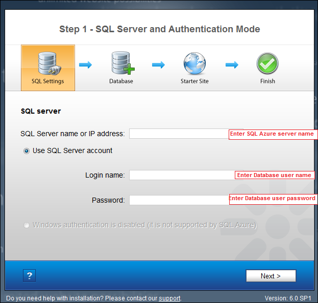
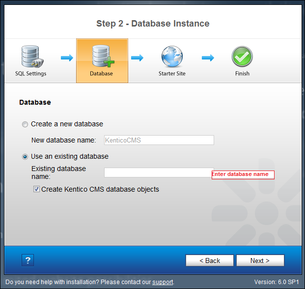
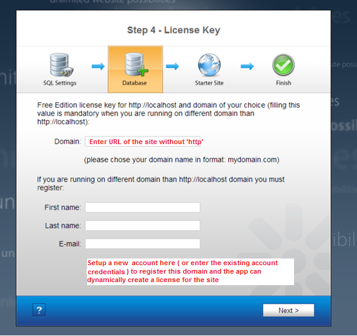

Azure App Gallery FAQ
====================
by [Sunitha Muthukrishna](https://github.com/SunBuild)

## Introduction

With just a few mouse clicks the Windows Web Application Gallery lets you select, download and install popular web applications like blogs, content management systems, wikis or media galleries onto Azure. The following FAQ describes additional information that you may need when you are configuring several popular applications on Azure.

## DotNetNuke Community and Professional Editions:

The database information must be re-entered to complete installation of DotNetNuke. You can view this information in the dashboard of your newly created site on the right side.

Once you have the database information, in the Database configuration step of DotNetNuke install wizard enter this database information as seen below

## Acquia Drupal and Drupal Commerce:

Once either of these apps are deployed; the app runtime installer needs to run. Please click on the &quot;Setup&quot; icon to continue the installation.

If &quot;Setup&quot; is not clicked and you browse the site you may see this error. This occurs since the app is not configured yet. To resolve this append install.php to the URL and run this script; for example [http://mysitename.azurewebsites.net/install.php](http://mysitename.azurewebsites.net/install.php)

## Umbraco CMS

Click on Setup in the notification bar once Umbraco is successfully deployed to configure your Umbraco site.

Umbraco install wizard will request you to re-enter the database information. You can view this information in the dashboard of your newly created site on the right side

Once you have the database information, re-enter this is the Umbraco install wizard

## Kentico CMS

 The database information must be re-entered to complete installation of Kentico CMS. You can view this information in the dashboard of your newly created site on the right side.

When you browse the app, Kentico CMS installation wizard request the database server name and database user information to be entered. Please refer to the connection string for this information.

Now select &quot;Existing database&quot; and enter the database name from the connection string.

Finally, a license needs to be created for the app as seen here. Continue with the wizard to complete the app installation.

