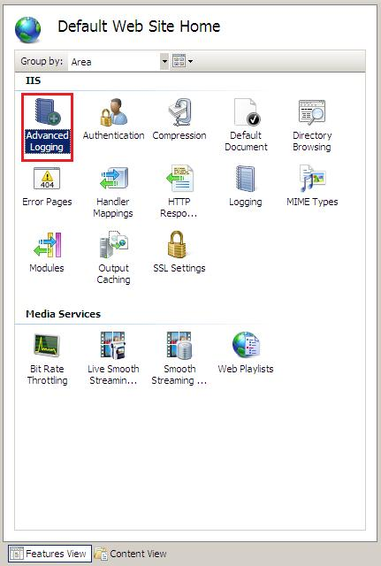
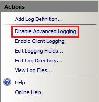
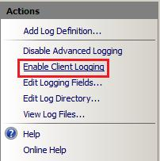
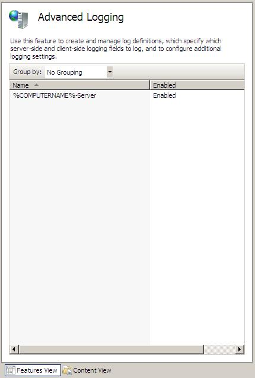
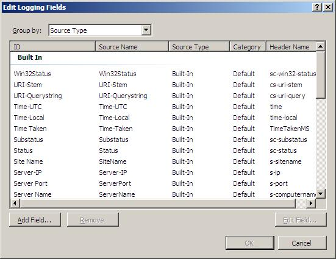
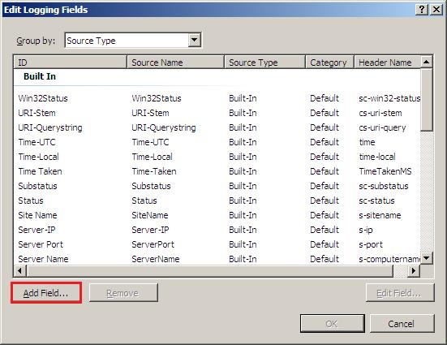
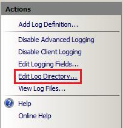

Advanced Logging for IIS - Custom Logging
====================
by [Vishal Sood](https://twitter.com/vishalsood)

IIS Advanced Logging provides tremendous flexibility in logging user requests and client data. Advanced Logging doesn't assume what's important to you. Instead, it provides enough control for you to specify what fields are important, add additional fields with ease, and provide policies around log file rollover and request filtering. You can log any of the HTTP request/response headers, IIS server variables, and client-side fields with simple configuration in IIS Manager.

In this article:

- [Installation](advanced-logging-for-iis-custom-logging.md#install)
- [Concepts](advanced-logging-for-iis-custom-logging.md#concepts)
- [About the Advanced Logging User Interface](advanced-logging-for-iis-custom-logging.md#using)
- [Adding Custom Logging Fields](advanced-logging-for-iis-custom-logging.md#custom)
- [Adding Log Definitions](advanced-logging-for-iis-custom-logging.md#adddef)
- [Storing Log Files](advanced-logging-for-iis-custom-logging.md#store)
- [Summary](advanced-logging-for-iis-custom-logging.md#summary)

## Installation

The following prerequisites must be fulfilled to install IIS Advanced Logging:

- You must use IIS 7 running on one of the following operating systems:

    - Windows Server 2008
    - Windows Server 2008 R2
    - Windows Vista with SP1
    - Windows 7
- To manage IIS Advanced Logging using the IIS Manager user interface, the IIS Management Console for IIS must be installed.

The following options are available for installing IIS Advanced Logging:

- Web Platform Installer
- Windows Installer files (for 32-bit and 64-bit versions of the selected operating system)

The "Installation Notes" section of the [Advanced Logging Readme](advanced-logging-readme.md) contains detailed instructions for each of these installation options.

## Concepts

**Log definition**. Defines the fields that are logged in each log file generated on the web server. It also sets additional options, such as log file rollover interval, base log file name, and so on.

**Global logging fields**. Advanced Logging maintains a master list of logging fields (the *global logging fields list*) that an administrator can add to log definitions in IIS Manager. Custom logging fields can be added to the global logging fields list (and by extension, to log definitions) using the IIS management interface. Custom logging fields can be added from the following source types:

- **Modules**. Logging fields published by other IIS modules. Client-side fields use this option.
- **Request headers**. Standard and custom HTTP headers that are included in a request.
- **Response headers**. Standard and custom HTTP headers that are included in a request response.
- **Server variables**. [IIS server variables](https://go.microsoft.com/?linkid=9656626).

## About the Advanced Logging User Interface

This section contains the following topics about the IIS Advanced Logging UI:

- [Opening Advanced Logging](advanced-logging-for-iis-custom-logging.md#open)
- [Enabling and Disabling Server Logging](advanced-logging-for-iis-custom-logging.md#server_logging)
- [Enabling and Disabling Client Logging](advanced-logging-for-iis-custom-logging.md#client_logging)
- [About Log Definitions](advanced-logging-for-iis-custom-logging.md#aboutlogdefs)
- [About the Global Logging Fields List](advanced-logging-for-iis-custom-logging.md#aboutglobalfields)

### Opening Advanced Logging

IIS Advanced Logging can be configured for servers, websites, and directories in IIS Manager. To open the Advanced Logging feature, click the server, website, or directory in the **Connections** pane, and then double-click the **Advanced Logging** icon on the **Home** page.  

### Enabling and Disabling Server Logging

By default, IIS Advanced Logging is disabled after you install it. To enable the feature so that it can handle log messages from other web server components, open it at the server level in IIS Manager, and then in the **Actions** pane, click **Enable Advanced Logging**.

To disable the feature at a later time, open it at the server level in IIS Manager, and then in the **Actions** pane, click **Disable Advanced Logging**.  

### Enabling and Disabling Client Logging

By default, client logging in the Advanced Logging feature is disabled after you install it. To enable client logging in the Advanced Logging feature so that it can handle client log messages that are received as XML data via HTTP POST messages, open the Advanced Logging feature at the server level in IIS Manager, and then in the **Actions** pane, click **Enable Client Logging**.  

To disable client logging at a later time, open the Advanced Logging feature at the server level in IIS Manager, and then in the **Actions** pane, click **Disable Client Logging**.  

> [!NOTE]
> For more information about how to use Client Logging, see [Advanced Logging for IIS - Client Logging](advanced-logging-for-iis-client-logging.md).

### About Log Definitions

The Advanced Logging feature displays all of the log definitions that are available on the server on the server **Home** page in IIS Manager. The following figure displays the log definition **%COMPUTERNAME%-Server**, which is installed by default and captures some fields of interest from a content delivery perspective.  

To view the the fields that are included in this log definition, click the log definition name, and then in the **Actions** pane, click **Edit Log Definition**. This opens the **Log Definition** feature page for the selected log definition, as shown in the following figure:

### About the Global Logging Fields List

The global logging fields list contains all of the logging fields that can be added to log definitions. To view the global logging fields list, open the Advanced Logging feature at the server, website, directory, or application level in IIS Manager, and then in the **Actions** pane, click **Edit Logging Fields**.  

This action opens the **Edit Logging Fields** dialog box, which displays the logging fields that are included in the default installation of IIS Advanced Logging.  
  
  
To learn more about adding custom logging fields to the global logging fields list, see [Adding Custom Logging Fields](advanced-logging-for-iis-custom-logging.md#custom).

## Adding Custom Logging Fields

This section describes how to add a custom logging field to the global logging fields list. In the following examples, we'll use a custom HTTP response header **author** as the custom logging field. This custom response header returns the webpage author's name in the response to clients.

To add a custom logging field to the global logging fields list, do the following:

1. In IIS Manager, open the Advanced Logging feature at the server, website, virtual directory, or application level.
2. In the **Actions** pane, click **Edit Logging Fields** to open the **Edit Logging Fields** dialog box. The dialog box displays the logging fields that are available by default.
3. In the **Edit Logging Fields** dialog box, click the **Add Field** button.  
    
4. In the **Add Logging Field** dialog box, specify settings and values for the custom logging field.  
    

- **Field ID**. Type a friendly name (for example, **Author**) that will be included in the log definition and displayed in the global logging fields list.
- **Source type**. Select **Response Header**.
- **Source Name**. Enter **author** as the HTTP response that you want to log.

## Adding Log Definitions

This section describes how to use the custom logging field **Author** that we added in the [previous section](advanced-logging-for-iis-custom-logging.md#custom) in a new log file. To do this, we need to create a new log definition:

1. In IIS Manager, open the Advanced Logging feature at the server, website, virtual directory, or application level.
2. In the **Actions** pane, click **Add Log Definition** to open the **Log Definition** page.
3. In the **Log Definition** page, specify settings and values for the new log definition:

    1. **Base file name**. File names of the logs files that are generated use a **Base file name** that you specify and a timestamp, in the form *Basefilename*\_*timestamp*.log. You can use environmental variables as the base file name and the environment variables will be expanded by the Advanced Logging feature. In this example, we use **TestLog**.
    2. **Enabled**. The new log definition will be enabled when this check box is selected. You can disable it by clearing the check box. In this example, we leave it enabled.
    3. **Publish real-time events**. This option allows the Advanced Logging feature to raise events that can be consumed by other IIS modules for real-time logging and analysis. The events contain all the data and are raised just before the data is written to the log file. In this example, we leave it unchecked. For more information about real-time logging, see [Advanced Logging for IIS - Real-Time Logging](https://go.microsoft.com/?linkid=9656627).
    4. **Log File Rollover**. Log file rollover options specify how often a new log file is generated. In this example, we choose the default **Schedule** option **Daily**, which will generate a new log file every day at midnight Coordinated Universal Time (UTC).
    5. **Selected Fields**. Click the **Select Fields** button to open the **Select Logging Fields** dialog box, in which you can select the fields that you want to log for this log definition, including the custom logging field **Author** that you added to the global logging fields list in the [previous section](advanced-logging-for-iis-custom-logging.md#custom). To add the custom **Author** logging field, select it in the list.  
          
  
 To add additional logging fields to the log definition, select additional logging fields by clicking the check boxes next to their names. Click         **OK** when you're done.
    6. (Optional) Specify the order that the logging fields are written to the log file by selecting a logging field name in the list and then clicking one of the **Move** buttons to update its position in the list.  
        
    7. **Filter**. Log Filtering in IIS Advanced Logging allows administrators to collect only the website traffic information of interest instead of having to capture all website traffic and then sift through all of the data to find what they need. In this example, we don't create a log filter. For more information about log filtering, see [Advanced Logging for IIS - Log Filtering](advanced-logging-for-iis-log-filtering.md).
4. To save the new **TestLog** log definition, in the **Actions** pane, click **Apply**.

## Storing Log Files

When you access a webpage hosted by the server, you should see **Author** being logged, along with the other logging fields that you selected in the [previous section](advanced-logging-for-iis-custom-logging.md#adddef), in the log files that are created. By default, log files for the server and all websites are stored in %*SystemDrive*%\inetpub\logs\AdvancedLogs. You can change this "global" log directory for the server and for websites and you can also specify a unique log directory for each website on your server.

This section contains the following procedures:

- [To specify a global log directory for the server and websites](advanced-logging-for-iis-custom-logging.md#logdirectory_global)
- [To specify a log directory for a website](advanced-logging-for-iis-custom-logging.md#logdirectory_site)

##### To specify a global log directory for the server and websites

1. In IIS Manager, open the Advanced Logging feature at the server level.
2. In the **Actions** pane, click **Edit Log Directory**.  
    
3. In the **Edit Log Directory** dialog box, update the log directory path information.  
    

- **Server log directory**. Specifies the log file directory for the server.
- **Default site log directory**. Specifies the default log file directory for all websites on the server. To change the log file directory for a specific website, see the [following procedure](advanced-logging-for-iis-custom-logging.md#logdirectory_site).

##### To specify a log directory for a website

1. In IIS Manager, open the Advanced Logging feature at the website level for which you want to change the log file directory.
2. In the **Actions** pane, click **Edit Log Directory**.  
    
3. In the **Edit Log Directory** dialog box, update the log directory path information for the website.  
    

- **Site log directory**. Specifies the log file directory for the website.

## Summary

In this walkthrough, we reviewed the Advanced Logging feature, learned how to add a custom logging field to the global logging fields list and how to use it to create a new log file, and learned how to specify the storage location for log files
  
  
[Discuss in IIS Forums](https://forums.iis.net/1160.aspx)