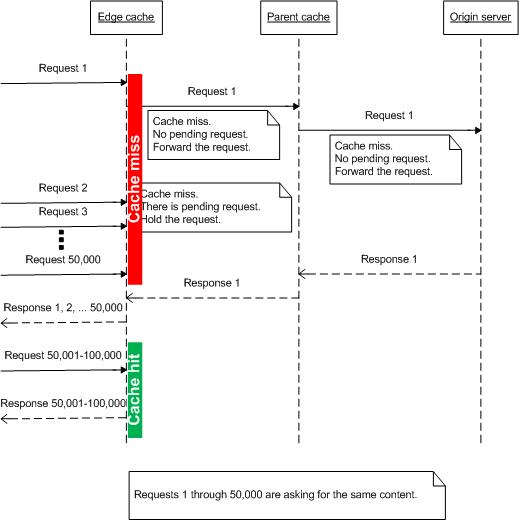
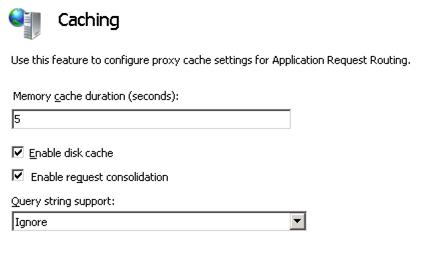

Configure Request Consolidation Feature in Application Request Routing
====================
by Won Yoo

This section of the document applies to **Microsoft Application Request Routing Version 2 for IIS 7 and Above.**

## Goal

To understand and configure the request consolidation feature in Application Request Routing (ARR).

## Prerequisites

This is an advanced feature in ARR. This article assumes that you are familiar with the overall functionality of ARR and know how to deploy and configure ARR with disk cache. If you have not done so already, it is strongly recommended that you review the following walkthroughs before proceeding:

- [Configure and enable disk cache in Application Request Routing](configure-and-enable-disk-cache-in-application-request-routing.md)
- [Cache hierarchy management using Application Request Routing](cache-hierarchy-management-using-application-request-routing.md)
- [Deploying Application Request Routing in CDN](../installing-application-request-routing-arr/deploying-application-request-routing-in-cdn.md)
- [Browse cached contents on disk on Application Request Routing](browse-cached-contents-on-disk-on-application-request-routing.md)
- [Delete cached objects](delete-cached-objects.md)
- [Manually override cache-control directives using Application Request Routing](manually-override-cache-control-directives-using-application-request-routing.md)
- [Warm-up cache nodes on Application Request Routing](warm-up-cache-nodes-on-application-request-routing.md)

If Application Request Routing Version 2 has not been installed, you can download it at:

- Microsoft Application Request Routing Version 2 for IIS 7 (x86) [here](https://download.microsoft.com/download/4/D/F/4DFDA851-515F-474E-BA7A-5802B3C95101/ARRv2_setup_x86.EXE).
- Microsoft Application Request Routing Version 2 for IIS 7 (x64) [here](https://download.microsoft.com/download/3/4/1/3415F3F9-5698-44FE-A072-D4AF09728390/ARRv2_setup_x64.EXE).

Follow the steps outlined in [this](../installing-application-request-routing-arr/install-application-request-routing-version-2.md) document to install ARR Version 2.

## Step 1 - Overview of request consolidation feature in ARR.

Cache proxies work well when the content is already available. However, when managing live streaming data, cache proxies are not as effective since the live contents are not available in advance to cache. For example, when tens-of-thousands of viewers tune in to watch a live basketball game using the Internet, how do you cache the live contents? Also, since the users are tuning in for the event all at the same time, how do you protect the origin server when there are cascading cache-misses at the cache nodes and all the requests are being forwarded to the origin server?

To address this problem, ARR has introduced the concept of request consolidation. The idea is to check the cache-miss requests that are "in flight" before forwarding the requests to the origin server (or if the cache nodes are tiered, the requests will be sent to the next tier server.) As shown below, the idea is simple, but has a big impact in reducing the number of requests, especially for live streaming contents.

## Step 2 - Configure request consolidation feature in ARR.

This feature is disabled by default. Note that the configuration for this feature is part of the proxy settings. The request consolidation feature can be configured at the server level, if ARR is being used as a server proxy, or it can be set at the server farm level, if the server farm feature is used.

This walkthrough shows the proxy setting at the server farm level.

1. Launch IIS Manager.
2. Select **Server Farms**.
3. Select the server farm that you created.
4. The following icons are shown:

    
5. Double-click **Caching**.
6. Select the **Enable request consolidation** checkbox.

    
7. Click **Apply** to save your changes. You have now successfully enabled the request consolidation feature. Note: The same configuration setting is available at the server proxy level on the **Server Proxy Settings** page.

## Summary

You have successfully stepped through how ARR consolidates requests, which is especially useful for handling live streaming contents.

For other ARR Version 2 walkthroughs, see the documents in [this](../planning-for-arr/application-request-routing-version-2-overview.md) article.
  
  
[Discuss in IIS Forums](https://forums.iis.net/1154.aspx)