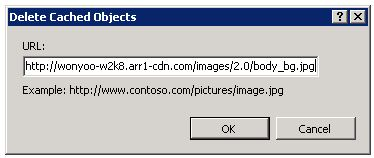
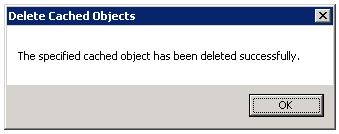
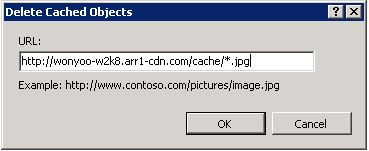

Delete Cached Objects
====================
by IIS Team

This section of the documentation applies to **Microsoft Application Request Routing Version 2 for IIS 7 and Above**.

## Goal

To successfully remove cached contents from disk on Application Request Routing (ARR).

There are several ways to delete the cached contents on ARR.

1. **Delete all cached objects**: This action deletes all cached contents from all primary cache drive location(s). This action does not delete cached contents from the secondary drive, if specified. 

    > [!NOTE]
    > This action can take a very long time if there are many cached objects. When resetting a server or adding/removing drives, it is recommended that you format the drives instead of using this action to remove the cached objects. See the [Deployment recommendations for Application Request Routing](../installing-application-request-routing-arr/deployment-recommendations-for-application-request-routing.md) article for more information.
2. **Delete selected cached object**: While browsing, you can select a folder or a file and choose to delete the selected content. If a folder is selected, all contents under the folder will be removed. If a file is selected, all associated files will be removed. For example, you may have noticed that for a given content, there may be multiple files:

    - example.jpg.full
    - example.jpg.full.gzip
    - example.jpg.0-1023
    - example.jpg.1024-2047

    ***any***    ***all***
In the above example, selectingone of the files will removeof the files that are associated with example.jpg.This action deletes the selected content from both the primary cache drive location(s) and the secondary drive, if specified.3. **Delete specific cached object(s)**: ARR allows the user to enter a specific/absolute URL or a partial URL with wildchar (\*) to delete all contents that match the pattern. This action deletes the content(s) from both the primary cache drive location(s) and the secondary drive, if specified.

## Prerequisites

This walkthrough assumes that you have reviewed both the ARR Version 1 walkthrough as well as other Version 2 documents about how to configure and enable disk cache features.

ARR scenario walkthroughs:

- ARR Version 1 walkthroughs can be found [here](../planning-for-arr/using-the-application-request-routing-module.md).
- ARR Version 2 walkthroughs can be found [here](../planning-for-arr/application-request-routing-version-2-overview.md).

If Application Request Routing Version 2 has not been installed, you can download it at:

- Microsoft Application Request Routing Version 2 for IIS 7 (x86) [here](https://download.microsoft.com/download/4/D/F/4DFDA851-515F-474E-BA7A-5802B3C95101/ARRv2_setup_x86.EXE).
- Microsoft Application Request Routing Version 2 for IIS 7 (x64) [here](https://download.microsoft.com/download/3/4/1/3415F3F9-5698-44FE-A072-D4AF09728390/ARRv2_setup_x64.EXE).

Follow the steps outlined in [this](../installing-application-request-routing-arr/install-application-request-routing-version-2.md) document to install ARR Version 2.

## Step 1 - Delete all cached objects.

The disk cache feature in ARR is a server-level feature. As such, the delete cache actions are found on the **Application Request Routing Cache** page at the server level.

**To delete all cached objects using the UI:** 

1. Launch IIS Manager.
2. Select the server in the navigation tree view.

    
3. Double-click **Application Request Routing Cache**. - In the **Actions** pane, click **Delete All Cached Objects**. 

    
- In the confirmation dialog box, click **Yes**. - All cached contents have been deleted from all primary cache drive location(s). 

    As noted above, this action can take a long time if there are many cached objects. If there is a need to reset the drives, it is recommended that you format the drive rather than use this feature to remove the files. See the [Deployment recommendations for Application Request Routing](../installing-application-request-routing-arr/deployment-recommendations-for-application-request-routing.md) article for more information.

## Step 2 - Delete selected cached objects.

This feature is available when browsing through the cached contents using IIS Manager. This walkthrough is documented in the [Browse cached contents on disk on Application Request Routing](browse-cached-contents-on-disk-on-application-request-routing.md) article.

> [!NOTE]
> If you are rewriting the host name as described in the article, [Deploying Application Request Routing in CDN](../installing-application-request-routing-arr/deploying-application-request-routing-in-cdn.md), then the host name that the **Browse Content** dialog box expects is the **re-written** host name and not the original host name that the cache node has received.

## Step 3 - Delete specific cached objects.

ARR allows the user to enter an absolute URL to delete one specific cached content, or it can accept a wildchar (\*) matching URL to delete contents that match the pattern.

> [!NOTE]
> If you are rewriting the host name as described in the article, [Deploying Application Request Routing in CDN](../installing-application-request-routing-arr/deploying-application-request-routing-in-cdn.md), then the host name that the **Browse Content** dialog box expects is the **re-written** host name and not the original host name that the cache node has received.

1. In the **Actions** pane, click **Delete Specific Cached Objects...**.

    
2. In the **Delete Cached Objects** dialog box, enter an absolute URL path to the cached content that you want to delete. In the example below, http://wonyoo-w2k8.arr1-cdn.com/images/2.0/body\_bg.jpg will be removed.

    
3. A confirmation dialog box is shown when the specified content has been deleted successfully.

    
4. To delete all contents that match a URL pattern, a wildchar (\*) can be used. In the **Delete Cached Objects** dialog box shown in Step 2 above, instead of entering an absolute path, enter a URL with a wildchar pattern. In the example below, the URL pattern is http://wonyoo-w2k8.arr1-cdn.com/cache/\*.jpg.

    
5. A confirmation dialog box is shown when the contents that match the pattern have been deleted successfully. 

    

## Summary

You have now successfully deleted one or more cached contents from ARR. For other ARR Version 2 walkthroughs, see [this](../planning-for-arr/application-request-routing-version-2-overview.md) article.
  
  
[Discuss in IIS Forums](https://forums.iis.net/1154.aspx)