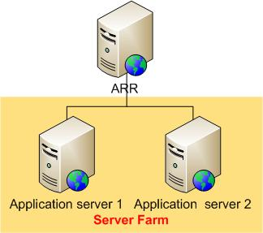
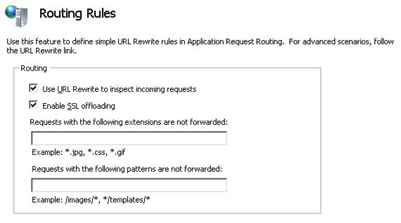
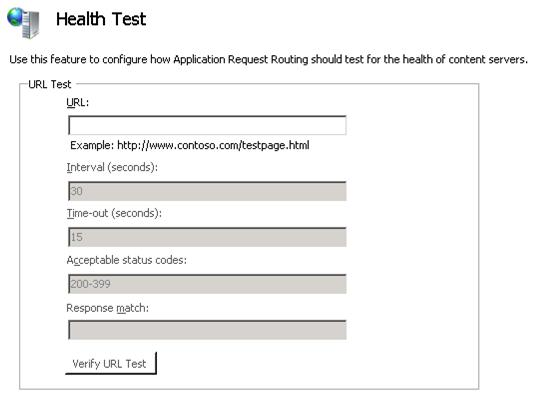
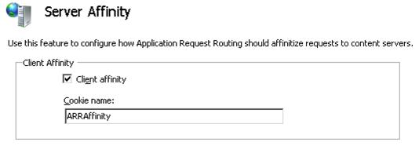

HTTP Load Balancing using Application Request Routing
====================
by [IIS Team](https://twitter.com/inetsrv)

## Overview

This topic leads the reader through the steps to configure Application Request Routing to load balance HTTP requests to achieve high availability and scalability. The walkthrough also highlights a couple of core features on how Application Request Routing monitors the health of the content servers and affinitizes requests from a client to a content server.

## Goal

To load balance HTTP requests across several content servers using Application Request Routing, as shown below:

## Prerequisites

This walkthrough requires the following prerequisites:

- IIS 7.0 or above on Windows 2008 (any SKU) or newer.
- Microsoft Application Request Routing Version 1 and dependent modules.
- Minimum of two content servers with working sites and applications.

If Application Request Routing Version 1 has not been installed, it is available for download at:

- Microsoft Application Request Routing Version 1 for IIS 7 (x86) [here](https://iis.net/downloads/default.aspx?tabid=34&amp;g=6&amp;i=1709).
- Microsoft Application Request Routing Version 1 for IIS 7 (x64) [here](https://iis.net/downloads/default.aspx?tabid=34&amp;g=6&amp;i=1712).

Follow the steps outlined in [this](../installing-application-request-routing-arr/install-application-request-routing.md) document to install Application Request Routing.

Another prerequisite is that the reader has defined and configured a server farm using the steps outlined in **[Define and Configure an Application Request Routing (ARR) Server Group](define-and-configure-an-application-request-routing-server-farm.md)**.

## Step 1 - Verify URL rewrite rules

Provided that the server farm has been created using the steps outlined in **[Define and Configure an Application Request Routing (ARR) Server Group](define-and-configure-an-application-request-routing-server-farm.md)**, the URL rewrite rules have already been created for a simple load balancing scenario.

**To verify URL rewrite rules using the UI:** 

1. Launch IIS Manager.
2. Select the server farm, **myServerFarm**, which was created in [**Define and Configure an Application Request Routing (ARR) Server Group**](define-and-configure-an-application-request-routing-server-farm.md).
3. The following icons are shown:  
    
4. Double-click **Routing Rules**.
5. Verify that the **Use URL Rewrite to inspect incoming requests** checkbox is checked.  
    
6. SSL offloading is enabled by default. When this feature is enabled, all communication between the ARR server and the application servers are done in clear text, even for HTTPS requests from clients to the ARR server. When both the ARR server and the application servers are deployed within a trusted network, such as within the same datacenter, enabling SSL offloading does not sacrifice security. Also, enabling this feature can further help to maximize the server resources on the application servers, since they do not have to spend cycles in encrypting and decrypting requests and responses.  
 To disable SSL offloading, uncheck the     **Enable SSL offloading** checkbox, and then click     **Apply** .
7. Open a browser and send several requests to the ARR server.
8. To verify that the requests are being load balanced equally between the application servers, select **myServerFarm**. Double-click **Monitoring and Management**.  
    
9. In the dashboard view, verify that the requests are being evenly distributed.  
    

**To verify URL rewrite rules using the command-line:** 

1. Open a command prompt with **administrator** privileges.
2. Navigate to **%windir%\system32\inetsrv**.
3. To verify that the URL rewrite rules have been created correctly, enter **appcmd.exe list config -section:system.webServer/rewrite/globalRules**. It returns the globalRules that looks like the following:  

    [!code-xml[Main](http-load-balancing-using-application-request-routing/samples/sample1.xml)]
4. To disable SSL offloading, first remove all URL rewrite rules:  

    [!code-console[Main](http-load-balancing-using-application-request-routing/samples/sample2.cmd)]

 Then, create the URL rewrite rules to forward HTTPS traffic. More specifically, with this rule, ARR forwards requests using SSL if the incoming requests are HTTPS:  

    [!code-console[Main](http-load-balancing-using-application-request-routing/samples/sample3.cmd)]
  
 Finally, create the URL rewrite rules to forward HTTP traffic in clear text to the application servers:  

    [!code-console[Main](http-load-balancing-using-application-request-routing/samples/sample4.cmd)]
5. To verify that the URL rewrite rules have been created correctly with SSL offloading disabled, enter **appcmd.exe list config -section:system.webServer/rewrite/globalRules**. It returns the globalRules that looks like the following:  

    [!code-xml[Main](http-load-balancing-using-application-request-routing/samples/sample5.xml)]

## Step 2 - Configure health check monitoring

Application Request Routing monitors the health of the content servers in two ways:

- Via the live traffic
- Via an explicit URL testing

The live traffic testing is performed automatically by default when the requests are made to Application Request Routing. The explicit URL testing is an additional test that can be used with the live traffic testing. In this section, the walkthrough guides you through configuring the explicit URL testing.

**To configure health check monitoring using the UI:** 

1. The URL testing requires a specific URL to test. To satisfy this requirement, use Notepad to create a text file named **healthCheck.txt** that contains the sentence "**I am healthy.**"
2. Place the **healthCheck.txt** file on the application servers.
3. Verify that the **healthCheck.txt** is rendering properly by opening the page in a browser.
4. In IIS Manager, select the server farm, **myServerFarm**. The following icons are shown:  
    
5. Double-click **Health Test**.  
    
6. Enter `http://(server name or FQDN of ARR server)/healthCheck.txt` as the **URL** value.
7. Enter **healthy** as the **Response match** value. Response match is an optional test to make sure that the body of the response contains the expected string. In this case, since **healthCheck.txt** contains the sentence "**I am healthy.**", Response match will look for the word "**healthy**".
8. Click **Apply** to save the changes.
9. To verify the functionality of health check monitoring, stop the monitored site on one of the application servers. Since the **Interval (seconds)** value is set to 30 seconds, wait for 30 seconds for the next health check.
10. After waiting for 30 seconds, send several requests to the ARR server.
11. To verify that all requests are going to the healthy server(s), double-click **Monitoring and Management**, and then refresh the dashboard by using the F5 key. Note that the runtime statistics have been reset. This is by design. You may want to send additional requests and refresh the dashboard, as needed.  
    
12. Health monitoring is also used to detect when an unhealthy server becomes healthy. To verify this functionality, start the site that was stopped in Step 9. Again, since the **Interval (seconds)** value is set to 30 seconds, wait for 30 seconds for the next health check.
13. After waiting for 30 seconds, send several requests to the ARR server.
14. To verify that the requests are distributed evenly between servers, refresh the dashboard in IIS Manager. Note that the runtime statistics have been reset. This is by design. You may want to send additional requests and refresh the dashboard, as needed.

**To configure health check monitoring using the command-line:** 

1. Open a command prompt with **administrator** privileges.
2. Navigate to **%windir%\system32\inetsrv**.
3. To set the URL to `http://(server name or FQDN of ARR server)/healthCheck.txt` with **I am healthy.** as the string to match, enter:  

    [!code-console[Main](http-load-balancing-using-application-request-routing/samples/sample6.cmd)]

## Step 3 - Configure client affinity

Application Request Routing provides a client affinity feature that maps a client to a content server behind Application Request Routing for the duration of a client session. When this feature is enabled, the load balancing algorithm is applied only for the very first request from the client. From that point on, all subsequent requests from the same client would be routed to the same content server for the duration of the client session. This feature is useful if the application on the content server is stateful and the client's requests must be routed to the same content server because the session management is not centralized.

**To configure client affinity using the UI:** 

1. Launch IIS Manager.
2. Select the server farm, **myServerFarm**, which was created in [**Define and Configure an Application Request Routing (ARR) Server Group**](define-and-configure-an-application-request-routing-server-farm.md).
3. The following icons are shown:  
    
4. Double-click **Server Affinity**.
5. To enable client affinity, check the **Client affinity** checkbox, and then click **Apply**.  
      
 Application Request Routing uses a cookie to enable client affinity. The     **Cookie name** will be used to set the cookie on the client. That said, the client must accept cookies for client affinity to work properly.
6. To verify the functionality of client affinity, send several requests to the ARR server. Refresh the dashboard in IIS Manager (**Monitoring and Management**). Verify that the runtime statistics are changing for only one of the application servers to where the client is affinitized. You may want to send additional requests and refresh the dashboard, as needed.

**To configure client affinity using the command-line:** 

1. Open a command prompt with **administrator** privileges.
2. Navigate to **%windir%\system32\inetsrv**.
3. To enable client affinity, enter:  

    [!code-console[Main](http-load-balancing-using-application-request-routing/samples/sample7.cmd)]

## Step 4 - Disallow new connections

Disallowing new connections on a server is a graceful way of taking the server out of the server farm environment. It is more meaningful when the client affinity feature is in use, because Application Request Routing will honor the existing sessions when disallowing new connections. That is, when a client is affinitized to the server that is disallowing new connections, the client will continue to be routed to the same server and, therefore, there is no impact on the client. However, no new clients will be routed to the server that is disallowing new connections.

**To disallow new connections using the UI:** 

1. Using the setup from Step 3 above, identify the server to which your client is affinitized.
2. Select the server farm, **myServerFarm**, which was created in [**Define and Configure an Application Request Routing (ARR) Server Group**](define-and-configure-an-application-request-routing-server-farm.md).
3. The following icons are shown:  
    
4. Double-click **Monitoring and Management**.
5. Select the server to where your client is affinitized. In the **Actions** pane, click **Disallow New Connections**.
6. In the confirmation dialog box, click **Yes**.  
    
7. To verify that the requests from your clients continue to get routed to the affinitized server, which is now disallowing new connections, send several requests to the ARR server. Refresh the dashboard in IIS Manager. Verify that the runtime statistics are changing only for the server to where the client is affinitized. You may want to send additional requests and refresh the dashboard, as needed.
8. To verify that new clients are not being routed to the server that is disallowing new connections, remove the cookie set by Application Request Routing by closing and restarting the browser.
9. Send several requests to the ARR server. Refresh the dashboard in IIS Manager. Verify that the runtime statistics are changing only for the servers that are **Available**. More specifically, verify that the runtime statistics for the serverthat is disallowing new connections are not changed. You may want to send additional requests and refresh the dashboard, as needed.

## Summary

You have now successfully configured a number of settings for Application Request Routing to scale out and distribute the load evenly. For more advanced routing capabilities using Application Request Routing, refer to [Using Application Request Routing](../planning-for-arr/using-the-application-request-routing-module.md).

[Discuss in IIS Forums](https://forums.iis.net/1154.aspx)