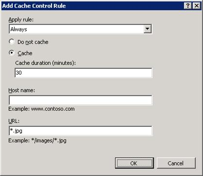
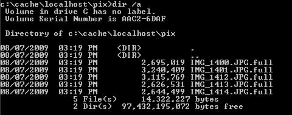
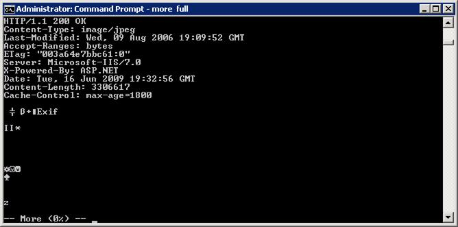

Manually Override Cache-control Directives Using Application Request Routing
====================
by Won Yoo

This section of the document applies to **Microsoft Application Request Routing Version 2 for IIS 7 and Above.**

## Goal

To successfully write rules to manage the cache control directives to control the behavior of cache-ability and cache duration.

In some cases, the administrator of ARR may want to define the cache control directives when they are missing in the response header or even override the cache control directives in the response. ARR provides a feature to define its own cache control directives so that the administrator can further manage the behavior of cached contents.

## Prerequisites

This article assumes that you are familiar with the overall functionality of ARR and know how to deploy and configure ARR with disk cache. If you have not done so already, it is strongly recommended that you review the following walkthroughs before proceeding:

- [Configure and enable disk cache in Application Request Routing](configure-and-enable-disk-cache-in-application-request-routing.md)
- [Cache hierarchy management using Application Request Routing](cache-hierarchy-management-using-application-request-routing.md)
- [Deploying Application Request Routing in CDN](../installing-application-request-routing-arr/deploying-application-request-routing-in-cdn.md)
- [Browse cached contents on disk on Application Request Routing](browse-cached-contents-on-disk-on-application-request-routing.md)
- [Delete cached objects](delete-cached-objects.md)

If Application Request Routing Version 2 has not been installed, you can download it at:

- Microsoft Application Request Routing Version 2 for IIS 7 (x86) [here](https://download.microsoft.com/download/4/D/F/4DFDA851-515F-474E-BA7A-5802B3C95101/ARRv2_setup_x86.EXE).
- Microsoft Application Request Routing Version 2 for IIS 7 (x64) [here](https://download.microsoft.com/download/3/4/1/3415F3F9-5698-44FE-A072-D4AF09728390/ARRv2_setup_x64.EXE).

Follow the steps outlined in [this](../installing-application-request-routing-arr/install-application-request-routing-version-2.md) document to install ARR Version 2.

## Step 1 - Configure cache control rules.

This walkthrough assumes that ARR is already configured with disk cache. Review the prerequisites carefully before proceeding.

1. Launch IIS Manager.
2. The cache control rules are defined at the server level. Select and expand the root of the server.

    
3. Double-click **Application Request Routing Cache**.
4. In the **Actions** pane, click **Cache Control Rules**.

    
5. In the **Actions** pane, click **Add...**.
6. A dialog box launches that will help you to write the cache control rules. Similar to the routing rules in ARR at the server farm level, ARR relies on URL rewrite to write the cache control rules. This UI in ARR makes it more relevant for the disk caching features without forcing the user to use the URL rewrite UI for writing the cache control rules. 

    For this walkthrough, you will write a rule to always cache .jpg images for 30 minutes, irrespective of what the cache control directives may have stated in the response header. To do so, enter the following values:  
  
**Apply rule:** Always  
**Cache:** Selected  
**Cache duration (minutes):** 30  
**Host name:** blank  
**URL:** \*.jpg   
  
> [!NOTE]
> Both the Host name and the URL are optional fields.

    

## Step 2 - Verify functionality.

The cache control rule that you wrote in Step 1 will always cache .jpg files for 30 minutes, irrespective of what the cache control directive may have stated in the response header.

1. Send a .jpg request to the ARR server with the rule that you wrote in Step 1.
2. Open a command prompt and navigate to the cached location.
3. Locate the file with the name **full**. (In the example below, the file is located in `c:\cache\localhost\pix\`)

    
4. Open the **full** file to see the header.

    

    Verify that the max-age is set to 30 minutes (or 1800 seconds).

    > [!NOTE]
    > ARR allows for multiple cache control rules. They are processed from top to bottom and the order can be managed by using the up and down arrows in the **Actions** pane. This walkthrough presented a simple case of cache control rules, but the same concept can be extended to not cache certain contents or only cache contents based on URL patterns or host names.

## Summary

You have now successfully written a cache control rule to define whether a content is cache-able and, if so, for how long it should be cached.

For other ARR Version 2 walkthroughs, see the documents in [this](../planning-for-arr/application-request-routing-version-2-overview.md) article.