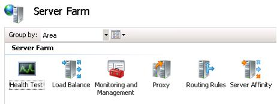
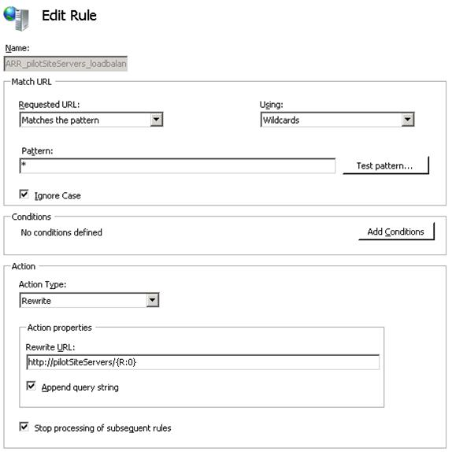
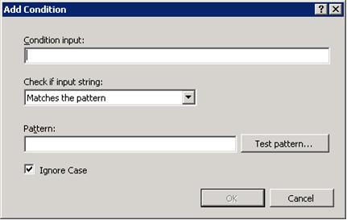
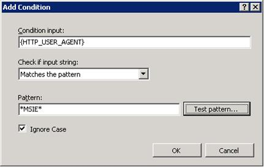
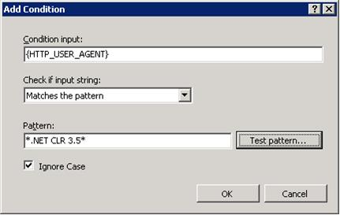

Pilot program management using Application Request Routing
====================
by IIS Team

## Overview

This topic leads the reader through the steps to launch and manage pilot or beta programs using Application Request Routing. Application Request Routing can be used to target and route the appropriate users to the pilot site, or it can also be used to limit and manage the amount of traffic that is routed to the pilot site. This walkthrough focuses on how Application Request Routing can be used to route specific requests to the pilot site based on the user's profile.

## Goal

To configure Application Request Routing to manage and mitigate risks around launching a pilot program.

## Prerequisites

This walkthrough requires the following prerequisites:

- IIS 7.0 or above on Windows 2008 (any SKU) or newer.
- Microsoft Application Request Routing Version 1 and dependent modules.
- Minimum of four content servers with working sites and applications. Two servers will be used to simulate the production site, and the other two servers will simulate the pilot site.
- Alternate browser to Microsoft Internet Explorer, such as Firefox, on a computer with .NET 3.5 installed. (This setup is used only for testing purposes.)

If Application Request Routing Version 1 has not been installed, it is available for download at:

- Download Microsoft Application Request Routing Version 1 for IIS 7 (x86) [here](https://iis.net/downloads/default.aspx?tabid=34&amp;g=6&amp;i=1709).
- Download Microsoft Application Request Routing Version 1 for IIS 7 (x64) [here](https://iis.net/downloads/default.aspx?tabid=34&amp;g=6&amp;i=1712).

Follow the steps outlined in [this](../installing-application-request-routing-arr/install-application-request-routing.md) document to install Application Request Routing.

Another prerequisite is that the reader has defined and configured two server farms by following the steps outlined in **[Define and Configure an Application Request Routing (ARR) Server Group](define-and-configure-an-application-request-routing-server-farm.md)**. One server farm will represent the production environment, while the other will represent the pilot environment.

## Step 1 – Change the URL rewrite rules to route requests based on user's profile

In this step, URL rewrite rules are changed so that only the users who have installed .NET 3.5 and are using Microsoft Internet Explorer (IE) are routed to the pilot site, defined as **pilotSiteServers**. All others are routed to the production site, defined as **productionSiteServers**.

**To change the URL rewrite rules using the UI:** 

1. Launch IIS Manager.

2. Select the server farm, **pilotSiteServers**.

3. The following icons are shown:

4. Double-click **Routing Rules**.

5. Since this scenario involves multiple server farms with conditional matching of HTTP request headers, the changes are made using the URL rewrite UI that exposes additional options. Click **URL Rewrite** under **Advanced Routing**.

6. Note that two rules have already been created, but they must be changed.

7. The order of the rules matter in this walkthrough. If **ARR\_productionSiteServers\_loadbalance** is above **ARR\_pilotServers\_loadbalance**, you can change the order of the rules by using **Move Up** or **Move Down** after selecting the rule.

8. Select **ARR\_pilotSite\_Servers\_loadbalance**, and then click **Edit...** in the **Actions** pane.

[](pilot-program-management-using-application-request-routing/_static/image7.jpg)

9. Clients with IE with .NET 3.5 should be specified to go to the **pilotSiteServers** server farm. Do this by adding conditions. Click **Add Conditions**, and thenclick **Add...**.

10. Enter **{HTTP\_USER\_AGENT}** as **Condition input** and **\*MSIE\*** as **Pattern**. This condition checks to see if the client is using IE.

11. Add another condition to check for the .NET version. Click **Add...**, and then enter **{HTTP\_USER\_AGENT}** as **Condition input** and **\*.NET CLR 3.5\*** as **Pattern**.

12. Finally, uncheck the **Stop processing of subsequent rules** checkbox, and then click **Apply** to save the changes.

As noted above, the order of the rules matters. This is because URL rewrite processes the rules in order when **Stop processing of subsequent rules** is unselected. So in this case, the first rule, **ARR\_pilotSiteServers\_loadbalance**, will be considered first. This rule tries to match whether the client is using IE and has .NET 3.5 installed. If so, the requests are forwarded to the **pilotSiteServers** server farm. Since the **Stop processing of subsequent rules** checkbox is unchecked, it will process the second rule, **ARR\_productionSiteServers\_loadbalance**, which will route all remaining requests to the **productionSiteServers** server farm.

**To change the URL rewrite rules using the command-line:** 

1. Open a command prompt with **administrator** privileges.

2. Navigate to **%windir%\system32\inetsrv**.

3. To change the **ARR\_pilotSiteServers\_loadbalance** rule to check for IE and .NET 3.5 in HTTP\_USER\_AGENT, enter:

[!code-console[Main](pilot-program-management-using-application-request-routing/samples/sample1.cmd)]

[!code-console[Main](pilot-program-management-using-application-request-routing/samples/sample2.cmd)]

4. To unselect **Stop processing of subsequent rules** for **ARR\_pilotSiteServers\_loadbalance**, enter:

[!code-console[Main](pilot-program-management-using-application-request-routing/samples/sample3.cmd)]

## Summary

You have now successfully changed the rules in URL rewrite and leveraged Application Request Routing to route only a subset of your users to the pilot site. For additional Application Request Routing properties and capabilities, refer to other Application Request Routing [walkthroughs](../planning-for-arr/using-the-application-request-routing-module.md).
  
  
[Discuss in IIS Forums](https://forums.iis.net/1154.aspx)