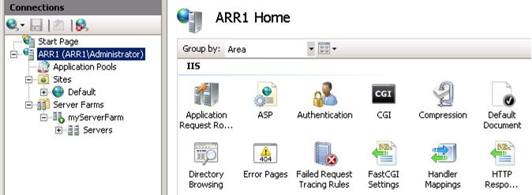
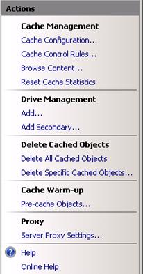
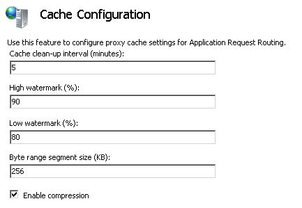

Using Compression in Application Request Routing
====================
by Won Yoo

This section of the document applies to **Microsoft Application Request Routing Version 2 for IIS 7 and Above.**

## Goal

To understand and configure the content encoding compression feature in Application Request Routing (ARR).

## Prerequisites

This is an advanced feature in ARR. This article assumes that you are familiar with the overall functionality of ARR and know how to deploy and configure ARR with disk cache. If you have not done so already, it is strongly recommended that you review the following walkthroughs before proceeding:

- [Configure and enable disk cache in Application Request Routing](configure-and-enable-disk-cache-in-application-request-routing.md)
- [Cache hierarchy management using Application Request Routing](cache-hierarchy-management-using-application-request-routing.md)
- [Deploying Application Request Routing in CDN](../installing-application-request-routing-arr/deploying-application-request-routing-in-cdn.md)
- [Browse cached contents on disk on Application Request Routing](browse-cached-contents-on-disk-on-application-request-routing.md)
- [Delete cached objects](delete-cached-objects.md)
- [Manually override cache-control directives using Application Request Routing](manually-override-cache-control-directives-using-application-request-routing.md)
- [Warm-up cache nodes on Application Request Routing](warm-up-cache-nodes-on-application-request-routing.md)

If Application Request Routing Version 2 has not been installed, you can download it at:

- Microsoft Application Request Routing Version 2 for IIS 7 (x86) [here](https://download.microsoft.com/download/4/D/F/4DFDA851-515F-474E-BA7A-5802B3C95101/ARRv2_setup_x86.EXE).
- Microsoft Application Request Routing Version 2 for IIS 7 (x64) [here](https://download.microsoft.com/download/3/4/1/3415F3F9-5698-44FE-A072-D4AF09728390/ARRv2_setup_x64.EXE).

Follow the steps outlined in [this](../installing-application-request-routing-arr/install-application-request-routing-version-2.md) document to install ARR Version 2.

## Step 1 - Overview of compression feature in ARR.

Based on the accept-encoding request header, the Web servers may compress a response in an encoded (compressed) format that the client can understand. While many of the Web servers are capable of different compression formats, such as gzip or deflate, they may not be enabled. When requests are proxied using ARR and ARR is configured to be used as a cache proxy, ARR can be configured to compress the responses (and, therefore, cache the contents as compressed objects) even if the origin Web servers may not compress the responses based on the accept-encoding header.

The diagram below further shows how this feature is designed to work:

## 

## Step 2 - Enable/disable compression on ARR.

This feature is enabled by default and can be found on the Cache Configuration page.

1. Launch IIS Manager.
2. The disk cache for ARR is configured at the server level. Select the server in the navigation tree view.

    
3. Double-click **Application Request Routing Cache**.

    
4. In the **Actions** pane, click **Cache Configuration**.

    
5. Use the **Enable compression** checkbox to enable or disable this feature in ARR.

    

## Summary

You have now successfully configured and enabled a disk cache for ARR. For other ARR Version 2 walkthroughs, see the documents in [this](../planning-for-arr/application-request-routing-version-2-overview.md) article.