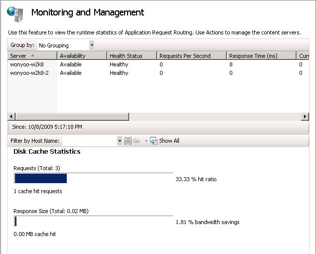
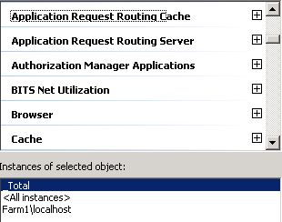
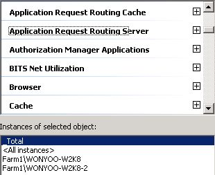

Using Performance Counters
====================
by CJ Pattekar

This section of the document applies to **Microsoft Application Request Routing Version 2 for IIS 7 and Above.**

## Goal

To successfully monitor Application Request Routing (ARR) runtime statistics using performance counters.

## Prerequisites

This is an advanced feature in ARR. This article assumes that you are familiar with the overall functionality of ARR and know how to deploy and configure ARR with disk cache. If you have not done so already, it is strongly recommended that you review the following walkthroughs before proceeding:

- [Configure and enable disk cache in Application Request Routing](configure-and-enable-disk-cache-in-application-request-routing.md)
- [Cache hierarchy management using Application Request Routing](cache-hierarchy-management-using-application-request-routing.md)
- [Deploying Application Request Routing in CDN](../installing-application-request-routing-arr/deploying-application-request-routing-in-cdn.md)
- [Browse cached contents on disk on Application Request Routing](browse-cached-contents-on-disk-on-application-request-routing.md)
- [Delete cached objects](delete-cached-objects.md)
- [Manually override cache-control directives using Application Request Routing](manually-override-cache-control-directives-using-application-request-routing.md)
- [Warm-up cache nodes on Application Request Routing](warm-up-cache-nodes-on-application-request-routing.md)

If Application Request Routing Version 2 has not been installed, you can download it at:

- Microsoft Application Request Routing Version 2 for IIS 7 (x86) [here](https://download.microsoft.com/download/4/D/F/4DFDA851-515F-474E-BA7A-5802B3C95101/ARRv2_setup_x86.EXE).
- Microsoft Application Request Routing Version 2 for IIS 7 (x64) [here](https://download.microsoft.com/download/3/4/1/3415F3F9-5698-44FE-A072-D4AF09728390/ARRv2_setup_x64.EXE).

Follow the steps outlined in [this](../installing-application-request-routing-arr/install-application-request-routing-version-2.md) document to install ARR Version 2.

## Step 1 - Overview of ARR runtime statistics.

Application Request Routing exposes runtime statistics on the Monitoring and Management page, as shown below:

As you refresh the view by pushing the F5 key, you can see the real-time statistics. While this works well for one instance of ARR, it is somewhat problematic when there are multiple instances of ARR and you want to aggregate the statistics into a consolidated view. To accommodate this scenario, ARR also exposes these statistics and more using performance counters.

## Step 2 - ARR runtime statistics as performance counters.

There are two counters for ARR:

- Application Request Routing Cache
- Application Request Routing Server

**Application Request Routing Cache**

The following performance counter objects are available:

- Hit Bytes
- Hit Byte %
- Hit Bytes / Sec
- Hit Requests
- Hit Requests %
- Hit Requests / Sec
- Miss Bytes
- Miss Bytes / Sec
- Miss Requests
- Miss Requests / Sec

Since ARR also provides the above statistics per host name per server farm, the instances of the objects have the same granularity and they are shown as `<server farm name>\<host name>`, as shown below:

**Application Request Routing Server**

The following performance counter objects are available:

- Average Response Time / Request
- Bytes Received
- Bytes Received / Sec
- Bytes Sent
- Bytes Sent / Sec
- Current Requests
- Failed Requests
- Failed Requests / Sec
- Health
- Requests / Sec
- State
- Total Requests

Since ARR also provides the above statistics per server per server farm, the instances of the objects have the same granularity and they are shown as `<server farm name>\<server name>`, as shown below:

## Summary

You have successfully located the Application Request Routing performance counters and objects, and they can now be used to aggregate and monitor statistics from one or more ARR servers.

For other ARR Version 2 walkthroughs, see the documents in [this](../planning-for-arr/application-request-routing-version-2-overview.md) article.