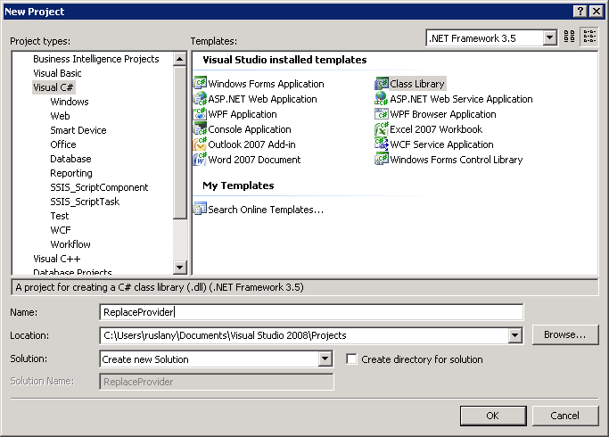
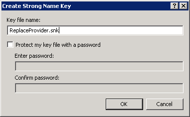
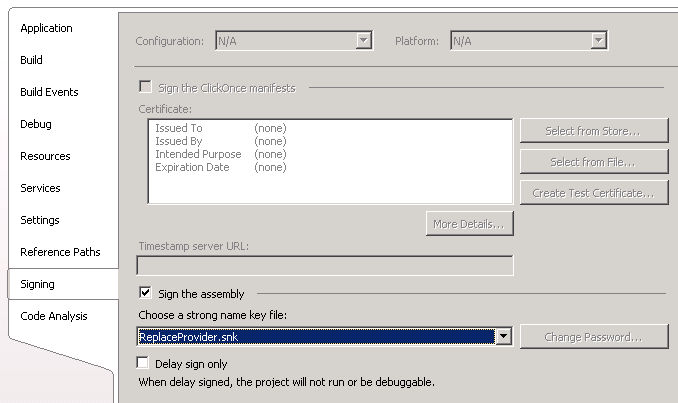
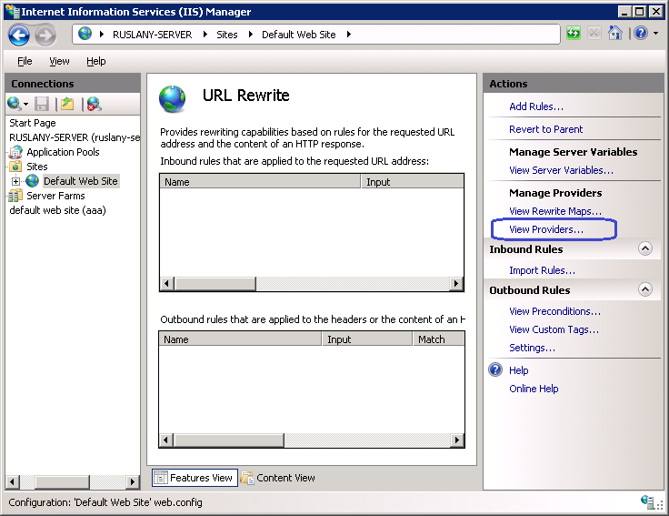
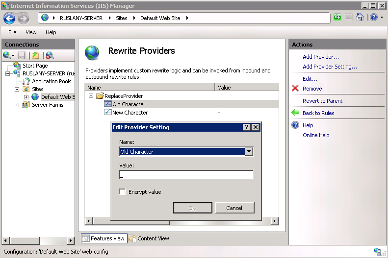

Developing a Custom Rewrite Provider for URL Rewrite Module
====================
by [Ruslan Yakushev](https://github.com/ruslany)

This walkthrough will guide you through how to develop a rewrite provider for URL Rewrite Module 2.0. You will create a ReplaceProvider that replaces all occurrences of a particular character in the URL with another character. This kind of logic is really hard and sometime impossible to express in terms of regular expressions, hence the need to create a custom rewrite provider.

## Creating a Visual Studio project

To create a Visual Studio project for rewrite provider follow these steps:

1. Open Microsoft Visual Studio 2008 or Microsoft Visual C# 2008 Express Edition.
2. In the File menu select "New Project...".
3. In the "New Project" dialog select the "Class Library" project template and name the project **ReplaceProvider**.  
    
4. Remove the file **Class1.cs** added by default (since you will not be using that file) using the context menu **Delete** option in the Solution Explorer;
5. Select "Add References..." from the Project menu and add references to **Microsoft.Web.Iis.Rewrite.dll** located in "%ProgramFiles%\Reference Assemblies\Microsoft\IIS".
6. Rewrite providers must be placed in the .NET Global Assembly Cache (GAC) in order to be visible for URL Rewrite Module. This requires the provider assembly DLL to be strongly named (signed). To sign the assembly, select the option "ReplaceProvider Properties..." from the "Project" menu.
7. In the Signing tab check "Sign the assembly" check box.
8. In the combo box, select the option &lt;New…&gt; to create a new key. In the "Create Strong Name Key" dialog, type DemoKey.snk as the name for the key and uncheck the Protect my key file with a password check box. Click OK.  
      
 The Signing tab should look as below:  
    
9. Select the "Build Events" tab and add the following "Post-build event" command line:  
  
 CALL "%VS90COMNTOOLS%\vsvars32.bat" &gt; NULL   
 gacutil.exe /if "$(TargetPath)"   
  
 Note: if you use Visual Studio 2010 then replace %VS90COMNTOOLS% with %VS100COMNTOOLS%.

## Implementing the provider interfaces

To implement a rewrite provider follow the steps below:

1. From the Project menu select "Add Class..." and then name the class as **ReplaceProvider**. This will add a new file **ReplaceProvider.cs** to the project.
2. Change the code so that it looks like below:

[!code-csharp[Main](developing-a-custom-rewrite-provider-for-url-rewrite-module/samples/sample1.cs)]

The code above implements two interfaces:

**IRewriteProvider** - this is the main interface that has to be implemented. It is used to initialize the provider by passing to it its configuration settings. Also it is used to execute the provider.

**IProviderDescriptor** - this is an optional interface and can be used to inform IIS Manager about the names and descriptions of the configuration settings used by provider.

## Registering and configuring the provider

Once the provider has been successfully built and placed into the GAC, it needs to be registered with IIS URL Rewrite Module. To register the provider:

1. Open IIS Manager and select the URL Rewrite feature
2. Click on the "View Providers..." action:  
    
3. In the Providers page click Add Provider... action and then enter the provider name as ReplaceProvider and choose the provider type from the Managed Type: drop down list.  
    
4. Click OK to save the changes.
5. Now click "Add Provider Setting..." action. Notice that the "Name:" drop down list shows the settings that were returned by the IProviderDescriptor.GetSettings() method. Select Old Character setting and enter "\_" as a value.  
    
6. Click OK to save the setting
7. Repeat steps 5 and 6 but now choose "New Character" and specify "-" as a value. This means that the provider will be used to replace all occurrences of "\_" character with "-" character in the input string.

This completes the registration and configuration of a rewrite provider. As a result the web.config file for the default web site will contain the following XML code inside of the &lt;rewrite&gt; section:

[!code-xml[Main](developing-a-custom-rewrite-provider-for-url-rewrite-module/samples/sample2.xml)]

## Using the rewrite provider

Now that the rewrite provider has been registered it can be used in the inbound and outbound rules. To test the provider you will create a rule that redirects all requests for URLs that have "\_" symbol to the URL where that symbol is replaced with "-". For example a request to a URL like this `http://localhost/some_blog_post/` will be redirected to `http://localhost/some-blog-post/`.

To create a rule that uses this rewrite provider add the following XML code inside of the &lt;rewrite&gt; element in the web.config file:

[!code-xml[Main](developing-a-custom-rewrite-provider-for-url-rewrite-module/samples/sample3.xml)]

Open a web browser and make a request to `http://localhost/some_blog_post/.` Notice that the browser got redirected to `http://localhost/some-blog-post/` because of the rule that you have added. The web server will return HTTP 404 error for the redirected URL because there is no such file or directory on the server, but that is not relevant for the purposes of this walkthrough. The important part is that the web server issued a redirect response based on the rule that used the custom rewrite provider.