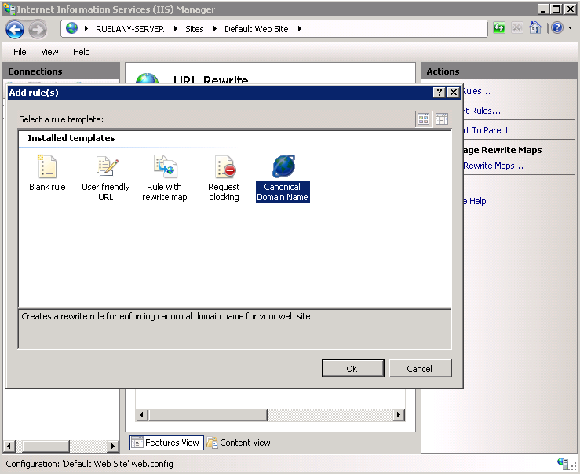
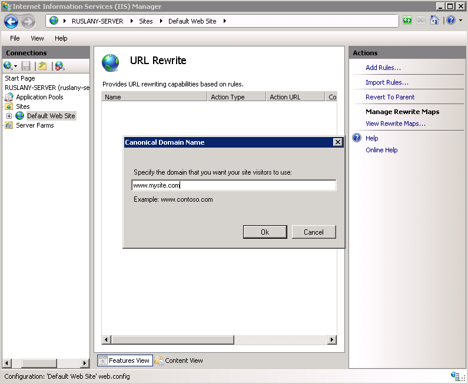
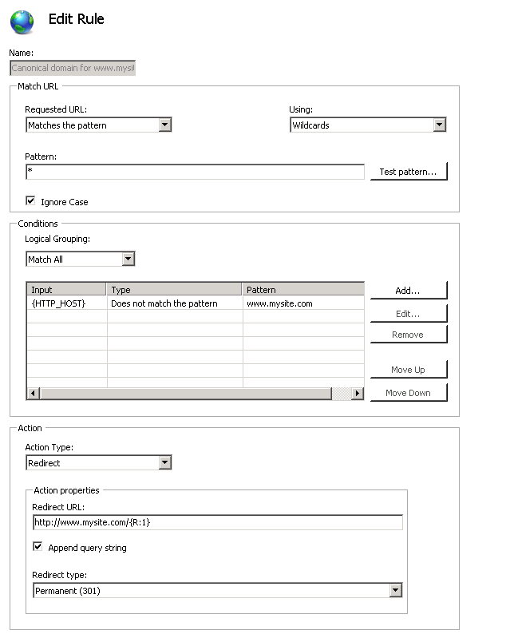
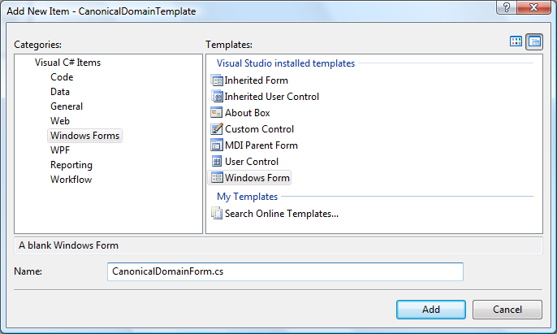
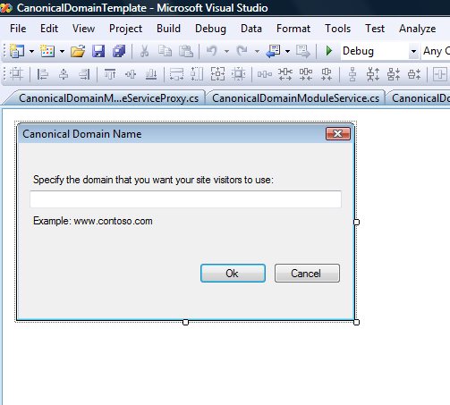

Developing Rule Template for URL Rewrite Module
====================
by Ruslan Yakushev

This walkthrough will guide you through how to develop a rule template for URL Rewrite module. You will create a rule template that can be used to generate a rewrite rule that enforces usage of a particular domain for a web site.

## Template Overview

Canonical Domain Name rule template can be used to simplify the creation of a rewrite rule that is used to enforce canonical domain name for a web site. Users can choose this template from the "Add rule(s)" dialog:

Then users can provide a domain name that they want to use:

After that the template will generate a rewrite rule as below:

## Prerequisites

Before proceeding with this walkthrough it is recommended to familiarize yourself with the basic concepts of IIS Manager extensibility by completing the tasks in the article "[How to create a simple IIS Manager module](../../develop/extending-the-management-ui/how-to-create-a-simple-iis-manager-module.md)".

## VS2008 project for the rule template

The complete Visual Studio 2008 project for this rule template is available for download [here](developing-rule-template-for-url-rewrite-module/_static/developing-rule-template-for-url-rewrite-module-519-canonicaldomaintemplateprojects1.zip).

## Implementing a rule template

To support remote management, all IIS Manager UI components are implemented by following a certain design pattern. A module's implementation consists of these parts:

- Client-side user interface and service proxy
- Server-side service for managing the IIS configuration

All the user interface specific implementation resides on a client side, which may be a remote client machine. All functionality that actually makes changes to the IIS configuration is implemented as a service on a server side, thus ensuring that it has access to all server configuration API's. Client-side controls interact with the service via service proxy.

It is a good practice to implement rule templates by following the same pattern, so that the templates work when users create rules via IIS Remote Manager. The following sections describe how to implement rule template service and client.

## Implementing a client-side user interface

### Create a module

First, you will need to create a module, is the main entry point in the client for all extensibility objects. To do that:

1. Create and configure a Visual Studio project by following steps described in tasks 1 and 2 from the article "[How to create a simple IIS Manager module](../../develop/extending-the-management-ui/how-to-create-a-simple-iis-manager-module.md)". Name the project as "CanonicalDomainTemplateClient".
2. Select **Add References** from the **Project** menu and add references to Microsoft.Web.Management.dll located in \Windows\System32\inetsrv:
3. Select **Add Reference** again and add reference to Microsoft.Web.Management.Rewrite.Client.dll located in \Program Files\Reference Assemblies\Microsoft\IIS.
4. Select **Add Reference** again and add reference to System.Windows.Forms.dll
5. Select the option **Add New Item** from the Project menu. In the **Add New Item** dialog box, select the **Class** template and type CanonicalDomainModule.cs as the name for the file.
6. Change the code so that it looks as below:

[!code-csharp[Main](developing-rule-template-for-url-rewrite-module/samples/sample1.cs)]

This code initializes a new instance of a class **CanonicalDomainFeature**, which will implement the rule template functionality. The instance of this class is used to register an extension of type **RewriteTemplateFeature**, which is a type from which all rule templates are derived.

### Create a Rewrite Template Feature

When defining a class that implements rule template you will need to derive this class from **RewriteTemplateFeature** class. It is a parent class that is used by all URL Rewrite rule templates.

1. Select the option Add New Item in the Project Menu. Select the Class template and type CanonicalDomainFeature.cs as the file name.
2. Change the code so that it looks as below:

[!code-csharp[Main](developing-rule-template-for-url-rewrite-module/samples/sample2.cs)]

This code does the following:

1. Defines the name and title for the rule template
2. Passes the name, the title and the icons to the base class constructor so that those are used when "Add rule(s)" dialog displays all registered rule templates
3. Defines the Run() method that is used to render the template user interface, which is WinForm based modal dialog **CanonicalDomainForm**. If the OK button is clicked in the dialog then the main UI page of the URL Rewrite module is refreshed by calling Navigate() method.
4. Lastly, it defines a helper function **GetPageType** that is used to get the main page for the specified module.

### Define a service proxy

For a remote client to call a service it is necessary to provide a service proxy. To do that, add another file to your project called CanonicalDomainModuleServiceProxy.cs and change the code in it to look as below:

[!code-csharp[Main](developing-rule-template-for-url-rewrite-module/samples/sample3.cs)]

The actual service implementation for **GenerateRule** method will be added later.

### Implement the rule template dialog

Now, that all the IIS Manager client-side plumbing code is done, the remaining part is to design and implement the actual user interface for the rule template. To do that follow these steps:

1. Select the option Add New Item in the project menu. In the Add New Item dialog, select "Windows Form" and type in the name CanonicalDomainForm.cs:  
     
2. Use Visual Studio windows forms designer to arrange controls on the form:  
     
3. Switch to the code view and add the private member of the class that will contain a reference to a service proxy:  

    [!code-csharp[Main](developing-rule-template-for-url-rewrite-module/samples/sample4.cs)]
4. In the same class modify the constructor code as below:  

    [!code-csharp[Main](developing-rule-template-for-url-rewrite-module/samples/sample5.cs)]
5. In the same class add the helper function that will call the service proxy to generate the rewrite rule with the parameters specified by a user:  

    [!code-csharp[Main](developing-rule-template-for-url-rewrite-module/samples/sample6.cs)]
6. Add an event handler for when OK button is clicked. In the event handler code invoke the helper function GenerateRule, passing the content of the TextBox control as a parameter. 

    [!code-csharp[Main](developing-rule-template-for-url-rewrite-module/samples/sample7.cs)]

## Implementing a service for rule template

To implement a service you will need to create a module provider, which is an entry point for registration of modules in IIS Manager. To do that:

1. Create and configure another Visual Studio project by following steps described in tasks 1 and 2 from the article "[How to create a simple IIS Manager module](../../develop/extending-the-management-ui/how-to-create-a-simple-iis-manager-module.md)". Name the project as "CanonicalDomainTemplate".
2. Select **Add References** from the **Project** menu and add references to the following assemblies located in \Windows\System32\inetsrv: 

    1. Microsoft.Web.Administration.dll
    2. Microsoft.Web.Management.dll
3. Select the option **Add New Item** from the Project menu. In the **Add New Item** dialog box, select the **Class** template and type CanonicalDomainModuleProvider.cs as the name for the file.
4. Change the code so that it looks as below (do not forget to replace the PublicKeyToken with the public key token of the CanonicalDomainTemplate.Client.dll assembly)

[!code-csharp[Main](developing-rule-template-for-url-rewrite-module/samples/sample8.cs)]

This code creates a ModuleProvider that supports all types of connections (Server, Site and Application) and registers a client-side module called **CanonicalDomainModule**. Also it registers the type of the module service **CanonicalDomainModuleService** that is used on a server-side to generate rewrite rules.

To create a service for the rule template follow these steps:

1. Select the option Add New Item in the Project Menu. Select the Class template and type CanonicalDomainModuleService.cs as the file name.
2. Change the code so that it looks as below:

[!code-csharp[Main](developing-rule-template-for-url-rewrite-module/samples/sample9.cs)]

This code creates a rule for redirection to canonical domain.

> [!TIP]
> to quickly get the code for generating rewrite rules use the Configuration Editor for IIS 7.0 and above, which is included in [Administration Pack for IIS](../../../downloads?tabid=34&amp;i=1682&amp;g=6.md). Refer to [this article](http://ruslany.net/2008/07/scripting-url-rewrite-module-configuration/) for more information on how to generate code for creation of rewrite rules.

## Registering the rule template with IIS Manager

Once the rule template project has been successfully compiled and placed into the Global Assembly Cache, you will need to register it with IIS Manager by adding its information to administration.config file.

Open administration.config file located at \Windows\System32\inetsrv\config and add the following line to the &lt;moduleProviders&gt; section. Make sure to replace the PublicKeyToken:

[!code-xml[Main](developing-rule-template-for-url-rewrite-module/samples/sample10.xml)]

> [!NOTE]
> By adding it only to the list of moduleProviders you are registering the module only for Server connections. If you want this module to be enabled for Site connections as well as application connections, add it to the following list:

[!code-xml[Main](developing-rule-template-for-url-rewrite-module/samples/sample11.xml)]

After these steps are done, you should be able to see the "Canonical Domain Name" rule template in the Add Rule(s) dialog of URL Rewrite module.
  
  
[Discuss in IIS Forums](https://forums.iis.net/1152.aspx)