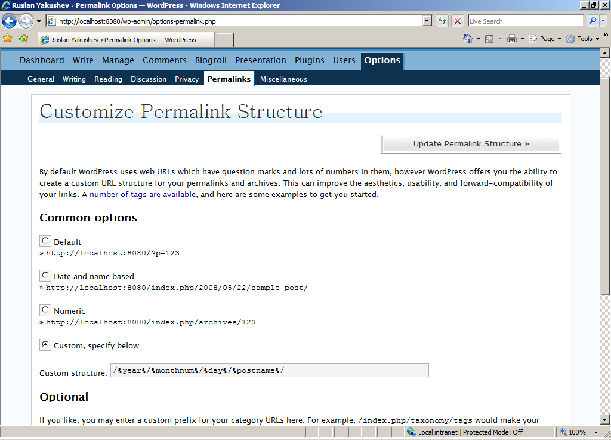
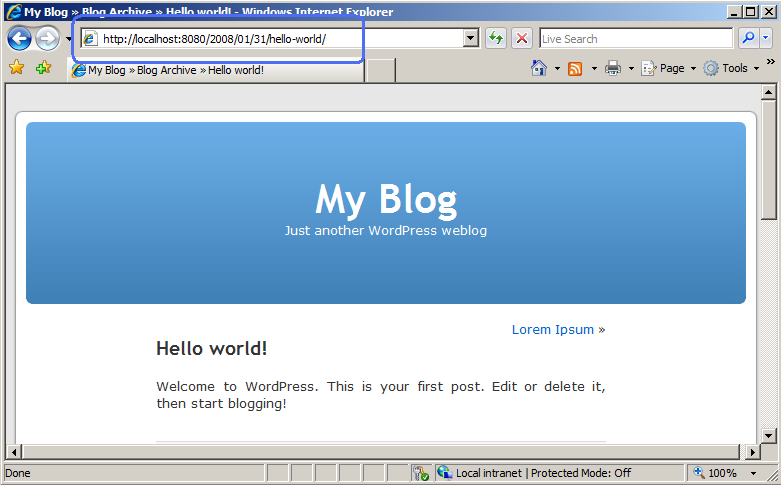

Enabling Pretty Permalinks in WordPress
====================
by [Ruslan Yakushev](https://github.com/ruslany)

This walkthrough describes how to enable "[Pretty Permalinks](http://codex.wordpress.org/Using_Permalinks "Pretty Permalinks")" for blog posts in the [WordPress](http://www.wordpress.org/ "WordPress") blog engine that is installed on IIS 7 and above. Typically, without URL rewriting functionality on a Web server, WordPress users must use "Almost Pretty" URLs, for example, **[http://contoso.com/index.php/yyyy/mm/dd/post-name/](http://contoso.com/index.php/yyyy/mm/dd/post-name/)**. By using the URL Rewrite module, you can use "Pretty Permalinks," for example, [`http://example.com/year/month/day/post-name/`](http://example.com/year/month/day/post-name/), for WordPress blogs that are hosted on IIS.

## Prerequisites

This walkthrough requires the following prerequisites:

1. IIS 7 or above with FastCGI and PHP installed. If you need to install PHP, follow the instructions in [this article](../../application-frameworks/install-and-configure-php-applications-on-iis/using-fastcgi-to-host-php-applications-on-iis.md "Install PHP").
2. WordPress installed. If you need to install WordPress, follow the instructions in [this article](../../application-frameworks/install-and-configure-php-applications-on-iis/install-wordpress-on-iis.md "Install WordPress") or use the instructions from the official [WordPress site](http://codex.wordpress.org/Installing_WordPress "Install WordPress").
3. URL Rewrite installed.

Note that for the purposes of this walkthrough it is assumed that WordPress is installed in a Web site root directory. If WordPress is installed in a subdirectory, then the rewrite rules that are used in this walkthrough should be included in the Web.config file that is located within the same subdirectory where the WordPress files are.

## Enabling Pretty Permalinks in WordPress

Use the following instructions to create pretty permalinks for your blog posts.

**To enable pretty permalinks in Word Press:** 

1. Log on to WordPress with Administrator user rights.
2. In WordPress, click the **Options** tab.
3. On the **Options** page, click the **Permalinks** subtab.  
 This will take you to the page where you can customize how WordPress generates permalinks for blog posts.
4. On the **Permalinks** page, select **Custom, specify below** and enter "/%year%/%monthnum%/%day%/%postname%/" in the **Custom structure** text box.
5. Click **Update Permalink Structure**.

All the blog post links will have URLs that follow the format that you have specified, but if you click any one of those links the Web server will return a 404 - File Not Found error. This is because WordPress relies on a URL rewriting capability within the server to rewrite requests that have "pretty permalinks" to an Index.php file. In the next section, you will create a rule that will provide this capability.

## Creating a Rewrite Rule

Open the Web.config file that is located in the same directory where the WordPress files are installed, and paste the following XML section into the system.webServer element:

[!code-xml[Main](enabling-pretty-permalinks-in-wordpress/samples/sample1.xml)]

This rule will try to match any requested URL. If the URL does not correspond to a file or a folder on the file system, it will rewrite the URL to the Index.php file. At that point, WordPress will determine which content to serve based on the REQUEST\_URI server variable that contains the original URL before it was modified by this rule.

## Testing the Rewrite Rule

After you save the rewrite rule to the Web.config file, open a Web browser and click any one of the permalinks in your WordPress blog. You should see the correct content returned by the Web server for each permalink.

## Summary

In this walkthrough you learned how to use the URL Rewrite module to enable "pretty permalinks" in the WordPress blog engine. WordPress is just one example of the many popular PHP applications that can take advantage of the URL Rewrite module in IIS, a feature that enables user-friendly and search engine-friendly URLs.