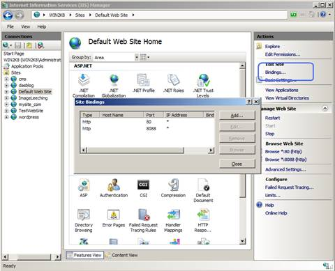
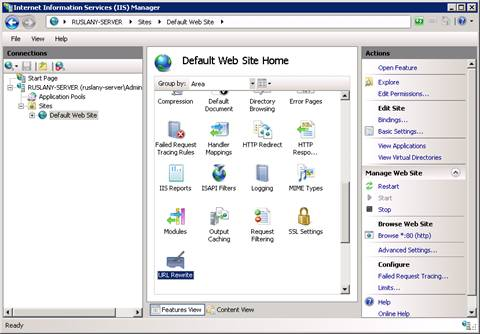
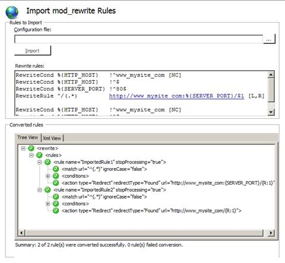
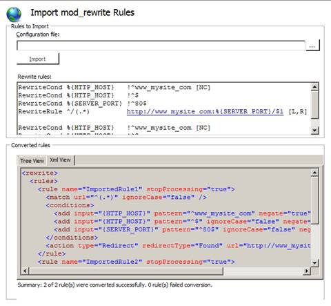
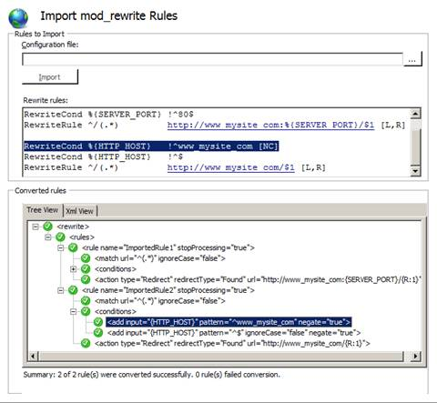
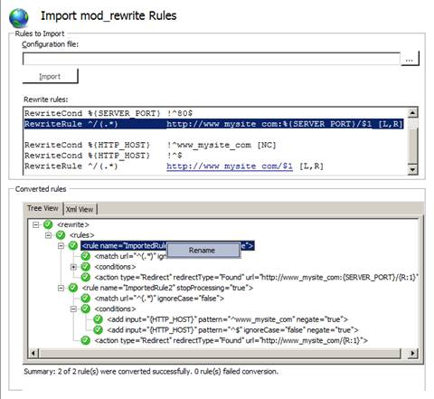
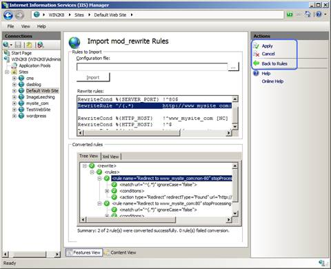

Importing Apache mod_rewrite Rules
====================
by Ruslan Yakushev

## Introduction

The URL Rewrite Module in IIS 7 and above provides an import feature that greatly simplifies the process of converting Apache mod\_rewrite rules to IIS URL rewrite rules. In this walkthrough, you use the Import Rules feature provided in the URL Rewrite Module to import several mod\_rewrite rules into an IIS configuration file. If you have not yet downloaded the URL Rewrite Module, you can do so at [https://www.iis.net/download/urlrewrite](https://www.iis.net/downloads/microsoft/url-rewrite).

## Set Up a Walkthrough Scenario

To see how you can convert mod\_rewrite rules and verify that the converted rules work correctly, you will implement the common scenario of enforcing canonical host names for a Web site. In this example, you will force the use of www.mysite.com instead of mysite.com, so that when a request is made that uses a host name other than www.mysite.com, you can redirect the request to a canonical hostname.

1. Start **IIS Manager**, and then click **Default Web Site**.  
2. In the **Actions** pane, click on **Bindings**, and add a new *http binding* for port **8088**.

[](importing-apache-modrewrite-rules/_static/image1.png)

###### Figure 1: Add a new binding

3. Using Notepad, open **%SystemDrive%\windows\system32\drivers\etc\hosts** and add the two following lines at the end of the file:

[!code-unknown[Main](importing-apache-modrewrite-rules/samples/sample-127327-1.unknown)]

Notice that you are using "\_" instead of "." for domain separators. This is to prevent the Web browser from trying to resolve the domain name by using a Domain Name System (DNS) server.

4. Save the hosts file.

5. Verify that the host names were setup correctly by opening a Web browser and going to the sites http://www\_mysite\_com/iisstart.htm and to http://mysite\_com/iisstart.htm.

## Convert mod\_rewrite Rules

The Apache mod\_rewrite rules to use for enforcing canonical host names are:

[!code-unknown[Main](importing-apache-modrewrite-rules/samples/sample-127327-2.unknown)]

To convert these rules to IIS URL rewrite–specific format:

1. Start **IIS Manager**.

2. On the left, in the **Connections** pane, select **Default Web Site.**

3. On the right, in **Features View**, click **URL Rewrite**.

[](importing-apache-modrewrite-rules/_static/image3.png)

###### Figure 2: Click URL Rewrite

4. On the right, in the **Actions** pane, click **Import Rules**.

5. Copy the example mod\_rewrite rules above and past them into the **Rewrite rules** text box.

[](importing-apache-modrewrite-rules/_static/image5.png)

###### Figure 3: Rules to import

6. The **Tree View** tab of the **Converted Rules** box instantly shows the result of the conversion. You can also click the **XML View** tab to see how the rules are stored in the Web.config file.

[](importing-apache-modrewrite-rules/_static/image7.png)

###### Figure 4: Converted rules

If you switch back to **Tree View** and select a node there, the corresponding mod\_rewrite rule directive in the **Rewrite rules** text box will be highlighted.

[](importing-apache-modrewrite-rules/_static/image9.png)

###### Figure 5: Tree view

Note that during the rules conversion the rules were assigned default names. To change the default names to something more meaningful, select a rule in **Tree View**, right-click it, and select **Rename** from the context menu.

[](importing-apache-modrewrite-rules/_static/image11.png)

###### Figure 6: Rename

Change the name of the first rule from **ImportedRule1** to **Redirect to www\_mysite\_com:non-80**. Change the name of the second rule from **ImportedRule2** to **Redirect to www\_mysite\_com:80**.

In the **Actions** pane, click **Apply** to save the converted rules to the Web.config file, and then click **Back to rules**.

[](importing-apache-modrewrite-rules/_static/image13.png)

###### Figure 7: Back to Rules

## Test the Converted Rules

To test that the rules imported from mod\_rewrite format work correctly, open a Web browser, and go to either one of the following URLs:

- http://localhost/iisstart.htm
- http://mysite\_com/iisstart.htm

In both cases, the Web browser is redirected to `http://www_mysite_com/iisstart.htm`.  
  
Also, if you try either of these URLs:

- http://localhost:8088/iisstart.htm
- http://mysite\_com:8088/iisstart.htm

the Web browser gets redirected to `http://www_mysite_com:8088/iisstart.htm`.

Note that the rules that were imported from mod\_rewrite enabled the enforcement of canonical host names for a Web site. A Bing search will reveal other [examples of Apache mod\_rewrite rules](http://search.live.com/results.aspx?q=mod_rewrite+examples).

## Disclaimer

 IMPORTANT - The URL Rewrite Module tries to convert Apache mod\_rewrite rules to functionally equivalent IIS URL rewrite rules. However, not all mod\_rewrite rules can be converted because of architectural differences between Apache and IIS. It is highly recommended that you study a mod\_rewrite rule set until you understand its functionality before you begin the conversion process. Then, after converting to IIS URL rewrite rules, review and test the result of the conversion to make sure that the corresponding IIS rewrite rule set provides the same URL rewriting logic.

Note that only rules that follow Apache mod\_rewrite syntax can be converted. Any other formats of rewrite rules (for example, ISAPI\_Rewrite, Ionic ISAPI Rewrite, IISRewrite, and others) are not recognized or will be converted incorrectly.
  
  
[Discuss in IIS Forums](https://forums.iis.net/1152.aspx)