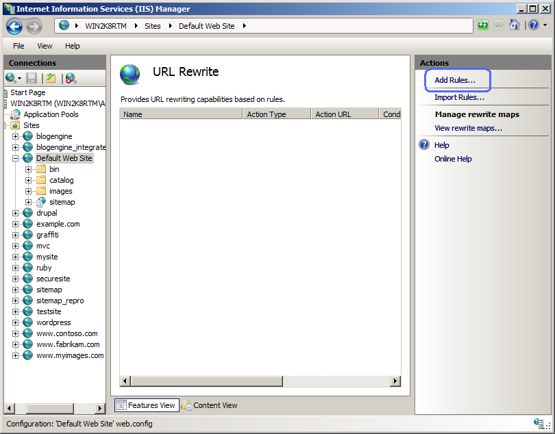
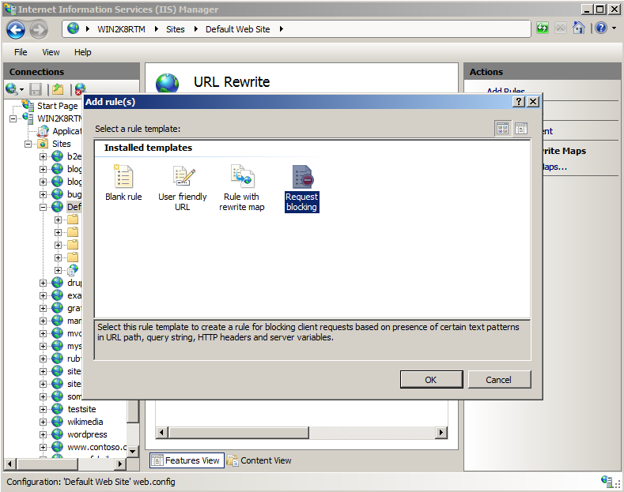
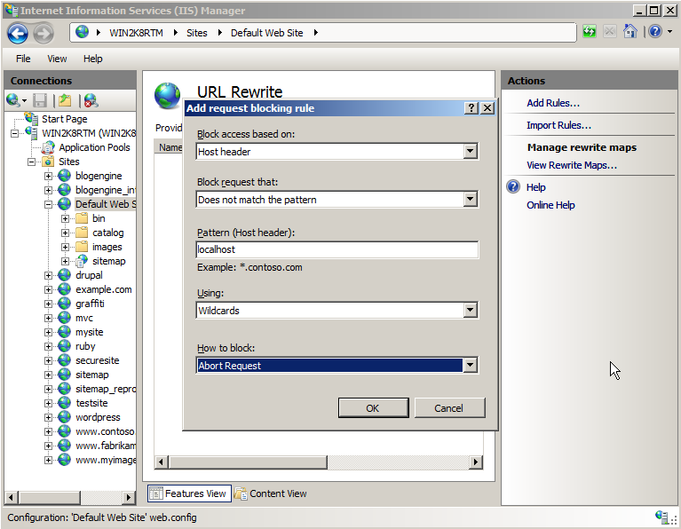
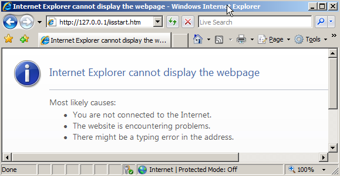

Request Blocking - rule template
====================
by [Ruslan Yakushev](https://github.com/ruslany)

Rule templates are used to provide a simple way of creating one or more rewrite rules for a certain scenario. URL rewriter module includes several rule templates for some common usage scenarios. In addition to that URL rewrite module UI provides a framework for plugging in custom rule templates. This walkthrough will guide you through how to use "Request Blocking" rule template that is included with URL rewrite module.

## Using rule template to generate a request blocking rule

The "Request Blocking" rule template can be used to generate a rule that blocks incoming requests based on various criteria. For example, requests can be blocked based on certain pattern within URL path or based on certain value in one of the request headers.

To use the template follow these steps:

1. Go to IIS Manager
2. Select "Default Web Site"
3. In the Feature View click "URL Rewrite"  
    
4. In the "Actions" pane on right hand side click on "**Add rules…**"  
    
5. In the "Add Rules" dialog select "Request Blocking" and click "OK":  
    
6. In the "Add request blocking rule" dialog choose to: 

    - Block access based on host header;
    - Block requests that do not match the pattern;
    - Specify **localhost** as a pattern, meaning that any request with host header not equal to localhost will be blocked;
    - Use wildcards pattern syntax;
    - Block request by aborting the request connection.

    
7. Click "OK" to create the rule.

### Testing the rule

To test this rule, open a Web browser and make a request to `http://127.0.0.1/iisstart.htm`. What you should see is a browser that does not receive any response from the server. However, if you request `http://localhost/iisstart.htm`, then the Web server will respond successfully.

## Summary

In this walkthrough you have learned how to use "Rule with Rewrite Map" template to generate rules that can protect security of your web application by blocking unwanted requests.
  
  
[Discuss in IIS Forums](https://forums.iis.net/1152.aspx)