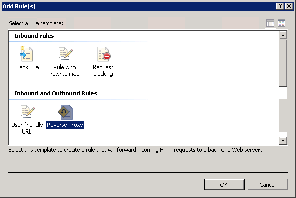
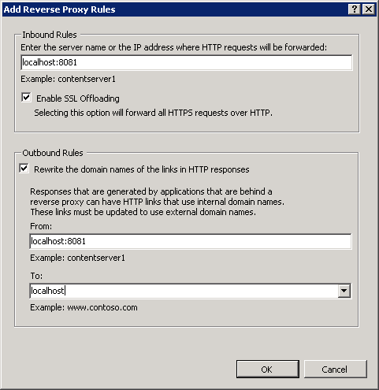
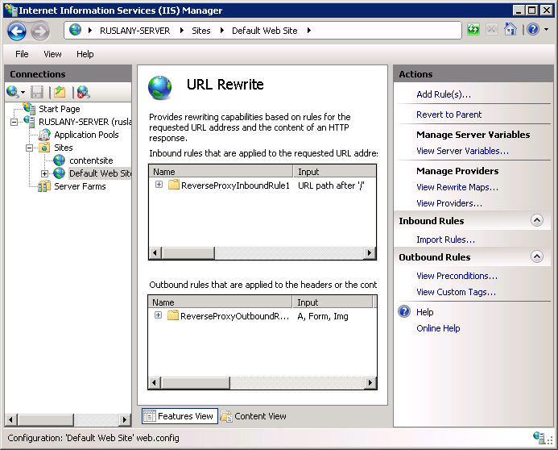
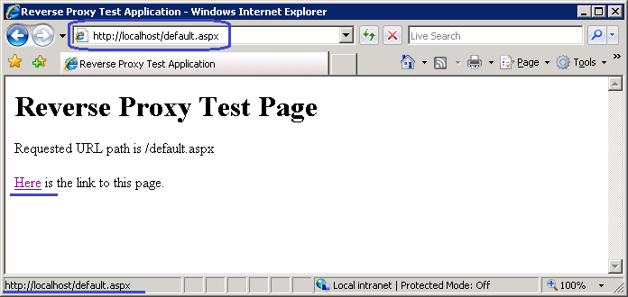

Reverse Proxy - Rule Template
====================
by [Ruslan Yakushev](https://github.com/ruslany)

Rule templates are used to provide a simple way of creating one or more rewrite rules for a certain scenario. URL Rewrite Module 2 includes several rule templates for some common usage scenarios. In addition to that URL Rewrite Module UI provides a framework for plugging in custom rule templates. This walkthrough will guide you through how to use "Reverse Proxy" rule template that is included with URL rewrite module. To learn more about configuring reverse proxy with IIS URL Rewrite Module and IIS Application Request Routing refer to Reverse Proxy with URL Rewrite v2 and Application Request Routing.

## Prerequisites

This walkthrough requires the following prerequisites:

- IIS 7 or above with ASP.NET role service enabled;
- URL Rewrite Module 2.0 installed;
- IIS Application Request Routing installed.

## Creating the Example Web Site

For simplicity, the reverse-proxy scenario you will work with in this walkthrough will be implemented on a single server, with the IIS "Default Web Site" acting as a reverse-proxy site and content application hosted in separate IIS web sites on the same server.

To create the example content Web site:

1. Create a folder called "**contentsite**" in the following folder:  

    [!code-unknown[Main](reverse-proxy-rule-template/samples/sample-127337-1.unknown)]
2. Create an IIS web site called "**contentsite**" that point to the corresponding folder under %SystemDrive%\inetpub\. Use port 8081 for the site.  
 You can use the following commands to create the sites:  

    [!code-console[Main](reverse-proxy-rule-template/samples/sample2.cmd)]
3. Create a file named default.aspx in the following folder:  

    [!code-unknown[Main](reverse-proxy-rule-template/samples/sample-127337-3.unknown)]
4. Copy the following ASP.NET markup, paste it into the file, and save the file as default.aspx:  

    [!code-aspx[Main](reverse-proxy-rule-template/samples/sample4.aspx)]
5. To make sure that the site is working correctly, open a Web browse and request the following URLs:  

    [!code-unknown[Main](reverse-proxy-rule-template/samples/sample-127337-5.unknown)]

## Generate Inbound and Outbound Rules by Using Reverse Proxy Template

The "Reverse Proxy" rule template can be used to generate inbound rewrite rule that is used to proxy the HTTP requests to another server. Optionally the template can also create an outbound rewrite rule that can fix the host names in the links URLs inside of HTML responses. In the example case described in this walkthrough the proxy server host name is **localhost** and the content server's host name is **localhost:8081**. The web application on the content server generates a link in HTML response that uses an internal host name, e.g. `http://localhost:8081/default.aspx`. The outbound rule fixes this link to use the proxy's host name, e.g. `http://localhost/default.aspx`.

To create the rules by using the rule template follow these steps:

1. In the IIS Manager select the "Default Web Site" in the tree view on left hand side.
2. Open the URL Rewrite feature view.
3. In the URL Rewrite feature view, select "Add Rule(s)..." action and then select "Reverse Proxy" template:  
    
4. In the "Add Reverse Proxy Rules" dialog enter the following:  
    **Server name or IP address where HTTP requests will be forwarded:** localhost:8081  
 Check the "    **Rewrite the domain names of the links in HTTP responses** " check box and enter:  
    **From:** localhost:8081  
    **To:** localhost  
    
5. Click OK. Both the inbound and outbound rules will be created:  
    

## Testing the Reverse Proxy

To test that the rewrite rules generated by the rule template work correctly open a web browser and make a request to `http://localhost/default.aspx`. IIS "**Default Web Site**" will receive this request and will route it to `http://localhost:8081/default.aspx` in accordance to the inbound rewrite rule. When the HTTP response is returned from the **contentsite** web site, the outbound rewrite rule modifies the link URL inside of the HTML to rewrite the host name from **localhost:8081** to **localhost**:

## Summary

In this walkthrough you have learned how to use "Reverse Proxy" rule template to generate rewrite rules to implement a simple reverse proxy configuration in IIS. This rule template can be used as a starting point to generate the base rules which can be adjusted or modified later to address the specific routing and rewriting requirements that you have for your web application.
  
  
[Discuss in IIS Forums](https://forums.iis.net/1152.aspx)