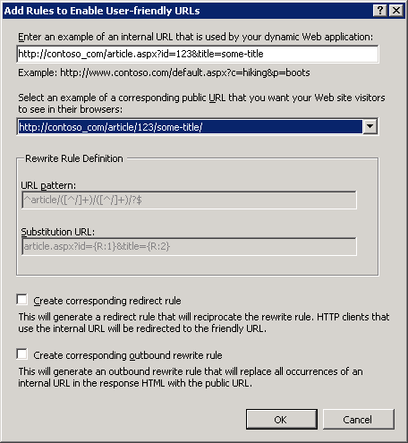
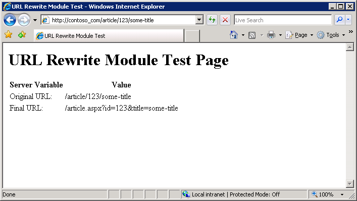
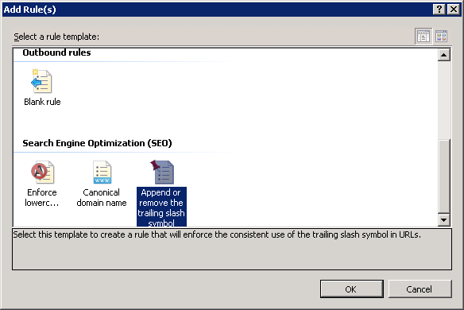
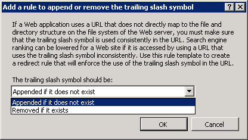
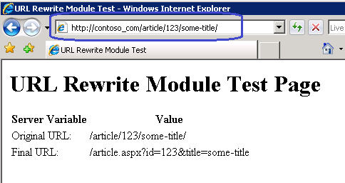
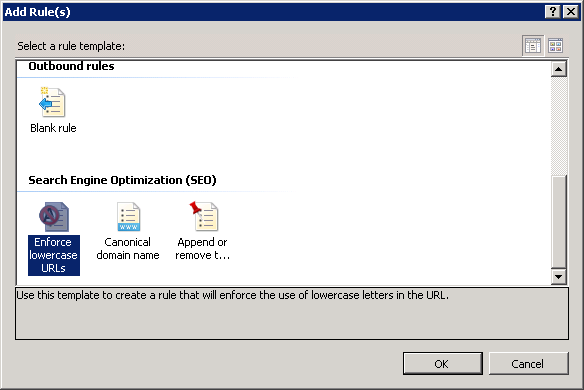
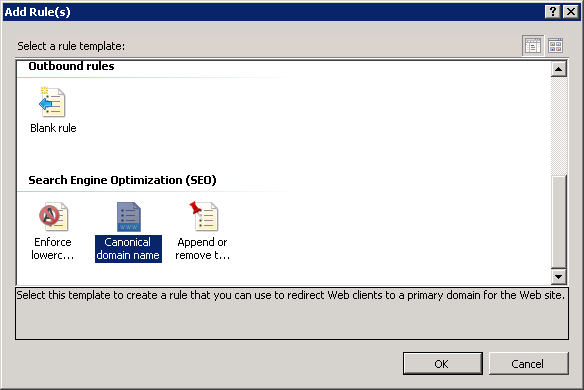
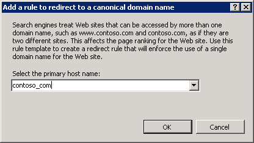

SEO Rule Templates
====================
by [Ruslan Yakushev](https://github.com/ruslany)

Rule templates are used to provide a simple way of creating one or more rewrite rules for a certain scenario. URL Rewrite Module 2 includes several rule templates for some common usage scenarios. In addition to that URL Rewrite Module UI provides a framework for plugging in custom rule templates. This walkthrough will guide you through how to use the "Search Engine Optimization" rule templates to make sure that the URLs used by pages on your web application are the most optimal for search engine ranking.

## Prerequisites

This walkthrough requires the following prerequisites:

- IIS 7 or above with ASP.NET role service enabled;
- URL Rewrite Module 2.0 installed;

## Setting up a test web page

You will be using a simple test asp.net page to verify that the rules created by the template work correctly. The test page simply reads the web server variables and outputs their values in browser.

Copy the following ASP.NET code and put it in the %SystemDrive%\inetpub\wwwroot\ folder in a file called article.aspx:

[!code-aspx[Main](seo-rule-templates/samples/sample1.aspx)]

Using Notepad, open **%SystemDrive%\windows\system32\drivers\etc\hosts** and add the two following lines at the end:

[!code-unknown[Main](seo-rule-templates/samples/sample-127338-2.unknown)]

Note: you are using "\_" instead of "." for domain separators. This is to prevent a Web browser from trying to resolve the domain name by using a Domain Name System (DNS) server.

Verify that the host names and web page were setup correctly by opening a Web browser and going to the urls:

`http://www_contoso_com/article.aspx?id=123&title=some-title`  
`http://contoso_come/article.aspx?id=123&title=some-title`

Finally use the "User-Friendly URL" rule template to generate an inbound rewrite rule that allows usage of the clean hierarchy base URLs instead of URLs that use query string parameters (refer to [User-Friendly URL - rule template](user-friendly-url-rule-template.md) for more information):

Verify that the rule has been generated correctly by opening a Web browser and making a request to `http://contoso_com/article/123/some-title`:

## Enforce Trailing Slash Rule Template

Many web applications use "virtual URLs" – that is the URLs that do not directly map to the file and directory layout on web server's file system. An example of such URL is `http://contoso_com/article/123/some-title`. If you try to request this URL with or without trailing slash you will still get the same page. That is OK for human visitors, but may be a problem for search engine crawlers as well as for web analytics services. Different URLs for the same page may cause crawlers to treat the same page as different pages, thus affecting the page ranking. They will also cause Web Analytics statistics for this page to be split up.

Having or not having a trailing slash in the URL is a matter of taste, but once you've made a choice you can enforce the canonical URL format by using the "Append or remove trailing slash symbol" rule template:

Choose whether you want to always add or always remove the trailing slash from all the "virtual URLs":

After the rule has been generated open a Web browser and make a request to `http://contoso_com/article/123/some-title`. The Web browser will be redirected to `http://contoso_com/article/123/some-title/`:

## Enforce Lowercase URLs

A problem similar to the trailing slash problem may happen when somebody links to your web page by using different casing, e.g. http://contoso\_com/Article/123/Some-Title vs. http://contoso\_com/article/123/some-title . In this case again the search crawlers will treat the same page as two different pages and two different statistics sets will show up in Web Analytics reports.

What you want to do is to ensure that if somebody comes to your web site by using a non-canonical link, then you redirect them to the canonical URL that uses only lowercase characters. The "Enforce lowercase URLs" rule template can be used to generate a redirect rule for that:

Click OK to generate a redirect rule:

After the rule has been generated open a Web browser and make a request to `http://contoso_com/Article/123/Some-Title`. The Web browser will be redirected to `http://contoso_com/article/123/some-title/`.

## Canonical Domain Name

Very often you may have one IIS web site that uses several different host names, like for example `http://contoso.com/` and `http://www.contoso.com`. Or, perhaps, you have recently changed you domain name from **oldsitename.com** to **newsitename.com** and you want your visitors to use new domain name when bookmarking links to your site.

To enforce usage of a particular domain name format use the "Canonical Domain Name" rule template:

Enter the domain name that you want to enforce for the site, for example contoso\_com:

After the rule has been generated open a Web browser and make a request to `http://www_contoso_com/Article/123/Some-Title`. The Web browser will be redirected to `http://contoso_com/article/123/some-title/`

## Summary

In this walkthrough you have learned how to use Search Engine Optimization rule templates to generate redirect rules that can help to improve search engine rankings and usability of your web site. To learn more about Search Engine Optimization tools available in IIS, refer to [Search Engine Optimization Toolkit](https://www.iis.net/downloads/microsoft/search-engine-optimization-toolkit).
  
  
[Discuss in IIS Forums](https://forums.iis.net/1152.aspx)