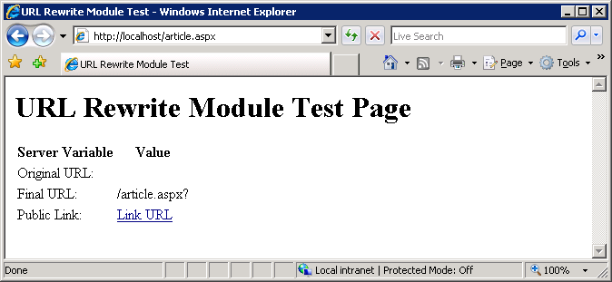
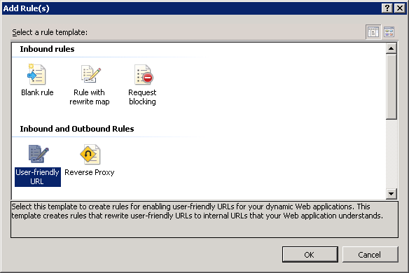
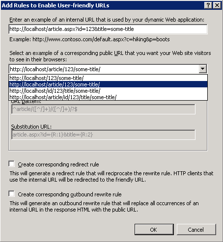
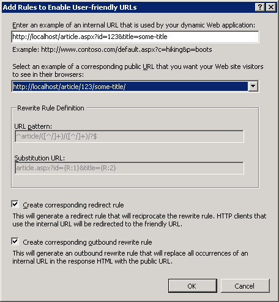
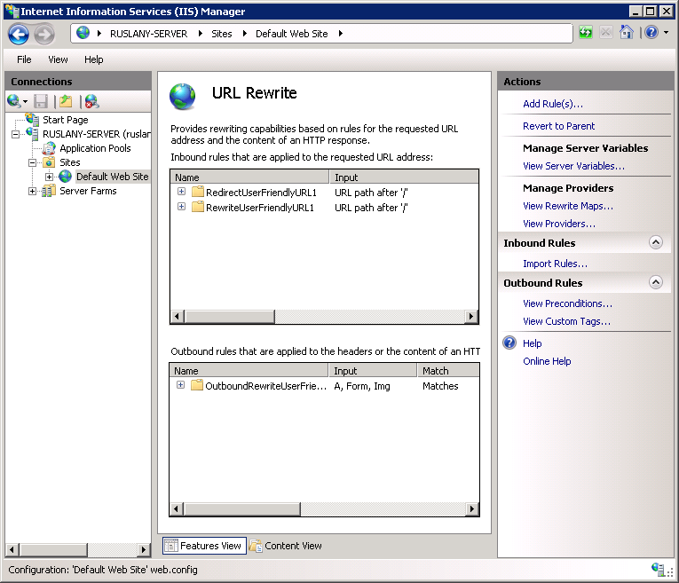
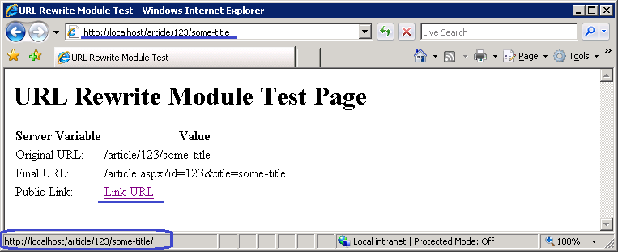

User Friendly URL - rule template
====================
by [IIS Team](https://twitter.com/inetsrv)

Rule templates are used to provide a simple way of creating one or more rewrite rules for a certain scenario. URL rewriter module includes several rule templates for some common usage scenarios. In addition to that URL rewrite module UI provides a framework for plugging in custom rule templates. This walkthrough will guide you through how to use "User Friendly URL" rule template that is included with URL rewrite module.

## Prerequisites

This walkthrough requires the following prerequisites:

1. IIS 7.0 or above with ASP.NET role service enabled;
2. URL rewrite module 2.0 release installed.

## Setting up a test web page

We will be using a simple test asp.net page to verify that the rules created by the template work correctly. The test page simply reads the web server variables and outputs their values in browser.

Copy the following ASP.NET code and put it in the %SystemDrive%\inetpub\wwwroot\ folder in a file called article.aspx:

[!code-aspx[Main](user-friendly-url-rule-template/samples/sample1.aspx)]

After copying this file, browse to `http://localhost/article.aspx` and check that the page was rendered correctly in a browser.  

## Using rule template to generate rewrite rules

The "User Friendly URL" rule template can be used to generate rewrite, redirect and outbound rules that make URLs for your dynamic web application more user and search engine friendly. Typically, dynamic web pages take into account query string parameters when generating an output HTML. The URLs with query strings (e.g. `http://contoso.com/articles.aspx?year=2008&month=11`) are not as easy for humans to use and communicate as simple hierarchy based URLs (e.g. `http://contolso.com/articles/2008/11`). In addition some search engine crawlers may ignore the query string when indexing the web site pages. The rule template helps you generate rewrite rule that transform the hierarchy based URLs to URLs with query strings. The templace can also, optionally, generate a redirect rule that can be used to redirect web clients form URLs with query strings to clean URLs. Finally, it is possible to create an outbound rewrite rule that replaces all the occurances of URLs with query strings in the HTML responce with their hierarch based URL equivalents.

To use the template follow these steps:

1. Go to IIS Manager
2. Select "Default Web Site"
3. In the Feature View click "URL Rewrite"  
    
4. In the "Actions" pane on right hand side click on "**Add rules…**" and then select "User Friendly URL" template:  
    
5. In the "Add rules to enable user friendly URLs" dialog enter an example of an URL with query string parameters: `http://localhost/article.aspx?id=123&title=some-title` and then expand the drop down list with suggested options for how that example URL can be transformed into a URL without query string.  
    
6. Choose the second option: `http://localhost/article/123/some-title`. Notice that the URL pattern and Substitution URL have been updated accordingly. These will be used in the rewrite rule that will be created by the rule template. Check the "Create corresponding redirect rule" to create a redirect rule that will be used, when web clients used internal URL to request a web page. Those clients will be redirected to a corresponding public URL.  
 Also, check the "Create corresponding outbound rewrite rule" to create an outbound rule that will replace all instances of internal URLs in the response HTML with their public equivalents.  
    
7. Click "OK" so that the rewrite, redirect and outbound rules will be generated:  
    

## Testing the rule

To test the generated rules, open a Web browser and request the following URL:

`http://localhost/article/234/some-title`

You should see that the rewrite rule on web server has changed the original URL to article.aspx and it has passed "234" and "some-title" as values for query string parameters.

In the web broser move the mouse over othe "Link URL" text (or use menu "Page" -&gt; "View Source..."). Notice that even though the URL for the link was originally in a format that used query string parameters, it has been replaced by URL Rewrite Module to use hierarchy based URL format.

Also, if you request `http://localhost/article.aspx?id=432&title=some-other-title` you will see that the browser gets redirected to `http://localhost/article/432/some-other-title`.

## Summary

In this walkthrough you have learned how to generate rewrite rules by using "User Friendly URL" rule template included in URL rewrite module. This rule template can be used as a starting point for designing rewrite rules for enabling user friendly and search engine friendly URLs for you existing web applications.
  
  
[Discuss in IIS Forums](https://forums.iis.net/1152.aspx)