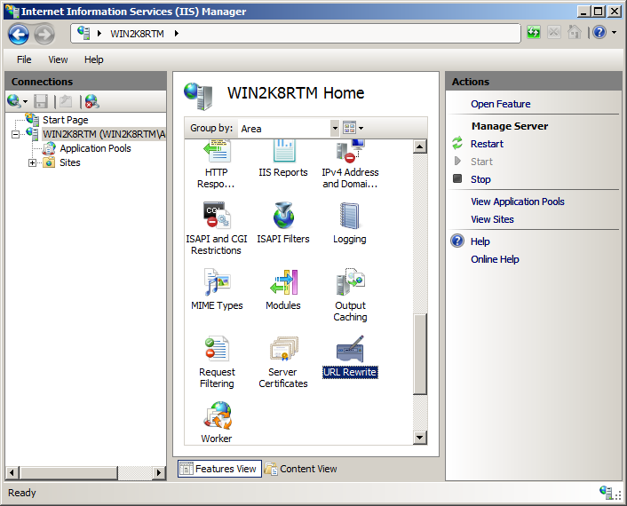
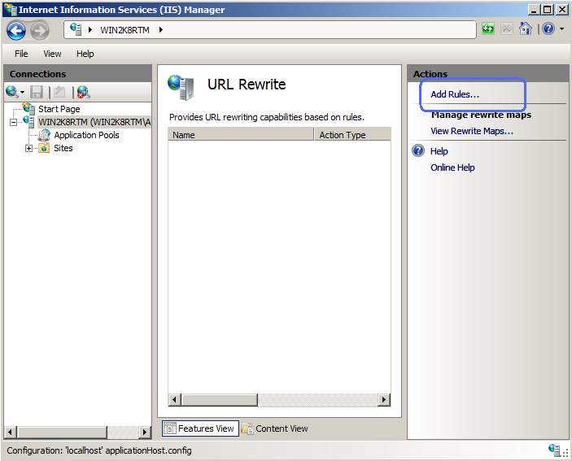
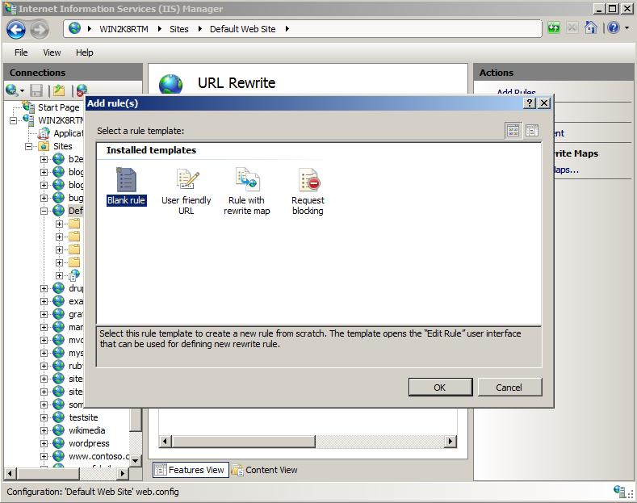
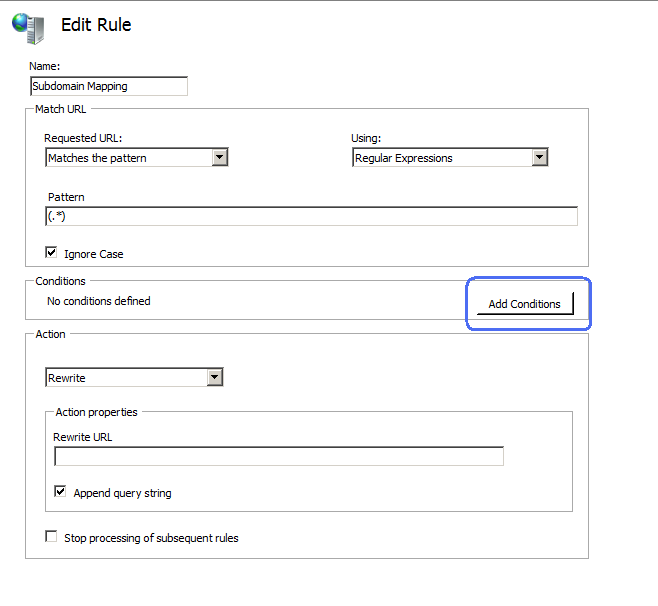
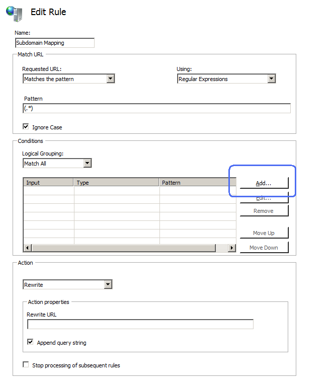
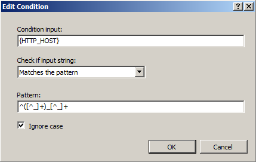
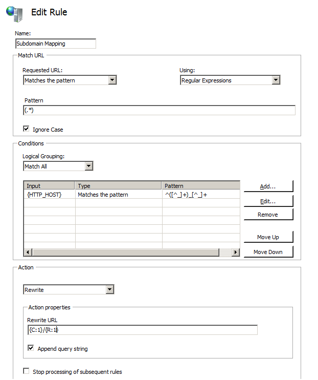
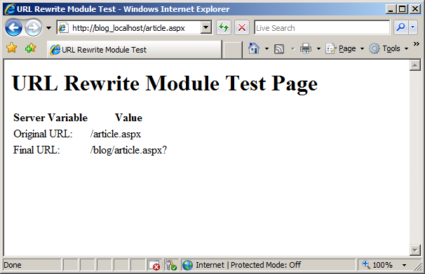
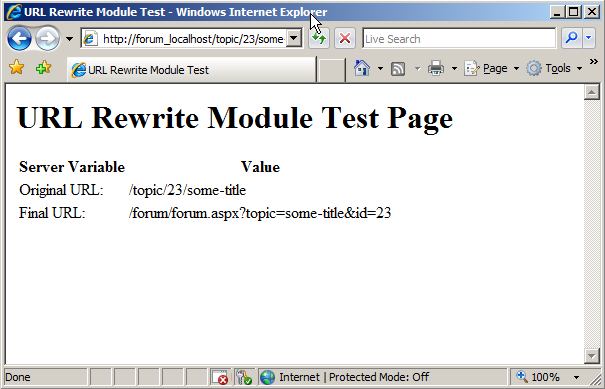

Using Global and Distributed Rewrite Rules
====================
by [Ruslan Yakushev](https://github.com/ruslany)

This walkthrough will explain the different types of rules supported by URL rewrite module and will guide you through how to configure global and distributed rewrite rules.

## Background

Global rewrite rules are used to define server-wide URL rewriting logic. These rules are defined within applicationHost.config file and they cannot be overridden or disabled on any lower configuration levels, such as site or virtual directory. Global rules always operate on the absolute URL path (that is, requested URI without the server name). For example if a request was made to `http://localhost/directory1/directory2/index.html`, then the URL rewrite module will pass "directory1/directory2/index.html" as an input to a global rule.

Distributed rewrite rules are used to define URL rewriting logic specific to a particular configuration scope. Distributed rules can be defined on any configuration level (except file) by using web.config files. Local rules always operate on URLs relative to the location of Web.config file where they are defined. For example if a request was made to `http://localhost/directory1/directory2/index.html` and a rewrite rule was defined in Web.config file located in directory1, then the URL rewrite module will pass "directory2/index.html" as an input to that rule.

Global rule set is always evaluated first, and after that distributed rule set will be evaluated by using a URL string produced by global rule set.

## Prerequisites

This walkthrough requires the following prerequisites:

1. IIS 7.0 or above with ASP.NET role service enabled
2. URL rewrite Go Live release installed

## Setting up a walkthrough scenario

To demonstrate how to use global and local rules, we will implement a common scenario of mapping sub-domains to directories. This will allow us to use sub-domains to access content in different directories on our site. For example users will be able to browse to `http://blog.mysite.com` instead of `http://mysite.com/blog`, or to `http://forum.mysite.com` instead of `http://mysite.com/forum`.

To set up the scenario perform the following steps:

1. Create two folders called "blog" and "forum" in `%SystemDrive%\inetpub\wwwroot\` folder.
2. Copy the following asp.net code and put it in the `%SystemDrive%\inetpub\wwwroot\blog` folder in a file called article.aspx:  

    [!code-aspx[Main](using-global-and-distributed-rewrite-rules/samples/sample1.aspx)]
3. Copy the following asp.net code and place it in the `%SystemDrive%\inetpub\wwwroot\forum` folder in a file called forum.aspx:  

    [!code-aspx[Main](using-global-and-distributed-rewrite-rules/samples/sample2.aspx)]
4. Open the file called "hosts", located at `%SystemDrive%\windows\system32\drivers\etc\` and add the following two lines at the of it:  

    [!code-console[Main](using-global-and-distributed-rewrite-rules/samples/sample3.cmd)]

    After adding these lines open a web browser and brows to http://blog\_localhost/blog/article.aspx and to http://forum\_localhost/forum/forum.aspx and verify that the pages were rendered correctly in a browser.

## Creating a global rewrite rule

First we will create a global rewrite rule that rewrites the URL based on the host header. For example if request was made to http://blog\_localhost/article.aspx then the rule will change URL path to "/blog/article.aspx".

To create a global rule by using URL Rewrite UI in IIS Manager follow these steps:

1. Go to IIS Manager
2. In the navigation tree view select the server node.
3. In the Feature View click "URL Rewrite Module"  
    
4. In the "Actions" pane click "Add rules…"  
    
5. In the "Add Rules" dialog select "Blank Rule" and click "Ok":  
    

Now we must define the actual rewrite rule. In URL Rewrite Module rewrite rule is defined by specifying four essential pieces of information:

- Name of the rule
- Pattern to use for matching the URL string
- Optional set of conditions
- Action to perform if pattern was matched and all conditions checks succeeded

### Naming a rule

In the "Name" text box enter a name that will uniquely identify the rule, for example: "Subdomain mapping".

### Defining a pattern

In the "Pattern" text box enter the following string:

[!code-console[Main](using-global-and-distributed-rewrite-rules/samples/sample4.cmd)]

This string is a regular expression that specifies that pattern will match any URL string, including an empty string and it will capture the matched string in a back-reference.

### Defining a condition

Click "Add Conditions" button:

Click "Add…" button to bring up the dialog box for defining conditions.

  
For "Condition input:" enter this string: "**{HTTP\_HOST}"**. This configures URL rewrite module to use the value of http request host header as an input for the condition

In the drop down combo box select "**Matches the pattern**".

In the "Pattern" textbox enter "**^([^\_]+)\_[^\_]+**". This regular expression will be used to match the domains that we have created (blog\_localhost and forum\_localhost) and will capture the part of the string before "\_" symbol into a back-reference. For example for string "**blog\_localhost**", it will keep the "**blog**" in the back-reference.

After all the properties have been specified the condition dialog should look as below:

Click OK to save the condition and return to the "Add Rule" UI.

### Defining an action

Since the rule that we are creating is supposed to rewrite the URL, choose the "Rewrite" action type within the "Action" group box. In the "Rewrite URL:" text box enter the following string:

[!code-json[Main](using-global-and-distributed-rewrite-rules/samples/sample5.json)]

This string specifies what the input URL should be rewritten to. The back-reference to condition {C:1} is used as a name of the folder and then whatever was captured in the rule pattern is preserved by using back-reference to the rule {R:1}.

Leave default values for all other settings. The "Edit Rule" UI should look as the following page:

  
   
Save the rule by clicking "Apply" action on the right hand side.

To understand how this rule will be applied let's walk through the steps that are performed by URL rewrite module when HTTP client requests this URL:   
`http://blog_localhost/article.aspx?id=323`:

1. URL rewrite module passes "article.aspx?id=323" as an input URL to the rule, successfully matches it against the rule pattern and captures it in a rule back-reference {R:1}
2. The host header value ("blog\_localhost") is successfully matched with regular expression "^([^\_]+)\_[^\_]+" and as a result "blog" is captured in a condition back-reference {C:1}
3. In accordance to the substitution string {C:1}/{R:1} the URL gets rewritten to "blog/article.aspx?id=323".

## Testing the rule

To test that the rule correctly rewrites URL's, open internet browser and request the following URL:  
`http://blog_localhost/article.aspx?id=123`

You should see that the URL rewrite module has changed the URL and opened an Article.aspx page in the "blog" directory. The changes made by the URL rewrite module were based on the information extracted from the host header.  
   
Similarly when you request `http://forum_localhost/forum.aspx?id=345` the URL will be rewritten to **/forum/forum.aspx?id=345**.

## Creating distributed rules

The global rule that we have just created was used to map the request to a folder based on the information extracted from the host header. Now we will create distributed rules that will allow us to have URL's without query string parameters. The distributed rules will take as an input the URL, which was already modified by global rule and will perform additional modifications to it. In particular:

- A rewrite rule in "blog" folder will rewrite URL path from "article/234/some-title" to "article.aspx?id=234&amp;title=some-title"
- A rewrite rule in "forum" folder will rewrite URL path from "topic/123/some-topic-title" to "forum.aspx?topic=some-topic-title&amp;id=123"

Local rules can be created by using either IIS Manager or by editing web.config files. For demonstration purposes we will create the rules by manually editing web.config files.

To create distributed rewrite rules:

1. Create an empty web.config file in `%SystemDrive%\inetpub\wwwroot\**blog**` folder. Open it in text editor and then paste the following XML code into it:  

    [!code-xml[Main](using-global-and-distributed-rewrite-rules/samples/sample6.xml)]
2. Create an empty web.config file in `%SystemDrive%\inetpub\wwwroot\**forum**` folder. Open it in text editor and then paste the following XML code into it:  

    [!code-xml[Main](using-global-and-distributed-rewrite-rules/samples/sample7.xml)]

## Testing both global and distributed rules

To test that all the rules work correctly together, open a Web browser and make a request to `http://blog_localhost/article/234/some-title`. The response in the browser should indicate that the URL was first changed by a global rule, and then has been additionally modified by a distributed rule.

Similarly, if you request `http://forum_localhost/topic/123/some-topic-title`, you should see that the URL rewrite module changes the requested URL string to "/forum/forum.aspx?topic=some-topic-title&amp;id=123."

## Summary

In this tutorial you have implemented a sub-domain mapping scenario by using global rule, and then used distributed rules to enable user friendly URL's for web pages in those folders.