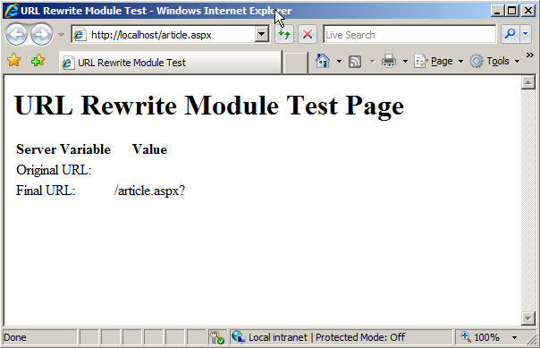
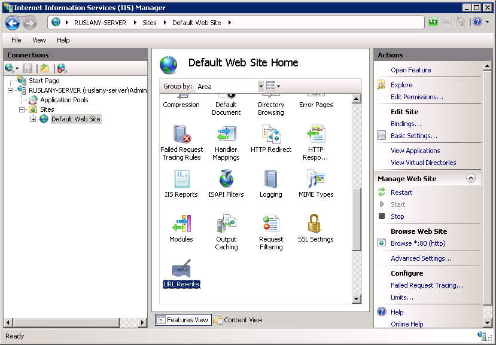
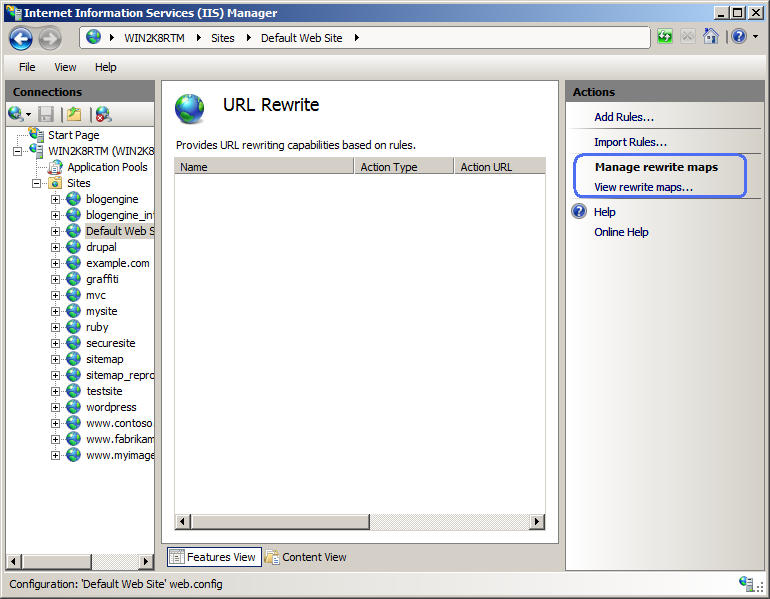
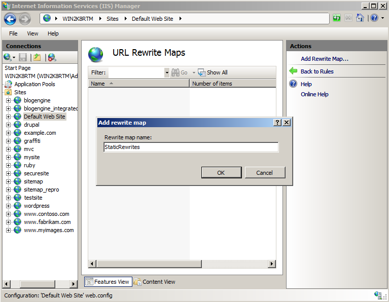
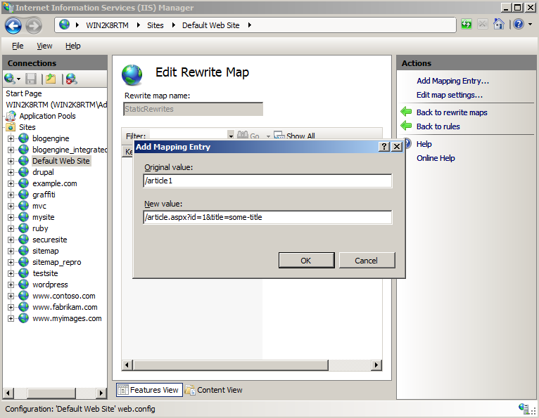
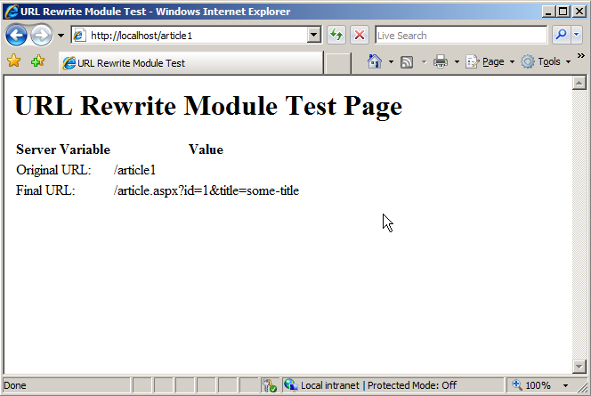

Using Rewrite Maps in URL Rewrite Module
====================
by [Ruslan Yakushev](https://github.com/ruslany)

This walkthrough will introduce you to the concept of rewrite maps in URL rewrite module and will guide you how to create rewrite rules that use rewrite maps. In this walkthrough you will create two rewrite maps: one rewrite map will be used by rule that performs url rewriting, and another rewrite map will be used by rule that performs redirects to a different domain.

## Background

A rewrite map is an arbitrary collection of name and value pairs that can be used within rewrite rules to generate a substitution URL during rewriting. Rewrite maps are particularly useful when you have a large set of rewrite rules and all of these rules use static strings (that is, when there is no pattern matching used). In those cases, instead of defining a large set of simple rewrite rules, you can put all the mappings into the rewrite map–as keys and values–between the input URL and the substitution URL. Then, to look up the substitution URL based on the input URL, you will have one rewrite rule that references this rewrite map.

## Prerequisites

This walkthrough requires the following prerequisites:

1. IIS 7.0 or above with ASP.NET role service enabled
2. URL rewrite Go Live release installed

## Setting up a test web page

To demonstrate rewrite map functionality, we will be using a simple test asp.net page. This page reads the web server variables and outputs their values in browser.

Copy the following ASP.NET code and put it in the %SystemDrive%\inetpub\wwwroot\ folder in a file called article.aspx:

[!code-aspx[Main](using-rewrite-maps-in-url-rewrite-module/samples/sample1.aspx)]

After copying this file, browse to `http://localhost/article.aspx` and check that the page was rendered correctly in a browser.

## Creating a map for rewriting

First, we will create a rewrite map and rewrite rule that will be used to perform URL rewriting based on a set of static mappings between original URLs and rewritten URLs. To create a rewrite map follow these steps:

1. Go to IIS Manager
2. Select "Default Web Site"
3. In the Feature View click "URL Rewrite"  
    
4. In the "Actions" pane on right hand side, click on "**View rewrite maps...**":  
    
5. In the "Actions" pane on right hand site, click on "Add rewrite map..." and then enter the name of the rewrite map as "**StaticRewrites**":  
    
6. On the page for newly created rewrite map, in the "Actions" pane on right hand side, click on "Add mapping entry..." and then enter "**/article**" and "**/article.aspx?id=1&amp;title=some-title**" for "Original value:" and "New value:" text boxes respectively. The original value specifies what URL path we want to rewrite from; the new value specifies what URL path we want to rewrite to.  
     
7. Repeat step 6 to add the following mappings to the rewrite map: 

    | Original Value: | New Value: |
    | --- | --- |
    | /some-title | /article.aspx?id=1&amp;title=some-title |
    | /post/some-title.html | /article.aspx?id=1&amp;title=some-title |

Now open the web.config file for your web site (if you use default web site then the web.config can be found at %SystemDrive%\inetpub\wwwroot). You should see the following section:

[!code-xml[Main](using-rewrite-maps-in-url-rewrite-module/samples/sample2.xml)]

This rewrite map, called "**StaticRewrites**," will be used to rewrite incoming URLs (defined as keys in the rewrite map) to their internal representations (defined as values). The **defaultValue** attribute specifies what value to use if an incoming URL has not been defined in the map. In this case an empty string will be returned.

Notice that there is no obvious common pattern in the keys and their relation to values. This means that it is not possible to use regular expressions or wildcards to define URL transformation logic. Further, this means that if we had not used rewrite maps we would have had to create three rewrite rules. With rewrite maps we can create only one rewrite rule. The next section explains how to create rewrite rule that uses this rewrite map.

## Referencing a rewrite map from rewrite rule

To create rewrite rule that uses the rewrite maps, copy and paste the following XML code into the &lt;rewrite&gt; section of web.config file for you website:

[!code-xml[Main](using-rewrite-maps-in-url-rewrite-module/samples/sample3.xml)]

Let's go through each rule element to understand what it does:  
**&lt;match url=".\*" /&gt;** - this element tells URL rewrite module to match any incoming URL (by using regular expression special character ".")

**&lt;add input="{StaticRewrites:{REQUEST\_URI}}" pattern="(.+)"&gt;**- this conditions checks is the value returned from rewrite map StaticRewrites is not an empty string. To perform this check the value of the server variable REQUEST\_URI is passed as a parameter to the rewrite map. If rewrite map contains an entry with key, that is the same as REQUEST\_URI, then the value corresponding to that key will be returned. The regular expression pattern will match only non-empty strings, so if empty string was returned from the map then the condition will evaluate to false, hence no rewriting will be performed. If non-empty string was returned then that string will be captured in a back-reference, because of the parenthesis used in the pattern.

**&lt;action type="Rewrite" url="{C:1}" /&gt;** - this element specifies that URL rewrite module needs to rewrite the current URL string with the new one extracted from rewrite map. Notice that the url attribute references the condition back-reference {C:1}, which has been set when pattern in condition was matched.

## Testing the rule for rewriting

To test the rewrite rule that uses "StaticRewrites" map, open web browser and request any of the following URLs:

`http://localhost/article1`  
`http://localhost/some-title`  
`http://localhost/post/some-title.html`

Any one of the URLs above should cause the URL to be rewritten in accordance to the mappings defined in the rewrite map. Your results should look like the following page:

## Using rewrite maps for redirection

Now we will create another rewrite map that will be used for defining static mappings between source URLs and redirection URLs. To create a rewrite map, follow the same steps as described in section "[Creating a map for rewriting](using-rewrite-maps-in-url-rewrite-module.md#Creating_a_map_for_rewriting)", but name the rewrite map as "StaticRedirects" and use the following values for mapping entries:

| Original value: | New Value: |
| --- | --- |
| /old-article.aspx?id=1 | /article.aspx?id=1 |
| /posts/default.aspx?id=1 | /article.aspx?id=1 |
| /old-title.html | /article.aspx?id=1 |

The web.config file for your web site now should contain these two rewrite maps:

[!code-xml[Main](using-rewrite-maps-in-url-rewrite-module/samples/sample4.xml)]

To create a rule that uses the StaticRedirects rewrite map, copy and paste the following rule definition into the web.config file for your web site:

[!code-xml[Main](using-rewrite-maps-in-url-rewrite-module/samples/sample5.xml)]

Again, let's go through each rule element to understand what it does:  
**&lt;match url=".\*" /&gt;** - this element tells URL rewrite module to match any incoming URL (by using regular expression special character ".")

**&lt;add input="{StaticRedirects:{REQUEST\_URI}}" pattern="(.+)"&gt;**- this conditions checks is the value returned from rewrite map **StaticRedirects** is not an empty string. To perform this check the value of the server variable REQUEST\_URI is passed as a parameter to the rewrite map. If rewrite map contains an entry with key, that is the same as REQUEST\_URI, then the value corresponding to that key will be returned. The regular expression pattern will match only non-empty strings, so if empty string was returned from the map then the condition will evaluate to false, hence no rewriting will be performed. If non-empty string was returned then that string will be captured in a back-reference, because of the parenthesis used in the pattern.

**&lt;action type="Redirect" url="http://localhost{C:1}" appendQueryString="False" redirectType="Permanent" /&gt;** - this element specifies that URL rewrite module needs to redirect web client to a new URL that is constructed by concatenating the new domain name (in this case it is the same domain for simplicity purposes) and the redirection URL path returned by StaticRedirects map.

## Testing the rule for redirection

To test the rewrite rule that uses "StaticRedirects" map, open web browser and request any of the following URLs:

`http://localhost/old-article`  
`http://localhost/posts/default.aspx?id=1`  
`http://localhost/old-title.html`

Any one of the URLs above should cause the browser to be redirected to the `http://localhost/article.aspx?id=1`.

## Using rewrite maps for query string parameters

Usage of rewrite maps is not limited to the above mentioned examples. Rewrite map is a generic collection of key-value pairs that can be used anywhere in rewrite rule. To illustrate this, let's create a rewrite map that can be used for manipulation of query string parameters.

Create a third rewrite map, by following the same steps as described in section "[Creating a map for rewriting](using-rewrite-maps-in-url-rewrite-module.md#Creating_a_map_for_rewriting)". Name the rewrite map as "IDtoTitleMap" and use the following values for mapping entries:

| Original value: | New Value: |
| --- | --- |
| 1 | some-title-1 |
| 2 | some-title-2 |
| 3 | some-title-3 |

The web.config file for your web site now should contain these two rewrite maps:

[!code-xml[Main](using-rewrite-maps-in-url-rewrite-module/samples/sample6.xml)]

To create a rule that uses the **IDtoTitleMap** rewrite map, copy and paste the following rule definition into the web.config file for your web site:

[!code-xml[Main](using-rewrite-maps-in-url-rewrite-module/samples/sample7.xml)]

Let's go through each rule element to understand what it does:  
**&lt;match url="^article\.aspx$" /&gt;** - this element tells URL rewrite module to execute the rule when article.aspx file is requested.

**&lt;add input="{QUERY\_STRING}" pattern="(?:^|&amp;)id=([0-9]+)(?:&amp;|$)" /&gt;**- this condition checks if the query string contains a parameter **id** that has a numeric value. The actual value is captured in a condition back-reference. Note that this pattern will work even if there are other parameters on the query string.

**&lt;add input="{IDtoTitleMap:{C:1}}" pattern="(.+)" /&gt;**- this conditions checks if the value returned from rewrite map **IDtoTitleMap** is not an empty string. The condition uses the back-reference from the previous condition pattern as an input to the rewrite map.

**&lt;action type="Redirect" url="article.aspx?title={C:1}" appendQueryString="False" redirectType="Permanent" /&gt;** - this element specifies that URL rewrite module needs to redirect web client back to article.aspx file but with different query string parameter **title**, which has a value that was looked up in rewrite map.

## Testing the rule for query string

To test the rewrite rule that uses "**IDtoTitleMap**" map, open web browser and request any of the following URLs:

`http://localhost/article.aspx?id=1`. This will be redirected to `http://localhost/article.aspx?title=some-title-1. http://localhost/article.aspx?someparam=somevalue&id=2`. This will be redirected to `http://localhost/article.aspx?title=some-title-2`

## Summary

In this walkthrough you have learned how to use rewrite maps to define URL mappings for rewrite and redirect rules. Also you have learned how to use rewrite maps to manipulate the query string parameters.

The rewrite maps allow you to reduce the number of rewrite rules when rewrite and redirect URL's are static and rewriting logic cannot be expressed by using any pattern matching techniques.
  
  
[Discuss in IIS Forums](https://forums.iis.net/1152.aspx)