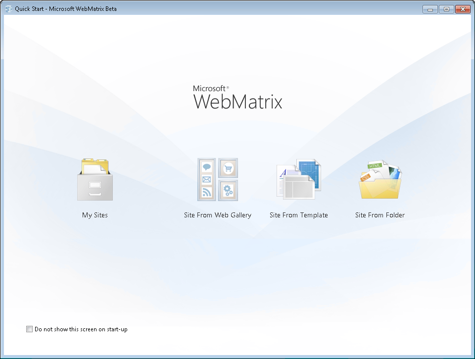
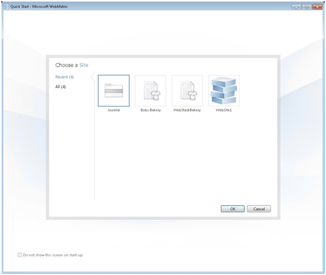
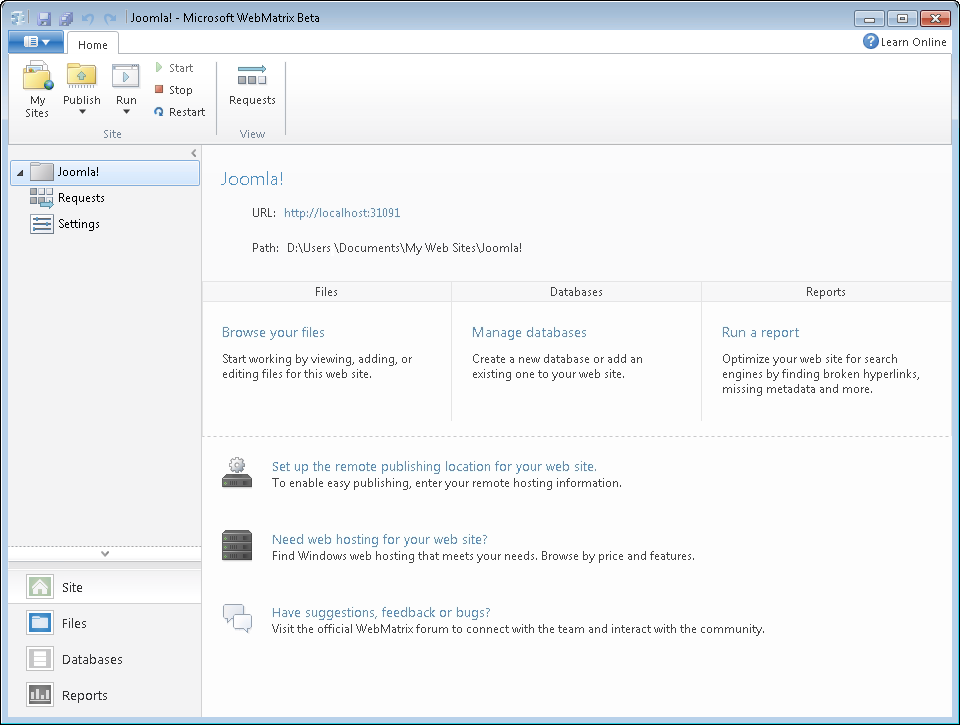
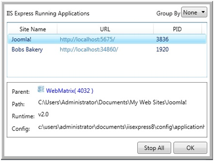
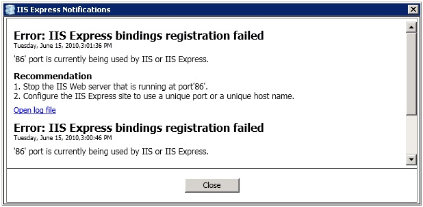

Using the Windows System Tray to Manage Websites and Applications
====================
by [Diana Nguyen](https://twitter.com/dianaaanguyen)

## Overview

This walkthrough discusses how to manage your websites and applications in WebMatrix Beta using the system tray. This feature lets you manage all running sites from the same system tray.

This walkthrough assumes that you have installed two or more websites and applications on your server.

### Prerequisites

You must have the following installed to complete the procedures in this walkthrough:

- Windows XP or newer
- WebMatrix Beta

For information about how to install WebMatrix Beta, see [Microsoft Web Platform Installer 3.0](https://go.microsoft.com/fwlink/?LinkID=145510).

## Managing Sites and Applications with the System Tray

1. Click **Start** &gt; **All Programs** &gt; **Microsoft WebMatrix**.
2. On the WebMatrix Beta **Quick** **Start** page, click **My Sites**.  
    
3. On the **Choose a Site** page, select the site that you want to open, and then click **OK**.  
    
4. WebMatrix opens your site.   
    
5. Repeat steps 1 – 3 to open a second site.   
    > [!NOTE]
    > If you do not already have a second site, you can add a new one by choosing **Site from Web Gallery**, **Site From Template**, or **Site From Folder**.
6. Right-click **WebMatrix** in the system tray. If you do not see the icon, click **Show hidden icons** to display the icon.  
      
 You will see the following:  
    

    | Sites | Displays a list of the sites that you are currently running. Select a specific site to display the **Browse Applications** and **Stop Site** options. |
    | --- | --- |
    | Exit | Closes all the sites that you are currently running. |
    | Browse Applications | Displays the URL addresses for each application. Click on the URL to view the site in a browser window. |
    | Stop Site | Stops the selected site from running. This action removes the site from the list of sites in the system tray. You must use either WebMatrix or IIS Express to start the site to see the site in the system tray again. |
    | Show All Applications | Displays a dialog box with a list of the applications that are running, including the site name, URL, and Process Identifier (PID). Use the Group by list to sort the applications by site name or PID. Select a site name to view additional details for each site, including the parent, path, runtime version, and configuration file path. The parent is the application that was used to start the instance of IIS Express that is hosting the site. If you right-click a site name you will see a context menu with additional options, such as stopping the site, browsing, etc. You can also stop all applications in this dialog box. |
    | Stop All | Stops all the running applications that are listed and exits the system tray. |

    

> [!NOTE]
> If there are any errors when running IIS Express, you will see the following notification:

Click the notification for more information, including a detailed error message and recommended steps to resolve the issue. For example:

For more information about IIS Express, see [Use the Command Line to Run a WebMatrix Site](https://go.microsoft.com/fwlink/?LinkId=195514).