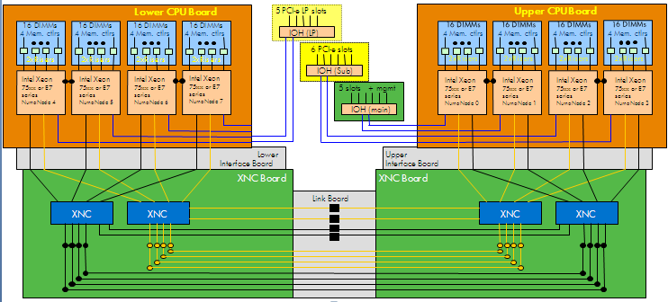
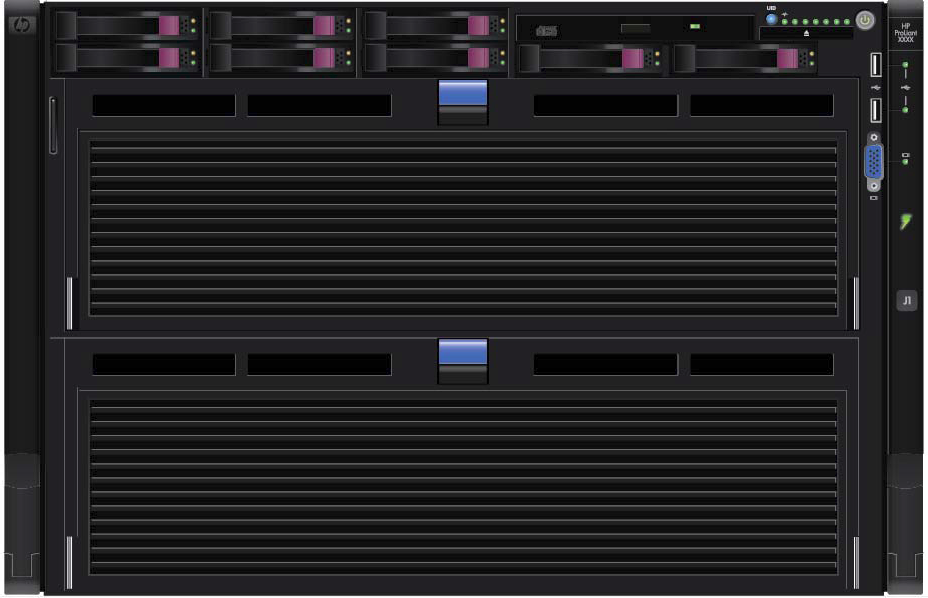
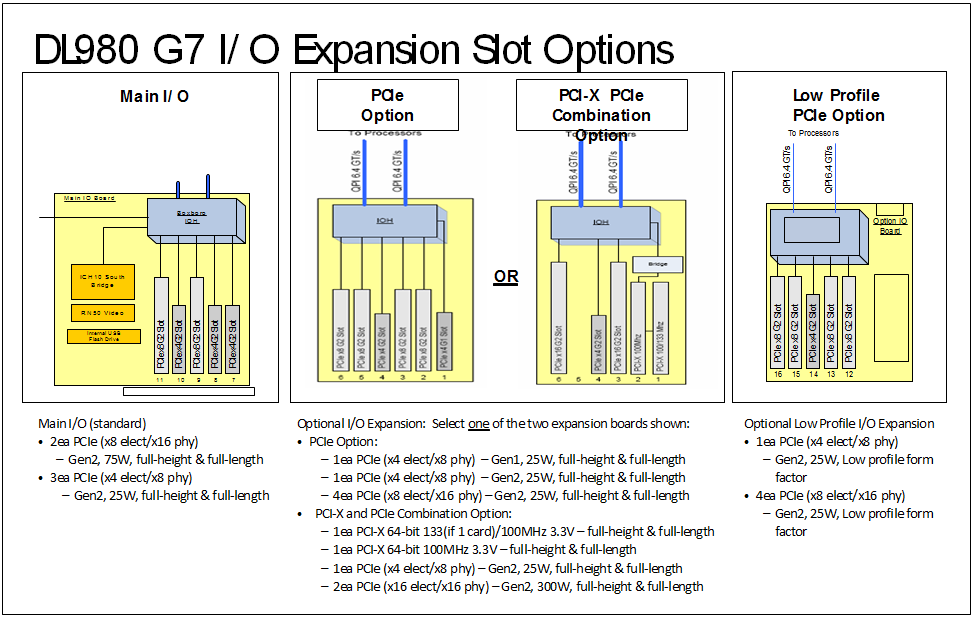
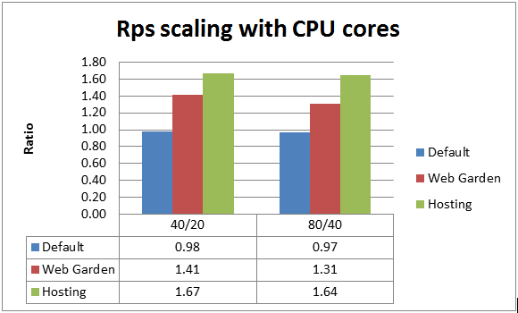
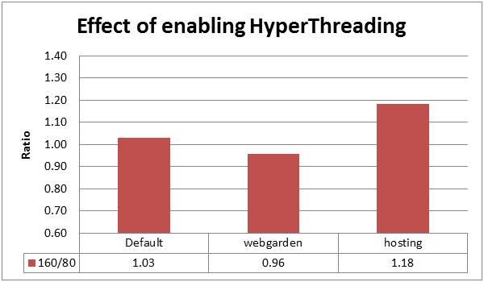
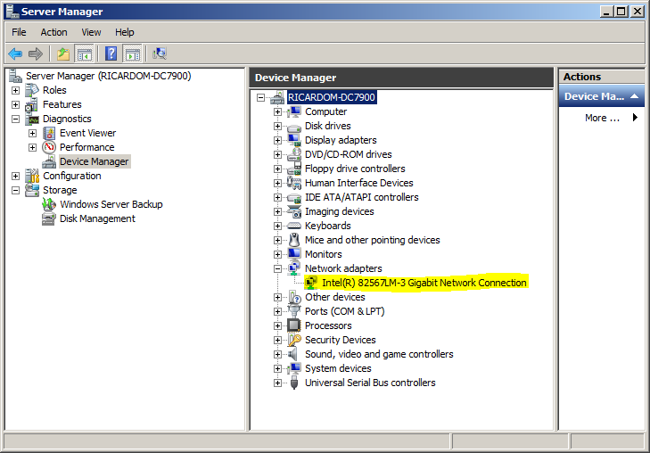
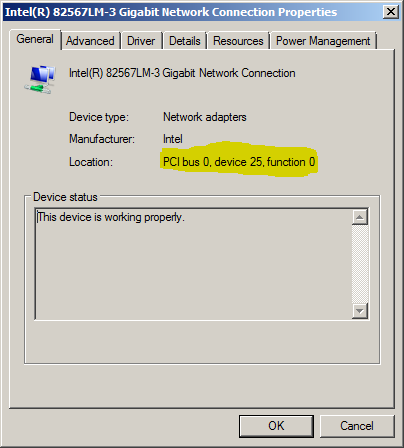

Case Study: IIS 8.0 Scaling On An HP Proliant DL980 G7 8-Processor Socket System
====================
by [Microsoft](https://github.com/Microsoft)

> This Whitepaper compiles the findings from a joint effort between HP and the IIS product team to assess the performance capabilities of IIS running on HP's 8-way systems. This whitepaper also serves as a deployment guide that can be used by customers to configure IIS on such systems.

**Abstract**: This case study describes how to deploy and optimize Microsoft IIS 8.0 Server on 8 way systems from HP.

**Authors**: Hewlett-Packard (HP), IIS Product Group (IIS), Microsoft's Enterprise Engineering Center (EEC)

## Contents

- [Introduction](#introduction)
- [The Customer Problem](#the-customer-problem)
- [IIS 8.0](#iis-80)
- [HP Platform](#hp-platform)

    - [Background on HP DL980 G7](#background-on-hp-dl980-g7)
    - [Recommended Configuration &amp; Settings](#recommended-configuration-and-settings)

        - [RAM](#ram)
        - [Network](#network)
        - [HBA &amp; IO](#hba-and-io)
        - [BIOS](#bios)
- [Test Methodology](#test-methodology)

    - [Test Scenario](#test-scenario)
    - [Test Setup](#test-setup)
- [Findings](#findings)

    - [Comparison between 80 cores and 40 cores](#comparison-between-80-cores-and-40-cores)
    - [Impact of Hyperthreading](#impact-of-hyperthreading)
- [Summary](#summary)
- [Appendix](#appendix)

    - [PowerShell](#powershell)

        - [Background](#background)
        - [Configuring RSS Affinity](#configuring-rss-affinity)

            - [Manually gathering the Topology Information](#manually-gathering-the-topology-information)
            - [Gathering Hardware Topology thru PowerShell](#gathering-hardware-topology-thru-powershell)
    - [WCAT](#wcat)
    - [About](#about)

        - [IIS Product Group](#iis-product-group)
        - [Hewlett-Packard (HP)](#hewlett-packard-hp)
        - [EEC](#eec)

## Introduction

*The Web Server workload is usually associated with commodity servers on a scale-out model. When additional processing power is required, extra machines are added to the pool. This is a very common model, and Microsoft Internet Information Services (IIS) has several features to make such an approach easy to configure and deploy.*

*Usually the scale-up model is associated with other workloads, for example: SQL Server. The reality, though, is that during the Windows Server 2012 Release, several investments were made in the IIS infrastructure to better enable the scale-up model. As a result of such investments, IIS 8.0 can be deployed in a way that takes advantage of all the characteristics of such of large scale servers. This allows customers to unleash all the power and reliability of such machines.*

*As part of the Windows Server 2012 development cycle, a series of performance tests were conducted to characterize the IIS workloads in terms of performance. Those tests were conducted on an HP DL980 G7 using the facilities at Microsoft's Enterprise Engineering Center (EEC), which is Microsoft's Customer Validation facility for Windows Server.*

*This Whitepaper compiles the findings from a joint effort between HP and the IIS product team to assess the performance capabilities of IIS running on HP's 8-way systems. This whitepaper also serves as a deployment guide that can be used by customers to configure IIS on such systems.*

## The Customer Problem

Generally speaking, increasing the number of cores should result in increased performance. When IIS customers deployed their applications on Non-Uniform-Memory-Access (NUMA) aware hardware with Windows Server 2008 R2, they noticed that after certain point increasing number of core resulted in performance degradation. This happened because the cost of software memory synchronization out-weighs the benefits of additional cores on NUMA hardware. IIS 8.0 in Windows server 2012 addresses this problem by intelligently distributing the thread affinity for processes on NUMA hardware, and this proof-of-concept has allowed identifying the operating system and network IO tuning to ensure the IIS 8.0 optimum scalability.

## IIS 8.0

Internet Information Services (IIS) on Windows Server 2012 is NUMA-aware and provides the optimal configuration for the IT administrators. The following section describes how IIS 8.0 takes advantage of NUMA hardware to provide optimal performance.

IIS supports following two ways of partitioning the workload:

1. ***Run multiple worker processes in one application pool (i.e. web garden).***  
 If you are using this mode, by default, the application pool is configured to run in a single worker process. For maximum performance, you should consider running the same number of worker processes as there are NUMA nodes, so that there is 1:1 affinity between the worker processes and NUMA nodes. This can be done by setting &quot;    **Maximum Worker Processes&quot;**  AppPool setting to 0. When this setting is configured, IIS will determine how many NUMA nodes are available on the hardware and will start the same number of worker processes.
2. ***Run multiple applications pools in single workload/site.***  
 In this configuration, the workload/site is divided into multiple application pools. For example, the site may contain several applications that are configured to run in separate application pools. Effectively, this configuration results in running multiple IIS worker processes for the workload/site and IIS intelligently distributes process affinity for maximum performance.

Depending upon the workload, administrator partitions the workload into multiple worker processes. Once a workload is correctly partitioned, IIS 8.0 identifies the most optimal NUMA node when the IIS worker process is about to start. By default, IIS picks the NUMA node with the most available memory. IIS has the knowledge of the memory consumption by each NUMA node and uses this information to &quot;load balance&quot; the IIS worker processes. This option is different from Windows default of round-robin and specially designed for IIS workload.

Finally, there are two different ways to configure the affinity for threads from an IIS worker process to a NUMA node.

1. ***Soft Affinity (default)***  
 With soft affinity, if other NUMA nodes have available cycles, the threads from an IIS worker process may get scheduled to a NUMA node that was not configured for affinity. This approach helps to maximize all available resources on the system as whole.
2. ***Hard Affinity***  
 With hard affinity, regardless of what the load may be on other NUMA nodes on the system; all threads from an IIS worker process are assigned to the chosen NUMA node that was selected for affinity using the design above.

*Although Hard Affinity can provide better overall performance, setting up Hard Affinity requires more configuration and deeper hardware understanding. Also, if configured improperly, it also results in poorer performance. So, the default configuration is Soft Affinity.*

## HP Platform

### Background on HP DL980 G7

DL980 G7 is the first HP Proliant scale-up server with 8 processor sockets, using the HP PREMA architecture incorporating node controllers with smart CPU caching and redundant system fabric. The first iteration of the DL980 G7 servers used Intel® Xeon® processor 7500/6500 series (a.k.a Nehalem-EX) processors (4-, 6- and 8-core SKUs), 128 DIMM sockets and 16 PCIe slots. The second version supports the Intel® Xeon® processor E7-8800/4800/2800 (a.k.a Westmere-EX) processors (up to the 10-core SKU). With the current Intel Nehalem-EX configuration with 8 processors, each with 8 cores and with hyper threading enabled, Windows Server 2008 R2 enables a total of 128 Logical Processors, the maximum OS support of 2TB of RAM and the 16 PCIe slots. With Intel Westmere-EX 10-core SKU processors and hyper threading enabled, Windows Server 2008 R2 enables a total of 160 Logical Processors for the DL980 G7. And today, Windows Server 2012 enables the 4TB of RAM this platform supports.

The performance and scalability capabilities of these 8-way Intel based servers with HP scalability node controllers exceeds anything that has previously existed on Intel/AMD and meet or exceeds the performance of many UNIX platforms, doing so at considerably lower price point than UNIX platforms. In addition these new Nehalem-EX &amp; Westmere-EX are at close to parity with UNIX platforms with respect to the R.A.S feature set according to Gartner and other industry analysts.

The installation and configuration of a HP DL980 differs from earlier simpler SMP servers in a number of respects:

- Placement of PCIe cards such as HBA and Network cards is critical
- Device Drivers must be Windows KGROUP-aware and NUMA-aware

While the support of scale-up servers by Windows Server 2012 is greatly improved, for the prior-Windows Operating System versions and Applications must be the correct versions and patches to fully support and scale on the DL980 G7 platform.

As Windows x64 Server and its user workloads utilize configurations with 8 or more sockets, incorrect configuration or use of these platforms like the HP DL980 G7 can result in substantial performance penalties. With this 8-processor configuration, incorrect device drivers or non-NUMA aware applications might not be delivering the scalability gains that the user might have expected. Typical problems that could occur include flooding the non-scalable transactions the QPI, IO Hub and PREMA chipsets interconnects

The Microsoft SQL Server, SAP and IIS teams have extensively tested, deployed and benchmarked their products on the DL980 G7, and it has demonstrated excellent results. The HP DL980 G7 and other 8-processor systems have demonstrated excellent outcomes as Database Servers but also now as Internet Information Servers

The following figure illustrates the DL980 G7 block diagram, and it is provided as a convenience to the reader as he/she follows the different configuration options and tuning presented in the following paragraphs:

**Configuration options:** 

The DL980 G7 ships in a variety of configurations: 4 and 8 processor socket models are available. Additionally, there are several different configurations for PCI expansion slots. These are documented in the [HP Technical Reference Guide for the DL980](http://h18004.www1.hp.com/products/quickspecs/13708_na/13708_na.pdf)

Throughout this document, we with refer to Processors in terms of how Windows recognizes and describes them, Processors 0 - 7 and NUMA nodes 0 - 7.

DL980 G7 has two &quot;trays&quot;. The upper tray holds Processor 0-3 and directly controls the Main and Sub IO boards. The lower tray holds Processor 4-7 and controls the &quot;Option&quot; or Low Profile (LP) IO board.

The DL980 G7 has three IO boards:

1. Main PCI board - Directly connected to **Processors 0-1,** this board provides 5x PCIe Gen 2 IO slots [ 2 (x8) and 3 (x4) electrical connectors] suitable for high bandwidth PCI devices such as full height HBA, NIC and FusionIO/SSD cards It also connects the embedded devices like the LAN On Motherboard (LOM -NC375i), video, internal disk controller (Smart array P410i), SATA DVD, USB ports, ...
2. Sub IO PCI board (optional) - Directly connected to **Processors 2-3,** this board provides 5 PCIe Gen2 slots [4 (x8) and 1 (x4) electrical connectors] and 1 PCIe Gen 1 (x4) - slot ID 1 - (optionally a PCI-X slot - not recommended) suitable for full height high bandwidth devices.
3. Low Profile (LP) IO board - Directly connected to **Processors 4-5,** this board provides 4 x PCIe x8 and 1 x PCIe x4 slots. These slots are half height only, most recent network and HBA cards ship with a low-profile bracket which can replace the standard one in order to fit in half height slots.

### Recommended Configuration &amp; Settings

#### RAM

The DL980 G7 has extremely powerful processors, each containing 2 memory controllers and is capable of massive IO throughput when correctly configured. The platform is configured so memory accesses are spread evenly across both memory controllers of each processor. To ensure a &quot;balanced&quot; system design, we recommend at least 512GB of RAM, with more typical deployments with 1TB of RAM as at May 2011. A DL980 G7 with less than 512GB-1TB of RAM is probably never able to leverage the very powerful processors because of insufficient RAM. Most customers will observe a dramatic decrease in IOPS and huge improvement both in IO and scaling performances with Windows Server 2012, thanks to increased IO NUMA-awareness and NUMA scaling improvements in this Windows operating system version.

Please note the following memory configuration facts:

- DDR3 DIMMs only.
- Each processor connects to 2 Memory Risers, with each riser supporting 1 memory controller and 8 DIMM connectors.
- Supports Registered DIMMs (RDIMM) only. Unbuffered DIMMs (UDIMM) are not supported.

    - LR or DDR3L are only supported with Westmere-EX processors.
- Supports single-rank (SR), dual-rank (DR) and quad-rank (QR) DIMM modules
- 1 GB and 2 GB DRAM technologies are supported with Nehalem-EX processors and 4 GB are also supported with Westmere-EX processors.
- **DIMMs are added in Quads across 2 memory controllers.**
- Supports Advanced ECC, Online Rank Sparing and Mirroring.
- Memory ECC support includes correction of x4 and x8 chip fail.

#### Network

- Gigabit network adaptors are recommended as standard. 1 Gigabit network adaptors are most likely to be a bottleneck on these powerful systems.
- Reduce the total number of Network Adaptors required to achieve the required network performance.
- 10 Gigabit network adaptors have significantly improved device drivers and device driver configuration options.
- The HP 10Gb NC550SFP (Intel) network card has been tested and proved to be very highly performing; it requires a PCIe x8 slot on the Main or Sub IO Boards to reach full performance.
- HP DL980s support up to 4 10GbE NICs such as NC550SFP and NC523SFP (refer to HP DL980 quick specs documents for up to date information) with a total number of 8 10GbE ports.
- For load balancing purposes 10 Gigabit cards can be balanced between the Main and Sub IO boards. (For example: 2 x Dual port 10G NIC on Main Board and 2 x Dual port 10G on Sub IO Board).
- As the reader will realize in the IIS scaling paper, it is recommended to enable [Receive Side Scaling](https://technet.microsoft.com/en-us/network/dd277646) (RSS) on the more modern Network Adaptors and modern Device drivers. 1 Gigabit Network Adaptors usually only support up to 8 RSS &quot;Rings&quot; or &quot;Queues&quot;. 10 Gigabit Adaptors support at least 16 Rings/Queues. Receive Side Scaling is a mechanism to balance the [DPC offload](https://download.microsoft.com/download/f/0/5/f05a42ce-575b-4c60-82d6-208d3754b2d6/NetworkDriverPerformance.ppt) across multiple logical processors. This avoids the problem sometimes seen during extremely high network activity where high kernel time is seen on one processor only (often logical processor 0 or 1, but not always). Note: The RSS implementation for Windows Server 2008 R2 covers only logical processors in the first Windows KGROUP of processors (KGROUP#0) but this restriction has been eliminated with Windows Server 2012 and several inbox drivers support it at first install.

#### HBA &amp; IO

- For high storage IO applications, install at least 2 x dual port HBA, more common configurations are 4 x dual port HBA.
- It is important that all the HBA ports are connected and active. If mul MPIO software must be installed and configured correctly. Automatic Load balancing (ALB) is recommended for HP EVA series SAN.
- Different HBA have different settings and different SAN models have different capabilities, however as a general guidance it is recommended:
- Emulex - set HBA Queue Depth to around 64-254 in &quot;OC Manager / HBA Anywhere&quot; in most configurations
- QLogic - set Execution Throttle to 64-96 in &quot;SanSurfer&quot;
- Brocade - Queue Depth is documented in the [Brocade Admin Guide](http://www.brocade.com/downloads/documents/support_plans/HBA/Docs_v1/53_1000881_01_HCMAdmin.pdf)
- HBA Cards should be placed cards should be distributed across all 3 IO Hubs according to their PCIe interface characteristics. We will always tend to put a x8 capable card in a x8 slot to benefit from its full features and balance the load across the system.

**Special Note on FusionIO Devices (generally applicable to other SSD cards):** 

FusionIO (HP IO accelerator boards) and OCZ provide ultra-fast access (up to 10,000 times faster than mechanical disks). So far extensive testing has only been conducted with FusionIO cards. The results have been exceptional provided the following:

- At a minimum, use FusionIO 2.2.3 or later device driver - K-Group Aware (available from FusionIO website).
- Place the FusionIO card on the Main or SubIO Board only: they are not low profile cards. Recommended IO slots are: 3, 5, 9 and 11.
- If you use more than 4 HP IO accelerators, modifications must be made within the BIOS to allow for more cooling and you have to consider external power cables or use the FusionIO power override feature with VSL 3.x and allow the additional power to be sourced from the PCIe slot.
- The current FusionIO stack still needs scalability improvements and FusionIO is still working on them. Meanwhile, please note that with a larger number of Fusion IO cards in this system, we have pushed over 1 million IOPs and above 16GB/s. With the current FusionIO driver implementation, you might find:

    - Very high processor utilization on a subset of the logical processors. This is related to the fact that current FusionIO HBAs don't support MSI-X and each HBA sends interrupts to a single logical processor. Additionally, the current implementation supports a DPC and FusionIO completion worker thread for each HBA only. For highly demanding scaling IO workloads, the user is almost expected identifying these logical processors by checking the CPU utilizations at 100% or at almost 100% on these specific logical processors. FusionIO has made available configuration parameters to partially mitigate this by allowing the specification of which logical processors to dedicate for these tasks. In these high IO cputimes, you can an affinity mask at the application level to avoid these logical processors.
    - IO throughput unbalances. The best IO performance is obtained by generating read/write requests on the same socket as where the FusionIO completion thread runs. The DL980 G7 BIOS provides IO NUMAness to the Windows operating system and its IO components: storport and ndis/netio for their miniports to use and tune.
    - Throughput modifications due to the impact of grooming the SSD, issue seen with previous and current generations of SSDs.

#### BIOS

It is recommended to change the following default values in the DL980 G7 BIOS for IIS:

| **SETTING NAME** | **RECOMMENDED SETTING** | **DEFAULT SETTING** |
| --- | --- | --- |
| **HP Power Profile** | Custom | (Default Balanced Power &amp; Perf) |
| **HP Power Regulator** | OS Control Mode | (default HP Dynamic Power Savings Mode) |
| **Processor HyperThreading** | Please refer to the paragraph below about the type of IIS 8.0 workloads and the impact of HyperThreading | Enabled |
| **Min Processor Idle Pwr State** | No C-States (no Processor Power gains) ***or*** C1e (to still get Processor Power gains and adequate performance) | (default C6 State) |
| **Memory Power Capping** | Disabled | (default Enabled) |
| **Collaborative Power Control** | Disabled | (default Enabled) |
| **MPS Table Mode** | Full Table APIC | (default) |
| **Address Mode 44-bit** | Enabled | (default Disabled) |
| **Thermal Configuration** | increased cooling or even &quot;max fans -(blowout), if using a lot of HP IO accelerator/Fusion IO HBAs. | (optimal cooling) |
| **Windows Debugging: ASR Status (disabled when no debugger is attached)** | Disabled if OS debugger is attached. | (default Enabled) |
| **Windows Debugging: iLO Cli (from iLO session)** | Disabled if OS debugger is attached. | (default Enabled) |

With DL980 G7 platforms, Windows Server 2012 will automatically switch the processors and IOHs in x2APIC mode and with physical interrupt delivery mode. To enable x2APIC with Windows Server 2008 R2 SP1 to improve IO Scaling, several Windows QFEs have to be installed on the platform and an additional Opt-In BCDEDIT command to execute. Enabling x2APIC and the specification of the QFEs are presented in the Microsoft Knowledge Database

#### Firmware

It is critical that the firmware for the below components is updated to the latest available as for example, many IO NUMA improvements were added in the October 2012 release.

- DL980 G7 System
- HBA Cards
- Network Cards
- FusionIO Cards (if used)

It is strongly recommended to verify the firmware of these components on the [HP DL980 Support web site](http://h20000.www2.hp.com/bizsupport/TechSupport/Document.jsp?lang=en&cc=us&objectID=c02497469&prodTypeId=15351&prodSeriesId=4231377).

#### Windows versions &amp; Configuration

As part of the Mission Critical offering for Windows customers, HP has a Smart Update QFE CD to automatically setup and tune Windows with the latest critical Microsoft QFEs: [http://www.hp.com/swpublishing/MTX-2d5e88cac8e8445181279f252e](http://www.hp.com/swpublishing/MTX-2d5e88cac8e8445181279f252e). These updates and tuning have been implemented with Microsoft and validated in the HP DL980 laboratory. HP recommends its customers to execute these updates.

- Windows Server 2012 - The IIS settings for kernel mode , cache management, request and connection management and user mode have not changed from Windows Server 2008 R2, please refer to the IIS specific tunings described in the [&quot;Performance Tuning Guidelines for Windows Server 2008 R2&quot;](https://msdn.microsoft.com/en-us/windows/hardware/gg463392.aspx) document. .
- For Windows 2008 R2, SP1 or higher is recommended. Service Pack 1 contains many critical performance fixes for &gt; 64 logical processor support.
- Windows 2008 cannot support 44 bit addressing correctly and should not be installed on DL980 G7. If for some reason Windows 2008 (non-R2 version) is deployed on DL980 both hyper threading and 44 Bit memory must be disabled, system is then limited to 64 logical processors and 1 TB of RAM. Windows Server 2008 SP2 is the only supported Windows Server 2008 Server version on the HP DL980 G7. If Windows Server 2008 is still required, please refer to the HP Support web site and organization for the complete list of Windows QFEs for Windows Server 2008 SP2 on the HP DL980 G7.

## Test Methodology

### Test Scenario

The goal of this test is to test the scalability of IIS Server while increasing the number of CPU cores/sockets on NUMA aware hardware:

- A simple ASP.net dynamic test page is used as website content
- The Web Capacity Analysis Tool (WCAT) is used to generate HTTP requests
- An HP Core Disable utility is used to scale down the server by disabling CPU core &amp; sockets, while respecting the IO configuration

The test environment demonstrates how the ASP.NET Web application scales on a server with NUMA hardware running IIS 8.0. The goal is to stress the server to determine the number of requests per second that the deployment processed at, or nearly at, 100% CPU utilization.

*Following configuration were used for measuring IIS performance*

1. *Web Garden (1xN) - Single application pool, one process per socket. This represents Enterprise scenario where a single application needs to scale up.*
2. *Hosting (Nx1) - One application pool per socket, one process per application pool. This represents hosting scenario, where multiple applications are hosted on a single server.*
3. *Default (1x1) - One application pool and one process regardless of number of sockets. This represents out of the box configuration.*

Tests were repeated for 20/40/80 cores (2/4/8 processor sockets). We also conducted additional test for 180 core (Hyper Threading enabled) to see how IIS benefits from HT.

### Test Setup

#### Servers:

A total of 6 machines were used to conduct test

- 4 machines working as WCAT Clients (*WCAT Settings: 100 Virtual Clients per physical client)*
- 1 machine working as WCAT controller
- 1 HP9L980G7 as IIS 8.0 server

#### Networking:

The test environment was set up with four client machines and one server. Each of the client machines used four 1 Gb NICs. The server used sixteen 1 Gb NICs. Sixteen subnets were configured, pairing each client NIC to a unique server NIC.

#### RSS Settings:

Networking performance on the server was optimized using RSS settings.

In order to ensure that traffic received on a given NIC would be processed by a core on the same IO Hub as the NIC, each NIC was associated with a NUMA node on the same IO Hub using the NumaNode setting.

The total number of RSS queues across all NICs was made equal to the total number of logical processors on the machine. This was done by setting NumberOfReceiveQueues for each NIC.

RSS queues on each NIC were then mapped to a specific set of cores on their assigned NUMA node using the settings BaseProcessorNumber and MaxProcessors.

## Findings

Following graph captures how IIS performance (Number of requests processed per second) changes with increase in CPU cores.

Increasing number of CPU cores from 20 to 40 (2 sockets to 4 sockets):

20 cores numbers are taken as baseline. When number of CPUs increased from 20 to 40, we observed 67% increase in request processed in web hosting scenario, 41% increase in web garden scenario and 2% decrease in default scenario. This indicates that both hosting and web garden scenarios are able to benefit most from increased CPU cores. Default configuration is not able to take advantage of increased CPUs as single process cannot scale to take advantage of NUMA hardware.

### Comparison between 80 cores and 40 cores

A similar trend was noticed after increasing number of cores from 40 to 80. Hosting scenario was able to process 64% more requests and web garden scenario processed 31% more requests. Default configuration performance further degraded by 3%.

### Impact of Hyperthreading

After enabling Hyperthreading, Hosting configuration processed 18% more requests. Web Garden configuration processed 4% less requests while default configuration processed 3% more requests. Typically HT can result in up to 20% better performance. Hosting configuration is able to take full advantage of HT.

## Summary

IIS 8.0 is NUMA hardware aware and is able to scales positively on NUMA hardware unlike previous IIS versions.

IIS 8.0 throughput increased by 67% on increasing CPU sockets from 2 to 4 and it further increased by 64% on increasing CPU sockets from 4 to 8. Enabling HyperThreading resulted in additional 18% throughput.

HP Proliant DL980-G7 provides a solid platform for deploying high demanding IIS applications, offering application scalability with a server consolidation solution on a platform with higher HW reliability, availability and serviceability.

Customers looking to scale their IIS deployments should consider deploying IIS on NUMA aware hardware and benefit from both scale up &amp; scale out options.

More IIS 8.0 characterizations with HyperV Server 2012 deployment on the HP DL980-G7 are being considered and these results will also be shared.

## Appendix

### PowerShell

#### Background

Traditionally, each processor on a multi-socket system access memory and IO thru the same bus. It's becoming more and more common for large scale systems to use NUMA (non-uniform memory access) in order to avoid bus bottlenecks. On this model, different parts of IO and memory are connected to different sockets thus meaning that the performance of IO and memory operations are affected by how close the socket is connected to some parts of memory and IO.

Receive Side Scaling (RSS) enables processing of network receiving by multiple processors.

#### Configuring RSS Affinity

Starting with Windows Server 2012, it's possible to configure RSS affinity to a given NUMA node by using PowerShell. The Core Networking team did a great job of providing a set of cmdlets that provide full control over the RSS stack.

More specifically, the NUMA affinity can be configured using the following cmdlet: Set-NetAdapterRSS. This cmdlet takes a few parameters related to the Server's hardware topology. The parameters are: BaseProcessorGroup, BaseProcessorNumber, MaxProcessors and NumaNode.

There are two ways to gather the values of such properties: Manual and thru PowerShell.

In order to correctly configure the NUMA affinity settings, it's imperative to identify the physical connection of a network adapter to a given NUMA node.

##### Manually gathering the Topology Information

Currently, this process that comprises the following steps:

1. Locate the target Network adapter by using the Control Panel\Network and Internet\Network Connections. The property of interest for the next step &quot;Device Name&quot; as pictured in the below screenshot.  
    
2. Locate the NIC thru Device Manager. For that we use the &quot;Device Name&quot; property gathered in the previous step.  
    
3. Invoke the properties dialog for the specified NIC. The &quot;General&quot; tab will show the slot, device and function numbers for a given NIC.  
    
4. With the bus information on hand, it's possible to identify in which NUMA node the NIC is connected to by correlating this information to the hardware topology diagram as provided in the &quot;[Hardware Section](#_HP_Platform)&quot; above.

##### Gathering Hardware Topology thru PowerShell

The hardware topology information that can be used to set the correct RSS affinity values can be obtained by using the Device Management PowerShell Cmdlets sample that is available on TechNet Gallery ([https://gallery.technet.microsoft.com/Device-Management-7fad2388](https://gallery.technet.microsoft.com/Device-Management-7fad2388)). This sample provides cmdlets to enumerate, control and manage devices.

The module currently exposes the following cmdlets:

- Get-Device
- Get-Driver
- Get-Numa
- Enable-Device
- Disable-Device

##### Listing Devices &amp; NUMA Topology Information

Get-Device | Sort-Object -Property Name | ft Name, NumaNode, UINumber -AutoSize 

##### Logical Processor and NUMA Information

Get-Numa

##### Firmware Tables

$hardwareTopology = Get-Numa; $hardwareTopology

### WCAT

Web Capacity Analysis Tool (WCAT) is a lightweight HTTP load generation tool primarily designed to measure the performance of a Web server within a controlled environment. WCAT can simulate thousands of concurrent users making requests to a single Web site or to multiple Web sites.

It can be found at [https://www.iis.net/downloads/community/2007/05/wcat-63-(x86)](https://www.iis.net/downloads/community/2007/05/wcat-63-x86)

### About

#### IIS Product Group

The IIS team at **Microsoft** is responsible for shipping IIS server as part of Windows Server. This team also releases and maintains various related products found @ [https://www.iis.net/downloads](https://www.iis.net/downloads).

#### Hewlett-Packard (HP)

**Hewlett-Packard Company** (**HP**) an American multinational information technology corporation headquartered in Palo Alto, California, United States. It provides products, technologies, software, solutions and services to consumers, small- and medium-sized businesses and large enterprises, including customers in the government, health and education sectors. HP is the world's leading company in Microsoft Windows revenue and units worldwide (IDC Worldwide Quarterly Server Tracker for 2Q12, August 2012). Within its HP Business Critical Server division, the Mission Critical Windows Engineering lab has over a decade of joint engineering to deliver robust Microsoft Windows and SQL Server solutions. With this IIS scaling project, the team has worked closely with the Microsoft IIS team to ensure optimum scalability and performance.

#### EEC

Microsoft's Enterprise Engineering Center (EEC) owes its existence to a simple idea: To provide Microsoft Customers with the greatest in validation and collaboration laboratory.

The EEC is equipped with world-class hardware and staffed with an incredibly talented and passionate team. Because we're located on the Redmond campus (at the epicenter of Microsoft's product development teams) we are able to bring together Microsoft's customers, partners and product group engineers in order to validate tomorrow's enterprise solutions.