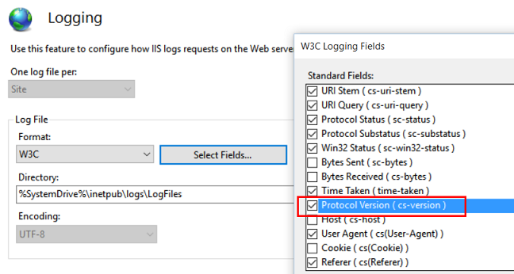
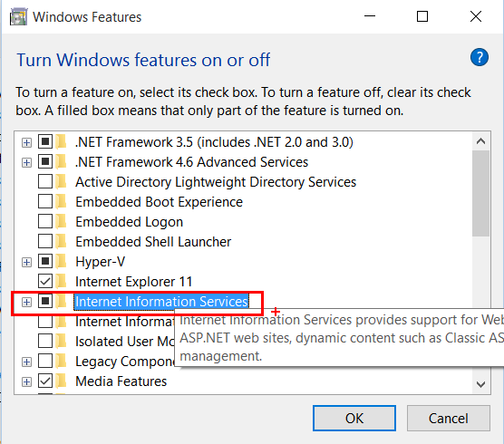
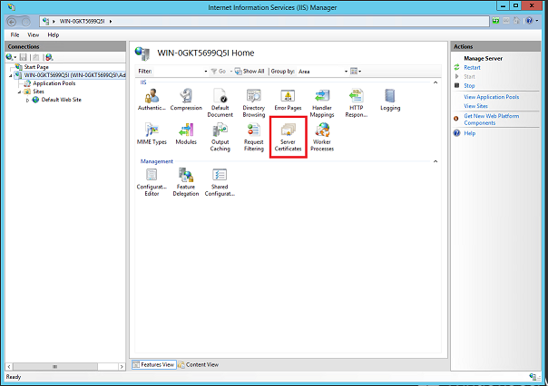
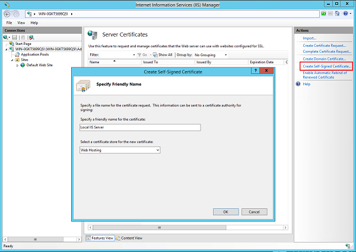
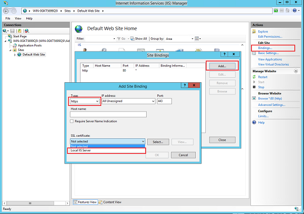

HTTP/2 on IIS
====================
by [David So](https://github.com/davidso)

### Compatibility

| Version | Notes |
| --- | --- |
| IIS 10.0 | HTTP/2 Support was introduced in IIS 10.0 |
| IIS 8.5 and earlier | HTTP/2 was not supported prior to IIS 10.0 |

## What is HTTP/2?

HTTP/2 is a rework of how HTTP semantics flow over TCP connections, and HTTP/2 support is present in Windows 10 and Windows Server 2016. HTTP/2 is a major upgrade after nearly two decades of HTTP/1.1 use and reduces the impact of latency and connection load on web servers.

The major advance of HTTP/1.1 was the use of persistent connections to service multiple requests in a row. In HTTP/2, a persistent connection can be used to service multiple simultaneous requests. In the process, HTTP/2 introduces several additional features that improve the efficiency of HTTP over the network.

### One connection for multiple requests

Every TCP connection requires a round trip to set up. If you're using encryption, the TLS handshake takes another 1-2 round trips. All this happens before the first byte of the first response can be sent. By reusing an existing connection instead of setting up a new one, this overhead can be shared by many requests. HTTP/2 sharply reduces the need for a request to wait while a new connection is established, or wait for an existing connection to become idle. Because a single connection is multiplexed between many requests, the request can usually be sent immediately without waiting for other requests to finish.

### Header compression with HPACK

HTTP has supported compression of data for ages. Headers, however, are sent as uncompressed text, with a lot of redundancy between requests. (Many of the longest headers are sent with exactly the same value on every request!) HTTP/2 introduces HPACK, a compression scheme for HTTP headers which reduces the redundancy between requests.

Compression helps multiplexing, because requests are smaller. This enables clients to make many requests in their first packets on a connection, while TCP flow control windows are still small.

### Server push

Requests come in patterns. If a client asks for one resource, the server can often predict that it will need other resources referenced on the page. In HTTP/1.1, inlining was used to deliver these resources to clients as part of the first response. Inlining has its drawbacks - most notably, that the inlined resource can't be cached for use on other pages where it might also be referenced.

HTTP/2 introduces the concept of &quot;push&quot; - the server responding to requests the client hasn't made yet, but it predicts the client will. This allows servers to continue providing the latency benefits of inlining, but in a form that the client can cache and reuse on other pages.

## How do I use HTTP/2?

You might be already! Since Almost all browsers already support HTTP/2 in their most current release, and current data shows that over [50% of users](http://caniuse.com/#feat=http2) are on HTTP/2-capable browsers already.

On the server, IIS running on Windows 10 or Windows Server 2016 supports HTTP/2.

IIS currently supports HTTP/2 only over TLS. When making an HTTPS connection to a web server running IIS on Windows 10, HTTP/2 is used if the client and server both support it. In IIS, we've implemented HTTP/2 as transparently as possible - you shouldn't need to change anything in your application for HTTP/2 to work. Certain HTTP/1.1 optimizations (domain sharding, inlining, etc.) are no longer recommended in HTTP/2, though, so you should plan to remove these in the future.

### What about push?

Since Server Push is a new feature in HTTP/2, there are new APIs that you need to call to take advantage of it. When you call the [PushPromise API](https://msdn.microsoft.com/en-us/library/system.web.httpresponse.pushpromise(v=vs.110).aspx) in ASP.NET or the [HttpDeclarePush](https://msdn.microsoft.com/en-us/library/windows/desktop/mt219053(v=vs.85).aspx) API from an IIS native module, you provide the URL and optional request headers for the request you anticipate the client making. If push is supported by the underlying connection, two things happen:

- A PUSH\_PROMISE is sent to the client, so the client can check whether the resource already exists in the cache
- A new request is added to the request queue for the pushed resource

If the underlying connection doesn't support push (client disabled push, or HTTP/1.1 client), the call does nothing and returns success, so you can safely call the API without needing to worry about whether push is allowed.

## IIS Settings

There are no new IIS configuration settings specific to HTTP/2.

In Windows Server 2016 Tech Preview, there was a mention of setting a 'DuoEnabled' registry key. This is no longer required. As mentioned above, provided the client and server configuration supports HTTP/2, then IIS will use HTTP/2 (or fallback to HTTP/1.1 if not possible).

### Logging Protocol Version

IIS Logging has a field 'Protocol version' which is off by default. Enabling this field is useful if you want to track which requests are going via HTTP/2, HTTP/1.1 etc.

In the Internet Services Manager UI, this can be found under the **Logging** feature, through **Select Fields**.

After making the changes, click on **Apply** under the **Actions** pane on the far right.

Here is sample log file output with Protocol Version field enabled:

[!code-console[Main](http2-on-iis/samples/sample1.cmd?highlight=5-6)]

## IIS with HTTP/2 Demo Walkthrough

1. If you are running Windows 10, this can be found via **Programs and Features**, then **Turn Windows features on or off**, then enabling **Internet Information Services** checkbox. If you are running Windows Server 2016, then launch **Server Manager**, then **Add roles and features** on the dashboard, and then select **Web Server (IIS)** from the list. 

    
2. After installation is complete, launch the Internet Services Manager and create a self signed certificate by selecting the **Server Certificates** option under the server's **Features** view. Note that the use of a self signed certificate in this example is only for demo/testing purpose (not recommended for protecting your production sites). 

    

    
3. Go to your Default Web Site and under **Bindings**, create a new TLS binding with the self-signed certificate which you just created. 

    
4. Launch your browser from your Windows 10 or Windows Server 2016 machine and hit F12, (or go to **Settings** and enable **F12 Developer Tools**), and then switch to the **Network** tab. Browse to https://localhost and voila, you are on HTTP/2! 

    

## When is HTTP/2 Not Supported?

In a few cases, HTTP/2 can't be used in combination with other features. In these situations, Windows will fall back to HTTP/1.1 and continue the transaction. This may involve negotiating HTTP/1.1 during the handshake, or sending an error code to the client instructing it to retry over an HTTP/1.1 connection.

- Windows authentication (NTLM/Kerberos/Negotiate) is not supported with HTTP/2. In this case IIS will fall back to HTTP/1.1.
- Clear text - as mentioned above, IIS currently only supports HTTP/2 over TLS. Again, IIS will fall back to HTTP/1.1.
- Bandwidth throttling - IIS has a feature to limit bandwidth (in Inetmgr, select the site, 'Limits' under Configure of the Action pane). This applies to HTTP/1.1 but is not enforced for HTTP/2 (will proceed with no errors or bandwidth limiting).

## For More Information....

See the Build 2015 talk [HTTP/2 in Windows 10: Browser, Apps, and Web Server](https://channel9.msdn.com/Events/Build/2015/3-88) for a more in-depth discussion of HTTP/2 and the client and server implementations in Windows.

### Authors: Mike Bishop, David So

(With contributions from and acknowledgements to Rob Trace, Baris Caglar, Nazim Lala)