IIS 8.0 Using ASP.NET 3.5 and ASP.NET 4.5
====================
by Won Yoo

## Compatibility

| Version | Notes |
| --- | --- |
| IIS 8.0 | ASP.NET 3.5 and ASP.NET 4.5 are supported on IIS 8.0. |
| IIS 7.5 | ASP.NET 3.5 and ASP.NET 4.5 are supported on IIS 7.5. |
| IIS 7.0 | ASP.NET 3.5 and ASP.NET 4.5 are supported on IIS 7.0. |

## Problem

Windows Server 2012 includes .NET Framework 4.5 by default, as well as optional installation of the .NET 3.5 Framework. Developers frequently need to run mixed web applications across multiple .NET Framework versions.

## Solution

IIS 8.0 on Windows Server 2012 runs ASP.NET applications on all .NET Framework versions supported on Windows Server 2012. This means ASP.NET applications can run on IIS 8.0 using either .NET Framework 3.5, or .NET Framework 4.5. IIS 8.0 hosts versions of the .NET Framework in different application pools, thus allowing multiple ASP.NET applications with different .NET Framework versions to run simultaneously on Windows Server 2012.

IIS 8.0 also supports managing both ASP.NET 3.5 and ASP.NET 4.5 applications using both the graphical IIS Manager tool as well as IIS' command-line management tools. Refer to [this](iis-80-aspnet-configuration-management.md) article for more information.

## Step by Step Instructions

#### Prerequisites:

- IIS is installed on Windows Server 2012. To learn more about installing IIS 8, see [Installing IIS 8 on Windows Server 2012](installing-iis-8-on-windows-server-2012.md).

### Setting up IIS 8.0 with support for ASP.NET 3.5 and ASP.NET 4.5

In Windows Server 2012, both the .NET Framework 3.5 and .NET Framework 4.5 are natively recognized by the operating system. This means both UI-based and command-line driven setup can be used to turn on both versions of the .NET Framework, as well as enabling integration of both versions of ASP.NET with IIS 8.0.

For this walkthrough we will use the new Server Manager UI in Windows Server 2012 Server to demonstrate enabling both ASP.NET 3.5 and ASP.NET 4.5 on IIS 8.0.

1. When you first login to a new Windows Server 2012 machine, the new Server Manager UI will display. Click **add roles** as shown below:  
    [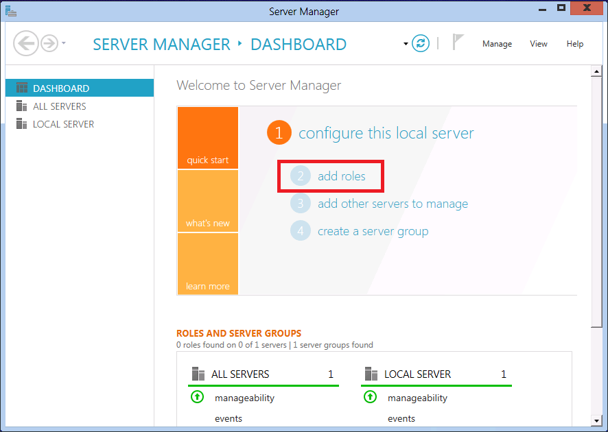](iis-80-using-aspnet-35-and-aspnet-45/_static/image1.png)
2. On the first screen of **Add Roles and Features Wizard**, click **Next**. This display a page where you select the desired installation type. Choose either **Role-based** or **Feature-based** installation as shown below:  
    [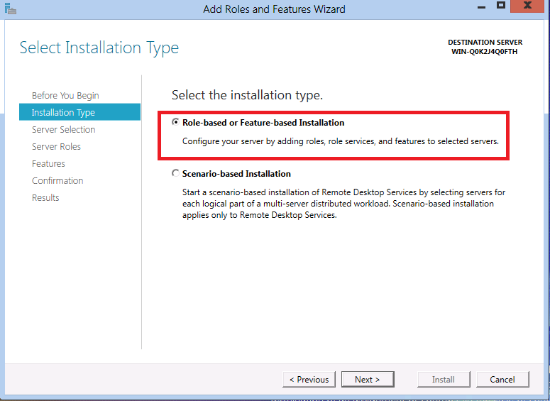](iis-80-using-aspnet-35-and-aspnet-45/_static/image5.png)
3. Click **Next.** The next screen of the wizard asks you to choose the server that you are configuring.
4. On the next wizard step you will be asked to select one or more server roles. Scroll down in the **Roles** list, and make sure to check the **Web Server (IIS)** checkbox as shown below:  
    [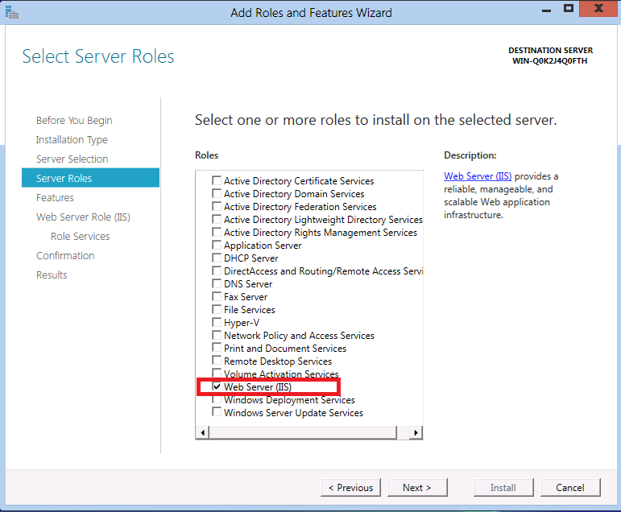](iis-80-using-aspnet-35-and-aspnet-45/_static/image9.png)
5. Click **Next** to proceed to the next step, which enables you to select additional specific features to install on the server. Click **Next** again and proceed to the next step.
6. The next wizard step displays some introductory information about the **Web Server (IIS)** role. Click **Next** again and proceed to the next step. Now you should be at a wizard step that looks like the following:  
    [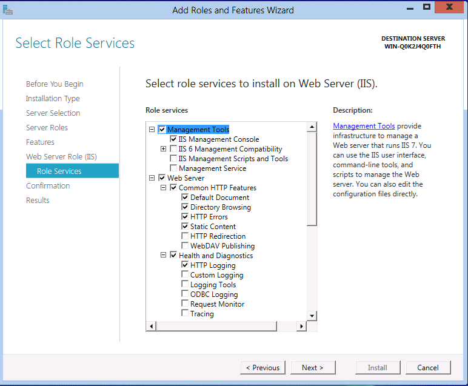](iis-80-using-aspnet-35-and-aspnet-45/_static/image13.png)
7. Note that a number of default sub-features for IIS have already been turned on because you selected the **Web Server (IIS)** server role earlier. However we want to enable both ASP.NET 3.5 and ASP.NET 4.5 to run on IIS 8.0, so we need to enable some additional IIS related features. Scroll down in the **Role services** list until the **Application Development** node is showing. This node is collapsed initially, click on the node and expand it so that its children are showing:  
    [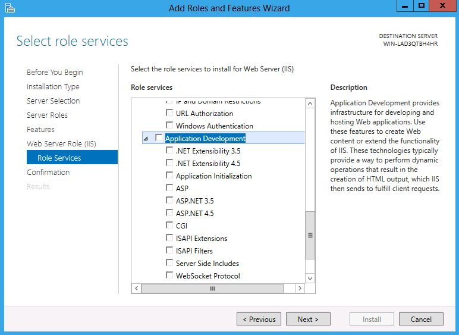](iis-80-using-aspnet-35-and-aspnet-45/_static/image17.png)
8. The **Application Development** node is where we enable ASP.NET integration with IIS. Note that there are a few checkboxes in the feature list with similar names. The pair of checkboxes that are of interest for this walkthrough are: 

    - **ASP.NET 3.** 5 - This option enables ASP.NET 3.5 to run on IIS 8.0. Note that with Windows Server 2012, .NET Framework 3.5 is not available as a part of the base OS image. Instead, the payload is downloaded from the Internet and you need to connect to the Internet.
    - **ASP.NET 4.5** - This option enables ASP.NET 4.5 to run on IIS 8.0.
9. First click the **ASP.NET 3.5** check box. When you do so an additional dialog box will popup as shown below:  
    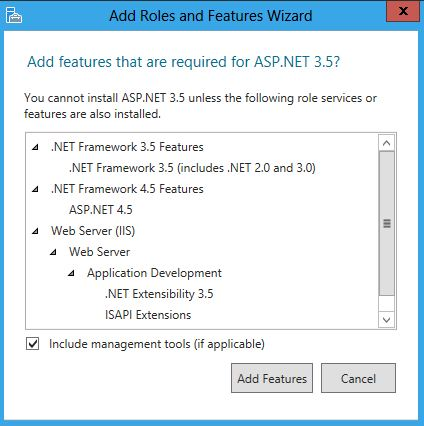
10. Since ASP.NET 3.5 is integrated into the Windows Server 2012 setup, Windows Server 2012 knows all of the related dependencies necessary to enable ASP.NET 3.5 on IIS 8.0. This popup dialog is just showing you what will be automatically pulled in and installed. Since we do want ASP.NET 3.5 enabled, click **Add Required Features**.
11. Next, click the **ASP.NET 4.5** check box in the **Role services** feature list. The end result of clicking both ASP.NET related checkboxes is shown below:  
    [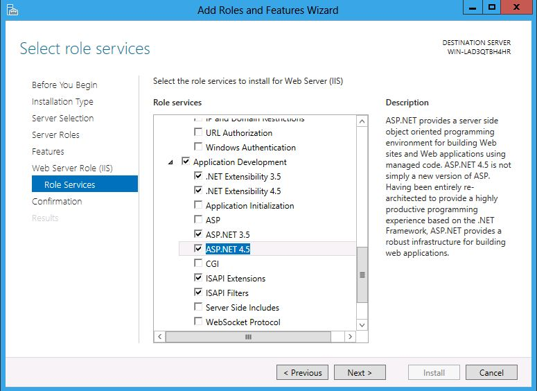](iis-80-using-aspnet-35-and-aspnet-45/_static/image5.jpg)
12. Even though you only directly selected the **ASP.NET 3.5** and **ASP.NET 4.5** features, the wizard automatically turned on a number of other items. This is done automatically so that developers do not have to explicitly choose the various component pieces needed to "assembly" of ASP.NET on Windows Server 2012. At this point click **Next** to accept the changes.
13. The **Confirm installation selections** step displays a list of all of features that are installed if you accept the changes.  
    [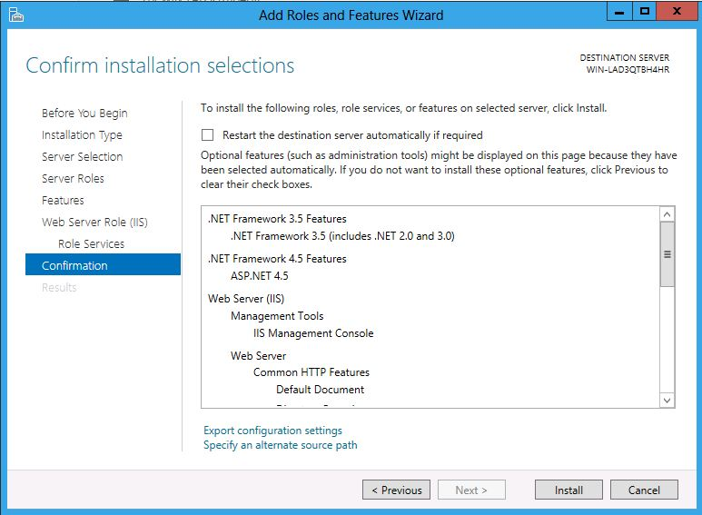](iis-80-using-aspnet-35-and-aspnet-45/_static/image9.jpg)
14. At this point, click **Install** to accept the changes and install full ASP.NET support on Windows Server 2012.
15. Since the installation will take a small amount of time to complete, the wizard displays a progress dialog while the installation progresses:  
    [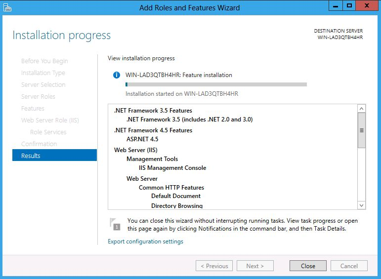](iis-80-using-aspnet-35-and-aspnet-45/_static/image13.jpg)
16. After a few minutes the wizard shows that the installation has completed:  
    [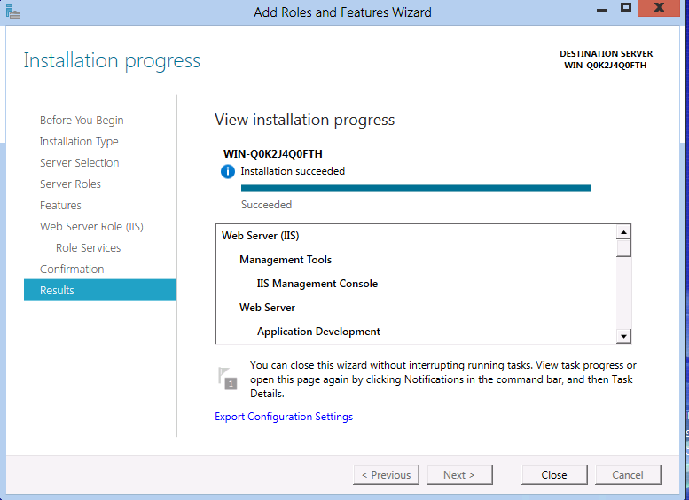](iis-80-using-aspnet-35-and-aspnet-45/_static/image19.png)
17. At this point, you can click **Close** and exit the wizard.

### Exploring the IIS 8.0 Installation

With both IIS 8.0 and ASP.NET integration installed we can take a look at the basic ASP.NET footprint for IIS 8.0.

1. From the Windows Start menu select **All Programs** and then expand the **Administrative Tools** menu. In the resulting list, find **Internet Information Services (IIS) Manager** and select it to launch the graphical IIS management tool:  
    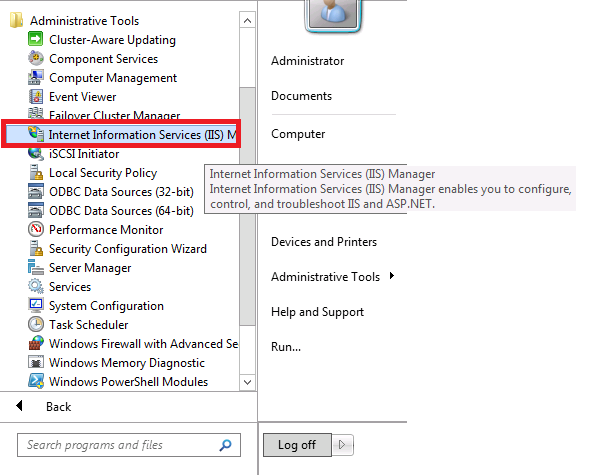
2. Once the IIS Manager starts up, expand the server node in the left-hand window so that both the **Application Pools** node and **Sites** node are showing. When you do this the IIS Manager will popup a dialog asking if you want to stay connected with the latest Web Platform Components. For this walkthrough, you can click **No**. However on real-world installations you will probably want to click **Yes** so that the Web Platform Installer is available for your use to download various IIS extensions such as the URL Rewrite Module. At this point the IIS Manager looks like the following picture:  
    [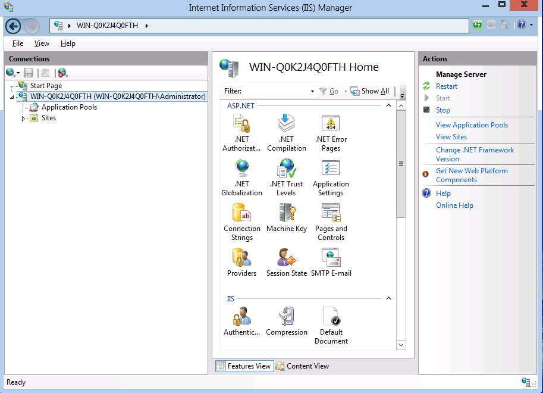](iis-80-using-aspnet-35-and-aspnet-45/_static/image25.png)
3. Click the **Application Pools** node to display the application pools that have now been installed for use by IIS 8.0:  
    [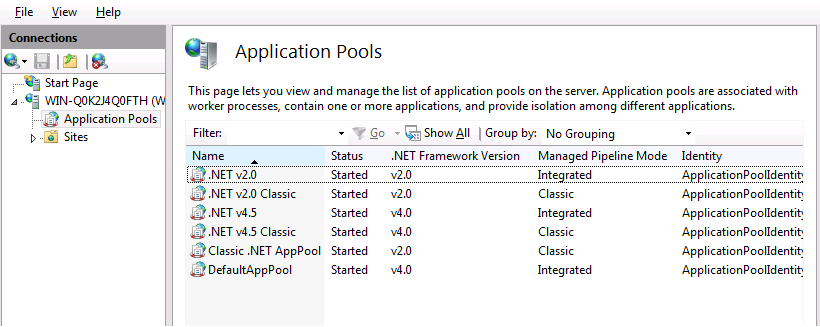](iis-80-using-aspnet-35-and-aspnet-45/_static/image29.png)
4. You can see that six different application pools are created by default when both ASP.NET 3.5 and ASP.NET 4.5 are enabled for IIS 8.0. Four of the applications are new for IIS 8.0, while two other application pools have been carried forward from previous Windows releases. 

    - Note that although the **.NET Framework Version** column shows "v2.0" and "v4.0" for .NET Framework versions, these equate to ASP.NET 3.5 and ASP.NET 4.5. Due to the internals of how application pools bind to .NET Framework versions, the actual version name written to configuration (and thus displayed in the tool) corresponds to the original .NET Framework file version.
    - **Classic .NET AppPool** and **DefaultAppPool** existed in previous versions of Windows, and thus continue to be created for IIS 8.0. Note however that since .NET 4.5 is the default .NET Framework for use by Windows Server 2012, the "DefaultAppPool" on IIS 8.0 also defaults to using the newer version of the .NET Framework.
    - The other four application pools are new in Windows Server 2012. There are two application pools for running .NET Framework 3.5 (**.NET v2.0** and **.NET v2.0 Classic**), and two application pools for running .NET Framework 4.5 (**.NET 4.5** and **.NET 4.5 Classic**).
    - The difference between "classic" and "not classic" application pools is the managed pipeline mode supported in each application pool type. The two application pools ending in "Classic" support the older Windows Server 2003-era classic pipeline mode for ASP.NET, while the other two application pools use the newer integrated pipeline mode for ASP.NET introduced in Vista/IIS7.0.
5. Exploring a little bit further, expand the **Sites** node in the left-hand side of the screen so that the **Default Web Site** node is visible:  
    
6. Default installations of IIS always have a "Default Web Site" configured to listen for HTTP requests on port 80. Drill into the "Default Web Site" to see what version of ASP.NET it supports by default. Right-click **Default Web Site**, then select **Manage Website**, and select **Advanced Settings** as shown below:  
    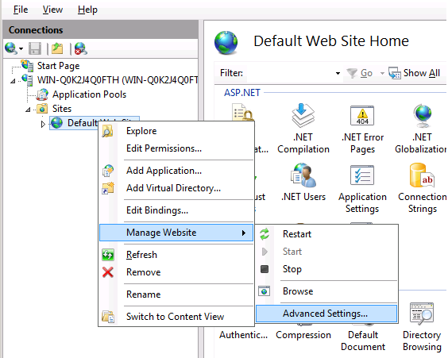
7. The **Advanced Settings** dialog pops up, showing (amongst other things) the application pool used to run the "Default Web Site". As shown in the picture below, the "Default Web Site" runs in the application pool called "DefaultAppPool":  
    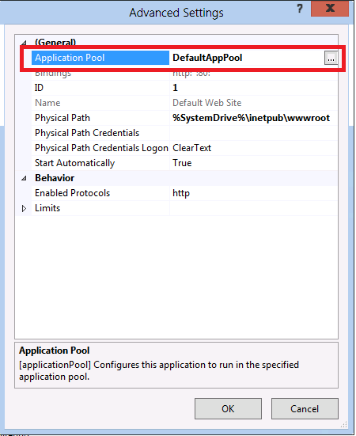
8. If you click the small ellipsis-button on the right-hand side of the application pool, an additional dialog pops up displaying more information about the "DefaultAppPool". As noted earlier the "DefaultAppPool" defaults to ASP.NET 4.5 for IIS 8.0, so ASP.NET 4.5 applications deployed in the "Default Web Site" will work without any further configuration.  
    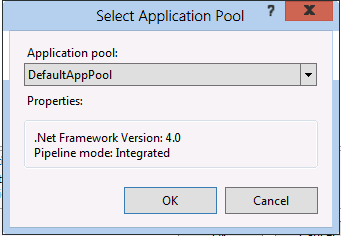
9. At this point, click **Cancel** to cancel both the **Select Application Pool** dialog, and the **Advanced Settings** dialog.

### Running both ASP.NET 3.5 and ASP.NET 4.5 Applications

Now that you have explored the setup state of IIS 8.0, try running some sample ASP.NET code to confirm that both ASP.NET 3.5 and ASP.NET 4.5 applications can run simultaneously on a single IIS 8.0 installation.

Sample code for both ASP.NET 3.5 and ASP.NET 4.5 is contained in the following .zip:

First, set up a simple ASP.NET 3.5 application on IIS 8.0:

1. Open the "examples.zip" file.
2. In Windows Explorer on your Windows Server 2012 machine, navigate to the "wwwroot" directory for your IIS installation. For example if you installed IIS on the "C:\" drive, the "wwwroot" directory will be at "c:\inetpub\wwwroot".
3. Copy the folder "example35" from "examples.zip", and paste it into the directory "c:\inetpub\wwwroot". When you are done the directory structure should look like the following:  
    [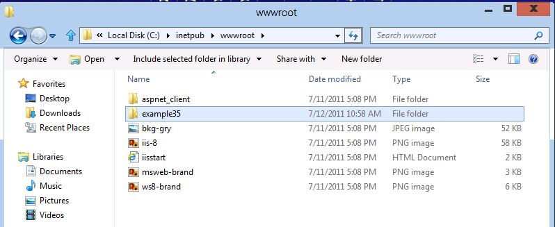](iis-80-using-aspnet-35-and-aspnet-45/_static/image45.png)
4. The newly created "example35" folder needs to be configured as an ASP.NET 3.5 application in the IIS Manager. Go back to the IIS Manager window, click on the **Default Web Site** node, and select **Refresh**. The treeview of child nodes under the **Default Web Site** now shows the "example35" folder:  
    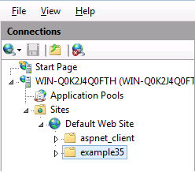
5. Right-click the **example35** folder and select **Convert to Application**:  
    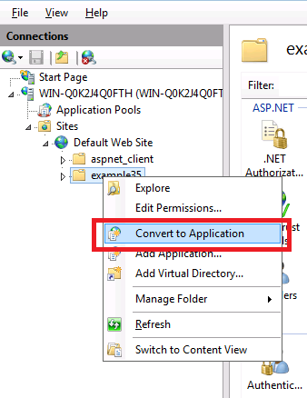
6. The **Add Application** dialog will pop up. By default all directories within **Default Web Site** are part of the application pool called **DefaultAppPool**. This means that newly created folders containing ASP.NET run as ASP.NET 4.5 applications by default.  
    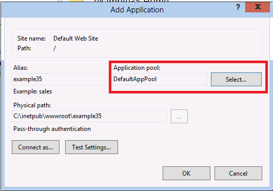
7. Since we want to run the **example35** folder as an ASP.NET 3.5 application, the application pool needs to be changed. Click **Select**, and the **Select Application Pool** dialog that pops up. Change the application pool to **.NET v2.0** as shown below:  
    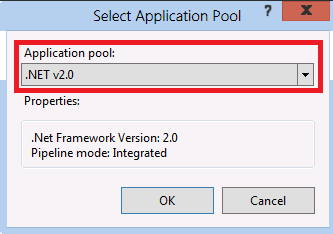
8. Click **OK** button to accept the application pool change, and then click **OK** again to commit the changes to IIS. The IIS Manager window appears again. In the treeview showing "Default Web Site", the icon for "example35" is changed to indicate it is now a separate ASP.NET application.  
    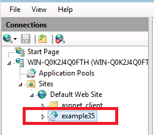
9. At this point start an instance of Internet Explorer and navigate to the following Url: 

    http://localhost/example35

 After a short pause the application displays a list of .NET Framework features supported in this application.
10. in Windows Explorer, if you navigate to the "c:\inetpub\wwwroot\example35" directory, you can use notepad to look at the code for "default.aspx" and the information in "web.config". For example, the contents of web.config include directives that configure the .NET Framework compilers to run in "3.5" mode. The .NET Framework code in "default.aspx" demonstrates some C# constructs that were introduced in .NET 3.5 - specifically LINQ-to-Object queries.

Now that there is an ASP.NET 3.5 application running, you can create a second ASP.NET application, but this time configure it to use .NET 4.5.

1. Go back to the Windows Explorer window that has the .zip file "examples.zip" open.
2. Open up the contents of the "example45" folder.
3. In the second Windows Explorer window that you have open, navigate to "c:\inetpub\wwwroot".
4. Copy the "default.aspx" file from the .zip file and paste it directly into "c:\inetpub\wwwroot". The folder contents for "c:\inetpub\wwwroot" should now look like:  
    [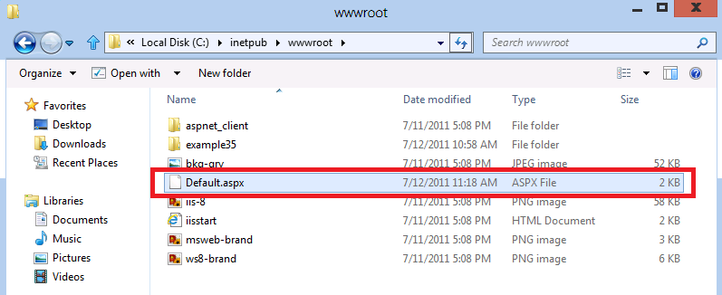](iis-80-using-aspnet-35-and-aspnet-45/_static/image59.png)
5. Now go back to Internet Explorer and navigate to the following Url: 

    http://localhost/default.aspx

 After a short pause a second application pool will start running an ASP.NET 4.5 application for the "Default Web Site". The browser once again displays a list of .NET Framework features supported in this application with a new entry at the end of the list for dynamically typed variables (i.e. the     *dynamic* keyword introduced in .NET 4.0/4.5). Notice that unlike the "example35" application that required special web.config entries, no web.config file was required to configure and run the "default.aspx" page in the "Default Web Site". This is because .NET Framework 4.5 is the default .NET Framework used by ASP.NET applications in IIS 8.0, and as a result no extra configuration is required.
6. If you use Notepad to open the "default.aspx" page that you just copied, you will also see a few changes compared to the version in the "example35" directory. There are no namespace directives at the top of the page since the .NET Framework 4.5 is the default on IIS 8.0. The code on the page demonstrates using a *dynamic* variable, which is a compiler concept introduced in .NET 4.0/4.5.

## Summary

IIS 8.0 supports running both ASP.NET 3.5 and ASP.NET 4.5 applications on the same machine using different application pools to host each .NET Framework version. IIS 8.0 supports for multiple .NET Framework versions enables developers and administrators to take full advantage of IIS 8.0 while maintaining backward compatibility with web applications carried over from Windows Server 2008 R2.