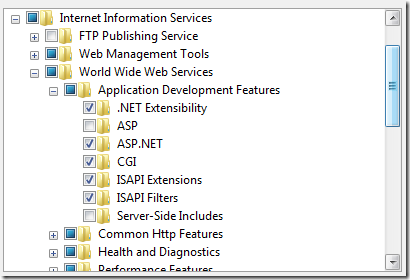
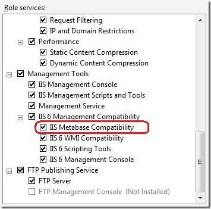
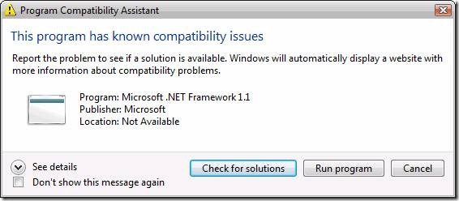
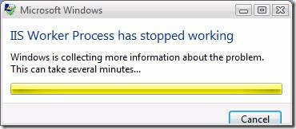
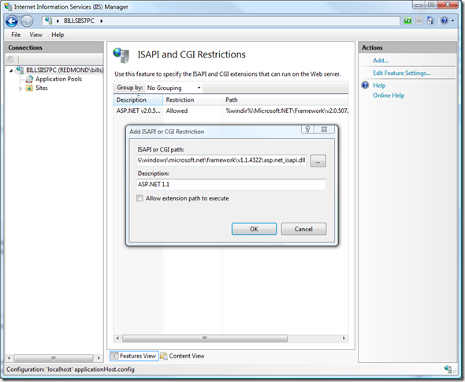

How to install ASP.NET 1.1 with IIS7 on Vista and Windows 2008
====================
by [Walter Oliver](https://github.com/walterov)

## Overview

You can use the Web Platform Installer (Web PI) to easily install IIS, and applications that run on IIS. The Web PI is a free, lightweight tool that lets you install IIS and related technologies such as ASP.NET, SQL Server Express, Visual Web Developer, other popular Web applications, and more. Because the Web PI references and links to the latest versions of available Web Platform offerings, with just a few simple clicks you can download and install any new tools or updates. To learn more about the Web PI, see [Learn more and install the Web PI](https://go.microsoft.com/fwlink/?LinkID=145510 "Learn about and install the Web PI").

You can also install ASP.NET 2.0 (3.0 and 3.5) using the Windows Vista and Windows 2008 user interface - just install the ASP.NET component located under IIS-&gt;Word Wide Web Services-&gt;Application Development Features. You can find this set of components in Windows 2008 by clicking Start, and click Server Manager. Expand the left-hand treeview in Server Manager and click Manage Roles, and then Web Server (IIS). In the right-hand pane look for an option that says Add Role Services. If you're on Windows Vista, click Start, click Control Panel, click Programs, and then Windows Features. Look for the following tree of features under Internet Information Services (IIS):

ASP.NET 1.1 is not included in Windows Vista or Windows 2008 and must be downloaded and installed manually. This post shows you how:

### Step 1: Install "IIS Metabase Compatibility"

The IIS "Metabase compatibility" component is required to successfully install ASP.NET 1.1.

To install it on Windows 2008 Server, click **Start**, and click **Server Manager**. Expand the left-hand treeview in Server Manager and click **Manage Roles**, and then **Web Server (IIS)**. In the right-hand pane look for an option that says **Add Role Services**. This takes you to wizard where you can install "IIS Metabase Compatibility".

If you're on Windows Vista, click **Start**, click **Control Panel**, click **Programs**, and then **Windows Features**. Look for Internet Information Services (IIS) and install "IIS Metabase Compatibility".

### Step 2: Install the .NET Framework v1.1 and .NET Framework v1.1 SP1

Install Framework v1.1, SP1, and ASP.NET's security update to SP1:

- [.NET Framework Version 1.1 Redistributable Package](https://www.microsoft.com/downloads/info.aspx?na=22&amp;p=1&amp;SrcDisplayLang=en&amp;SrcCategoryId=&amp;SrcFamilyId=&amp;u=%2fdownloads%2fdetails.aspx%3fFamilyID%3d262d25e3-f589-4842-8157-034d1e7cf3a3%26DisplayLang%3den)
- [.NET Framework Version 1.1 Service Pack 1](https://www.microsoft.com/downloads/info.aspx?na=22&amp;p=3&amp;SrcDisplayLang=en&amp;SrcCategoryId=&amp;SrcFamilyId=&amp;u=%2fdownloads%2fdetails.aspx%3fFamilyID%3da8f5654f-088e-40b2-bbdb-a83353618b38%26DisplayLang%3den)
- [ASP.NET Security Update for .NET Framework 1.1 SP1](https://www.microsoft.com/downloads/info.aspx?na=22&amp;p=7&amp;SrcDisplayLang=en&amp;SrcCategoryId=&amp;SrcFamilyId=&amp;u=%2fdownloads%2fdetails.aspx%3fFamilyID%3d8ec6fb8a-29eb-49cf-9dbc-1a0dc2273ff9%26DisplayLang%3den)

When you install .NET Framework Version 1.1, and SP1 for .NET Framework Version 1.1, you'll see the following dialog. Click **Run program**.

***note***: If you do not install Framework v1.1 SP1, you may run into Data Execution Prevention errors with messages like "IIS Worker Process has stopped working". This is expected. Installing .NET Framework v1.1 SP1 will fix this.

### Step 3: Enable ASP.NET v1.1 ISAPI Extension

Enable ASP.NET v1.1 ISAPI as an allowed ISAPI extension. To do this, open "IIS Manager" administration tool. In the features view, click on the "ISAPI and CGI Restrictions" feature. In the actions pane, click "add"

**Extension**: C:\Windows\Microsoft.NET\Framework\v1.1.4322\aspnet\_isapi.dll   
note: change drive if your system drive is not C:\   
**Description**: ASP.NET v1.1

You can also do by running the following command line:

[!code-console[Main](how-to-install-aspnet-11-with-iis-on-vista-and-windows-2008/samples/sample1.cmd)]

### Step 4: Add IgnoreSection Handler to v1.1 machine.config

ASP.NET v1.1 will throw runtime exceptions out of the box if you have IIS configuration in the web.config files that are read by your ASP.NET v1.1 applications. To make ASP.NET v1.1 ignore IIS configuration sections, open the Framework v1.1 machine.config file `%windir%\Microsoft.NET\Framework\v1.1.4322\config\machine.config` and add the following section entry just above the bottom tag for the &lt;configSections&gt; element:

[!code-xml[Main](how-to-install-aspnet-11-with-iis-on-vista-and-windows-2008/samples/sample2.xml)]

### Step 5: Move Site or Application to ASP.NET 1.1 Application Pool

During installation, Framework v1.1 creates an application pool called "ASP.NET 1.1" that is configured to load Framework v1.1 upon startup. To move your site or application into this application pool using IIS Manager, please see our [online documentation](http://technet2.microsoft.com/WindowsServer2008/en/library/ad122434-505b-4fcc-8146-7b21cf10a57f1033.mspx). You can also do this from the command line by navigating to the `%windir%\system32\inetsrv` directory and running the following command line:

appcmd set app "Default Web Site/" /applicationPool:"ASP.NET 1.1"If you would like to create a new application pool that's configured to load Framework v1.1, please see our online documentation for [creating an application pool](http://technet2.microsoft.com/WindowsServer/en/Library/ad96956e-4207-4730-b03e-308e3f9e10751033.mspx?mfr=true). You can also do this from the command line by navigating to the `%windir%\system32\inetsrv` directory and running the following command line:

[!code-console[Main](how-to-install-aspnet-11-with-iis-on-vista-and-windows-2008/samples/sample3.cmd)]