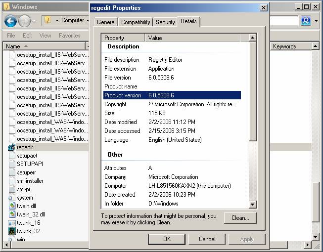

Using Unattended Setup to Install IIS 7.0
====================
by Tobin Titus

## Introduction

Pkgmgr.exe is a new command tool in Windows Vista/Windows Server® 2008 for installing Windows Optional Features:

- Replaces sysocmgr.exe for installing Windows Optional Features
- Allows you to install / un-install Windows Vista Optional Features directly from command prompt or from scripts

Pkgmgr can take a list of windows features to install on the command line or take an xml file name as a parameter for unattend installs. This article will illustrate the use of pkgmgr unattend files for installing optional features.

## Prerequisites

### Windows Vista/Windows Server 2008 Editions Supported

This walkthrough is for the following editions of Windows Vista/Windows Server 2008:

- Windows Vista Home Premium Edition
- Windows Vista Professional Edition
- Windows Vista Ultimate Edition
- Windows Server 2008 Editions

Make sure you have installed one of the supported editions of Windows Vista/Windows Server 2008 before proceeding.

### Local User Administrator (LUA) Security

Make sure you have administrative privileges on the machine: By default, you do not have them if you are logged on as a user other than the built-in Administrator account, even if this user was added to the local Administrators group on the machine (this is a new security feature in Windows Server 2008, called LUA, which is beyond the scope of this article). Make sure to either log-on as the built-in Administrator account, or explicitly invoke applications as the built-in Administrator, as needed, using the "runas" cmd-line tool.

For example, to launch notepad.exe, run this command: "runas /user:administrator notepad.exe". You are prompted for the password of the Administrator account. It is useful to have a cmd-box shell that is already elevated, by running "runas /user:administrator cmd.exe". Every application you run from that cmd-box is elevated as well, and you do not need to use the "runas" syntax from that cmd-box.

## Procedure

### Step 1: Pkgmgr.exe Overview

Windows Optional features in Vista/Windows Server 2008 is installed using a new command tool called Pkgmgr. The command line syntax using pkgmgr.exe is:

[!code-console[Main](using-unattended-setup-to-install-iis/samples/sample1.cmd)]

**Pkgmgr.exe Commands**

[!code-unknown[Main](using-unattended-setup-to-install-iis/samples/sample-126999-2.unknown)]

This specifies updates to install by update name and takes a semicolon separated name of updates to install.

[!code-unknown[Main](using-unattended-setup-to-install-iis/samples/sample-126999-3.unknown)]

This specifies the updates to uninstall and takes a semicolon separated list of selectable updates to be uninstalled from the system. At least one update name must be specified

[!code-unknown[Main](using-unattended-setup-to-install-iis/samples/sample-126999-4.unknown)]

This specifies file name of the unattend XML file.

> [!NOTE]
> If you run pkgmgr without the "start /w" prefix, the pkgmgr cmd will return immediately and you will not know when the optional feature install has completed.

### Step 2: Open Command Window

Follow the instructions in the Prerequisites section above for starting a command window running as the local Administrator account.

### Step 3: Create an Unattend.xml file

From the command window, run notepad.exe.

To install only the IIS 7.0 default features, copy the following unattend.xml text into notepad.

[!code-xml[Main](using-unattended-setup-to-install-iis/samples/sample5.xml)]

If you want to install all IIS 7.0 features for evaluation purposes, use one of the following unattend.xml files.

For Windows Vista Professional, Windows Vista Ultimate, or Windows Server 2008 Editions, copy and paste the following text into notepad.

[!code-xml[Main](using-unattended-setup-to-install-iis/samples/sample6.xml)]

If you are installing IIS 7.0 on Windows Vista Home Premium, copy and paste the following text into notepad:

[!code-xml[Main](using-unattended-setup-to-install-iis/samples/sample7.xml)]

### Step 4: Get Windows Build Number

You then must check the version number of Windows you have installed. To find the exact version, do the following:

1. From the Start Menu, click **Run** and go into the explorer.  

    - In the explorer, browse to the Windows direct and locate the regedit.exe
    - Right click on **regedit.exe** and select **Properties**
    - In the Properties dialog box, select the **Details** tab and note the Product Version.  
        
2. In your notepad, enter this value in the XML attribute version to match the build you have installed.  

    - In this case, version="6.0.5308.6"
    - If you have installed on a 64 Bit CPU you must edit the processorArchitecture XML attribute:  

        processorArchitecture="amd64"  
> [!NOTE]
> Possible values are: x86, amd64, and ia64.

### Step 5: Save the Unattend.xml File

Save the notepad file with name "unattend.xml"

### Step 6: Run Pkgmgr with the Unattend.xml File

In the command window, enter the following command line:

[!code-console[Main](using-unattended-setup-to-install-iis/samples/sample8.cmd)]

Note: If you saved unattend.xml to a drive folder other then the current drive and folder of your command window, you must specify the full path of the unattend.xml file in your pkgmgr /n: parameter.

### Step 7: Wait for Setup to Complete

IIS 7.0 setup via pkgmgr.exe should take 1 to 5 minutes. When the command prompt returns, IIS 7.0 setup is complete.

### Step 8: Check Error Code

At the command prompt type:

[!code-unknown[Main](using-unattended-setup-to-install-iis/samples/sample-126999-9.unknown)]

A result of 0 indicates success.

## Summary

In this article, we examined how to use pckmgr.exe to install the Operating System and IIS 7.0.
  
  
[Discuss in IIS Forums](https://forums.iis.net/1041.aspx)