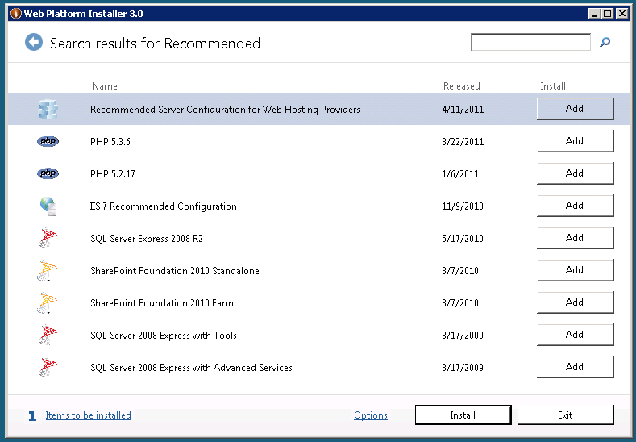
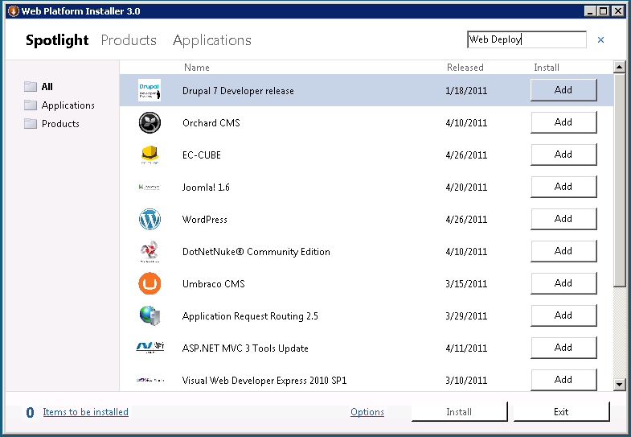
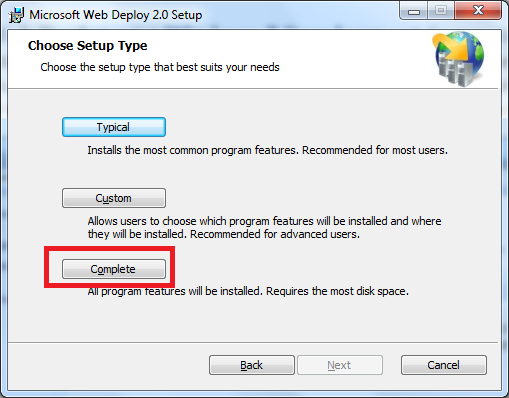
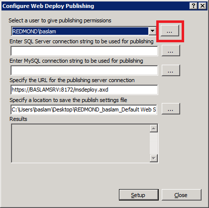
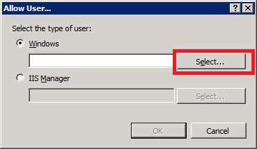
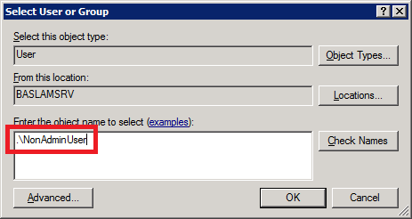

Installing and Configuring Web Deploy on IIS 7
====================
by [Kristina Olson](https://github.com/krolson)

## Summary

In this walkthrough, we will show steps for installing and configuring Web Deploy for administrator or non-administrator deployments. This means the steps necessary to enable a client to use Web Deploy to publish Web site content to the server, even if the client does not have administrator credentials for the server.

Note: Currently Web Deploy V3 RTW is only available through direct download. We are still working on WebPI feed. Easiest way to install V3 RTW is to first install Web Deploy V3 RC using WebPI 4 RC ([x86](https://download.microsoft.com/download/C/4/9/C4963E95-B3E7-4520-BD87-86BFEED90A1E/WebPlatformInstaller_x86.msi)/[x64](https://download.microsoft.com/download/C/4/9/C4963E95-B3E7-4520-BD87-86BFEED90A1E/WebPlatformInstaller_amd64.msi)) as instructed in  Installing &amp; Configuring Web Deploy tutorial, and later update it running Web Deploy V3 RTW msi.

### Install and Configure Web Deploy for Non-Administrator Deployments

#### Requirements:

The server must have an operating system that comes with IIS7— this means either Windows Server 2008 or Windows Server 2008 R2.

#### Use WebPI to install Web Deploy along with its dependencies like the Web Management Service (WMSvc)

1. Set up your machine like a hosting server using the "Recommended Configuration for Hosting Providers" product 

    1. Download the [Web Platform Installer](https://www.microsoft.com/web/downloads/platform.aspx)
    2. Click in the search bar in the upper-right hand corner and search for "Recommended"  
        
    3. Add the "Recommended Server Configuration for Web Hosting Providers" product and click **Install**

        - Note that this bundle includes some optional components, such as PHP and MySQL, which you can choose not to install with this bundle by clicking the "X" next to them on the next screen.
2. Install Web Deploy by using either method **1** or **2** below: 

    1. Install Web Deploy and dependent products using the [Web Platform Installer](https://www.microsoft.com/web/downloads/platform.aspx)

        1. Download the Web Platform Installer. [https://www.microsoft.com/web/downloads/platform.aspx](https://www.microsoft.com/web/downloads/platform.aspx)
        2. In the upper-right hand corner, click in the search box, type "Web Deploy", and press ENTER  
            
        3. Add the "Web Deployment Tool 2.1 for Hosting Servers" product and click **Install**.  
            
    2. Download the Web Deploy installer directly from the [IIS.net Web Deploy page](https://www.iis.net/downloads/microsoft/web-deploy)[https://www.iis.net/download/webdeploy](https://www.iis.net/downloads/microsoft/web-deploy) ([x86](https://go.microsoft.com/fwlink/?LinkId=209115) | [x64](https://go.microsoft.com/fwlink/?LinkId=209116))

		1. In the Setup wizard choose the "Complete" setup option.  
             
        2. Note: *Using the MSI directly is generally not recommended for the novice user, as recommended or required dependent products must then be installed separately*. The following limitations may create issues when using the MSI instead of WebPI to install Web Deploy on servers: 

            1. The MSI will not install SQL Shared Management Objects (SMO), which is required for the SQL Server database deployments. This component may be installed using WebPI to enable SQL Server database deployments.
            2. The MSI will not install the Web Management Service handler component if the Web Management Service is not installed; the handler component is necessary for non-administrator deployments. Windows component IIS, including Management Service, should be installed first to enable the handler component to install.
            3. The MSI will not configure Web Management Service to allow non-administrator deployments if PowerShell v2 is not installed. This setup step includes creating delegation rules in the IIS server Administration.config file that allow non-administrator users to use Web Deploy. PowerShell v2 is built-in on Windows Server 2008 R2 but may require a Windows Update for Windows Server 2008. Alternatively the delegation rules may be added manually after install.

#### Configure a Site for Delegated Non-Administrator Deployment

After installing Web Deploy using method (1) or (2a), described above, all server-level configuration is complete for non-administrator publishing, however additional configuration is required at a site level. This site configuration can be accomplished using methods (1) or (2) described below.

1. Create a new site or set permissions on an existing Web site for a new or existing non-administrator user using Web Deploy PowerShell scripts as explained in the PowerShell scripts walkthrough [**link to be added**] OR
2. Configure publishing on an existing site for an existing user using the IIS Manager UI 

    1. Start IIS Manager (type "inetmgr.exe" in the Start Menu)
    2. Expand the **Sites** node and right click a site, such as "test"
    3. Click **Deploy** &gt; **Configure for Web Deploy Publishing...**
    4. The following UI will appear. Click **...**   
        
    5. Click **Select :**   
        

	6. Type the name of a non-administrator Windows user and click **Ok**   
		
	7. When you click **Setup**, the following log will lines will appear:
 
		- Publish enabled for 'NonAdminUser'
		- Granted 'NonAdminUser' full control on `C:\inetpub\wwwroot\test`
		- Successfully created settings file `C:\Users\JohnDoe\Desktop\NonAdminUser\_Default Web Site.PublishSettings`
	8. The non-administrator Windows user (NonAdminUser) may now publish to the site (test).

### Install and Configure Web Deploy for Administrator deployments

#### Requirements:

Install Web Deploy using method (1) or (2a) described above. If you are using a client operating system such as Vista or Windows 7, or a Windows server version without IIS7+, such as Windows Server 2003, you will need to choose the Web Deployment Tool 2.1 product option in the Web Platform Installer (in install method 2a), or install directly from the Web Deployment Tool download page (install method 2b). For these client or server 2003 machines the Web Management Service handler component and associated delegation rules will not be applicable.

### Trouble-shooting Common Issues:

- If you are upgrading an existing installation of Web Deploy, make sure to restart the handler and agent services by running the following commands at an administrative command prompt:
- net stop msdepsvc &amp; net start msdepsvc
- net stop wmsvc &amp; net start wmsvc
- Make sure your firewall allows connections to the service you are using. By default, the Web Deployment Agent Service (MsDepSvc) listens on port 80, and the Web Management Service (WmSvc, also called the "handler") listens on port 8172 by default.
- You must run MsDepSvc by using the built-in Administrator account, or from a domain account that has been added to the Administrators group. A local administrator which is not the built-in account will not work with MsDepSvc.
- Check to see if .NET 4.0 has not been registered with IIS: 

    - **Symptoms:** .NET 4.0 is installed, but there are no .NET 4.0 application pools or handler mappings in IIS. You cannot browse to applications that use .NET 4.0 (for example, applications based on WebMatrix's site template applications) after you publish them.
    - **Cause:** Your machine had .NET 4.0 installed on it before IIS was installed.
    - **Solution:** Run the following command to register .NET 4.0 with IIS: `%systemdrive%\Windows\Microsoft.NET\Framework64\v4.0.30319\aspnet\_regiis.exe -iru`