Installing and Configuring WebDAV on IIS 7 and Later
====================
by [Robert McMurray](https://github.com/rmcmurray)

## Introduction

For Internet Information Services (IIS) 7.0 on Windows Server® 2008, Microsoft released a separate, downloadable WebDAV extension module that was completely rewritten. This new WebDAV extension module incorporated many new features that enable Web authors to publish content better than before, and offered Web administrators more security and configuration options. With the release of IIS 7.5, support for a newer WebDAV module was built-in for Microsoft IIS, and Microsoft released an updated version of the downloadable module that had been released for IIS 7.0. This newer version of the WebDAV module provides shared and exclusive locks support to prevent lost updates due to overwrites.

This document walks you through adding WebDAV publishing to an existing Web site by using the new WebDAV user interface and by directly editing the IIS configuration files.

> [!NOTE]
> This walkthrough contains a series of steps in which you log on to your Web site using the local loopback address and the local administrator account. When using an administrator account, these steps should only be followed on the server itself using the loopback address or over SSL from a remote server. If you prefer to use a separate user account instead of the administrator account, you must create the appropriate folders and set the correct permissions for that user account when necessary.

> [!NOTE]
> This topic discusses using the WebDAV Redirector to connect to your web site. Please see the [Using the WebDAV Redirector](../../publish/using-webdav/using-the-webdav-redirector.md) topic for more information; specifically the &quot;Troubleshooting the WebDAV Redirector&quot; section if you have trouble using the WebDAV redirector.

## Prerequisites for Installing and Configuring WebDAV on IIS

The following items are required to complete the procedures in this article:

- IIS 7.0 or later must be installed on your server, and the following must be configured: 

    - The Default Web Site that is created by the IIS 7.0 installation must still exist.
    - The Internet Information Services Manager must be installed.
    - At least one authentication method must be installed. 

        > [!NOTE]
        > If you choose to use Basic Authentication with the WebDAV redirector, you must connect to your server using HTTPS.
- The WebDAV Redirector must be installed for Windows Server 2008, Windows Server 2008 R2, or Windows Server 2012. (The WebDAV Redirector is already installed on Windows Vista, Windows 7, and Windows 8.) To install the WebDAV Redirector, use Server Manager to install the Desktop Experience feature.

## Installing WebDAV on IIS 7.0

### Downloading the Right Version for Your Server

There are two separate downloadable packages for the new WebDAV extension module; you need to download the appropriate package for your version of Windows Server 2008:

- **32-bit Installation Package**: 

    - [WebDAV 7.5 for IIS 7.0 (x86)](https://go.microsoft.com/fwlink/?LinkID=141805)
- **64-bit Installation Package**: 

    - [WebDAV 7.5 for IIS 7.0 (x64)](https://go.microsoft.com/fwlink/?LinkID=141807)

### Launching the Installation Package

You must run the installation package as an administrator. This can be accomplished by one of the following methods:

- Logging in to your server using the actual account named &quot;Administrator&quot;, then browsing to the download pages listed above or double-clicking the download package if you have saved it to your server.
- Logging on using an account with administrator privileges and opening a command-prompt by right-clicking the **Command Prompt** menu item that is located in the **Accessories** menu for Windows programs and selecting **Run as administrator**, then typing the appropriate command listed below for your version of Windows to run the installation: 

    - **32-bit Windows Versions**: 

        - msiexec /i webdav\_x86\_75.msi
    - **64-bit Windows Versions**: 

        - msiexec /i webdav\_x64\_75.msi

### Walking Through the Installation Process

1. When the installation package opens, you see the following screen. If you agree to the license terms, check the &quot;I accept&quot; box, then click **Install**.  
    [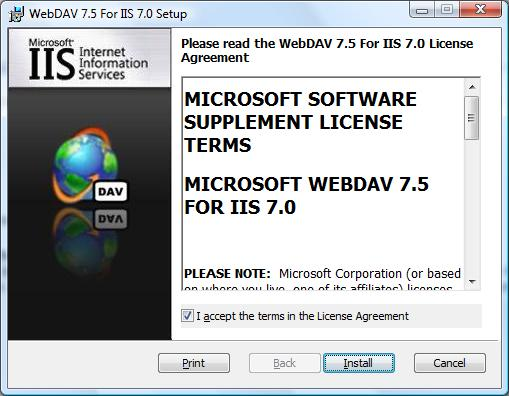](installing-and-configuring-webdav-on-iis/_static/image1.jpg)
2. The progress indicator will reflect the status of the installation as it proceeds.  
    [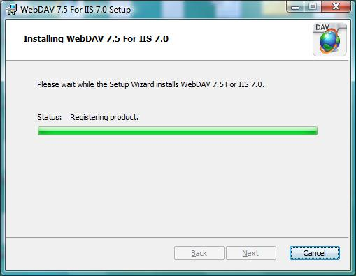](installing-and-configuring-webdav-on-iis/_static/image5.jpg)
3. After the installation has completed, click **Finish**.  
    [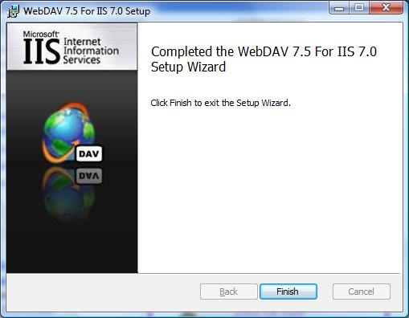](installing-and-configuring-webdav-on-iis/_static/image9.jpg)
4. The WebDAV extension module is now installed.

## Installing WebDAV on IIS 7.5

### IIS 7.5 for Windows Server 2008 R2

1. On the taskbar, click **Start**, point to **Administrative Tools**, and then click **Server Manager**.
2. In the **Server Manager** hierarchy pane, expand **Roles**, and then click **Web Server (IIS)**.
3. In the **Web Server (IIS)** pane, scroll to the **Role Services** section, and then click **Add Role Services**.
4. On the **Select Role Services** page of the **Add Role Services Wizard**, expand **Common HTTP Features**, select **WebDAV Publishing**, and then click **Next**. 

    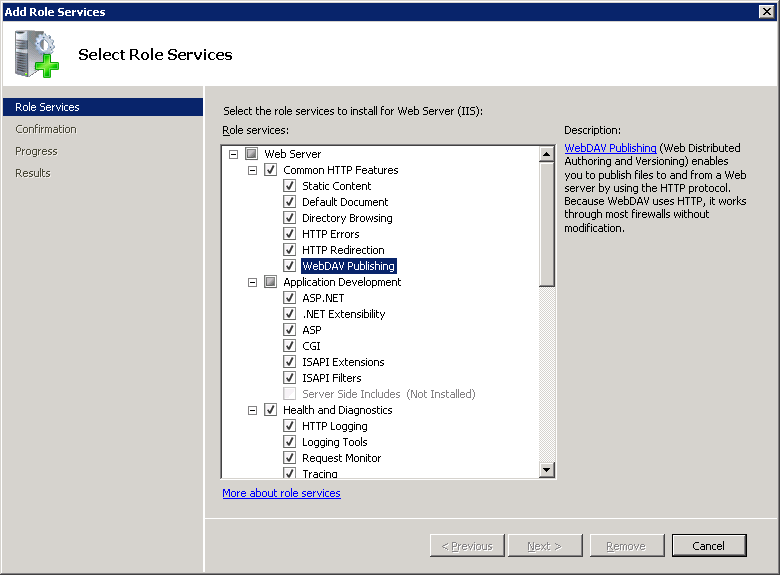
5. On the **Confirm Installation Selections** page, click **Install**.
6. On the **Results** page, click **Close**.

### IIS 7.5 for Windows 7

1. On the taskbar, click **Start**, and then click **Control Panel**.
2. In **Control Panel**, click **Programs and Features**, and then click **Turn Windows Features on or off**.
3. Expand **Internet Information Services**, then **World Wide Web Services**, then **Common HTTP Features**.
4. Select **WebDAV Publishing**, and then click **OK**. 

    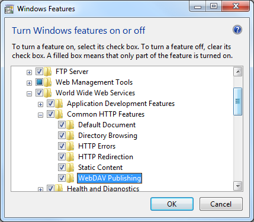

## Installing WebDAV on IIS 8.0 and IIS 8.5

### IIS 8.0 on Windows Server 2012 and IIS 8.5 on Windows Server 2012 R2

1. Click the **Server Manager** icon on the desktop.
2. In the **Server Manager** window, click the **Manage** menu, and then click **Add Roles and Features**.
3. On the **Before You Begin** page, click **Next**.
4. Select the **Installation Type** and then click **Next**.
5. Select the **Destination Server**, and then click **Next**.
6. On the **Select Role Services** page, expand **Web Server (IIS)**, expand **Web Server**, expand **Common HTTP Features**, and then select **WebDAV Publishing**. Click **Next**. 

    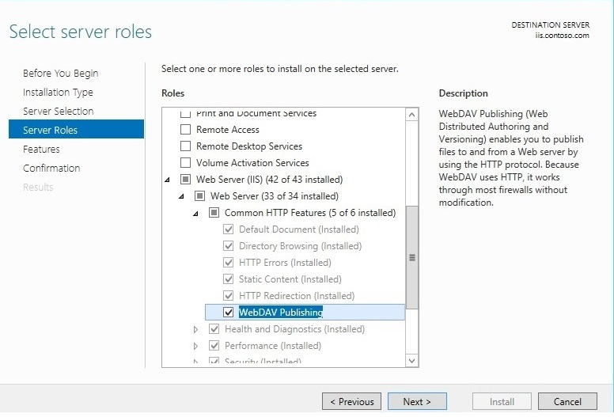
7. On the **Select Features** page, click **Next**.
8. Confirm the installation selection, and then click **Install**.
9. On the **Results** page, verify that the installation succeeds, and then click **Close**.
10. On the **Confirm Installation Selections** page, click **Install**.
11. On the **Results** page, click **Close**.

### IIS 8.0 for Windows 8 and IIS 8.5 for Windows 8.1

1. On the taskbar, hold down the **Windows** key, and then press the **X** key. Click **Control Panel**.
2. In the **Control Panel**, click **Programs and Features**, and then click **Turn Windows Features on or off**.
3. Expand **Internet Information Services**, then **World Wide Web Services**, then **Common HTTP Features**.
4. Select **WebDAV Publishing**, and then click **OK**. 

    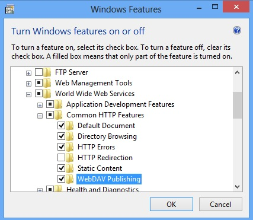

## Enabling WebDAV Publishing by Using IIS Manager

The WebDAV extension module makes it easy to add WebDAV publishing to existing sites by providing you with a wizard that walks you through all of the required steps.

> [!NOTE]
> The following procedure is performed using IIS 8.5 on Windows Server 2012 R2

### Step 1: Enabling WebDAV and Adding an Authoring Rule

In this first step, we add WebDAV publishing to the Default Web site, and add the required settings to allow the local administrator account to edit the content.

1. In **IIS Manager**, in the **Connections** pane, expand the **Sites** node in the tree, then click the **Default Web Site**.
2. As shown in the image below, double-click the **WebDAV Authoring Rules** feature.   
    [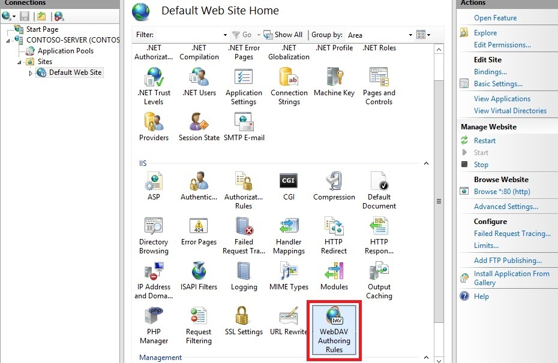](installing-and-configuring-webdav-on-iis/_static/image17.jpg)
3. When the **WebDAV Authoring Rules** page is displayed, click the **Enable WebDAV** task in the **Actions** page.  
    
4. Once WebDAV has been enabled, click the **Add Authoring Rule** task in the **Actions** pane.  
    
5. When the **Add Authoring Rule** dialog appears: 

    1. Click **All content** to specify that the rule applies to all content types.
    2. Choose **Specified users** and type &quot;administrator&quot; for the user name.
    3. Select **Read**, **Source**, and **Write** for the permissions.
    4. When you have completed these items, click **OK**.

    [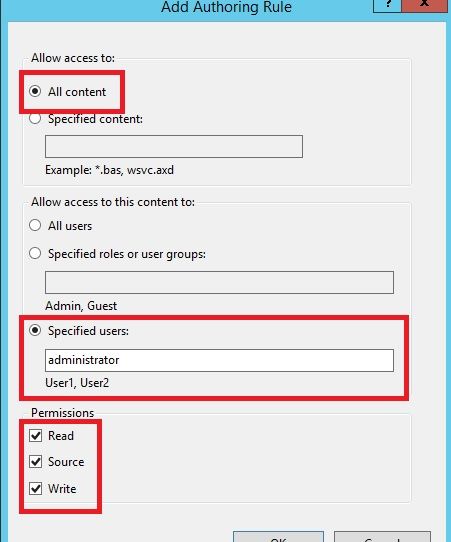](installing-and-configuring-webdav-on-iis/_static/image29.jpg)

**Summary for enabling WebDAV authoring and adding an authoring rule**

Task completed. You have enabled WebDAV authoring on an existing Web site.

To recap the items that you completed in this step, we added WebDAV publishing to the Default Web Site by:

- Enabling WebDAV for the Web site.
- Adding an Authoring Rule for the local administrator account for Read, Source, and Write access.

> [!NOTE]
> As mentioned earlier, your default request filtering settings may block several file types from WebDAV authoring. If you do not modify your request filtering settings, you may see various errors when you try to publish files that are blocked. For example, if you attempt to upload or download a web.config file you will see errors in your WebDAV client. For more information about configuring your request filtering settings, see the [How to Configure WebDAV with Request Filtering](../../publish/using-webdav/how-to-configure-webdav-with-request-filtering.md) walkthrough.

### Step 2: Logging in to Your WebDAV Site

In Step 1 above, you enabled WebDAV publishing for your Default Web Site and added an authoring rule for the local administrator account for Read, Source, and Write access to your Web site's content. In this step, you log in using your administrator account.

**Ensuring that you have authorization and authentication configured**

1. In **IIS Manager**, in the **Connections** pane, expand the **Sites** node in the tree, then click the **Default Web Site**.
2. Double-click the **Authentication** feature.  
    [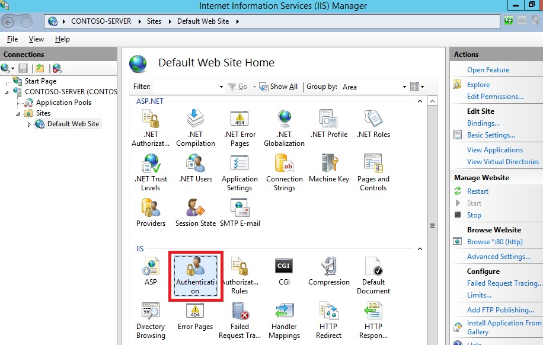](installing-and-configuring-webdav-on-iis/_static/image33.jpg)
3. When the **Authentication** feature opens, make sure that **Windows Authentication** is enabled. If it is not enabled, select **Windows Authentication**, and click **Enable** in the **Action** menu.(> [!NOTE]
> You can use Basic Authentication with WebDAV, but the WebDAV redirector will only use Basic authentication with SSL connections.)  
    [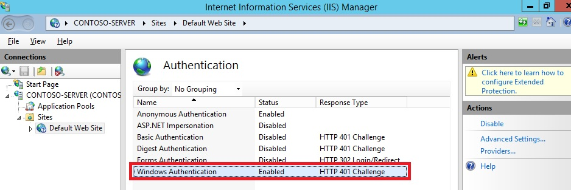](installing-and-configuring-webdav-on-iis/_static/image37.jpg)
4. In IIS Manager, click the **Default Web Site** under the **Sites** node in the tree.
5. Double-click the **Authorization Rules** feature.  
    [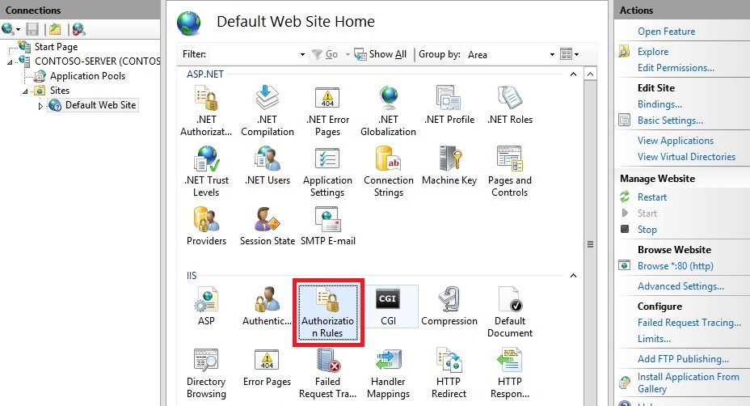](installing-and-configuring-webdav-on-iis/_static/image41.jpg)
6. When the **Authorization** feature opens, make sure that an **Allow** rule is defined that includes the administrator account. (For example, the default rule for IIS allowing access to All Users will include the administrator account.)  
    

**Logging in to your WebDAV site using your administrator account**

Logging into your WebDAV site requires the WebDAV Redirector. The WebDAV Redirector is used to publish content to an existing Web site that has the WebDAV nodule installed. You must use Server Manager to install the Desktop Experience feature before you can use the WebDAV redirector. For more information, see Using the WebDAV Redirector.

1. On your WebDAV server, open a command prompt session.
2. Type the following command to connect to your WebDAV server:  
  
 net use \* http://localhost/

You now have a drive mapped to your WebDAV-enabled web site using the local administrator account, and based on the authorization rule that we added in Step 1, you have Read, Write, and Source access to the content folder.

[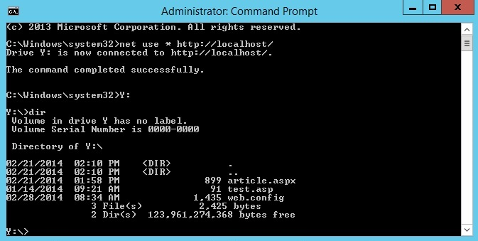](installing-and-configuring-webdav-on-iis/_static/image49.jpg)

**Summary for logging into your WebDAV site**

To recap the items that you completed in this step:

- You verified that your Web site had sufficient authentication and authorization settings.
- You logged in to your WebDAV site as the local administrator.

## Enabling WebDAV Publishing by Editing the IIS Configuration Files

You can also add WebDAV publishing to an existing Web site by editing the IIS configuration files.

> [!NOTE]
> Editing your applicationHost.config file requires full administrative permissions. This is best accomplished using one of two methods:

- Log in to your computer using the local &quot;administrator&quot; account.
- If you are logged in using an account with administrative permissions that is not the local &quot;administrator&quot; account, open Notepad using the "Run as Administrator" option.

> [!NOTE]
> The above steps are required because the User Account Control (UAC) security component in Windows Server 2008 and later will prevent access to your applicationHost.config file. For more information about UAC, please see the following documentation:

- [https://go.microsoft.com/fwlink/?LinkId=113664](https://go.microsoft.com/fwlink/?LinkId=113664)

The following steps will walk you through all of the required settings to add WebDAV publishing for the Default Web Site.

1. Using a text editor such as Windows Notepad, open your applicationHost.config file, which is located in your %SystemRoot%\System32\inetsrv\config folder by default.
2. Scroll to the bottom of your applicationHost.config file and locate the &lt;location&gt; section for your Default Web Site that contains your authentication settings. If this section does not exist, you must add it. This should resemble the following example:  

    [!code-xml[Main](installing-and-configuring-webdav-on-iis/samples/sample1.xml)]
3. Make sure that you have Windows authentication method enabled.
4. Add a &lt;webdav&gt; section beneath the closing &lt;/authentication&gt; tag that will contain your WebDAV settings.
5. Add an &lt;authoring enabled="true" /&gt; element to the &lt;webdav&gt; element
6. Add an &lt;authoringRules&gt; collection with a single entry for &lt;add users="administrator" path="\*" access="Read, Write, Source" /&gt;.
7. Your Default Web Site's settings should now resemble the following example:  

    [!code-xml[Main](installing-and-configuring-webdav-on-iis/samples/sample2.xml)]
8. Save your applicationHost.config file.

You should now be able to log in to your WebDAV-enabled site using a WebDAV client using the administrator account, but no other users should be able to access the content using WebDAV.

**Summary for adding WebDAV publishing by editing the IIS configuration file**

In this task, you added WebDAV publishing to your Default Web Site by editing the IIS configuration files. To recap the items that you completed in this task:

1. You enabled Windows Authentication for the Default Web Site.
2. You enabled WebDAV for the Default Web Site.
3. You added a WebDAV authoring rule for the administrator account with Read, Write, and Source access to the Default Web Site.