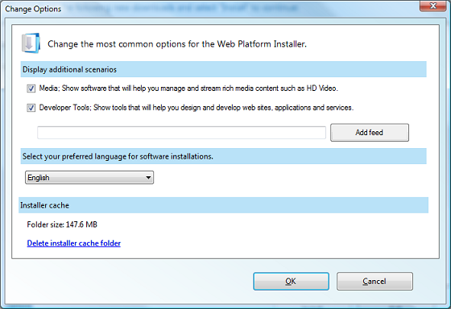
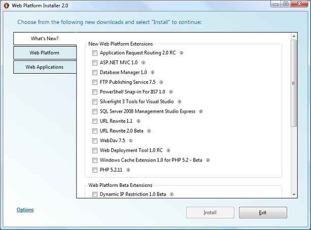
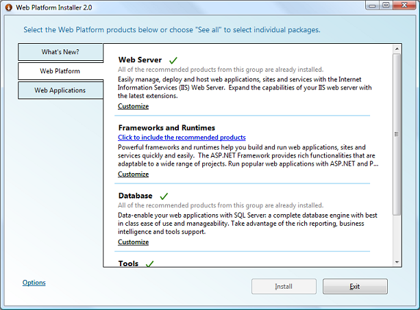
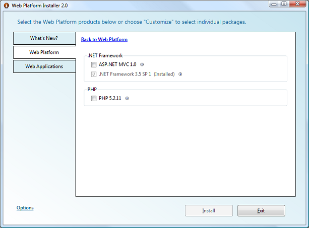
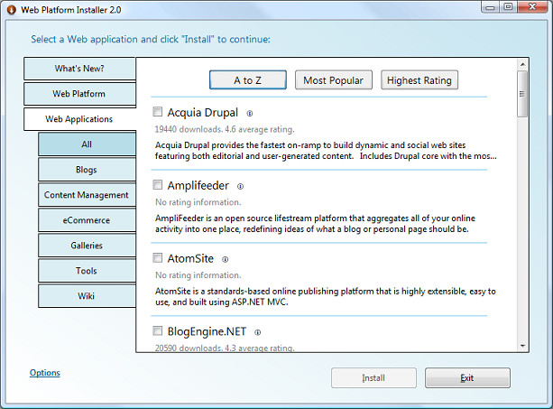
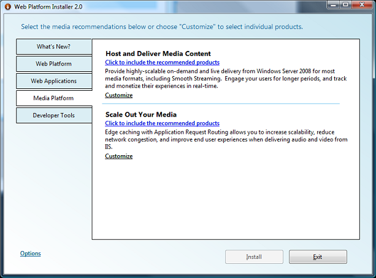
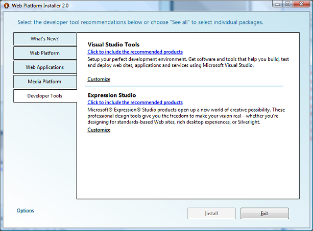
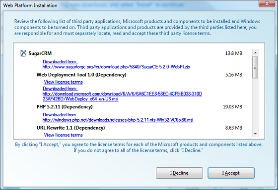
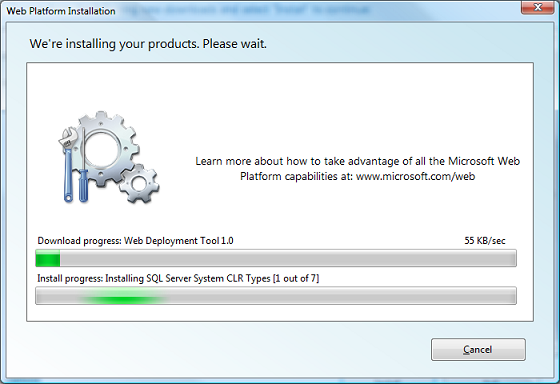

Web Platform Installer 2.0 Walkthrough
====================
by Crystal Hoyer

The Microsoft Web Platform Installer (Web PI) is a free tool that makes it simple to download and install the latest components of the Microsoft Web Platform, including the IIS, SQL Server Express, .NET Framework, and Visual Web Developer. To help you stay up-to-date with product releases, the Web Platform Installer tool always installs the latest version of Web Platform components as well as new additions to the Microsoft Web Platform.

The software offered through Web PI is free to download, and can be installed on a computer that is running Windows XP SP2+, Windows Vista, Windows Vista SP1, Windows 7, Windows Server 2003 SP1+, Windows Server 2008, and Windows Server 2008 R2.

## Installing and Starting the Web PI

To get started, you need to download and install the Web Platform Installer. To install the Web PI, select one of the following options:

1. Visit the newly designed Web PI [download site](https://www.microsoft.com/web/channel/products/WebPlatformInstaller.aspx "Web PI download").

2. View the following terms and then click **Install Now**.

By clicking **Install Now** and by using the Web PI, you agree to the [terms of use](https://go.microsoft.com/?linkid=9546162 "terms of use") for the Microsoft Web Platform Installer. The Web PI will contact Microsoft over the Internet to retrieve product information.

> [Install Now](https://go.microsoft.com/?linkid=9588072 "Install Now")

When the installation is completed, to start the Web PI, in the Windows **Start** menu, click **All Programs**, and then click **Microsoft Web Platform Installer**.

## Customizing the Web PI

By default, the Web PI displays the following tabs: **What's New**, **Web Platform**, and **Web Applications**. You can also use the Web PI to install Developer Tools and components of the Media Platform, such as IIS Media Services and Application Request Routing. To display the **Media Platform** and **Developer Tools** tabs, click **Options**, displayed in the lower left corner of the Web PI interface.

The **Change Options** dialog box is displayed.

Select the check box for the **Media** and/or **Developer Tools** to display those tabs in the Web PI interface, and then click **OK**. The tabs are then displayed when the Web PI interface refreshes.

You can also specify the language you want displayed in the Web PI and configure settings for the Installer cache.

## Selecting the applications you want to install

Select the tab that describes the type of products you want to install.

### What's New tab

Products listed on the **What's New** tab include products that have been released in the last few months.

### Web Platform tab

The **Web Platform** tab includes the products and components that comprise the Microsoft Web Platform. The Web PI automates the discovery and installation of the Microsoft Web Platform components, which includes the Web Server, Frameworks and Runtimes, Database, and Tools sections. In version 2.0, the Microsoft Web Platform also installs PHP version 5.2.9-2, by using the publically available Windows installer for PHP.

A green checkmark next to a category indicates that all the recommended products for that category are already installed on your computer. To select specific products or components for a category, click **Customize**.

Click **Back to the Web Platform** after you select the applications you want to install.

### Web Applications tab

The **Web Applications** tab includes popular community ASP.Net and PHP applications.

You can change the sort order of the applications by using the buttons displayed at the top of the page.

Click **A to Z** to sort alphabetically by application name.

Click **Most Popular** to display the most downloaded applications at the top of the list.

Click **Highest Rating** to display the applications with the highest average user rating first.

Click on a tab to display only the applications in that category. You can sort applications within each category as well.

### Media Platform tab

The **Media Platform** tab displays IIS Media Services and related components.

### Developer Tools tab

The **Developer Tools** tab displays tools for developing Web applications, including Visual Studio tools and a trial version of the latest release of Microsoft Expression Studio.

## Confirm your selections and accept the license agreement

After you select the products and applications you want, click **Install**. The **Web Platform Installation** page displays the products you selected as well as any required dependencies. When you select a product or application, the Web PI automatically adds the dependencies for those products to the list of products to install.

If you do not agree with the license terms, click **I Decline** to cancel the installation.

Click **I Accept** to agree with the license terms for each selected product or application and begin the installation.

Most of the products that are offered in the Web PI do not require any further input from you and will seamlessly download and install. However, if a product requires input, a dialog box is displayed and you must then enter the information for that product's installation. For example, some applications ask for an application name and a Web site name as part of the installation process.

## Finishing the installation

When the Web PI completes the installation of the products that you selected, a page is displayed that indicates the status of the installation. If any products did not successfully install, an indication of the cause for the error is displayed, as well as a link to get more information.

After you have reviewed the information, click **Finish** to close the Web PI.

Congratulations, you have now successfully downloaded and installed the Microsoft Web Platform through the Web PI. Run the tool again to see what new products have been added as we will continually add new products as they are released.

## Where to get more information

To learn more about the Microsoft Web Platform, visit the [Microsoft Web Platform](https://www.microsoft.com/web/) page.

To learn more about the Microsoft Web Platform Installer, visit the  Web Platform Installer page on IIS.net.

To learn more about the Web PI schema, see the [Web Platform Installer Schema Reference](https://technet.microsoft.com/en-us/library/ee506569(WS.10).aspx).

To view the Web PI API documentation, see the [Microsoft.Web.PlatformInstaller Namespace](https://msdn.microsoft.com/en-us/library/microsoft.web.platforminstaller.aspx) article on MSDN.

For troubleshooting information, including a list of known issues with the Web PI, see [Troubleshooting Problems with Web Platform Installer 2.0](../../troubleshoot/web-platform-installer-issues/troubleshooting-problems-with-microsoft-web-platform-installer.md) on IIS.net.
  
  
[Discuss in IIS Forums](https://forums.iis.net/1155.aspx)