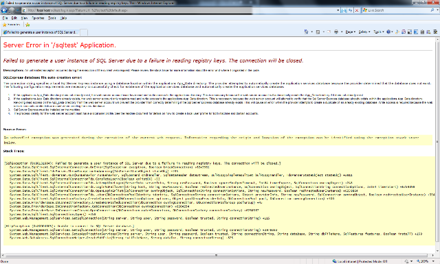

Application Pool Identities and SQL Server Express
====================
by [Thomas Deml](https://github.com/thomasdeml)

## Introduction

IIS 7.5 on Windows 7 or Windows Server 2008 R2 supports a new feature called "Application Pool Identity". It allows the effective isolation of Application Pools without having to maintain a user account for each and every Application Pool that is supposed to be sandboxed. Application Pool Identities are generated automatically and don't require passwords either - management costs go down.

As with every new feature there are certain drawbacks and this is not different with the Application Pool Identity feature. This article describes an issue that an web application develoer might face when he uses IIS 7.5 together with SQL Express.

## The Pieces of the Puzzle

SQL Express supports a feature called ["User Instances" or RANU (Run As Normal User).](https://msdn.microsoft.com/en-us/library/bb264564(SQL.90).aspx "SQL Express User Instances") If this feature is turned on (turning it on is as easy as adding "UserInstance=true" to your connection string) the SQL Server process that is started when a user opens a database connection will run under the same account as the connecting user. RANU is very desirable from a security perspective.

When you are developing with Visual Studio 2008 or Visual Studio 2010 a default connection string is stored in the machine.config file. Here it is:

[!code-xml[Main](application-pool-identities-and-sql-server-express/samples/sample1.xml)]

The default connection string is using RANU (User Instance=true) as you can see. The default connection string is used, for example, when a feature requires a database to store some data but no database is configured yet. ASP.NET Membership is a good example for this. If a developer adds Membership functionality to his web application ASP.NET will automatically create a database and the necessary tables by using the default connection string in machine.config.

## The Issue

Now here comes the problem:

Out-of-the-box RANU doesn't work with the new "Application Pool Identity" feature. The "Application Pool Identity" feature is the default identity in IIS 7.5. The IIS 7.5 DefaultAppPool for example, runs under the "IIS AppPool\DefaultAppPool identity and not as NetworkService anymore. For this reason you might run into this issue if you are also developing with Visual Studio.

Here is the error pages you might see:

The error is caused because SQL Server Express RANU requires a user profile to be loaded and IIS 7.5 doesn't load a [user profile](https://msdn.microsoft.com/en-us/library/bb776892(VS.85).aspx "Windows User Profiles") by default. You don't see this error in previous versions of IIS because the DefaultAppPool was running as NetworkService and the operating system preloads the user profile for NetworkService.

## The Fix

Fortunately the fix for this problem is pretty straightforward. IIS allows you to load the user profile for an Application Pool by simply setting the LoadUserProfile setting on an Application Pool to true.

This can be done via the User Interface:

1. Click the "Application Pools" node in the IIS Manager.
2. Select the Application Pool in question, e.g. DefaultAppPool
3. Click "Advanced Settings..." in the Actions menu on the right hand side.
4. In the "Process Model" sub section you find the line with the name "Load User Profile". Switch it to "true"

If you want to do this via command-line execute the following command in an elevated command prompt:

[!code-console[Main](application-pool-identities-and-sql-server-express/samples/sample2.cmd)]

## Side Effects of Loading the User Profile

The biggest side effect with loading the user profile can be the temp directory. If the user profile is not loaded the %temp% environment variable points to the \windows\temp directory. Everybody can write to this directory. If the user profile is loaded the %temp% environment variable points to a dedicated directory to which only the user has access to. So if your DefaultAppPool runs as the "IIS AppPool\DefaultAppPool" the %temp% variable wout point to the C:\Users\DefaultAppPool\AppData\Local\Temp directory. To this directory only the DefaultAppPool and Administrators would have write access to.

So why is this a problem? Unfortunately the Windows operating system supports a feature called "impersonation". Impersonation allows a piece of code to run under an identity different from the identity the process is running as. Some Web Application Frameworks take advantage of this feature. Classic ASP for example executes all code as impersonated. The identity used is either the anonymous user configured in the IIS configuration store or the user authenticated via the IIS provided authentication schemes (Basic, Digest or Windows). ASP.NET doesn't impersonate the code it runs by default. Impersonation is still supported using the [system.web identity section](https://msdn.microsoft.com/en-us/library/72wdk8cc(VS.71).aspx "system.web identity section") in configuration or using .NET APIs. The problem is that the impersonated identity probably doesn't have access to the %temp% directory. Here is an [article](../../application-frameworks/running-classic-asp-applications-on-iis-7-and-iis-8/using-classic-asp-with-microsoft-access-databases-on-iis.md "Access and LoadUserProfile") that explains one instance of this problem.

If you are only developer ASP.NET applications and don't use the identity section you probably will never see these issues and loading the user profile should be perfectly safe.

## Summary

This article described an issue with SQL Express and the new IIS 7.5 Application Pool Identity. Because the Application Pool Identity feature is the default in IIS 7.5 users might see the problem described above when using SQL Express in a development environment, i.e. when developing with Visual Studio. This issue won't happen on production environments because SQL Express is not supported in production environments.