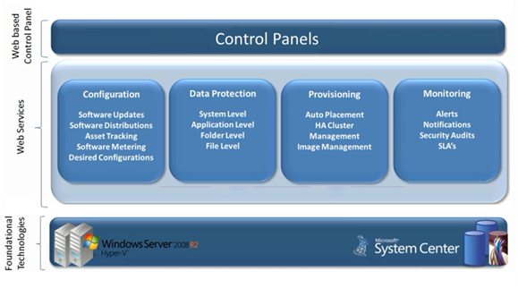

Hosted Services Control Panels
====================
by Brad Joseph

## Hosted Services Control Panels

Hosted services control panels are customer-facing, web-based applications provided by hosting providers and WebVAPs for issuing and managing hosted services such as websites, database administration, email accounts, and resource provisioning. Control panels are a proven model for monetizing commodity web servers and host services. hosting providers depend on control panels to automate rapid web server and website deployment by abstracting the complexity of enterprise-focused management tools through the use of user-centric controls for getting customers up and running in minutes, at anytime, and from anywhere. In addition to basic website functions, most control panel manufacturers also provide a complete billing system with extensive reports and itemized billing information.

Host control panels provide two primary functions to users: web server administration and domain-level task automation.

Web server administration includes the following functions:

- Managing customer accounts
- Defining host packages

    - Account quotas
    - Domains
    - Billing
- Server-level functions

    - Web server configuration
    - Database configuration
    - Domain Name System (DNS) configuration
    - Managing virtual servers

Domain-level task automation includes the following actions:

- Application installation
- Website file transfer
- Website analytics
- Database management
- Sub-domain configuration
- Email account configuration and administration

Since all functions are performed from a browser, there is no operating system–specific control panel installation needed, remote desktop dependency, or firewall negotiation required. An additional advantage to web interfaces is a decreased dependency upon the underlying platforms—such as Windows/SQL or Linux/MySQL—thereby eliminating the need for custom-built control panels. And in an attempt to fit the hosting providers' business needs, many manufacturers let you modify the control panel's look and feel with skins, branding, and customized modules.

The following graphic shows the role control panels play when working with Windows-based hosting environments:

### Recommended Control Panels

Microsoft does not currently offer a control panel to shared and dedicated hosting providers, but there are many control panel products on the market to choose from. Below are a few of the control panel offerings on the market today that cater to hosting providers:

- **Parallels Plesk Panel 9.5** is a comprehensive solution for shared, virtual and dedicated hosting providers. Plesk 9.5 provides multi-level administration for the server administrator, reseller, and hosting customers by providing management features like key auto-update mechanism, auto-component updater, migration manager and a Web-based installation for quick deployment. For more information on Plesk 9.5 and other Parallels products, visit: [http://www.parallels.com/](http://www.parallels.com/).
- **Ensim** **Unify Managed and Service Provider**. Ensim Unify Service Provider is a single, multi-tenant, centralized software application that simplifies the day-to-day burden of activating, configuring and managing a service provider's unified communications and collaboration infrastructure. Ensim Unify Managed is a comprehensive systems management console that allows managed service providers to administer and automate their customers' dedicated mission-critical application infrastructure. For more information on Unify Managed, Service Provider and other Ensim products, visit: [http://www.ensim.com/](http://www.ensim.com/)
- Hosting Controller is an integrated control panel, providing a multi-tenant, self-served, coherent interface for the management and facilitation of day to day web and cloud hosting tasks. For its Windows platform Hosting Controller leverages the convenience and simplicity of IIS, which also serves as its web server. Some of its key offerings include a multi-tiered hierarchy, automated billing and provisioning, customizable auto sign-up scripts and tightly coupled domain registrars and payments processors enabling a complete Web automation suite. For more information on Hosting Controller, visit: [http://hostingcontroller.com/](http://hostingcontroller.com/)
- **EMS Cortex** enables service providers to host, sell, and resell hosted infrastructure and applications in a low cost automated manner through a single web based control panel. Cortex allows Hosting providers to offer Virtual Data Centres on Hyper-V and a range of popular Cloud Applications including Exchange, SharePoint, OCS and Dynamics CRM, as well as Cloud Desktop delivery. For more information on EMS, visit: [http://www.ems-cortex.com/](http://www.ems-cortex.com/).

### WebsitePanel

Another option for hosting providers is [WebsitePanel](websitepanel.md). WebsitePanel, formerly known as DotNetPanel, is an open-source control panel built exclusively for the Windows operating system. With the help of former DotNetPanel developers, Microsoft is investing in the future and success of WebsitePanel by contributing support for ongoing development efforts.

WebsitePanel has recently been submitted as an open-source project on [SourceForge](http://sourceforge.net/) and carries a BSD license. For more information on WebsitePanel, visit: [http://websitepanel.net](http://websitepanel.net/).