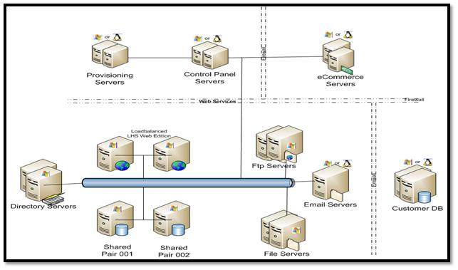
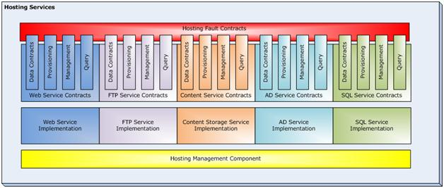

Services Overview
====================
by [Walter Oliver](https://github.com/walterov)

## Introduction

The Hosting Services Sample is a set of services implemented in C# provided to help developers in web hosting organizations developing and/or integrating Hosting Provisioning and Management system.

Its purpose is to show through sample code and documentation how to take advantage of the Windows Server® 2008 platform to implement such functionality. These services were developed as part of the early IIS 7.0 Technology Adopter Program (TAP), where Microsoft worked with over 20 hosters and helped them create an offer on Windows Server 2008 and SQL 2005. Hosters leveraged these sample services because it helped them cut back on their learning curve.

### Components

There are three main components in the sample. Each has a corresponding Visual Studio 2008 project:

1. **The Windows Service based host.** Includes contracts for managing provisioning and managing web and FTP sites, content storage, Active Directory and SQL Server resources. The services are hosted in a Windows Service. This is useful for managing configurations where IIS 7.0 is not installed or when running the hosting services on the web is not desired.
2. **The Web Service based host.** Includes the same functionality as the Windows Service based version of the host. The only difference is that the services are hosted in a Windows Web Service instead of an Windows Service based application.
3. **Sample Client**. Is a simple web application that calls the contracts for each service. Its purpose is to illustrate the use of the services.

> [!NOTE]
> This is a sample application and should not be used in a production environment. It is provided for learning purposes only.

This article contains the following:

- [Getting Started with the Services](services-overview.md#Getting)
- [Hosting Environment](services-overview.md#Hosting)
- [Management Services for Hosters](services-overview.md#Management)
- [Sample Services Architecture](services-overview.md#Sample)

## Getting Started with the Services

The Hosting Services Code Sample has been deployed in two different scenarios. One is through IIS 7.0 and the other is through a Windows Service.

### IIS 7.0

Under Windows Server® 2008 and IIS 7.0, the Windows Communication Foundation (WCF) services are deployed as a hosted web site. This allows it to take advantage of features such as:

- Process recycling
- Idle shutdown
- Process health monitoring
- Message based activation

Because the hosting extensions require high permissions to perform operations such as creating directories on the file system, creating databases, adding new users and so forth, the application pool for this site requires an identity with administrator permissions. An installation package (HostServiceInstaller.msi) has automated this deployment.

### Windows Service

The second scenario deploys the services to run as a Windows Service. This deployment allows the services to be hosted on a server that is not running IIS. It also requires additional code to be written so that the WCF services inherit from **ServiceBase** class and implements the **OnStart** (to create and open an instance of ServiceHost ) and **OnStop** (to close the instance of ServiceHost). An installation package (HostingWindowsService.msi) has automated this deployment.

### Validating the Installation

Validate the installation using the following steps.

1. Browse to the following url: http://&lt;hostheader&gt;/webmanagementservice.svc . The following page appears if the installation was successful, which indicates that the service is now hosted.

> [!NOTE]
> You must configure an account with admin rights for running either Windows Service or an application pool for the IIS hosted web site, since the services require admin level permissions to manage IIS configurations, as well as other functions.

2. Download and install the solution with the **SolutionSetup.msi** installation package. Open the solution (IIS7GoLive.sln) in Visual Studio and you find the following structure in Solution Explorer.

## Hosting Environment

A typical hosting environment is a heterogeneous environment (as shown in figure below). Most hosters use Web Services to manage the disparate set of servers and the different roles each server plays.

Figure 1: A Heterogeneous Hosting Environment

### Different Servers

The hosting environment has multiple versions of Windows and Linux servers, each of which provides a specific service or role. Hosters stitch together or integrate these services to provide a coherent offer to their customers. It is quite common to see the Web site served from IIS 7.0 servers, whereas the email accounts may be served from a Linux server (and vice versa). The provisioning operations can be managed from a Linux server, but the website is provisioned on Windows. Regardless of the service being offered, the needs and constraints of the hosters in managing these servers are the same.

Hosters also tend to have a very heavily firewalled infrastructure. Some of the APIs available on the Microsoft stack leverage DCOM or .NET Remoting, which requires hosters to open additional ports in the firewalls--this is not an ideal solution.

To address the constraints created by the heterogeneous environments and by firewall/security issues, most hosters have now standardized using Web Services to provision and manage their servers and the different server roles.

The Windows Platform does not natively ship Web Services, and therefore, every hoster needs to implement their own. In order to address this deficiency and the needs of hosters, Microsoft has created a set of services. This set of services is **Management Services for Hosters**, and is treated as "Hosting Extensions" to the managed APIs.

## Management Services for Hosters

The sample is made up of a set of low level services that provide capabilities for some of the most common server roles used in the hosting space. The service subsystems are:

- Web
- FTP
- Content Storage
- SQL Server 2005 (&amp; 2008)
- Active Directory

In addition to these, the sample can be extended to support DNS, WSS and Email (Exchange or SMTP/PoP3).

### Interfaces and Operations

All operations against each of the subsystems are grouped into three interfaces:

- Provisioning
- Management
- Querying

These operations perform the tasks that both the operational tools, and the control panel type application used by end users, must perform.

The provisioning operations deal mainly with creation of a site, a user, a database, and so forth. These are operations that the hoster may initially execute in order to create an environment for the end user. Each create has a corresponding delete.

Once the object is created, the management operations provide the capability to maintain the object: for instance, a web site can be stopped, or restarted; default documents and additional bindings may be applied to the site; and site authentication may be added or changed. The users of these operations can be either the end user managing their own site, or a hoster's support department applying certain properties.

The Query operations view information specific to each subsystem. A hoster's support department might call services in these operations to monitor server activity or gather information on current status of sites.

## Sample Services Architecture

The sample is implemented as Windows Communication Framework (WCF) services, which are then exposed to customers as Web Services using the WSHttpBinding. The following is an architectural diagram:

Figure 1: Hosting Services Sample Architecture

In the diagram, notice the consistency of the framework. All subsystems are developed with the same pattern of contracts and operations. This framework can be followed by future subsystems.

### Hosting Subsystems

The following subsystems are provided in the sample:

1. **Web Service** - This subsystem is for IIS 7.0 web site provisioning, management, and query. Aside from the basic site creation, added functionality pertains to managing and querying of sites, Application Pools, default documents, bindings, authentication, and others. The goal of this subsystem is to create web services for all functionality that exists in IIS manager. The data contract for this subsystem is based on the IIS 7.0 xml schema found at c:\windows\system32\inetsrv\config. Services are written using the Microsoft.Web.Administration APIs.

2. **FTP Service** - This subsystem is built for the new FTP7 Server that only runs on Windows Server® 2008 and IIS 7.0. The FTP7 Server add-on is available as a free download. The new FTP contains feature improvements for the shared hosting scenario. For instance, an FTP binding can be added to a web site so that the same content can be hosted on both sites. Like the subsystem for the web, this subsystem's data contracts are also based on the Config files schema.

3. **Content Storage Service** - This subsystem is for provisioning, managing, and querying of storage that an end user may need. This is used in conjunction with site creation and managing the storage a user has for a site. Quotas can be set and permissions and security applied at both directory and file levels.

4. **Active Directory Service** - This subsystem is for provisioning, managing and querying of Active Directory membership stores. This would be used in situations where a customer might want to create an Organization Unit, groups within that OU, and users to be added to the groups.

5. **SQL service** - This subsystem is for SQL Server Database provisioning, management and query. This is used in situations in which a customer develops an application that requires a database. They need to create the database, run scripts to create stored procedures, create tables, and populate tables with data.