Get to Know the IIS 7.0 WMI Provider Using CIM Studio
====================
by IIS Team

## Introduction

This document introduces WMI CIM Studio, a tool that provides a visual interface for exploring WMI namespaces. Using the IIS "WebAdministration" namespace, you learn how to enumerate classes in a namespace, view the properties and methods on a class, search classes and properties for a specific word like "restriction", and much more – all without writing one script.

Before you can do anything in WMI, you must connect to a namespace. The first section of this document describes how to download and open CIM Studio, enumerate all namespaces, and connect to a specific namespace.

The second portion of this document shows how to explore classes in a namespace by viewing their properties and methods, and property/method metadata such as whether a property is read only or read/write. Finally, you get object instances and interact with them by setting properties and executing methods. This is WMI, visual and demystified.

## Before You Start

### Install IIS

IIS 7.0 or above must be installed to complete the steps in this document. If you can browse to [http://localhost](http://localhost/) and receive the standard IIS "Under Construction" page, then IIS is installed. If IIS is not installed, please refer to [Installing IIS on Windows Vista](../../install/installing-iis-7/installing-iis-on-windows-vista-and-windows-7.md) for installation instructions.

### Install WMI Provider

Install the IIS WMI provider by selecting the **IIS Management Scripts and Tools** component under **Management Tools** (or Web Management Tools). In Windows Vista, this is in the Windows Features dialog under Internet Information Services. On Windows Server® 2008, this is in the Server Manager under the Web Server (IIS) role.

[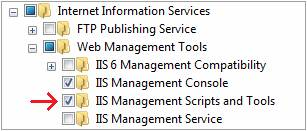](get-to-know-the-iis-wmi-provider-using-cim-studio/_static/image1.jpg)

### Install WMI Tools (includes CIM Studio)

Install the WMI Tools suite from the [Microsoft Download Center](https://www.microsoft.com/downloads/details.aspx?FamilyID=6430f853-1120-48db-8cc5-f2abdc3ed314&amp;DisplayLang=en.) before starting.

### Required Privileges and User Account Control (UAC)

You must be an administrator to connect to the WebAdministration WMI namespace. This means that you are logged in as:

- The built-in Administrator account on Longhorn Server
- A member of the Administrators group and you have disabled User Account Control (UAC)
- A member of the Administrators group and UAC is enabled

If you are in the first or second situation, you will not encounter any permissions problems with this article.

If you are in the third situation, you will encounter **Access is Denied** errors. Avoid these problems by always opening command prompts as Administrator and by launching CIM Studio from an elevated command prompt.

To open a command prompt as Administrator, click **Start**, click **All Programs**, click **Accessories**, right-click **Command Prompt**, and select **Run as Administrator**.

To launch CIM Studio from an elevated command prompt:

1. Open a command prompt as Administrator.
2. Type **"%systemdrive%\Program Files\WMI Tools\studio.htm"** andpress Enter.

### Make a Backup

Backup key IIS configuration files before beginning so that you can restore your system to its original state after you have finished.

1. Open a command prompt.
2. Type **%windir%\system32\inetsrv\appcmd add backup IIS7\_WMI\_CIMStudioLab.**

*Expected output*:

[!code-console[Main](get-to-know-the-iis-wmi-provider-using-cim-studio/samples/sample1.cmd)]

- After you have finished, restore IIS to its original state by opening the command prompt as administrator and typing **%windir%\system32\inetsrv\appcmd restore backup IIS7\_WMI\_CIMStudioLab**.

*Expected output*:

[!code-console[Main](get-to-know-the-iis-wmi-provider-using-cim-studio/samples/sample2.cmd)]

## 1. Connect to the WebAdministration Namespace

Click **Start**, click **All Programs**, click **WMI Tools**, and click **WMI CIM Studio**.

[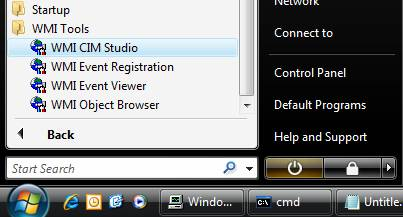](get-to-know-the-iis-wmi-provider-using-cim-studio/_static/image3.jpg)

If you are prompted with the following dialog, click Close.

[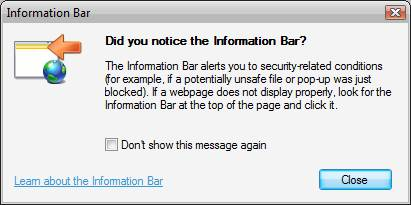](get-to-know-the-iis-wmi-provider-using-cim-studio/_static/image5.jpg)

If the yellow information bar indicates that Internet Explorer is blocking active content, right-click the information bar and click the **Allow Blocked Content...** option. You then receive a Security Warning asking you if you are sure you want to let this file run active content; click Yes.

[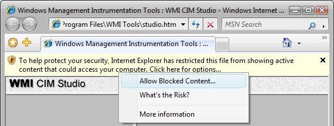](get-to-know-the-iis-wmi-provider-using-cim-studio/_static/image7.jpg)

> [!NOTE]
> If you wish to avoid this security warning in the future, click on the **Tools** drop-down menu on the right hand side of Internet Explorer 7, select **Internet Options...**, click on the **Advanced** tab, scroll down to the Security settings and check "Allow active content to run in files on my computer". Click **OK**.

You will see the dialog below when CIM Studio opens. This dialog allows you to connect to a specific WMI namespace. Click the browse button circled in red below.

The browse button brings up the namespace browsing dialog below. Click the **Connect** button.

[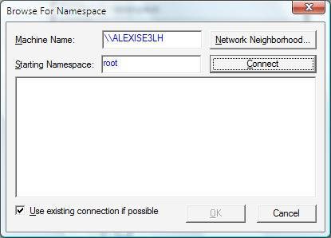](get-to-know-the-iis-wmi-provider-using-cim-studio/_static/image9.jpg)

CIM Studio now pops up a login dialog, as shown below. Click **OK**.

[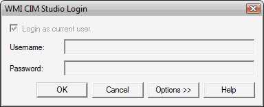](get-to-know-the-iis-wmi-provider-using-cim-studio/_static/image3.gif)

The dialog shows a tree view of namespaces available under "root" after connecting to the root namespace. Scroll to the bottom to see "WebAdministration", the new IIS WMI namespace. Double-click the **WebAdministration** folder icon to connect to the namespace.

[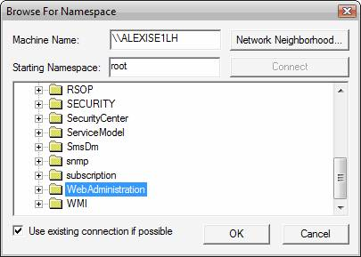](get-to-know-the-iis-wmi-provider-using-cim-studio/_static/image11.jpg)

CIM Studio pops up a login dialog again. Click **OK**.

After successfully connecting to the WebAdministration namespace, the left side of CIM Studio window looks similar to the screen shot below. Check to see that your namespace is called "root\WebAdministration" as shown below.

## 2. Explore Classes

The list of classes in the WebAdministration namespace looks similar to the screen shot below. The classes circled in red are the base classes for the WebAdministration provider; the classes that are not circled and begin with a double underscore "\_\_" are WMI standard classes that are not related specifically to the WebAdministration provider.

[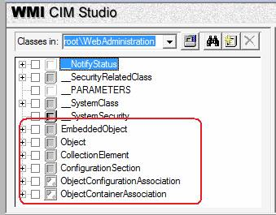](get-to-know-the-iis-wmi-provider-using-cim-studio/_static/image15.jpg)

Expand the tree under the **Object** class. Expand the tree under the **ConfiguredObject** class. You now see a tree view that contains familiar web server objects such as Site and Application, as shown below. These objects are the central focus of the WebAdministration WMI namespace and you will likely spend most of your time interacting with these objects.

[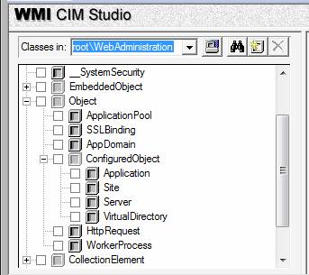](get-to-know-the-iis-wmi-provider-using-cim-studio/_static/image17.jpg)

Select the **Site** object. When you select an object, the right-hand pane of the CIM Studio window provides information about that object. The screen shot below shows the Properties tab. The Properties tab shows the names of the Site properties, their type, and their value. You notice that the value column contains mostly "&lt;empty&gt;" strings because we are looking at the definition of the Site object, not an instance of Site (we look at instances in later). Note that all properties beginning with double underscore "\_\_" are standard WMI class properties and can be ignored while learning WMI basics.

[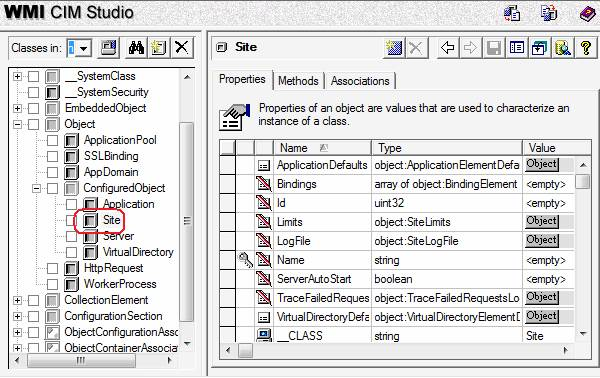](get-to-know-the-iis-wmi-provider-using-cim-studio/_static/image19.jpg)

To know if the Site Id property is read-only or read/write, right-click on **Id** and select **Property Qualifiers...**

The dialog below shows the "qualifiers" for the Id property. Qualifiers are metadata about a property. The "read" and "write" qualifiers describe whether a property can be read or written; both the read and write qualifiers have a value of true for the Id property, so this property is read/write.

[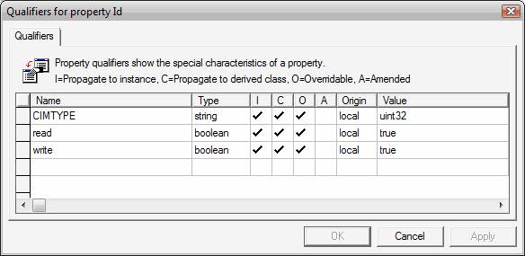](get-to-know-the-iis-wmi-provider-using-cim-studio/_static/image22.jpg)

1. Click the **Cancel** button.
2. Click the **Methods** tab to see the Site methods, as shown below.

[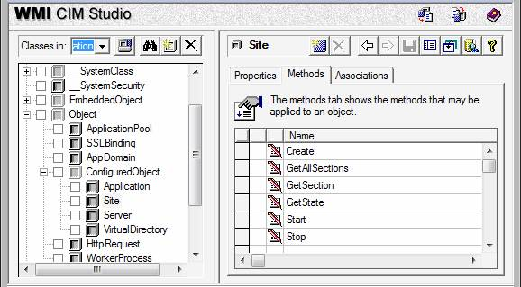](get-to-know-the-iis-wmi-provider-using-cim-studio/_static/image24.jpg)  

To know what parameters the Create method takes, right-click on the **Create** method and select **Edit Method Parameters**. This menu item launches a dialog box that contains a list of the parameters for the Create method, as shown below. The return type for the method is specified at the bottom of the dialog. Take care not to modify any of the method parameters; only use this dialog to view the method parameters.

[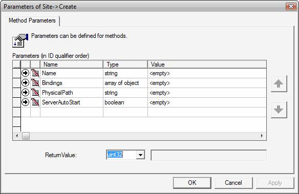](get-to-know-the-iis-wmi-provider-using-cim-studio/_static/image26.jpg)

Click the **Cancel** button.

Take another look at the Site properties by clicking the **Properties** tab in the right pane. The Bindings property has a type "array of object:BindingElement"; i.e. an array of BindingElement objects. Next, take a look at the BindingElement class to see what properties a BindingElement has.

Click the **Search** button, circled in red below.

Type **BindingElement** into the search text box and click the **Go!** button. The "Search results:" text box displays an entry called BindingElement.

[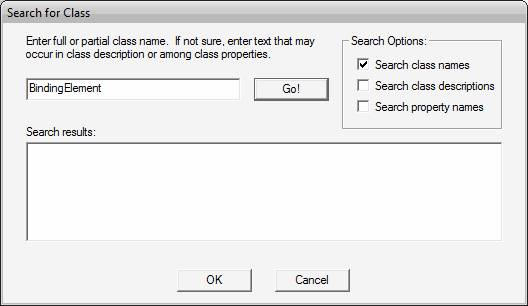](get-to-know-the-iis-wmi-provider-using-cim-studio/_static/image30.jpg)

Double-click **BindingElement** entry in the search results to go to the BindingElement class definition.

[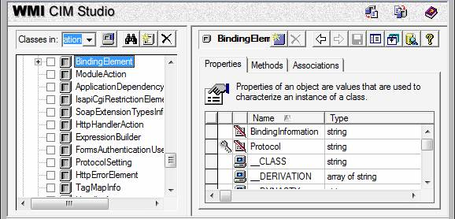](get-to-know-the-iis-wmi-provider-using-cim-studio/_static/image32.jpg)

## 3. Get Object Instances

Use search to find the "Site" class again. Click the **Instances Of** button, shown circled in red below, to see all instances of the Site object.

All instances of the Site object are displayed in blue text in the right hand panel of CIM Studio, as shown below. Double-click on the **Default Web Site** instance for detailed information about that Site object.

[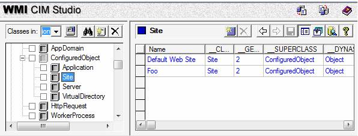](get-to-know-the-iis-wmi-provider-using-cim-studio/_static/image36.jpg)   
  
Now CIM Studio displays information about the Default Web Site. The Site name is displayed at the top of the right hand pane, and the properties on the Property tab have real values instead of "&lt;empty&gt;". The "LogFile" property has a button labeled **Object** in its Value column instead of a real value. Click this **Object** button.

[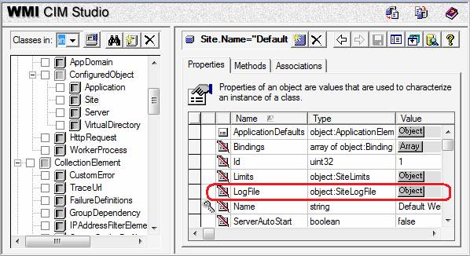](get-to-know-the-iis-wmi-provider-using-cim-studio/_static/image38.jpg)

The **Object** button launches a dialog that shows the properties of the LogFile object, as shown below. These properties enable/disable logging, define the format of the log file, specify the logging directory, etc.

[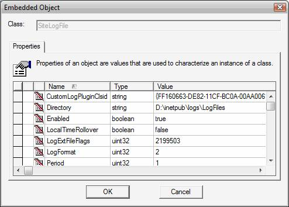](get-to-know-the-iis-wmi-provider-using-cim-studio/_static/image40.jpg)

Click inside the Value field for the **LocalTimeRollover** property. Click the drop-down to see the options for this value, and select "true". This field now shows "true"; the text is in blue because this property has been modified.

[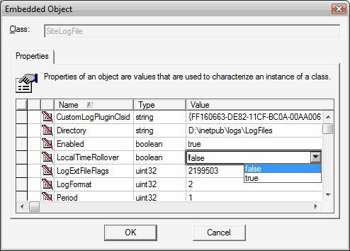](get-to-know-the-iis-wmi-provider-using-cim-studio/_static/image42.jpg)

Click the **OK** button. The Save button, shown below circled in red, has become available because the LogFile.LocalTimeRollover property is modified. Click the **Save** button.

To see this change in configuration, click **Start**, click **Run**, and type **notepad %windir%\system32\inetsrv\applicationHost.config**. Click the **Edit** menu, and select **Find**. Type "localTimeRollover" to find the newly added configuration. The configuration should appear similar to the XML below, and the localTimeRollover configuration property should be set to "true".

[!code-xml[Main](get-to-know-the-iis-wmi-provider-using-cim-studio/samples/sample3.xml)]

Close the applicationHost.config file (click **No** if notepad asks if you would like to save changes). Now we execute one of the Site methods. Click the **Methods** tab, right click the **GetState** method, and select **Execute Method**. Click the **Execute** button.

[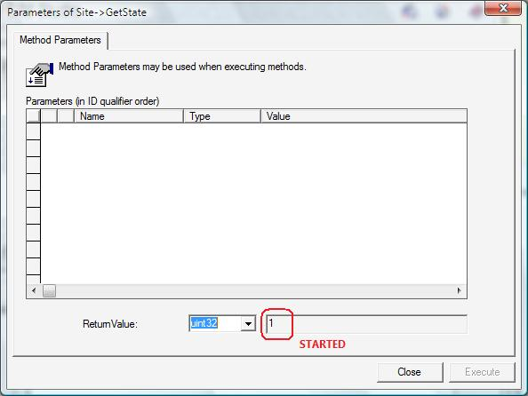](get-to-know-the-iis-wmi-provider-using-cim-studio/_static/image46.jpg)

The return value is 1, or "Started". How do we know that? Click **Close**. Right click the **GetState** method and select **Method Qualifiers…**. This brings up the GetState method metadata, including ValueMap and Values which describe how the return values map to human readable data. Click the **Array** button in the Values row to see the different states.

[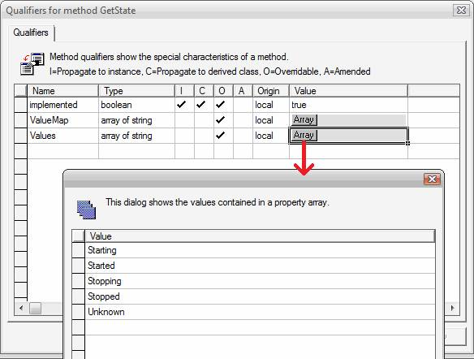](get-to-know-the-iis-wmi-provider-using-cim-studio/_static/image48.jpg)

## Summary

In this document you have learned how to connect to a WMI namespace, how to search for a class, how to discover the properties and methods for a class, how to determine whether a property is read/write or read-only, how to find the parameters for a method, how to get instances of a specific object, how to interactively change properties on an object instance, and how to view the properties of an embedded object.