NBC Online Video Monetization and Highlights Creation for the 2010 Winter Olympics
====================
by Daniel Karuppiah, Jason Suess, Alex Zambelli

### Introduction

The [2010 Winter Olympics in Vancouver](http://www.nbcolympics.com/) marked the sixth of seven consecutive Olympic Games broadcast by NBC Universal and presented the opportunity to build on the success of the 2008 Summer Olympics in Beijing. NBC teamed with premier technology vendors, led by Microsoft, to cover 4,485 hours of 2010 Winter Olympics events in HD via Microsoft Internet Information Services (IIS) Smooth Streaming to a video player based on Microsoft Silverlight. In addition to pleasing sports fans, the programming offered an audience of more than 15.8 million unique visitors to the many advertising partners of NBC. The exceptional capability of IIS Smooth Streaming and Silverlight technologies gave technology vendors the tools they needed to deliver midstream ads while providing an engaging experience for Olympics enthusiasts.

Microsoft and its partners provided an infrastructure that helped to provide NBC, the Canadian television company (CTV), and the Norwegian Broadcasting Corporation (NRK) with streaming content of the 2010 Winter Olympics. This article describes the general IT architecture and tools used to support these three broadcasters, and offers specific details about how NBC inserted midstream ads in both the live video and video-on-demand (VOD) scenarios and created and delivered highlight clips.

| 2010 Olympic Winter Games Fast Facts | CTV | NRK | NBC |
| --- | --- | --- | --- |
| Total number of events covered | 300, including 86 medal events | 300, including 86 medal events | 300, including 86 medal events |
| Hours of video consumed | 7.2 million hours total (6.3 live, 0.9 VOD) | 1.02 million hours | 4.4 million |
| Peak concurrent active live streams | 14 (out of 19) | 16 (out of 19) | 19 (out of 24) |
| Peak concurrent online viewers | 133,785 | 48,802 | 181,000 |
| Total amount of video delivered | 6.2 petabytes | 960 terabytes total (800 live, 160 VOD) | 3.6 petabytes |
| Total video streams delivered | 28.6 million | 4.6 million total (3.3 live, 1.3 VOD) | 50.5 million |
| Total number of unique visitors consuming video online | 3.9 million | 1.22 million | 15.8 million |
| Average minutes per unique view over the entire Games | 111.3 | - | - |
| Peak minutes per unique view (per user/per day) | - | 77.94 | - |
| Photos | - | - | 41,560 |
| Photo galleries | - | - | 1,573 |
| Video quality | 720p for live and VOD | 720p for live and VOD | 720p for live and VOD |

### About IIS Media Services 3.0 and IIS Smooth Streaming

IIS Media Services 3.0, an integrated HTTP-based media delivery platform, delivers true HD (720p+) streaming and provides real-time logging to measure media investments. By offering a complete media delivery platform together with a proven web server, rich, dynamic websites can now be managed from a single web platform: IIS. IIS Smooth Streaming, a feature of IIS Media Services, is a hybrid media delivery method that acts like streaming but is based on HTTP progressive download rather than a traditional streaming protocol. The HTTP downloads are performed in a series of small chunks, enabling the media to be easily and cost-effectively cached along the edge of the network and closer to clients. Providing multiple encoded bit rates of the same media source also lets Silverlight-based IIS Smooth Streaming clients seamlessly and dynamically switch between bit rates, depending on network conditions and the utilization metrics of the client. The resulting user experience is one of reliable, consistent playback without stuttering, buffering, or "last mile" congestion.

### About Silverlight

Silverlight is a powerful development platform for creating rich media applications and business applications for the web, desktop, and mobile devices. Combined with the continued innovation in world-class tools from Microsoft for designers and developers, such as Microsoft Visual Studio and Microsoft Expression Blend, Silverlight empowers more than 6 million Microsoft .NET Framework developers to create cutting-edge, rich Internet applications and media experiences.

## Winter Olympics Solution Overview

The three broadcasters chose Microsoft partners and technologies—featuring Silverlight, the Silverlight Media Framework, and IIS Media Services 3.0 technology running on Windows Server 2008—to create a platform for delivering online video programming monetized through sophisticated ad support.

The ultimate delivery of the program required coordination among myriad partners who provided a variety of services, including broadcasting, transmission and encoding, player development, content management and delivery, security and analytics, highlights creation and delivery, and ad insertion. In this section, you will learn about the basic architecture of streaming and how the player consumed the video, video assets, and ads.

### Streaming Content

As shown in Figure 1, NBC and CTV shared much of the same streaming infrastructure, which was a fully redundant, cloud-based content origination service combined with real-time performance monitoring, maintenance, and health checks of the origin server resources. For NBC, iStreamPlanet handled the receipt and production of 24 concurrent HD video feeds, including venue and broadcast streams, obtained from fiber-optic streams from the International Broadcast Center in Vancouver via the NBC studio at 30 Rockefeller Center in New York City and satellite streams via CTV in Toronto. The multicast feeds were then converted to HD-SDI and transported to a bank of Inlet Spinnaker HD Encoders, which reencoded the video into 720p streams for the IIS origin servers to process and distribute across the content delivery network (CDN). IIS Smooth Streaming content was streamed via the Akamai HD Network—a highly distributed, HTTP-based CDN of 65,000 servers—to audiences in Canada, Norway, and the United States. This content was delayed for about 30 seconds to allow for the midstream insertion of ads in the live stream.

[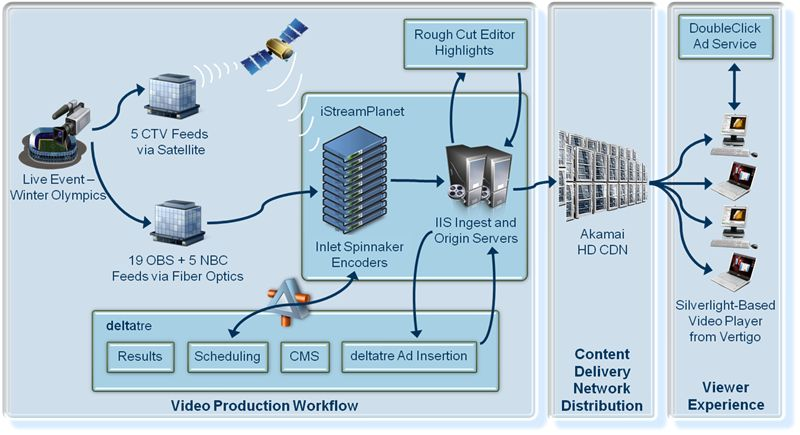](nbc-online-video-monetization-and-highlights-creation-for-the-2010-winter-olympics/_static/image1.jpg)

Figure 1. NBC video, highlights, and ad insertion workflow.

For CTV, iStreamPlanet handled the video workflow consisting of the acquisition of 24 concurrent HD video feeds, including:

- Venue and broadcast streams from the International Broadcast Center in Vancouver and satellite streams via CTV in Toronto
- Decoding of the multicast feeds to HD-SDI
- Routing of the feeds to assigned encoders
- Provisioning of all IIS Smooth Streaming publishing points
- Starting and stopping of Inlet Spinnaker HD Encoders via an Inlet API

For NRK, iStreamPlanet handled the video workflow for Olympic Broadcasting System (OBS) feeds only, which included 19 HD video feeds. iStreamPlanet decoded the multicast feeds to HD-SDI, routed the feeds to assigned encoders, and provisioned the IIS Smooth Streaming publishing points. Four NRK encoders in Oslo, Norway, received feeds from the European Broadcasting Union headquarters in Geneva for NRK's two broadcast channels, NRK1 and NRK2, for the events. These channels delivered localized content with Norwegian commentary, and the focus was primarily on Norwegian athletes. From Oslo, content was streamed over the Akamai HD Network, a highly distributed, HTTP-based distribution network.

It should be noted that the 19 OBS streams were common across the three broadcasters CTV, NRK, and NBC, while the additional streams were fully produced, simulcast streams.

### Workflow Automation

To streamline the video delivery workflow, iStreamPlanet developed a web service that brokered interaction between the multicast decoders, Inlet encoders, and IIS server groups, or pods. This workflow service used IIS Media Services APIs to automate delivery of live, encoded streams to multiple publishing points within the IIS origin server environment, including ingest, live, and VOD servers. The service also tapped Inlet APIs to handle provisioning and starting and stopping of encoders, and failover between encoders. After the Inlet encoders pushed the content to the various publishing points on the IIS servers, the iStreamPlanet automation service parsed the manifest file to extract the start time code. This information was then sent to the **delta** tre content management system (CMS) to initiate ad insertion, highlight production, and publication of the video to the website.

### Server Redundancy

The iStreamPlanet origin server, located at the SuperNAP data center in Las Vegas, was run across three server pods, each one consisting of the primary and the secondary origin servers. Each pod included one ingest, one live, and one video-on-demand (VOD) server, all running Windows Server 2008 R2 and IIS Media Services 3.0. The infrastructure included a bank of Inlet Spinnaker encoders, not only to handle the number of simultaneous Olympic events in progress but also to provide multiple streaming bit rates for each event. In today's IIS Smooth Streaming adaptive bit rate (ABR) delivery scenarios, this helps to ensure outstanding user experience and quality and, even more importantly, to provide graceful failover and business continuity planning.

### From Live Video to VOD

IIS Smooth Streaming technology coupled with iStreamPlanet's workflow automation supported an easy transition seamlessly between live video and VOD. Archives of live content were created on VOD servers, and HTTP redirectors were created in the Akamai network. As soon as the live stream ended, the video-player application automatically redirected to the VOD server for playback of archived video content.

### Protection and Optimization for the Silverlight-Based Video-Player Application

For the NBC Silverlight-based video player, Dotfuscator from PreEmptive Solutions both protected and optimized the final Silverlight components. One Silverlight-specific feature worth noting is that Dotfuscator can accept and output XAP files instead of low-level DLLs that force developers to manually edit XAP files; this shortened and simplified the release process, which was critical for an event like the Olympics. Dotfuscator obfuscated and pruned the video player's executables to prevent tampering and reverse engineering and reduce video-player download time.

### Health Monitoring of the IIS Smooth Streaming Infrastructure

Wintellect, a Microsoft Gold Certified Partner, created specialized management packs for Microsoft System Center Operations Manager that worked through an interface with IIS Media Services APIs. Wintellect provided critical support in the configuration and health monitoring of the origin server environment, a state-of-the-art, high-security data center that housed all of the IIS Smooth Streaming servers used for the Winter Olympics. These included ingest servers that processed live, encoded streams; live servers; VOD servers for on-demand playback of archives; and completely redundant sets of hardware. Wintellect also created tools for health monitoring and maintenance of the IIS Smooth Streaming infrastructure. These included:

- Deployment and configuration of System Center Operations Manager to monitor the health of the Olympics server environment.
- Creation of custom System Center Operations Manager management packs that interfaced with the IIS Smooth Streaming APIs to provide continuous performance metrics, feedback, and alerts related to the health of publishing points in the data center.
- Creation of custom System Center Operations Manager jobs that automatically shut down any orphaned live publishing points.
- Development of a custom Windows service agent to remotely manage all of the IIS Smooth Streaming servers within the data center.
- Development of a Silverlight-based application to interface with the service agents via Windows Communication Foundation. This tool allowed Microsoft to quickly publish new configuration files (such as web.config and clientaccesspolicy.xml) to groups of servers and dynamically manipulate configuration settings (for example, turning off compression on a remote IIS Smooth Streaming server when required) through a visual interface on multiple remote servers at once.
- Creation of a synchronization tool that compared the file structure of replicated servers and automatically sent an email message containing detailed reports of any discrepancies to the Olympics team at Microsoft.

### Real-Time Monitoring and Analysis

Conviva integrated its Pulse Monitoring Plug-in with the video player, as seen in Figure 2. Conviva Telemetry &amp; Insights is a real-time, cross-platform audience measurement and inference service. By using Conviva's Pulse Monitoring Plug-in, NBC and its partners obtained real-time insights into:

- Video quality and experience for each viewer
- Viewer engagement
- Content popularity trends
- Network distribution performance and operational diagnostics

The monitoring was done via a web-based console that allowed users to react in real time. An alerting system was also in place to send email messages or phone texts.

With complete viewer penetration and up-to-the-second actionable insights, NBC and its partners optimized the experience and economics of the live events and on-demand content. This helped to provide stable, high-quality online coverage over the 17 days of the Winter Olympics.

[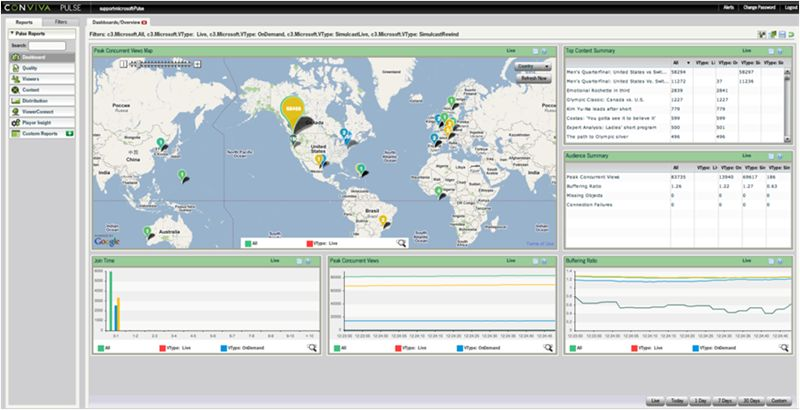](nbc-online-video-monetization-and-highlights-creation-for-the-2010-winter-olympics/_static/image4.jpg)

Figure 2. Conviva Pulse management console gave NBC and its partners real-time insights.

An example of where Conviva technology provided real-time quality control was during the final U.S. hockey game that peaked at 181,000 concurrent viewers. Before the start of the game, there was little data that could predict the size of the audience, so the partners used information that the Pulse management console provided to ensure that the viewer experience was excellent during these games. For instance, Vertigo, the NBC video-player development team, tracked player errors and configuration changes in real time; this was invaluable in ensuring a good viewer experience while ramping up to unprecedented, live-event traffic levels for the Winter Olympics.

## NBC Clip Creation and Ad Insertion

NBC provided an audience of more than 15.8 million unique visitors to its advertising partners. In addition to offering an engaging experience, technology vendors took advantage of Silverlight and IIS Smooth Streaming to develop a way to publish highlight clips faster and to deliver midstream ads.

### About the NBC Silverlight-Based Video Player

California-based Vertigo designed and developed NBC's 2010 Winter Olympics video-player and photo-viewer application. Vertigo built the Silverlight-based video player and photo viewer, playing the video streams coming from iStreamPlanet and Akamai while integrating the data streams and displaying the photos coming from **delta** tre. The video-player code was secured by using PreEmptive Solution's Dotfuscator and had code built in to enable Conviva monitoring. The Vertigo team extended core functionality in the Silverlight Media Framework to incorporate HD video support, DVR-style controls (including "trick plays"), rich data integration, and social-media functionality. Figure 3 illustrates the basic architecture of the player.

[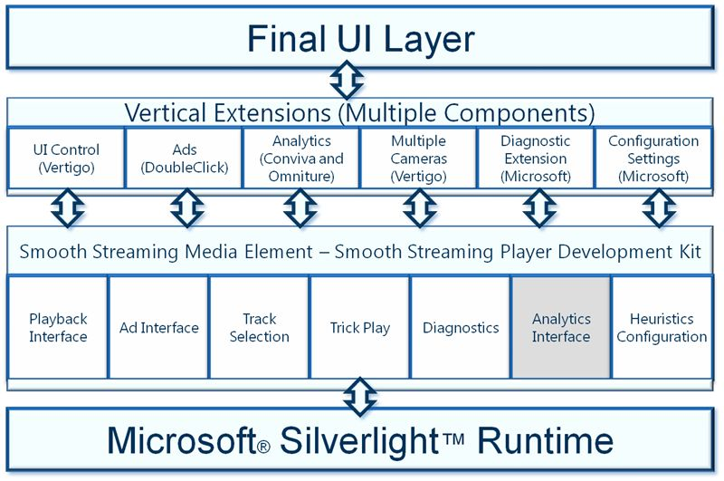](nbc-online-video-monetization-and-highlights-creation-for-the-2010-winter-olympics/_static/image8.jpg)

Figure 3. The architecture for NBC's Silverlight-based video player for the Winter Olympics.

In addition, the Vertigo team built in specific support for playing ads, including integration with DoubleClick, which ensured Interactive Advertising Bureau (IAB)–certified ad delivery. The player "listened" for ad markers through IIS Smooth Streaming.

### The RCE for Clip Creation

**Time to market**: During the Beijing Olympics, NBC needed to place the highlight clip of, say, Michael Phelps' winning a medal available within minutes, because viewers wanted to watch the race again online. If this huge rush of traffic to the site could not be capitalized upon, it was a missed opportunity. NBC took advantage of the Silverlight Rough Cut Editor (RCE), which enabled rapid, light-touch editing of IIS Smooth Streaming video content without the need for re-encoding. By using the RCE during the Winter Olympics, within seconds an editor could mark in and mark out the clip needed and have the clips available within minutes after the event.

**Reduced Cost**: Typically, an editor sitting down at the editing bay to create a clip would use specialized hardware and software that would include high-end editing tools and processes to create an EDL file. The file then went through a transcode process that also involved specialized hardware and software, both of which were expensive. The RCE allowed NBC to take advantage of the web production, where a significant portion of the assets could be reused without the need for use of expensive and specialized equipment. Developed by Southworks, the RCE simplifies the editing and publishing process, enabling real-time, browser-based video editing and providing the ability for publishers to improve collaboration, manage dynamic metadata, and deliver exciting content to the web. Powered by Silverlight, the RCE provides a rich, stutter-free, full-screen editing experience. The RCE has an open and extensible architecture, and it can be integrated into any digital asset management and any encoding or transcoding system that an organization is already using.

Training time associated with the RCE was hence reduced in absence of specialized equipment. In preparation for the Winter Olympics in Vancouver, 50 editors learned how to use the RCE in just three hours.

**Decentralized Production**: To use the RCE, one did not have to be at the editing bay. It could be accessed from anywhere; the editor did not have to be someone who understood highly specialized equipment. The RCE was so easy to use that even senior management folks created clips. The RCE, which was enhanced for the Winter Olympics project, as seen in Figure 4, is a nondestructive editing tool that allows an editor to mark in and mark out sections in the live video feeds, creating a playlist that points toward live video feeds delineating the highlights.

In summary, the RCE was used to create highlights without any need for conforming or transcoding (not the editing and publishing process) and offered NBC a faster workflow to get to market at a lower cost—plus, the workflow provided for a decentralized production model.

[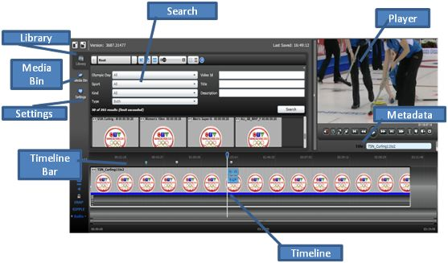](nbc-online-video-monetization-and-highlights-creation-for-the-2010-winter-olympics/_static/image13.jpg)

Figure 4. The RCE user interface.

### How the Player Ingests Composite Manifests

One part of the [Silverlight Media Framework](http://smf.codeplex.com/) is the [IIS Smooth Streaming Client](https://www.iis.net/downloads/microsoft/smooth-streaming), which includes the [SmoothStreamingMediaElement](https://msdn.microsoft.com/library/microsoft.web.media.smoothstreaming.smoothstreamingmediaelement(v=VS.90).aspx) (SSME). This control is the core client-side component for making Smooth Streaming work in Silverlight, and it includes support for a manifest format called the Composite Manifest.

#### Composite Manifest for Clip Creation

A Content Manifest is essentially an XML-based playlist file that defines, and allows Silverlight to play back, cuts-only clips created from one or more longer clips. Using this manifest, the RCE can be used to dynamically take portions of existing streams and then deliver them as "new" Smooth Streaming assets, without going through the process of re-assembling, re-encoding, or trans-muxing the existing streams. For the Winter Olympics project, NBC operators used the RCE and a live, encoded stream of the events to create interesting highlight clips for their viewers to watch within minutes.

As indicated in Figure 5, the fragments from the live stream are not copied and joined together; rather, the start and stop points in the original stream are referenced. When the player plays the clip, each stream is located and played in the order indicated in the Composite Manifest. Although Smooth Streaming files typically delivers fragments that are 2 seconds in duration, the Composite Manifest lets you start and end your clips within the boundaries of any given fragment. This means cuts are not constrained to be made at fixed two-second fragment intervals, but can be nearly frame-accurate.

[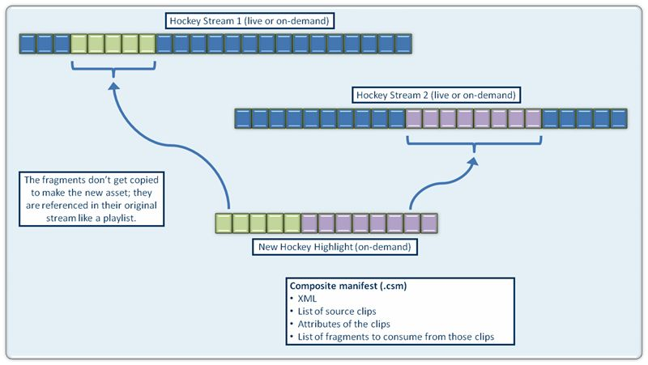](nbc-online-video-monetization-and-highlights-creation-for-the-2010-winter-olympics/_static/image19.jpg)

Figure 5. The composite manifest for a highlights clip.

#### Content Management System Content Manifest Support for the RCE

For NBC, deltatre integrated the RCE directly into the content management system (CMS) to provide a seamless workflow for the editors creating the highlights, as shown in Figure 6. At the end of each editing session, the RCE called web services via the CMS to save an XML-based project file. The editor could then use the CMS to add any necessary metadata associated with the new highlight (for example, a title, description, sport, athletes involved, and so on). When the highlight was ready to be published, the CMS sent the RCE project file to a web service provided by Southworks that transformed the file into a Composite Manifest (.csm) file that was uploaded to the IIS origin server.

[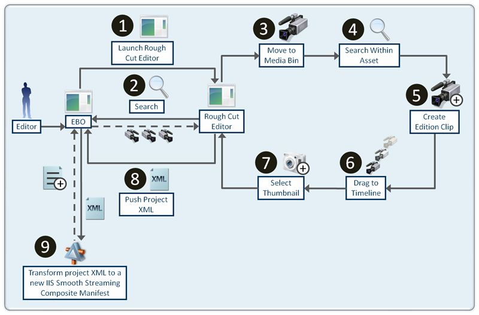](nbc-online-video-monetization-and-highlights-creation-for-the-2010-winter-olympics/_static/image26.jpg)

Figure 6. The operator process for clip creation.

### Inserting Ads

**delta** tre built the NBC Olympics website, using its sports-specific content management system (CMS) for the creation and operation of the site. **delta** tre also managed the real-time results system and synchronized it with live video to offer viewers an engaging, interactive Olympics experience. The Silverlight-based player read and integrated a data feed from **delta** tre that contained play-by-play information, schedules, results, and other Olympics-related statistical information which was integrated, in real time, into the video player.

**delta** tre developed new features in the CMS to give NBC more flexibility in serving ads for live and on-demand videos to maximize commercial value. Midstream ads were inserted both in live streams and in VOD-only offerings, such as high-production-value, file-based highlight reels that were created at NBC's Highlights Factory in Vancouver.

#### Ads Delivered by Using thedeltatre Ad-Insertion Tool

The **delta** tre ad-insertion tool gave ad operators from NBC a fast way to choose a preconfigured "ad pod" and select a precise insertion location in the stream. The tool enabled NBC to place ad markers very precisely in video streams and to change the ads presented at almost any time.

Figure 7 illustrates how the ad-insertion tool worked with the video feeds. The ad operators viewed an undelayed live feed to determine where to place the ad markers.

[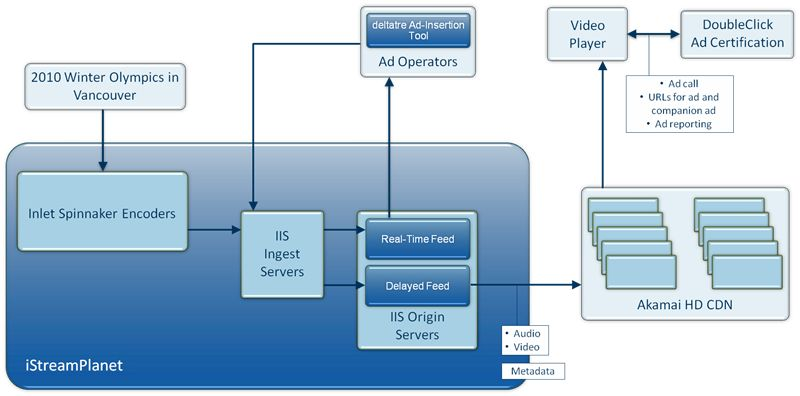](nbc-online-video-monetization-and-highlights-creation-for-the-2010-winter-olympics/_static/image34.jpg)

Figure 7. The ad-insertion process for NBC Olympics live programming.

In the live setting, an operator clicked the appropriate button that represented the template type while watching the undelayed feed to choose the correct moment to start the ad pods, as seen in Figure 8. This action triggered a metadata injection into the live stream, which was pushed to the content delivery network (CDN) and then to the video player. The video player read the template and then executed DART.

[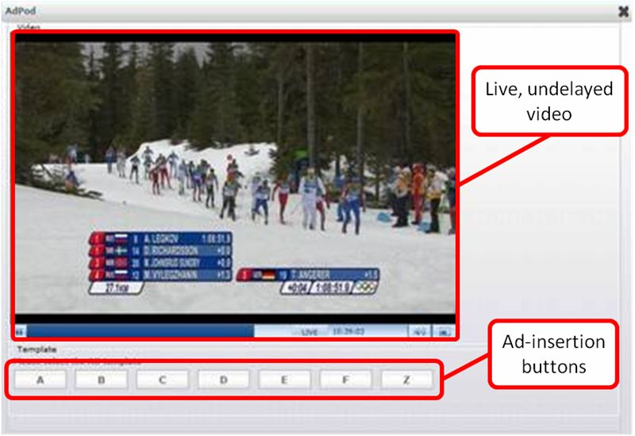](nbc-online-video-monetization-and-highlights-creation-for-the-2010-winter-olympics/_static/image43.jpg)

Figure 8. The ad-insertion tool has seven buttons on the bottom that refer to predetermined ad templates (for example, 15-second spots might be the "A" template and 30-second spots might be the "B" template).

After the video and its associated ads were available for VOD, the ads could be replaced by performing a similar process. In this case, the tool would insert an addendum to the manifest, which indicated which ad should be replaced and which ad template to use instead.

#### Ad Logic

The IIS Smooth Streaming support for in-stream data feeds made implementing ads straightforward. The ad information was delivered directly into the video's manifest, and business logic—which was built into the player— defined whether the player would play the ad. For example a basic rule could be set that if a viewer had seen an ad in the last 3 minutes, an ad would not be served again. If a viewer rewound, he would not be served ads if he has seen one in the last 3 minutes, while another viewer would be served ads again if he had not seen an ad in the last 3 minutes.

#### Ad Templates

Ad types and opportunities were well defined early in the process to meet IAB standards and to meet the business goals of NBC. The majority of the ads were 30-second clips, but some were 15-second and 60-second clips.

The following code snippet is an example of the two templates that were used for the Winter Olympics video player:

- TemplateType is just a string identifier.
- Each TemplateType can be separated into live and VOD variants.
- Each Item identifies an ad. 

    - Duration is the estimated duration (in ticks).
    - KeyValuePairs can be used to add any number of additional tags that are added to the DART call (trafficking).

##### *Code snippet – Ad template example*

[!code-xml[Main](nbc-online-video-monetization-and-highlights-creation-for-the-2010-winter-olympics/samples/sample1.xml)]

#### Ads Delivered in VOD

NBC inserted ads for three different VOD scenarios, including using RCE highlights, archives of live streams, and encores (long-form replays of ads on TV).

#### Ads by Using the RCE

Ads for VOD-only deliverables were produced by using the RCE, as shown in Figure 9. When creating RCE highlights, editors would create markers on the timeline for the location where the ads should be inserted. The resulting RCE project file would be sent to a manifest generator that produced a composite manifest (.csm) file that included metadata for locations of the ad insertions. The Silverlight-based video player would play the ads based on this metadata information.

Figure 9. VOD workflow using the RCE.

#### Ads in "Rewinds"

NBC delivered full event "rewinds," which were full event archives of previous live streams. In this case, the **delta** tre CMS had already injected the metadata that included the ad-insertion points during the live stream. Figure 10 illustrates the workflow of how the rewind video existed on the VOD origin server at the end of an event. To insert a new ad or replace ads, the CMS created an addendum to the composite manifest based on the inputs from the editor, which is merged with the video at the Silverlight-based video player.

Figure 10. Workflow for ad insertion for rewind videos.

#### Ads in "Encores"

Ads were also inserted into the file-based, high-quality highlights VOD content created by the NBC Highlights Factory in Vancouver. For these "encore" clips, the Highlights Factory used high resolution OBS master material and then created either cut-only edits or more complex material for glossier pieces that included a voice-over, graphics, and transitions. Examples of these pieces included presentations of events after they were broadcast on TV, such as the opening ceremonies. As shown in Figure 11 the clips were encoded only after they were approved and were published through the **delta** tre CMS

[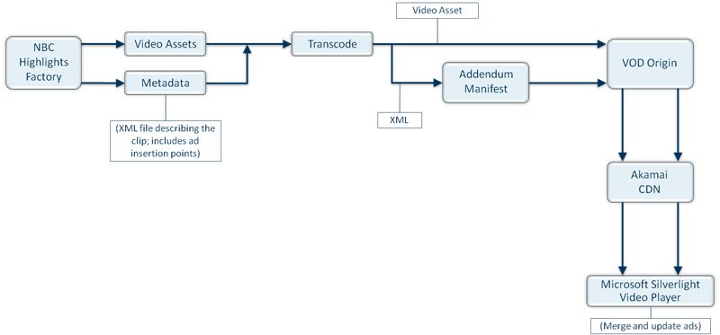 Figure 11. Ad workflow for encore highlight videos. Figure 12 illustrates an example of how ad markers were incorporated in high production quality VOD encores. [[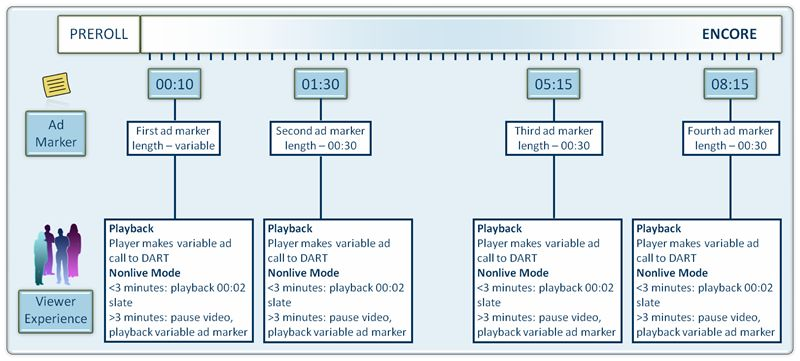](nbc-online-video-monetization-and-highlights-creation-for-the-2010-winter-olympics/_static/image90.jpg) Figure 12. Example of ad marker incorporation into an encore highlights video. ### Monitoring Ads An inverse correlation exists between advertising and viewership, so broadcasters strive for an optimum balance between popularity of content and the number of ads they can serve without losing viewers. As seen in Figure 13, Conviva's real-time insights allowed monitoring of the real-time experience of the viewers of the live stream and on-demand content. This helps to deliver ads at an optimum level. For example, if more ads are scheduled and the broadcaster sees a drop in viewership, the number of ads scheduled can be decreased. Before the start of a game, typically, the broadcasters estimated the size of an audience and scheduled ad inventory. By using Conviva's real-time insights, the broadcasters were able to dynamically manage ad inventory depending on the viewership throughout the game. [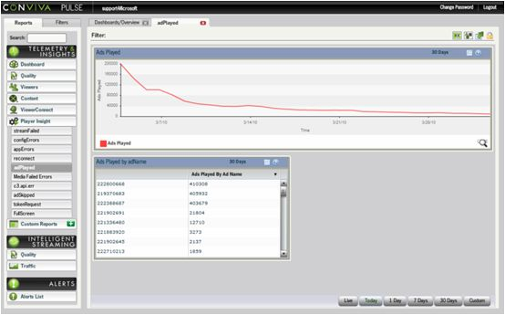](nbc-online-video-monetization-and-highlights-creation-for-the-2010-winter-olympics/_static/image92.jpg) Figure 13. The Conviva Pulse management console, monitoring ads skipped and ads played, among other things. Features of real-time monitoring enabled the broadcasters to understand whether the ads were being delivered as planned. When an ad was skipped, the broadcasters knew where, when, and which ad had been passed over and they used these insights to make adjustments. Features include the following: - **WithinMidrollTimer**: Indicates that an ad was skipped within a midroll. By looking at the console, a broadcaster could determine whether the midroll ad had been played or skipped. - **Ad Playing**: Indicates that an ad that is playing has been skipped. By looking at the console, one can determine whether the ad playing reached completion or was skipped. - **Scheduling**: Indicates that ads that have been scheduled to appear have been skipped. By looking at the console, a broadcaster could determine whether the scheduled ad had been played or skipped. - **WithinPreRollTimer**: Indicates that the preroll ad that appeared prior to an online video had been skipped. By looking at the console, a broadcaster could determine whether the preroll ad had played or not. ## Conclusion NBC, CTV, and NRK wanted to attract more viewers to their 2010 Winter Olympics in Vancouver websites by offering compelling, immersive experiences that would support a more sophisticated approach to advertising. The three broadcasters and their partners used IIS Smooth Streaming and Silverlight technologies to employ an ad and video delivery platform that offered a flexible workflow with support for dynamic ad insertion based on real-time telemetry. By using these exciting technologies, the broadcasters were able to: - Create a compelling experience that increased traffic. - Employ flexible, sophisticated ad integration. - Deliver highlights faster The three broadcasters found that the combination of the IIS Smooth Streaming technology and Silverlight helped them to monetize their coverage of the Winter Olympics in more and varied ways than past events. Inserting ads midstream without disrupting the viewer experience created more opportunities for NBC, CTV, and NRK to offer to their advertising partners. Meanwhile, the RCE helped the broadcasters to deliver highlights to fans faster while saving money on production. Combined, the broadcasters delivered the following totals: - A total of 300 events, 86 of which were medal events - 12.6 million hours of video streamed - 10.76 petabytes of video delivered - 83.7 million video streams - 20.92 million unique video visitors ## Resources - [NBC Streams 4.4 Million Hours of Olympics Video, Delivers Midstream Ads](https://www.microsoft.com/casestudies/Case_Study_Detail.aspx?casestudyid=4000007258 "NBC 2010 Olympics Online Video Case Study") - [NRK Captures Gold for High-Quality Winter Olympics Coverage, More Than 1 in 4 Norwegians Tune in Online](https://www.microsoft.com/casestudies/Case_Study_Detail.aspx?casestudyid=4000007275 "NRK 2010 Olympics Online Video Case Study") - [CTV Streams 6.2 Petabytes of Winter Olympics To over 3.9 Million Visitors, Making Every Second Count](https://www.microsoft.com/casestudies/Case_Study_Detail.aspx?casestudyid=4000007347 "CTV 2010 Olympics Online Video Case Study") - Composite Manifest Support for Rough Cut Editing scenarios in SSME: [blogs.iis.net/vsood/archive/2010/01/22/composite-manifest-support-for-rough-cut-editing-scenarios-in-ssme.aspx](https://blogs.iis.net/vsood/archive/2010/01/22/composite-manifest-support-for-rough-cut-editing-scenarios-in-ssme.aspx "Composite Manifest Support for Rough Cut Editing scenarios in SSME") - Streaming the Olympics: How We Got Here: [blogs.iis.net/alexzam/archive/2010/02/16/streaming-the-olympics-how-we-got-here.aspx](https://blogs.iis.net/alexzam/archive/2010/02/16/streaming-the-olympics-how-we-got-here.aspx "Alex Zambelli blog post - Streaming the Olympics - How We Got Here") - Introducing the Silverlight Rough Cut Editor (video from MIX 10): [live.visitmix.com/MIX10/Sessions/CL26](http://live.visitmix.com/MIX10/Sessions/CL26 "MIX10 - Introducing the Silverlight Rough Cut Editor") - [Delivering Live and On-Demand Smooth Streaming](../smooth-streaming/delivering-live-and-on-demand-smooth-streaming-istreamplanet.md "Delivering Live and On-Demand Smooth Streaming"), a deployment guide, presented by iStreamPlanet and Microsoft ### Microsoft Silverlight Microsoft Silverlight is a cross-browser, cross-platform plug-in for delivering the next generation of .NET-based media experiences and rich interactive applications for the web and mobile devices. Fully supported by Visual Studio and Expression Blend, Silverlight includes major media enhancements, out-of-browser support for web applications on the desktop, smooth streaming capabilities, browser ubiquity, graphics processing unit (GPU) acceleration, and support for 3-D graphics and H.264 video. For more information about Silverlight, visit [www.microsoft.com/silverlight](https://www.microsoft.com/silverlight "Microsoft Silverlight") and for resources, visit [www.silverlight.net](http://www.silverlight.net/ "Silverlight Community"). ### Silverlight Media Framework The open-source Silverlight Media Framework from Microsoft enables developers to quickly deploy a robust, scalable, customizable media player for IIS Smooth Streaming delivery. The framework builds on the core functionality of the IIS Smooth Streaming Client. For more information about the Silverlight Media Framework, visit [smf.codeplex.com](http://smf.codeplex.com/ "Silverlight Media Framework"). ### Silverlight Rough Cut Editor The Silverlight Rough Cut Editor is a standalone component proxy and metadata editing solution that allows end users to collaborate on and edit IIS Smooth Streaming content in a cross-platform web browser experience. For more information about the Silverlight Rough Cut Editor, visit [rce.codeplex.com](http://rce.codeplex.com/ "Silverlight Rough Cut Editor"). ### IIS Media Services IIS Media Services is an integrated HTTP-based media delivery platform that delivers true HD (720p+) live and on-demand streaming, DVR functionality, and real-time analytics support to computers, TVs, and mobile devices. It offers a complete multi-format media delivery platform built on a proven Web server, allowing the management of highly immersive websites from a single Web platform. IIS Smooth Streaming is one of the features of IIS Media Services. For more information about IIS Media Services, visit [www.iis.net/media](https://www.iis.net/media "IIS Media Services"). The information contained in this document represents the current view of Microsoft Corporation on the issues discussed as of the date of publication. Because Microsoft must respond to changing market conditions, it should not be interpreted to be a commitment on the part of Microsoft, and Microsoft cannot guarantee the accuracy of any information presented after the date of publication. This white paper is for informational purposes only. MICROSOFT MAKES NO WARRANTIES, EXPRESS OR IMPLIED, IN THIS DOCUMENT. ## Appendix: Partners Partners involved with the NBC online coverage of the Winter Olympics in Vancouver include: - **iStreamPlanet**. iStreamPlanet has created a variety of managed and hosted services for getting content onto the web. Its nationwide footprint of webcast producers, each with many years of experience in producing the largest webcasts, makes the process of putting live events on the web painless. iStreamPlanet also has strategically located, specially equipped encoders and satellites and fiber-optic content acquisition facilities to reduce the costs of getting content to the web. - **Inlet Technologies**. Through innovative solutions for media preparation that combine striking video quality with surprising simplicity and reliability, Inlet Technologies enables customers to expand audiences and realize greater value from content. - **Vertigo**. Vertigo is a Microsoft Gold Certified Partner that provides design and development assistance by using the latest Microsoft technology to redefine the human and computer interface. - **deltatre**. **delta** tre is a sports media services company that provides operational, technology, and consulting services for broadcast, web, results, graphics, and sports business processes. With more than 300 staff in Turin, Italy; London, England; Lausanne, Switzerland; and Paris, France, and 24 years of experience at the highest level of international sports, **delta** tre has the resources to take on the biggest challenges in the world of sports. - **Akamai**. Akamai is the leading global service provider for accelerating content and business processes online. The company has created a digital operating environment for the web. Its global platform of thousands of specially equipped servers helps the Internet withstand the crush of daily requests for rich, dynamic, and interactive content, transactions, and applications. When delivering on these requests, Akamai detects and avoids Internet problem spots and vulnerabilities to ensure that websites perform optimally, media and software download flawlessly, and applications perform reliably. - **Conviva**. Conviva was founded in 2006 by Dr. Hui Zhang and Dr. Ion Stoica to deliver the highest-quality video experience for both viewers and premium-content owners. Backed by Foundation Capital, NEA, and UV Ventures, Conviva's express purpose is to optimize the experience and economics of online video while providing content owners real-time insights. - **Wintellect**. Wintellect is a consulting, debugging, and training firm that specializes in the .NET Framework and Windows technologies. The company's mission is to help companies build better software, faster. Three developers—Jeff Prosise, Jeffrey Richter, and John Robbins—and businessman Lewis Frazer founded the company in spring 2000. - **PreEmptive Solutions**. PreEmptive Solutions was founded in 1996 and is the market leader in .NET Framework–based and Java application–hardening and runtime-intelligence solutions. The company's commercial products are used by thousands of organizations around the world and, through a unique multiyear OEM agreement with Microsoft, are available to more than 6 million developers through integration with Visual Studio. - **Southworks**. Southworks is a software development company that provides consulting and development services for Fortune 50 companies around the world. - **DoubleClick**. DoubleClick is a provider of digital marketing technology and services. The world's top marketers, publishers, and agencies take advantage of DoubleClick's expertise in ad serving, rich media, video, search, and affiliate marketing to help them make the most of the digital medium. [Discuss in IIS Forums](https://forums.iis.net/1145.aspx)](nbc-online-video-monetization-and-highlights-creation-for-the-2010-winter-olympics/_static/image89.jpg)](nbc-online-video-monetization-and-highlights-creation-for-the-2010-winter-olympics/_static/image76.jpg)