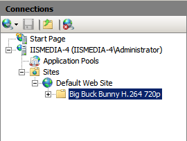
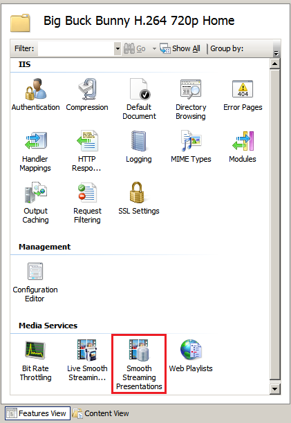
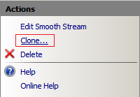
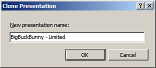
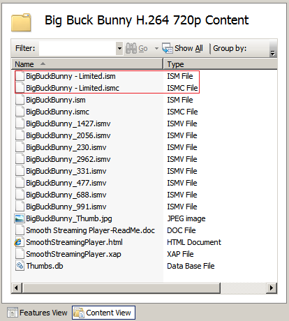
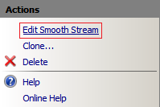
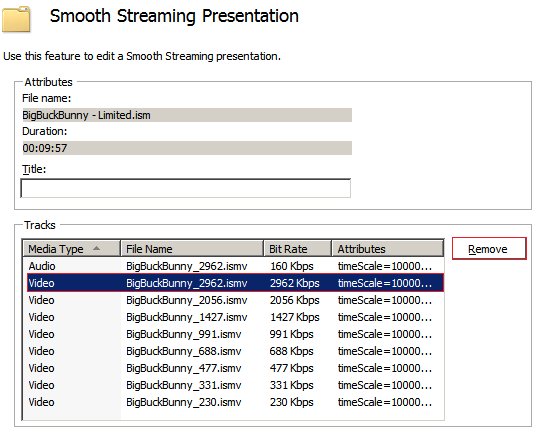
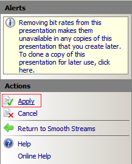

Managing On-Demand Presentations
====================
by Dave Nelson

Applies To: IIS Media Services 4.0

You can clone your on-demand Smooth Streaming presentations in order to make different sets of bit rates available to your audience. For example, if you want to save bandwidth costs, you can remove the highest available bit rate from a cloned presentation in IIS Manager. In specialized content-delivery scenarios, you can clone a presentation and remove the higher bit rates to make the presentation available as a free sample, while using the default presentation, which includes all of the original bit rates, for a premium channel.

- [Prerequisites](managing-on-demand-presentations.md#requirements)
- [Viewing the Tracks in a Smooth Streaming Presentation](managing-on-demand-presentations.md#tracks)
- [Cloning a Smooth Streaming Presentation](managing-on-demand-presentations.md#clone)
- [Saving Bandwidth Costs by Limiting the Maximum Bit Rate](managing-on-demand-presentations.md#bitrate)

## Prerequisites

The scenarios in this article require a Smooth Streaming Web server. Follow the steps in [Getting Started with IIS Smooth Streaming](getting-started-with-iis-smooth-streaming.md) to set up a Smooth Streaming Web server and to deploy Smooth Streaming sample content.

## Viewing the Tracks in a Smooth Streaming Presentation

The **Smooth Streaming Presentations** page in IIS Manager is useful for displaying the Smooth Streaming presentation files in a directory at a glance. To open the **Smooth Streaming Presentations** page in IIS Manager, do the following:

1. In the **Connections** pane, click the directory where you deployed the sample content.  
    
2. In the **Features View** pane, under **Media Services**, double-click the **Smooth Streaming Presentations** icon.  
    

As shown in the following figure, the **Smooth Streaming Presentations** page displays a summary of the video and audio bit rates available in each presentation.  

## Cloning a Smooth Streaming Presentation

Cloning a presentation is useful if you want to make an alternate version of your presentation that has a different set of bit rates available to your audience. To clone a Smooth Streaming presentation, do the following:

1. Select a presentation in the **Smooth Streaming Presentations** page (described in the [previous section](managing-on-demand-presentations.md#tracks)), and then in the **Actions** pane, click **Clone**.  
    
2. In the **Clone Presentation** dialog box, enter a new name for the cloned presentation (for example, **BigBuckBunny - Limited**), and then click **OK**.  
    

The cloned presentation is displayed in the **Smooth Streaming Presentations** page.  

Cloning creates a version of a presentation that shares the presentation metadata without making a deep-copy of the media (.ismv) files. You can observe this behavior by selecting the **Content View** tab for the presentation in IIS Manager. The following figure shows that .ism and .ismc files have been created for the cloned presentation, and that the original and cloned presentations share the same set of media files.  

To make the cloned presentation available to clients, do the following:

1. In a text editor, such as Notepad, open SmoothStreamingPlayer.html and update the **mediaurl** attribute value with the fully qualified URL of the cloned on-demand Smooth Streaming presentation server manifest (.ism) file. In our example, this value is:  

    [!code-console[Main](managing-on-demand-presentations/samples/sample1.cmd)]
2. Navigate your Web browser to `http://localhost`**/Big Buck Bunny H.264 720p/SmoothStreamingPlayer.html**.  

    > [!NOTE]
    > If you stored the sample content in a different content directory, substitute its URL appropriately. To view the content from a remote computer, substitute the server name for **localhost**.

## Saving Bandwidth Costs by Limiting the Maximum Bit Rate

You can save bandwidth by removing the highest available bit rate for the presentation in IIS Manager. To do this, do the following:

1. In the **Smooth Streaming Presentations** page, select the **BigBuckBunny - Limited.ism** presentation.  
    
2. In the **Actions** pane, click **Edit Smooth Stream**.  
    
3. In the **Smooth Streaming Presentation** page that appears, select the video track with the highest bit rate value (**2962 Kbps**), and then click **Remove**.  
    
4. In the **Actions** pane, click **Apply**.  
    

You can repeat this process and remove additional high bit rate values, leaving only the lower bit rates available as a free sample. You can use the original presentation file, which includes all of the original bit rates, and make them available to clients through a premium channel.