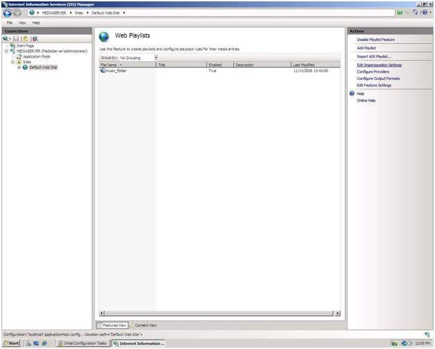
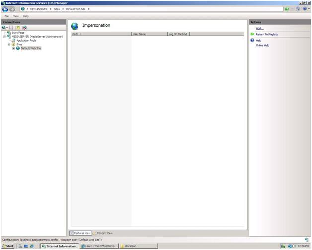
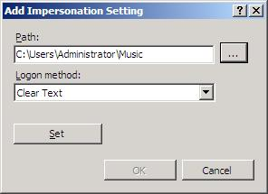
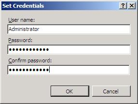
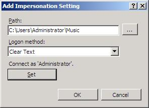
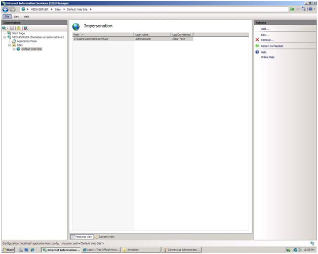

Web Playlists for IIS 7 - Serving Media Content From User Folders
====================
by Dave Nelson

You can serve media assets referenced in Web playlist files (files with .isx file name extensions), provided that the files are stored in folders on the Web server computer that can be accessed by the Web Playlists feature. By default, these folders include the Web site root (&lt;*systemdrive*&gt;\inetpub\wwwroot). If you want to serve media assets stored in your user account folders (for example, music files stored in &lt;*systemdrive*&gt;\Users\&lt;*username*&gt;\Music&gt;, you can create impersonation credentials in the Web Playlists feature to enable Web Playlists to connect to the media assets under the context of an authenticated Windows client. This allows you to maintain one set of media files that you can serve to customers, rather than creating copies of the files in the Web site root.

This article describes how to provide folder access to Web Playlists so that you can reference media files that reside outside of the Web site root in Web playlists (.isx) files. The procedure in this article uses the **Music** folder on the local Web server as an example; however, you can use the procedure for any folder on the local Web server computer that stores media assets. For more information about adding media assets to Web playlist files, see [IIS Media Services](https://www.iis.net/media) Help.

## Impersonating user account credentials

Web Playlists can access folders by using the credentials for local user accounts that have at least **Read** access to the folder. To allow Web Playlists to access the **Music** folder on your Web server, perform the following procedure.

**To impersonate user account credentials**

1. In Web Playlists, in the **Actions** pane, click **Edit Impersonation Settings**.  
    
2. In the **Impersonation** feature page, in the **Actions** pane, click **Add**.  
    
3. In the **Add Impersonation Setting** dialog box, do the following:  
      

    1. In **Path**, enter the path of the folder that you want Web Playlists to access (for example, enter **C:\Users\&lt;*username*&gt;\Music**). You can also use the **Browse** button to enter the path.
    2. In **Logon method**, select **Clear Text**.
    3. Click **Set**.
4. In the **Set Credentials** dialog box, enter user account logon credentials (user name and password) for an account that has at least **Read** access to the folder.  
    
5. In the **Add Impersonation Setting** dialog box, click **OK**.  
    

The impersonation setting is added to the **Impersonation** feature page in Web Playlists.

The example procedure in this article created impersonation credentials in the Web Playlists feature to enable Web Playlists to connect to media assets stored in the **Music** folder under the context of local Administrator account; however, you can use the local account credentials for any authenticated Windows client that has at least **Read** access to the folder.

You can add media assets stored in the **Music** folder (or in another user folder) to a Web Playlist (.isx) file; however, Web Playlists cannot download these assets to clients until you complete the above procedure. For more information about adding media assets to Web playlist (.isx) files, see [IIS Media Services](https://www.iis.net/media) Help.
  
  
[Discuss in IIS Forums](https://forums.iis.net/1145.aspx)