DotNetNuke
====================
by [Simon Tan](https://github.com/simtan)

## Introduction

DotNetNuke is an open source content management system (CMS) and application development framework for Microsoft .NET. For more information about DotNetNuke, refer to the [DotNetNuke](http://www.dotnetnuke.com/) Web site. For step-by-step instructions on installing this application in an IIS environment, see the *Procedure* section of this document.

## Requirements

For information about technical requirements for your IIS environment, refer to [Install Server Components](../../web-hosting/joining-the-web-hosting-gallery/install-server-components.md).

## Procedure

### Step 1. Install the application in an IIS test environment.

To install the application, you can use Web Platform Installer or WebMatrix. These procedures are described in this step.

#### Web Platform Installer

The Microsoft Web Platform Installer 2.0 (Web PI) is a free tool that allows you to easily install and run the most popular free web applications for blogging, content management and more with the built-in Windows Web Application Gallery. For more information about Web PI, refer to the [Microsoft Web Platform Installer 2.0](https://www.microsoft.com/web/downloads/platform.aspx) Web site.

To use Web PI to install this application, complete these steps:

1. From the Windows Start menu, click **Programs**, and then click **Web Platform Installer**.  
  
 The Web Platform Installation window appears.  
    [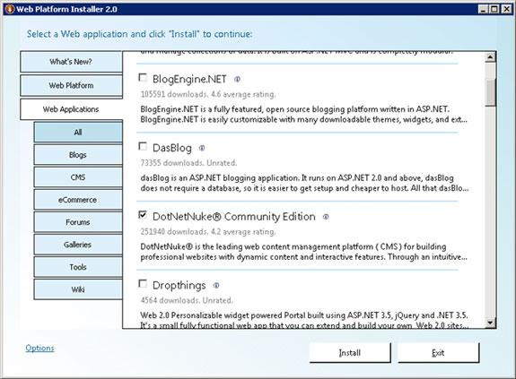](dotnetnuke/_static/image1.jpg)
2. Click the **Web Applications** tab, select the **DotNetNuke Community Edition** check box, and click **Install**.  
    [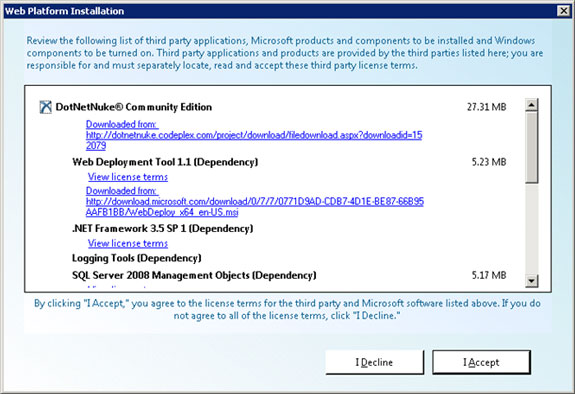](dotnetnuke/_static/image3.jpg)
3. Select the **DotNetNuke Community Edition** check box, and click **I Accept**.  
    
4. Select **Mixed Mode Authentication**, enter a password, and click **Continue**. 

    Once the preinstallation steps complete, the site information window appears.  
[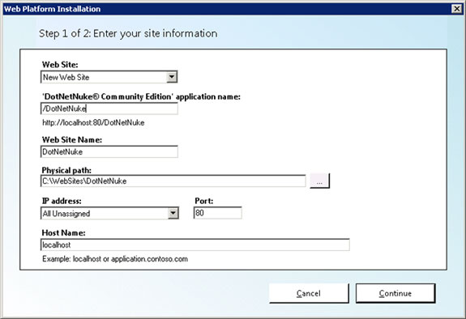](dotnetnuke/_static/image7.jpg)
5. In the Web Site list, click **New Web Site**.
6. Enter an application name in the application name field.
7. Enter a web site name in the Web Site Name field.
8. Enter a physical path in the Physical path field.
9. In the IP address list, click **All Unassigned**, and enter **80** in the Port field.
10. Enter a host name in the Host Name field, and click **Continue**.  
  
 Once the installation process completes, the final installation window appears.  
    [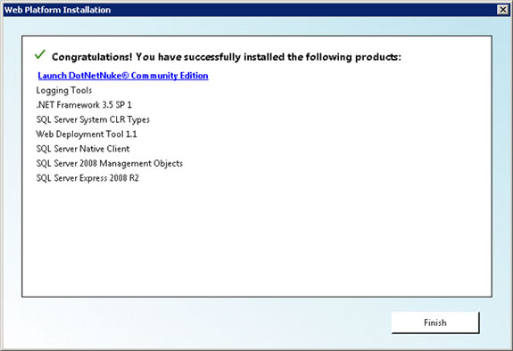](dotnetnuke/_static/image9.jpg)
11. Click **Finish**.  
  
 The DotNetNuke Installation Wizard web page appears.   
    [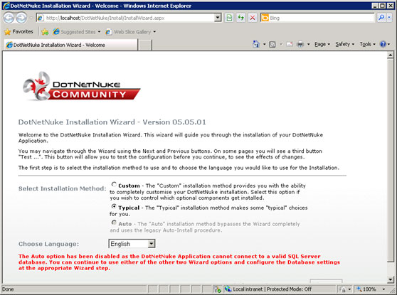](dotnetnuke/_static/image11.jpg)
12. On the DotNetNuke Installation Wizard web page, select an installation method, choose your language, and click **Next**.  
  
 The Checking File Permissions web page appears.  
    [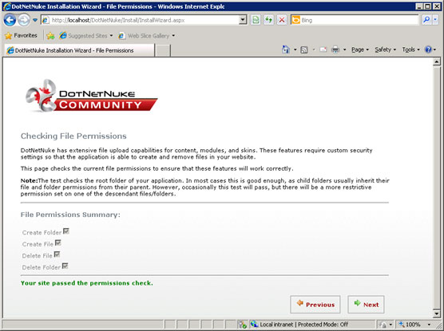](dotnetnuke/_static/image13.jpg)
13. Once your site passes the permissions check, click **Next**.  
  
 The Configure Database Connection web page appears.  
    [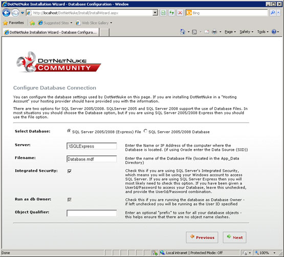](dotnetnuke/_static/image15.jpg)
14. Select the type of database.
15. Enter the name or IP address of the computer where the database is located.
16. Enter the name of the database file.
17. Click the **Integrated Security** check box.
18. Click **Next** to complete the installation.

#### WebMatrix

WebMatrix is a free, easy way to customize and build Web sites from popular open-source applications, such as WordPress, Drupal, and Joomla. In addition, you can build sites from the ground up using ASP.NET, PHP, HTML and a number of other leading technologies. For more information about WebMatrix, refer to the [WebMatrix](https://www.microsoft.com/web/webmatrix/) Web site.

To use WebMatrix to install this application, complete these steps:

1. Launch WebMatrix.  
  
 The WebMatrix home page appears.  
    [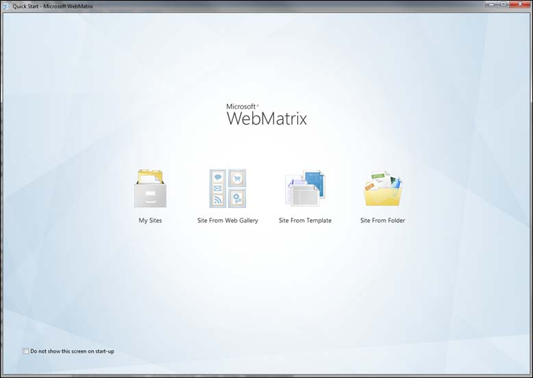](dotnetnuke/_static/image17.jpg)
2. Click **Site From Web Gallery**.  
  
 The Site From Web Gallery page appears.    [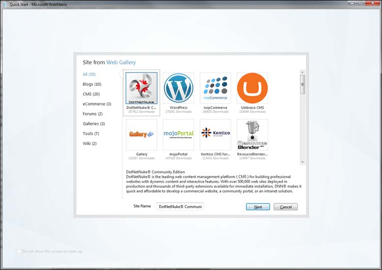](dotnetnuke/_static/image19.jpg)
3. Click **DotNetNuke**, and then click **Next**.  
  
 The Accept EULA page appears.  
    [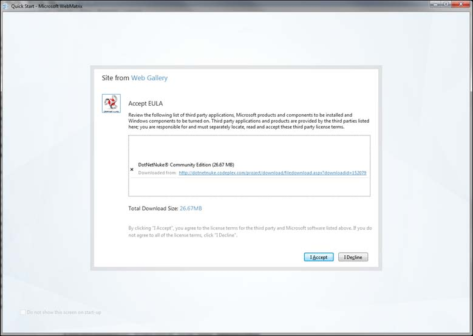](dotnetnuke/_static/image21.jpg)
4. Click **I Accept** to agree to the end-user license agreement.  
  
 WebMatrix installs the DotNetNuke software on your local computer. This page appears once installation is complete.  
    [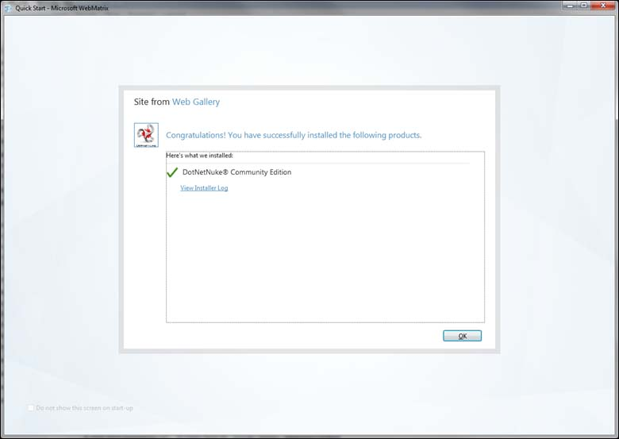](dotnetnuke/_static/image23.jpg)
5. Click **OK**.   
  
 The DotNetNuke application starts as indicated in bottom-left corner of the page.  
    [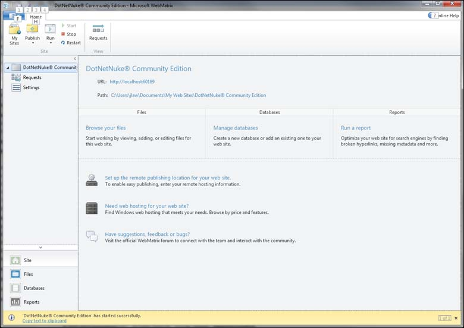](dotnetnuke/_static/image26.jpg)
6. Click **Settings** in the left navigation area.  
  
    [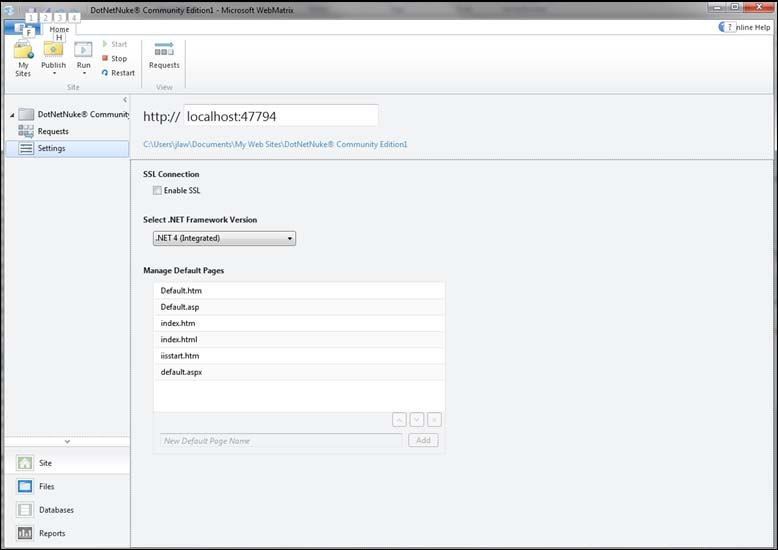](javascript:void(0);)
7. Select **.Net 4 (Integrated)** from the Select .NET Framework Version drop-down list.
8. Select **Publish &gt; Configuration**.  
  
 The Publishing Settings dialog box appears.  
    [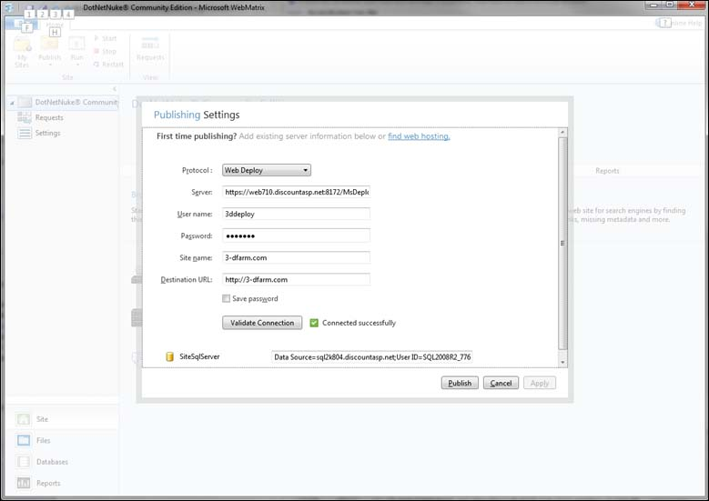](dotnetnuke/_static/image31.jpg)
9. Add your hosting provide and domain-specific information, and click **Validate Connection**.
10. If the connection was successful, click **Apply**, and then click **Publish**.  
  
 WebMatrix determines changes to be made.  
    [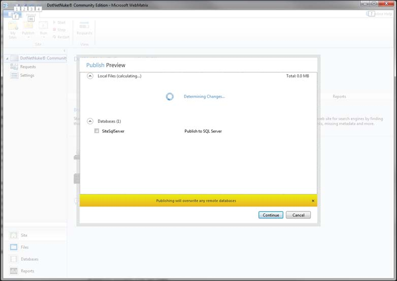](dotnetnuke/_static/image33.jpg)
11. Once changes have been determined, check the **Publish to SQL Server** check box, and click **Continue**.  
  
 Once the process completes, the Publish Preview dialog box appears.  
    [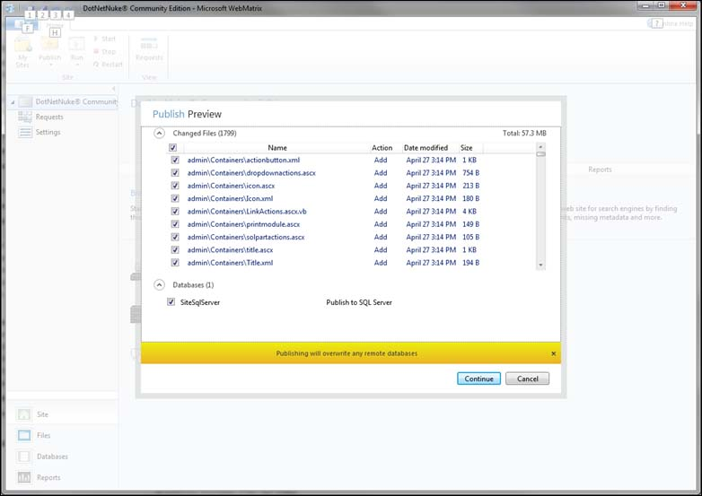](dotnetnuke/_static/image35.jpg)
12. Click **Continue**.  
  
 The status of the publishing process is indicated in the bottom-left corner of the page.  
    [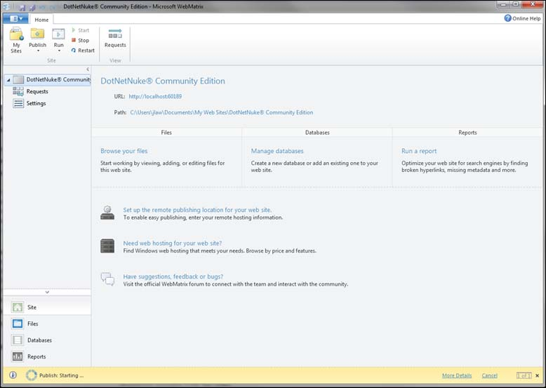](dotnetnuke/_static/image39.jpg)
13. Once publishing is complete, go to your domain, and verify DotNetNuke is running.  
    [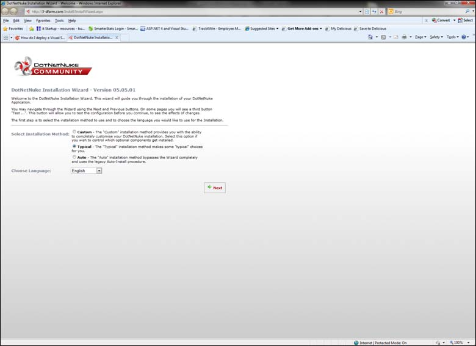](dotnetnuke/_static/image41.jpg)

### Step 2. Build the application package from the IIS site.

To build the application package from the IIS site, complete the steps described in [Export a Package through IIS Manager](../using-web-deploy/export-a-package-through-iis-manager.md).

### Step 3. Install the application on the target server.

To install the application on the target server, complete the steps described in [Import a Package through IIS Manager](../using-web-deploy/import-a-package-through-iis-manager.md).