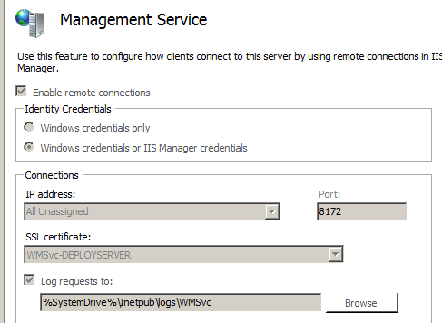
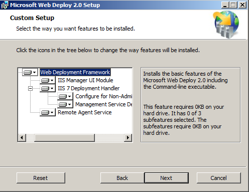
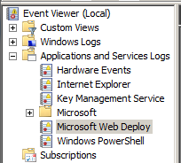

Troubleshooting Web Deploy problems with Visual Studio
====================
by [Apurva Joshi](https://github.com/apurvajo)

#### Tools Used in this Troubleshooter:

- NA

This material is provided for informational purposes only. Microsoft makes no warranties, express or implied.

## Overview

The steps below walk through the series of errors you are likely to encounter when trying to publish from Visual Studio to a server that has not been correctly configured via Web Deploy. To collect the screenshots and errors below, I used a new ASP.Net MVC 3 project in Visual Studio 2010 SP1. The destination server was a clean install of Windows Server 2008 R2 SP1 with IIS. No additional configuration was done.

## "Unable to connect" errors

The first error you are likely to encounter will look something like the screenshot below in Visual Studio's output window. To make it easier to read, the full text of the message is reproduced below the screenshot.

[!code-console[Main](troubleshooting-web-deploy-problems-with-visual-studio/samples/sample1.cmd)]

[!code-console[Main](troubleshooting-web-deploy-problems-with-visual-studio/samples/sample2.cmd)]

[!code-console[Main](troubleshooting-web-deploy-problems-with-visual-studio/samples/sample3.cmd)]

[!code-console[Main](troubleshooting-web-deploy-problems-with-visual-studio/samples/sample4.cmd)]

[!code-console[Main](troubleshooting-web-deploy-problems-with-visual-studio/samples/sample5.cmd)]

The text highlighted in this error (and the other errors below) is the key to understanding the nature of the problem. Web Deploy did not get a reply from the server, so Visual Studio cannot distinguish between several possible causes. As a result, it gives a list of things to try.

Is the web management service installed? On the IIS server, open the Internet Information Services Manager and select the machine name node. In the Features view, scroll down to the Management section and look for these Icons:

If they are not there, you need to install the Management Service through the Add Role Services dialog. It can also be installed via the Web Platform Installer from the products tab. Select Server in the left column and choose IIS: Management Service. Note that after you install the Management Service, you will need to start it, as it is not started automatically. To do this, double-click the Management Service icon. After the Management Service pane is displayed, click Start in the Actions pane on the right.

Has the web management service been allowed through Windows Firewall? When you install the Web Management Service on the server, an inbound firewall rule named Web Management Service (HTTP Traffic-In). Verify this rule is enabled by going to Start-&gt;AdministrativeTools-&gt; Windows Firewall with Advanced Security. Click Inbound Rules and find the Web Management rule in the list. It should be enabled for all profiles. If you are using a 3rd party firewall, you need to ensure inbound connections on port 8172 are allowed.

**Is the service URL correct?**

By default, the Web Management Service listens on port 8172, but this can be changed. The easiest way to check what port is being used is to open the Management Service pane as described above, and look at the IP and port information in the Connections section. If the port has been changed to something other than 8172, you will need to ensure the new port is allowed through the firewall, and update the service URL in Visual Studio's publishing settings to use the new port.

[!code-console[Main](troubleshooting-web-deploy-problems-with-visual-studio/samples/sample6.cmd)]

[!code-console[Main](troubleshooting-web-deploy-problems-with-visual-studio/samples/sample7.cmd)]

[!code-console[Main](troubleshooting-web-deploy-problems-with-visual-studio/samples/sample8.cmd)]

This message is somewhat misleading. It states that the server did not respond, but the 403 error indicates that Web Deploy could contact the server, but the request was actively refused. The HTTP log for the Web Management Service can help confirm the request reached the server, and provide details about the actual request that failed. This log can be found at %SystemDrive%\Inetpub\logs\WMSvc by default. Like other IIS logs, data is not written to the log immediately, so you may have to wait a couple minutes to see the request, or restart the Web Management Service to flush the log.

In the WMSVC log, the error above looks like

[!code-console[Main](troubleshooting-web-deploy-problems-with-visual-studio/samples/sample9.cmd)]

The "6" after the 403 in the log is the substatus code, and means "IP address rejected". (A complete list of the status and substatus codes for IIS can be found at [https://support.microsoft.com/kb/943891](https://support.microsoft.com/kb/943891)

**Is the Management Service configured to allow remote connections?**

This is the most likely reason for the 403.6 response. Double click the Management Service icon, and verify that Enable Remote Connections is checked. You must stop the service to make changes, so be sure to restart it when you are done.

**Have IP restrictions been configured for the Management Service?**

The other common reason you could get a 403 error is if the management service has been configured to deny the IP of the client. By default, it is configured to allow all IPs as long as remote connections are allowed. You can check for IP restrictions by double-clicking the Management Service icon. Any configured IP restriction rules will be at the bottom of the page, in the IPv4 Address Restrictions

[!code-console[Main](troubleshooting-web-deploy-problems-with-visual-studio/samples/sample10.cmd)]

[!code-console[Main](troubleshooting-web-deploy-problems-with-visual-studio/samples/sample11.cmd)]

[!code-console[Main](troubleshooting-web-deploy-problems-with-visual-studio/samples/sample12.cmd)]

[!code-console[Main](troubleshooting-web-deploy-problems-with-visual-studio/samples/sample13.cmd)]

The 404 error indicates that Web Deploy was able to contact the Web Mangement Service on the server, but couldn't find what it needed. The first thing to do is confirm what resource Web Deploy tried to connect to. You should see an entry in the WMSVC log that looks like

[!code-console[Main](troubleshooting-web-deploy-problems-with-visual-studio/samples/sample14.cmd)]

Msdeploy.axd is the handler for Web Deploy requests.

**Is Web Deploy installed?**

You can verify web deploy is installed by going to the Programs and Features control panel and looking for Microsoft Web Deploy 2.0 in the list of installed programs. If it is not there, you can install it via the Web Platform Installer by going to the "Products" tab. It is listed as Web Deployment Tool 2.1. You should also ensure the Web Deployment Agent Service (MsDepSvc) is running.

**Is the web deployment handler installed?**

If Web Deploy is installed and you still get this error, make sure the IIS 7 Deployment Handler feature in Web Deploy is installed. In the Programs and Features control panel, find Microsoft Web Deploy 2.0, right-click and choose Change. In the Wizard that comes up, click next on the first page, and then choose "Change" on the second page. Add IIS 7 Deployment Handler and everything under it.

Click Next to complete the Wizard. You will need to restart the web management service after making this change.

## Errors with Delegation Rules

Once Web Deploy and the Web Management Service are correctly configured, you will need to set up delegation rules to allow users to update content. For permissions issues, there are several different errors you may see in Visual Studio. For example:

[!code-console[Main](troubleshooting-web-deploy-problems-with-visual-studio/samples/sample15.cmd)]

[!code-console[Main](troubleshooting-web-deploy-problems-with-visual-studio/samples/sample16.cmd)]

[!code-console[Main](troubleshooting-web-deploy-problems-with-visual-studio/samples/sample17.cmd)]

[!code-console[Main](troubleshooting-web-deploy-problems-with-visual-studio/samples/sample18.cmd)]

In the WMSvc log, you will see

[!code-console[Main](troubleshooting-web-deploy-problems-with-visual-studio/samples/sample19.cmd)]

The highlighted http status in the Visual Studio output is an Access Denied error. The highlighted win32 status in the error log maps to "Logon failure: unknown user name or bad password", so this is a simple logon failure. If the user is authenticated, but does not have the rights needed to publish, the log entry will look like

[!code-console[Main](troubleshooting-web-deploy-problems-with-visual-studio/samples/sample20.cmd)]

To allow this user to publish, you will need to set up delegation per the instructions at [https://www.iis.net/learn/publish/using-web-deploy/configure-the-web-deployment-handler](../using-web-deploy/configure-the-web-deployment-handler.md)

If the account is able to log in, but has not been granted the rights needed to publish the content, you will see

[!code-console[Main](troubleshooting-web-deploy-problems-with-visual-studio/samples/sample21.cmd)]

The WMSvc log will show HTTP 200 responses for these requests. Fortunately, Web Deploy 2.1 also writes information to the Microsoft Web Deploy service log. To view it, open the event viewer and go to Applications and Services Logs -&gt;Microsoft Web Deploy.

For this particular error, the event log contains extra detail (truncated for brevity):

[!code-console[Main](troubleshooting-web-deploy-problems-with-visual-studio/samples/sample22.cmd)]

This message tells you where permissions need to be granted for this particular error. Another permissions error you may see in Visual Studio is

[!code-console[Main](troubleshooting-web-deploy-problems-with-visual-studio/samples/sample23.cmd)]

[!code-console[Main](troubleshooting-web-deploy-problems-with-visual-studio/samples/sample24.cmd)]

[!code-console[Main](troubleshooting-web-deploy-problems-with-visual-studio/samples/sample25.cmd)]

This particular error does not give you much to go on, but the picture becomes much clearer if you look at the Web Deploy error log in Event Viewer.

[!code-console[Main](troubleshooting-web-deploy-problems-with-visual-studio/samples/sample26.cmd)]

From this, we can see that User1 does not have rights to set security information. In this case, the user does not have Modify permissions on the content. Granting "Change Permissions" to the content resolves the problem.

### Other Resources

- [Configure the Web Deployment Handler](../using-web-deploy/configure-the-web-deployment-handler.md)
- [The HTTP status codes in IIS 7.0 and IIS 7.5](https://support.microsoft.com/kb/943891)
- [Configuring Web Management Service Logging and Tracing](https://technet.microsoft.com/en-us/library/ee461173(WS.10).aspx)