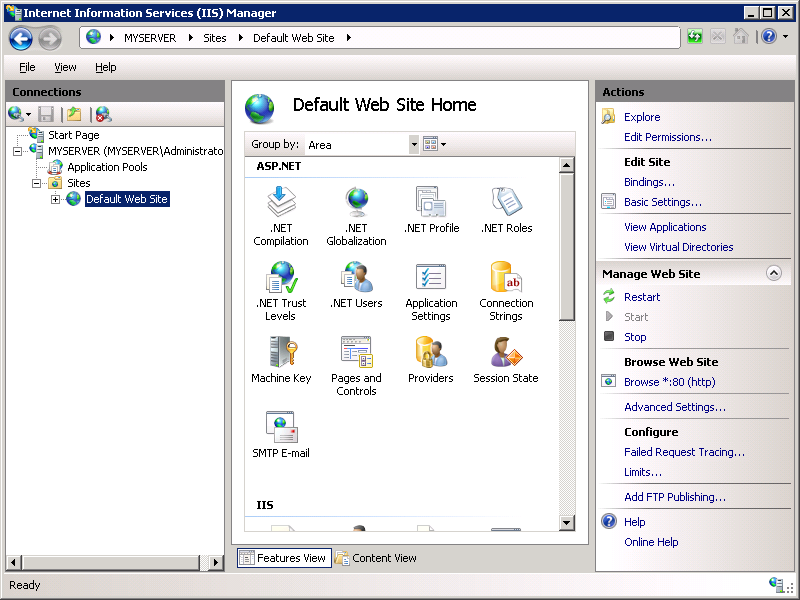
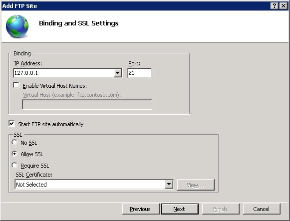
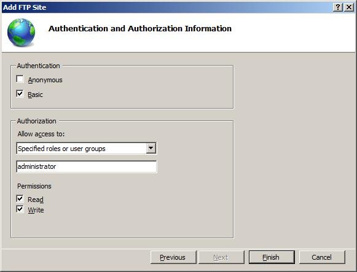

Adding FTP Publishing to a Web Site in IIS 7
====================
by [Robert McMurray](https://github.com/rmcmurray)

## Compatibility

| Version | Notes |
| --- | --- |
| IIS 7.5 | The FTP 7.5 service ships as a feature for IIS 7.5 in Windows 7 and Windows Server 2008 R2. |
| IIS 7.0 | The FTP 7.0 and FTP 7.5 services were shipped out-of-band for IIS 7.0, which required downloading and installing the service from the following URL: [https://www.iis.net/download/FTP](https://www.iis.net/downloads/microsoft/ftp). |

## Introduction

Microsoft updated the FTP service for Windows Server® 2008 and above. This new FTP service incorporates many new features that enable web authors to publish content better than before, and offers web administrators more security and deployment options.

This document walks you through adding FTP publishing to an existing web site using the new FTP user interface and by directly editing the IIS configuration files.

> [!NOTE]
> This walk-through contains a series of steps in which you log in to your FTP site using the local administrator account. These steps should only be followed on the server itself using the loopback address or over SSL from a remote server. If you prefer to use a separate user account instead of the administrator account, you must create the appropriate folders and set the correct permissions for that user account when necessary.

### Prerequisites

The following items are required to complete the procedures in this article:

1. IIS 7.0 or above must be installed on your Windows Server 2008, and the following must be configured: 

    - The Default Web Site that is created by the IIS 7.0 or above installation must still exist.
    - The Internet Information Services Manager must be installed.
2. The new FTP service must be installed. You can download and install the FTP service from the [https://www.iis.net/](https://www.iis.net/) web site using one of the following links: 

    - [FTP 7.5 for IIS 7.0 (x64)](https://go.microsoft.com/fwlink/?LinkID=143197)
    - [FTP 7.5 for IIS 7.0 (x86)](https://go.microsoft.com/fwlink/?LinkID=143196)

## Adding FTP Publishing Using the IIS Manager

The new FTP service makes it easy to add FTP publishing to existing sites by providing you with a wizard that walks you through all of the required steps.

### Step 1: Use the FTP Site Wizard to add FTP publishing

In this first step, add FTP publishing to the Default Web site, and add the require settings to allow the local administrator account to edit the content.

1. In IIS Manager, in the **Connections** pane, expand the **Sites** node in the tree, then click the Default Web Site.
2. As shown in the image below, click **Add FTP Publishing** in the **Actions** pane.  
    
3. When the **Add FTP Site** wizard appears: 

    - Choose an IP address for your FTP site from the **IP Address** drop-down, or choose to accept the default selection of "All Unassigned." Because we use the administrator later in this walk-through, you want to ensure that you restrict access to the server and enter the local loopback IP address for your computer by typing "127.0.0.1" in the **IP Address** box.
    - Normally, you would enter the TCP/IP port for the FTP site in the **Port** box. For this walk-through, choose to accept the default port of 21.
    - For this walk- through, we will not use a host name, so make sure that the **Virtual Host** box is blank.
    - Make sure that the **Certificates** drop-down is set to "Not Selected" and that the **Allow SSL** option is selected.
    - When you have completed these items, click **Next**.

    
4. On the next page of the wizard: 

    - Select **Basic** for the **Authentication** settings.
    - For the **Authorization** settings: 

        - Choose "Specified users" from the **Allow access to** drop-down
        - Type "administrator" for the user name.
        - Select **Read** and **Write** for the **Permissions** option.
    - When you have completed these items, click **Finish**.

    

#### Summary

You have successfully added FTP publishing to an existing Web site.

To recap the items that you completed in this step, we added FTP publishing to the "Default Web Site" by:

- Adding an FTP binding for the Web site for the local loopback IP address on port 21
- Choosing not to use Secure Sockets Layer (SSL) for the FTP site.
- Enabling Basic Authentication and creating an authorization rule for the local administrator account for Read and Write access.

### Step 2: Logging in to your FTP site

In Step 1, you added FTP publishing to your Default Web Site and added an authorization rule that allows the local administrator account Read and Write access your Web site's content. In this step you log in using your administrator account.

> [!NOTE]
> When creating the FTP site in Step 1, we bound the FTP site to the local loopback IP address. If you were not using the local loopback address, use SSL to protect your account settings. If you prefer to use a separate user account instead of the administrator account, set the correct permissions for that user account for the appropriate folders.

#### Logging in to your FTP site using your administrator account

1. On your FTP server, open a command prompt session.
2. Type the following command to connect to your FTP server: 

    [!code-console[Main](adding-ftp-publishing-to-a-web-site-in-iis-7/samples/sample1.cmd)]
3. When prompted for a user name, enter "administrator".
4. When prompted for a password, enter your administrator password.

You should now be logged in to your FTP site as the local administrator. Based on the authorization rule that we added in Step 1 you should have both Read and Write access to the content folder.

#### Summary

To recap the items that you completed in this step:

- You logged in to your FTP site as the local administrator.

## Adding FTP Publishing by Editing the IIS Configuration Files

You can also add FTP publishing to an existing Web site by editing the IIS configuration files.

> [!NOTE]
> Editing your applicationHost.config file requires full administrative permissions. This is best accomplished using one of two methods:

- Log in to your computer using the local "administrator" account.
- If you are logged in using an account with administrative permissions that is not the local "administrator" account, open Notepad using the "Run as Administrator" option.

> [!NOTE]
> The above steps are required because the User Account Control (UAC) security component in the Windows Vista and Windows Server 2008 operating systems prevent access to your applicationHost.config file. For more information about UAC, please see the following documentation:

[https://go.microsoft.com/fwlink/?LinkID=113664](https://go.microsoft.com/fwlink/?LinkID=113664)

The following steps walk you through all of the required settings to add FTP publishing for the Default Web Site.

1. Using a text editor such as Windows Notepad, open your applicationHost.config file, which is located in your `%SystemRoot%\System32\inetsrv\config` folder by default.
2. Locate the section for your Default Web Site. This should resemble the following example: 

    [!code-xml[Main](adding-ftp-publishing-to-a-web-site-in-iis-7/samples/sample2.xml)]
3. Create a new binding element in the bindings collection, and set the value of the protocol attribute on the new binding element to contain "ftp", then change the port value of the bindingInformation attribute to contain "21".   
  
 Your Default Web Site's settings should now resemble the following example: 

    [!code-xml[Main](adding-ftp-publishing-to-a-web-site-in-iis-7/samples/sample3.xml)]
4. Add an ftpServer section beneath the closing bindings tag that will contain your authentication settings.  
  
    > [!NOTE]
    > The authentication settings for FTP sites are configured at the site-level, unlike authentication for web sites, which can be configured per URL. 

    [!code-xml[Main](adding-ftp-publishing-to-a-web-site-in-iis-7/samples/sample4.xml)]

 Your `<sites>` section should now contain something like the following example: 

    [!code-xml[Main](adding-ftp-publishing-to-a-web-site-in-iis-7/samples/sample5.xml)]
5. Scroll to the bottom of your applicationHost.config file and add a location section for your Default Web Site that will contain your authorization settings.  
  
    > [!NOTE]
    > As shown in this example, the authorization settings for FTP sites are configured per URL. 

    [!code-xml[Main](adding-ftp-publishing-to-a-web-site-in-iis-7/samples/sample6.xml)]
6. Save your applicationHost.config file.

You should now be able to log in to your FTP-enabled site using an FTP client using the administrator account, but no other users should be able to log in.

#### Summary

In this task you added FTP publishing to your Default Web Site by editing the IIS configuration files. To recap the items that you completed in this task:

- You added an FTP binding to the Default Web Site.
- You enabled FTP basic authentication and disabled FTP anonymous authentication for the Default Web Site.
- You configured the administrator account for Read/Write permissions for the Default Web Site.