Building a Web Deploy Package from Visual Studio 2010
====================
by Ben Byrd

## Summary

So far, we have installed Web Deploy on a web server and enabled non-administrators to deploy applications to IIS 7. In this walkthrough, we will learn how developers can create Web Deploy packages, which can be deployed by users who have access to the web server (such as administrators, or IT / ops teams). A package contains the files (binaries and static content), databases, and IIS settings that you want to deploy.

In this tutorial, we will deploy the package to our server from the development computer and we will also explore importing it on the server using Web Deploy UI in IIS Manager.

## Web Deployment Packages

In Visual Studio 2010, you can create Web Deploy packages through the UI or by using MSBuild on the command line. Both of these methods will generate 1) a standard Web Deploy package and 2) a batch (.cmd) file that will help you deploy the package.

### Configuring Package/Publish Options:

1. Start Visual Studio 2010 and load up the [Contoso University](https://code.msdn.microsoft.com/ASPNET-MVC-Application-b01a9fe8) C# solution.
2. In Solution Explorer, expand the ContosoUniversity node and double click **Properties** (C#)  
    [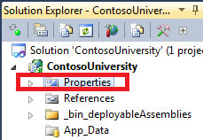](building-a-web-deploy-package-from-visual-studio-2010/_static/image1.png)
3. Click the **Package/Publish Web** tab.  
    
4. Choose the Configuration for the package.  
      
 Packages are configuration specific and settings are per configuration, so you need to choose the configuration and configure the setting before creating a package.
5. Configure **Items to deploy (applies to all deployment methods)**  
      
 These options will be used regardless of whether you publish with Web Deploy or a different publishing method. 

    - **Items to deploy** has three options:  
          
 The         **Only files needed to run this application** option should be sufficient in most cases. This will exclude source code, project files, and other files that are not normally needed to run a site. The         **All files in this project** option will publish the above mentioned set plus the source files, project files, and other related files. The         **All Files in this project folder** option will include files not in the project, except for files under the obj folder.
    - The **Exclude generated debug symbols** option tells VS to exclude debug symbols if the symbols are being generated.
    - The **Exclude files from the App\_Data** folder option will exclude files from the App\_Data folder.
6. Configure **Items to deploy (applies to Web Deploy only)**  
      
 These options only apply when you create a Web Deploy package, or use the Web Deploy protocol for publishing. 

    - **Include all databases** option tells Web Deploy whether or not to deploy databases configured in the **Package/Publish SQL** tab.
    - **Include all IIS settings as configured in IIS/IIS Express** and **Include application pool settings used by this Web project** options are covered in the article {LINK to Article about IIS Settings} and are only available when you have selected **Use Local Web server** on the **Web** property tab instead of the Cassini development server.
7. Configure **Web Deployment Package Settings**  
    [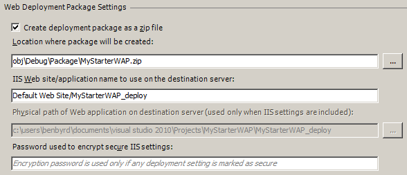](building-a-web-deploy-package-from-visual-studio-2010/_static/image13.png)  

    - The **Create deployment package as a zip file** option will determine whether a zip file or a directory structure ([Archive Directory](https://technet.microsoft.com/en-us/library/dd569042(WS.10).aspx)) is created at package time. Unless you are creating packages that would encounter the ZIP file size limit of 2,147,483,647 bytes (Int.MaxValue), we recommend using the ZIP format.
    - The **Location where package will be created** option specifies the location were the package file will be created. You will need to ensure you have write permissions to the location that you specify.
    - The **IIS Web Site/application name to use on the destination server** option specifies the default site or application name that will be used on the destination server if the user does not specify a different one.
    - The **Physical path of the web application on destination server (used only when IIS settings are included** and **Password used to encrypt secure IIS settings** options are covered in the article {LINK to Article about IIS Settings}

### Configuring Package/Publish SQL Options:

There are scenarios in which you will want to deploy a database along with your application. For example, when deploying your application for the very first time, you may want to deploy the database with schema and data.

Note that Visual Studio 2010 does NOT support incremental database deployment.

1. If you want to include databases in your package, click the **Package/Publish SQL** tab.  
    
2. Choose the configuration for the package.  
    [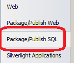](building-a-web-deploy-package-from-visual-studio-2010/_static/image17.png)  
 Packages are configuration specific, so you need to choose the configuration setting for the package before you create it.
3. If your Web.config file has a database connection string, you can click **Import from Web.Config**. A message will appear when the import is complete.  
    [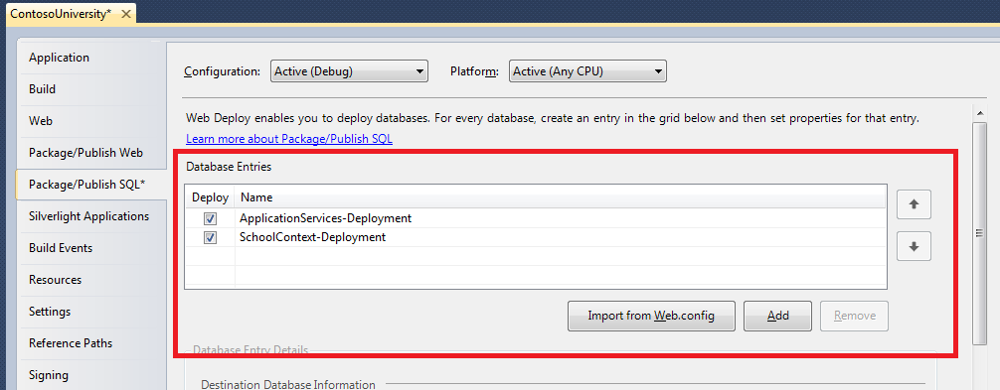](building-a-web-deploy-package-from-visual-studio-2010/_static/image19.png)  
 The following will appear if no connection string was found:  
    [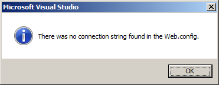](building-a-web-deploy-package-from-visual-studio-2010/_static/image21.png)  
 If you see this error, check that the Web.Config file has the desired connection string and that the file has not been modified (an asterisk in the editor tab will indicate that the file has been altered and that the changes have not been saved.)
4. If a database that you want to add to your deployment package is not listed under **Database Entries**, click the **Add** button to add the connection.
5. Once all of your connections are added, you can select an entry and adjust its order in the list to specify the order in which it will added to the package, and thus deployed, by using the up and down arrows.  
  
 Clicking a database entry will allow you to remove it.
6. Next, configure the details for each database in the **Database Entry Details** section. 

    1. Select a database from the **Database Entries** list.  
        [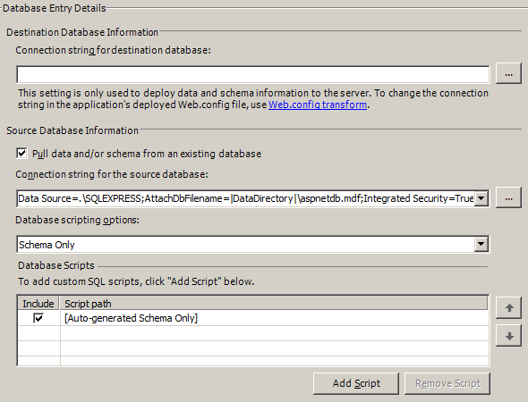](building-a-web-deploy-package-from-visual-studio-2010/_static/image23.png)
    2. In the **Connection string for destination database** field, enter the connection string to be used when the database is deployed to the server. This is needed for one-click publishing, but for packaging, this value will be used as a default that can be changed at deployment time.)  
 Note: This value will NOT be used to update the connection string information in the Web.config file. You can update your Web.config file for each build configuration using Web.config transforms. For more information on Web.config transforms, see {link to publishing article}, this article on         [MSDN](https://msdn.microsoft.com/en-us/library/dd465326.aspx) , or Vishal Joshi's blog         [here](http://vishaljoshi.blogspot.com/2009/09/overview-post-for-web-deployment-in-vs.html) under the Web.Config Transformation section.
    3. The **Pull data and/or schema from an existing database** option will script out the database pointed to by the **Connection string for the source database** field and will script out schema, data, or both depending on the setting that you select for **Database scripting options**.
    4. The last option, **Database Scripts**, is to add custom SQL scripts and pick the order in which the scripts are executed. If you selected the **Pull data and/or schema from an existing database** checkbox under **Source Database Information**, the **[Auto-generated *&lt;Database scripting option&gt;*]**" checkbox appears. If you want to execute additional scripts, click **Add Script**. Browse to the location of the script and click **Open**. You can then select it in the **Database Scripts** section and use the up and down arrows to adjust its execution order.
    5. The last option, **Database Deployment Notes**, is optional.
    6. Now save the changes to the configuration before continuing.

Now that we have configured the packaging settings, we can create a package.

### Generating the Package from Visual Studio 2010

1. In VS 2010, select your WAP from the solution explorer.
2. Right-click the WAP.
3. Select **Build Deployment Package**.  
    [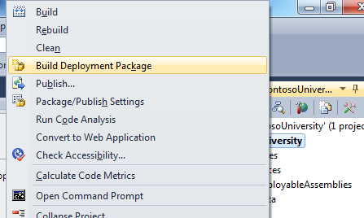](building-a-web-deploy-package-from-visual-studio-2010/_static/image25.png)
4. Note that if you have never logged on to Contoso University, the aspnetdb.mdf file does not exist. Package creation will fail with an error similar to this one: "Cannot connect to the database'C:\code\ContosoUniversity\ContosoUniversity\ContosoUniversity\App\_Data\aspnetdb.mdf'. A connection was successfully established with the server, but then an error occurred during the login process." 

    - To fix this error, simply start the application with F5 and register a user. This will create an aspnetdb.mdf file.
5. The output window will give updates as packaging progresses. When it finishes, the output will contain a link to the package location.  
    
6. Control clicking this link will open the package location.  
    

### Generating the Package from MSBuild

All the settings we configured above are stored in the project file for the WAP. You can now build a WAP or solution and have the package created that uses the settings above.

1. Open a command prompt with MSBuild in the path (for example, the VS command prompt, which is under Start -&gt; All Programs -&gt; Microsoft Visual Studio 2010 -&gt; Visual Studio Tools -&gt; Visual Studio Command Prompt (2010))
2. Navigate to your solution or project file.
3. If you are building a solution, the command will look like this:  

    [!code-console[Main](building-a-web-deploy-package-from-visual-studio-2010/samples/sample1.cmd)]

 If you are building the project file, the command will look like this:  

    [!code-console[Main](building-a-web-deploy-package-from-visual-studio-2010/samples/sample2.cmd)]

 If you would like to build a configuration other than the default, add the following to the above commands:  

    [!code-console[Main](building-a-web-deploy-package-from-visual-studio-2010/samples/sample3.cmd)]

### Deploying the Package from the Command Prompt

Now that we have a package, we can deploy it from the command prompt. We will deploy it as an administrator.

To deploy the package as an administrator using the Remote Agent Service:

1. Open a command prompt
2. Navigate to the location where the package was built. You can find this information in the build output. There will be a link in the build **Output** window in the UI and from the command line the location will be listed in the **PackageUsingManifest** section of the build output.
3. Type **{project name}.deploy.cmd /t /m:{destinationServerName} /u:{administratorUser} /p:{AdministratorPassword}** and press enter.
4. If the trail publish produced the correct results rerun the command without the **/t** parameter.

For more information on deploying using the command file you can type **{project name}.deploy.cmd** to open the associated readme or visit the article located [here](https://msdn.microsoft.com/en-us/library/ff356104.aspx).

### Deploying the Package using IIS Manager

We can also use Internet Information Services (IIS) manager to install our newly created package.

To deploy the package using Internet Information Services manager (inetmgr):

1. Run inetmgr.exe
2. Expand the server node in inetmgr.
3. Expand the **Sites** node.
4. Right-click on the site you want to import the application to.
5. Select **Deploy -&gt; Import Application...**  
    [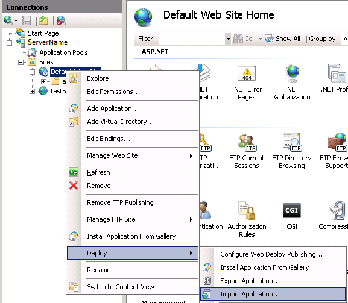](building-a-web-deploy-package-from-visual-studio-2010/_static/image30.png)
6. Enter the location of the package into the **Package path:** text box.
7. Click **Next**
8. You will now be at **Select the Contents of the Package** screen. By checking and unchecking items you can customize what is installed. In this screenshot you see:  

    - There is an item to create the application.
    - File content for the site.
    - Two items configuring the ACLs on the site.
    - A database script.  
        [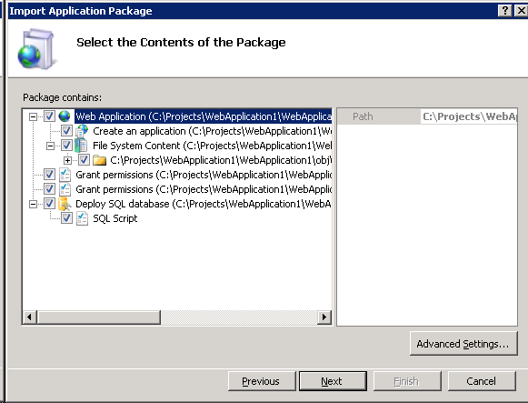](building-a-web-deploy-package-from-visual-studio-2010/_static/image32.png)
9. After selecting the desired items to install, click **Next**.
10. You will now need to verify the set the package parameters.  

    - **Application Path** is the location to install the application, since I decided to import from the Default Web Site node in inetmgr that will be the root and I can enter an application name in the text box to install to.
    - The first **Connection String** parameter is the database to install the package script to.
    - The second **Connection String** parameter is the value to be placed in the web.config file. The two different parameters will allow you to install the database as a more privileged user and run the application with a lower privileged account.  
        [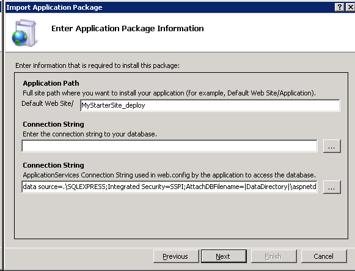](building-a-web-deploy-package-from-visual-studio-2010/_static/image34.png)
11. Click **Next**.
12. If the application exists you will be prompted if you would like to delete extra files. Choose the desired option and click **Next**.  
    [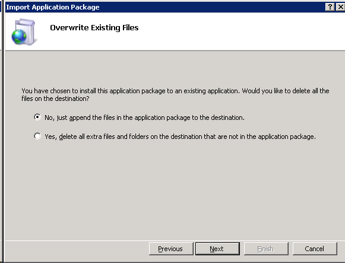](building-a-web-deploy-package-from-visual-studio-2010/_static/image36.png)
13. You will know be at the summary page. Review the information and click **Finish**.  
    [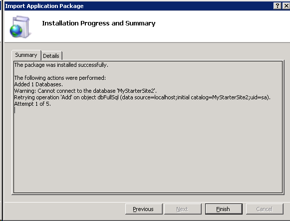](building-a-web-deploy-package-from-visual-studio-2010/_static/image38.png)
14. Now in inetmgr you can click the **Browse** link under **Manage Application** to view your site  
    [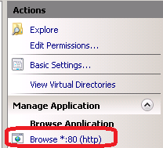](building-a-web-deploy-package-from-visual-studio-2010/_static/image40.png)
  
  
[Discuss in IIS Forums](https://forums.iis.net/1144.aspx)