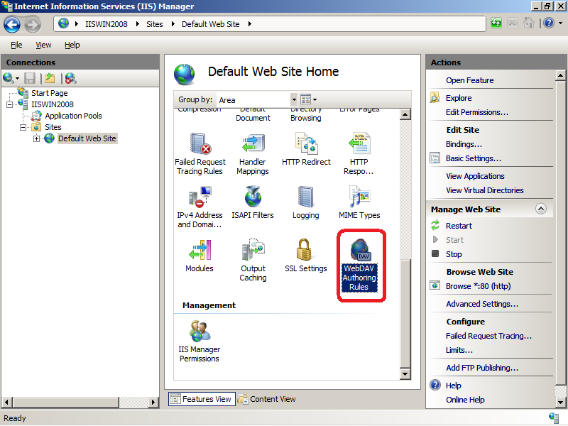
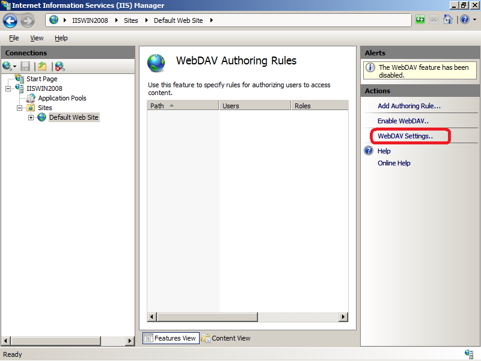
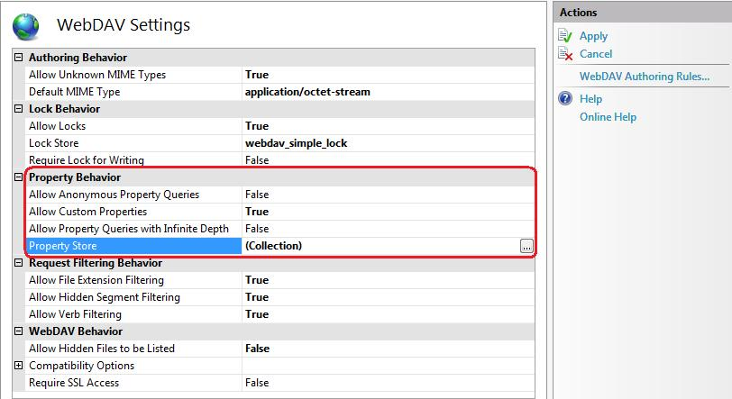
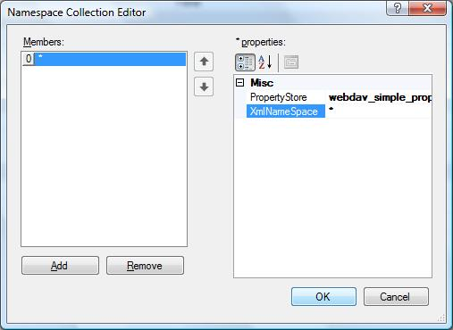

How to Use Custom Properties With WebDAV
====================
by [Robert McMurray](https://github.com/rmcmurray)

## Introduction

Microsoft released a new WebDAV extension module that was completely rewritten for Internet Information Services 7.0 (IIS 7.0) on Windows Server® 2008. This new WebDAV extension module incorporated many new features that enable web authors to publish content better than before, and offers web administrators more security and configuration options. Microsoft has released an update to the WebDAV extension module for Windows Server® 2008 that provides shared and exclusive locks support to prevent lost updates due to overwrites.

One of the great features of WebDAV is the ability to store custom properties for content, which are most often used for additional metadata for the content. The information that is stored in these custom properties depends on the WebDAV client, but the new WebDAV module allows publishing clients to save these properties to a simple property store for later retrieval.

This document walks you through configuring the new WebDAV module to store custom properties, which are used by some WebDAV clients.

### Prerequisites

The following items are required to complete the procedures in this article:

- IIS 7.0 must be installed on your server, and the following must be configured: 

    - The Default Web Site that is created by the IIS 7.0 installation must still exist.
    - The Internet Information Services Manager must be installed.
- The new WebDAV extension module must be installed. For information regarding the installation of the new WebDAV module, please see the following document: 

    - [Installing and Configuring WebDAV on IIS 7.0](https://go.microsoft.com/fwlink/?LinkId=105146)

> [!NOTE]
> You need to make sure that you follow the steps in this document using full administrative permissions. This is best accomplished using one of two methods:

- Log in to your computer using the local "administrator" account.
- If you are logged in using an account with administrative permissions that is not the local "administrator" account, open IIS Manager and all command prompt sessions using the "Run as Administrator" option.

The above condition is required because the User Account Control (UAC) security component in Windows Server 2008 prevents administrative access to the IIS 7.0 configuration settings. For more information about UAC, please see the following documentation:

- [https://go.microsoft.com/fwlink/?LinkId=113664](https://go.microsoft.com/fwlink/?LinkId=113664)

### Additional Information

- The simple property store saves properties in a hidden system file named "properties.dav" in each folder. You should add this file to the list of list of denied file types in your request filtering settings. For more information, please see the [How to configure WebDAV and Request Filtering](https://go.microsoft.com/fwlink/?LinkId=108321) walkthrough.
- Properties are limited in the following fashion: 

    - Individual property values are limited to 32,000 characters.
    - The total size of properties per file is limited to 500,000 characters.

## Enabling Custom Properties Using IIS Manager

1. In IIS Manager, in the **Connections** pane, expand the **Sites** node in the tree, then click the **Default Web Site**.
2. As shown in the image below, double-click the **WebDAV Authoring Rules** feature.  
    
3. When the **WebDAV Authoring Rules** page is displayed, click the **WebDAV Settings** task in the **Actions** pane.  
    
4. When the **WebDAV Settings** page is displayed, specify the following options: 

    - Set **Allow anonymous property queries** to **False**
    - Set **Allow custom properties** to **True**
    - Set **Allow property queries with infinite depth** to **False**
    - 
5. Click on the [...] button to launch the Namespace Collection Editor
6. Click on **Add** and then choose "**webdav\_simple\_prop**" from the drop-down list
7. Specify '\*' for the XmlNameSpace and then click on **OK**.

    
8. Once you have completed the above steps, click the **Apply** task in the **Actions** pane.

## Enabling Custom Properties Using AppCmd

AppCmd.exe is a new command-line tool for administering IIS 7.0, and additional information about using this utility with IIS and WebDAV is located in the following document:

- [How to manage WebDAV using AppCmd](https://go.microsoft.com/fwlink/?LinkId=108319)

The following steps will walk you through using the AppCmd utility to configure WebDAV's property settings.

> [!NOTE]
> The AppCmd.exe utility is located in the %WinDir%\System32\InetSrv folder.

### Configuring Property Behaviors

#### Using custom properties

In order to use custom properties, you must first enable the feature. To do so, set the "allowCustomProperties" attribute to "true" on the "properties" collection in the "authoring" section using syntax as in the following:

[!code-console[Main](how-to-use-custom-properties-with-webdav/samples/sample1.cmd)]

To disable custom properties, use syntax as in the following example:

[!code-console[Main](how-to-use-custom-properties-with-webdav/samples/sample2.cmd)]

#### Anonymous property queries

Anonymous access to properties is disabled by default for security reasons, but you may need to enable anonymous access for certain WebDAV clients to access the metadata. To do so, set the "allowAnonymousPropfind" attribute to "true" on the "properties" collection in the "authoring" section using syntax like the following:

[!code-console[Main](how-to-use-custom-properties-with-webdav/samples/sample3.cmd)]

To disable anonymous access, use syntax as in the following example:

[!code-console[Main](how-to-use-custom-properties-with-webdav/samples/sample4.cmd)]

#### Infinite depth for property queries

Property queries can be executed recursively by WebDAV clients, allowing a client to retrieve the properties for an entire web site with one request. This action can take a considerable amount of server resources to process, so it is disabled by default. Some WebDAV clients may need to retrieve the properties for all of the content in a web site, and that can be enabled by setting the "allowInfinitePropfindDepth" attribute to "true" on the "properties" collection in the "authoring" section using syntax like the following:

[!code-console[Main](how-to-use-custom-properties-with-webdav/samples/sample5.cmd)]

To disable infinite depth for property queries, use syntax as in the following example:

[!code-console[Main](how-to-use-custom-properties-with-webdav/samples/sample6.cmd)]

### Managing your Property Provider

The WebDAV module is designed to work with a configurable set of property providers, although currently only one provider named "'webdav\_simple\_prop" has been developed. In the future, additional property providers will be developed, allowing the use of different property providers for different XML namespaces for custom properties.

> [!NOTE]
> Currently only the default namespace of "\*" can be configured.

#### Configuring your property provider

To specify the property provider for a web site, use syntax like the following:

[!code-console[Main](how-to-use-custom-properties-with-webdav/samples/sample7.cmd)]

#### Editing your property provider

To modify the property provider for a web site, use syntax as in the following:

[!code-console[Main](how-to-use-custom-properties-with-webdav/samples/sample8.cmd)]

#### Removing your property provider

To remove the property provider for a web site, use syntax as in the following:

[!code-console[Main](how-to-use-custom-properties-with-webdav/samples/sample9.cmd)]

## Summary

### More Information

For additional information about using WebDAV, please see the following articles:

- [Installing and Configuring WebDAV on IIS 7.0](https://go.microsoft.com/fwlink/?LinkId=105146)
- [How to manage WebDAV using AppCmd](https://go.microsoft.com/fwlink/?LinkId=108319)
- [How to configure WebDAV and Request Filtering](https://go.microsoft.com/fwlink/?LinkId=108321)
  
  
[Discuss in IIS Forums](https://forums.iis.net/1045.aspx)