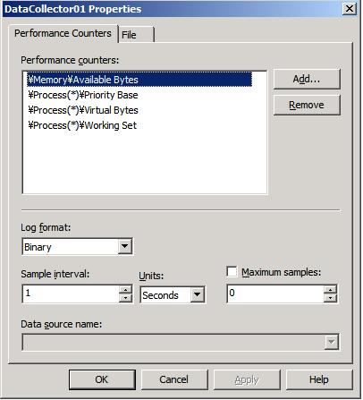
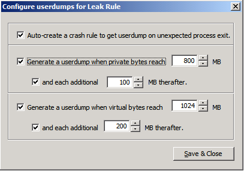
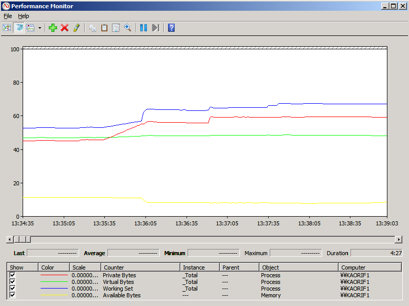
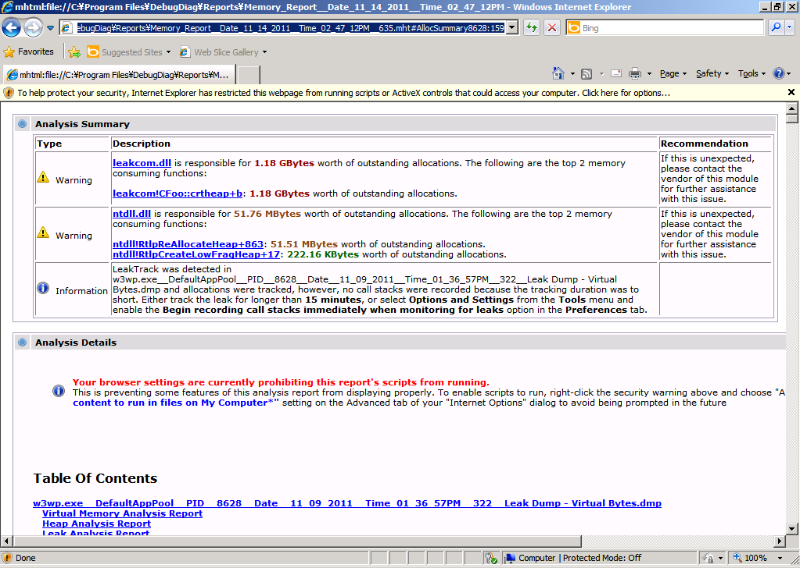
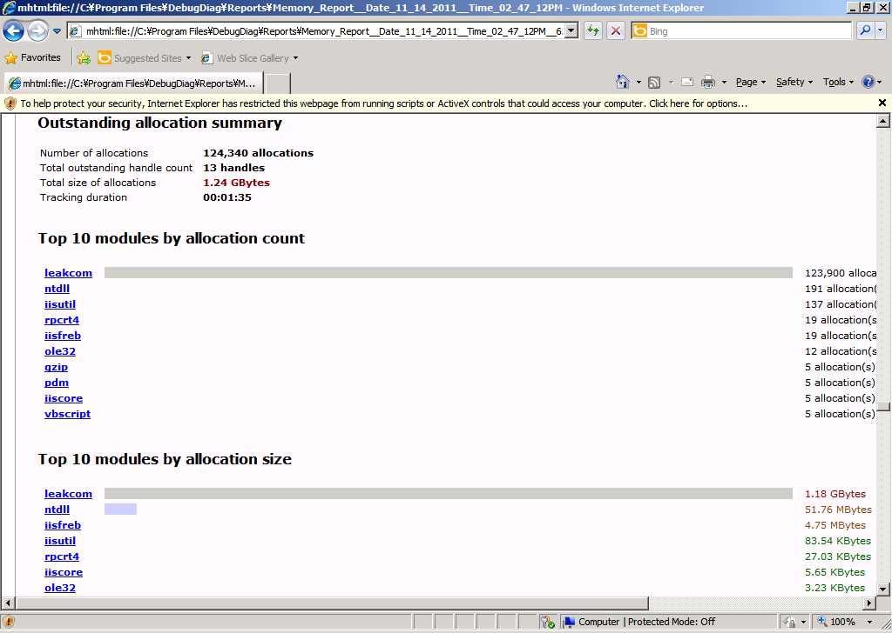
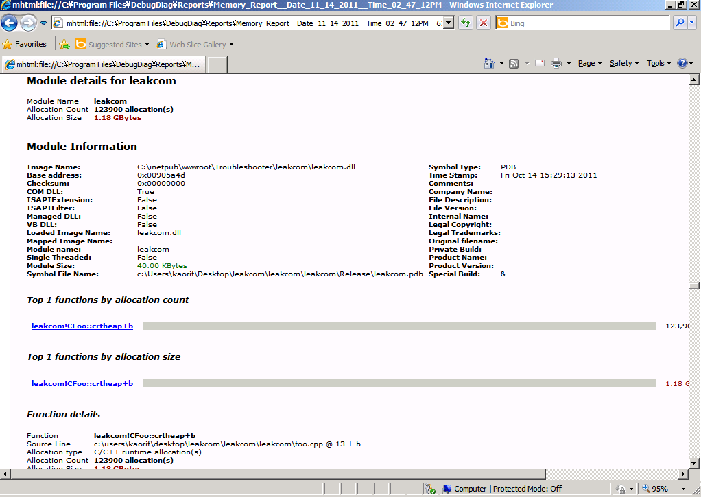

Troubleshooting native memory leak in an IIS 7.x Application Pool
====================
by [Apurva Joshi](https://github.com/apurvajo)

#### Tools Used in this Troubleshooter:

- Debug Diagnostics 1.2
- Performance Monitor
- Debugging Tools for Windows

This material is provided for informational purposes only. Microsoft makes no warranties, express or implied.

## Overview

This troubleshooter will help you to identify the cause of native memory leak in an IIS application pool. It's important to keep in mind that it is normal for high memory allocation as a web application serves requests. However, if you consistently see both Process\Private Bytes and Process\Virtual Bytes are increasing or Process\Private Bytes and Process\Working Set are increasing and Memory\Available Bytes is decreasing, the memory leak will occur and it may cause an out-of-memory exception.

When the memory leak in an IIS application pool occurs, increasing physical memory (RAM) does not effective because the memory in this scenario is not the physical memory (RAM) but a virtual memory. The following table summarizes the virtual memory which is addressable memory from the web application.

| Process | Windows | Addressable memory (with a large address-aware process) | Practical limit for virtual bytes | Practical limit for private bytes |
| --- | --- | --- | --- | --- |
| 32-bit | 32-bit | 2 GB | 1400 MB | 800 MB |
| 32-bit | 32-bit with /3GB | 3 GB | 2400 MB | 1800 MB |
| 32-bit | 64-bit | 4 GB | 3400 MB | 2800 MB |
| 64-bit | 64-bit | 8 TB | Not applicable | Not applicable |

## Scenario

You consistently see both Process\Private Bytes and Process\Virtual Bytes are increasing or Process\Private Bytes and Process\Working Set of w3wp.exe are increasing and Memory\Available Bytes is decreasing.

It may cause an out-of-memory exception on an application pool in IIS.

To recover, the application pool must be restarted, but after doing so, the memory usage again climbs to a high level. When you see the error above, the application pool has already restarted automatically.

## Data Collection

The first thing you should do when you encounter the high memory usage is to determine whether the memory of a worker process on an application pool in IIS is leaked or not. You can use Performance Monitor. For more information on using Performance Monitor, see **Analyzing Performance Data** later in this troubleshooter.

**TIP**

If you need to identify which application pool is associated with a particular w3wp.exe process, open an Administrative Command Prompt, switch into the %windir%\System32\inetsrv folder (cd %windir%\System32\inetsrv) and run appcmd list wp. This will show the process identifier (PID) of the w3wp.exe process in quotes. You can match that PID with the PID available in Task Manager.

Once you have confirmed that a w3wp.exe process is experiencing high memory usage, you will need to two pieces of information in order to determine what is causing the problem.

- A Performance Monitor data collector set.
- A user-mode memory dump of the w3wp.exe process.

Both of these will need to be collected from the low memory usage such as starting the process until the high memory usage such as experiencing an out-of-memory exception.

**Collecting a Performance Monitor Data Collector Set**

Performance Monitor (Perfmon) data can be viewed in real-time or it can be collected in a data collector set that can be reviewed later. For troubleshooting a high memory issue, we need to collect a data collector set. To create a data collector set for troubleshooting high CPU, follow these steps.

1. Open Administrative Tools from the Windows Control Panel.
2. Double-click on Performance Monitor.
3. Expand the Data Collector Sets node.
4. Right-click on User Defined and select New, Data Collector Set.
5. Enter High Memory as the name of the data collector set.
6. Select the Create Manually (Advanced) radio button.
7. Click Next.
8. Select the Create Data Logs radio button.
9. Check the Performance Counter checkbox.
10. Click Next.
11. Click the Add button.
12. Expand Process from the list of counters.
13. Select Private Bytes, Virtual Bytes and Working Set from the Thread object.
14. Select &lt;ALL instances&gt; from the list of instances.
15. Click Add.
16. Expand Memory from the list of counters.
17. Select Available Bytes from the Thread object.
18. Click Add.
19. Click OK.
20. Set Sample interval to "1 Seconds" and then Next and Finish.

Your dialog should now look like the one shown in Figure 1.

Figure 1 - Creating a data collector set.

**Creating a Debug Diagnostics 1.2 Rule**

The easiest way to collect user-mode process dumps when a high memory condition occurs is to use Debug Diagnostics 1.2 (DebugDiag.) You can download DebugDiag from the following URL.

[https://www.microsoft.com/download/en/details.aspx?id=26798](https://www.microsoft.com/download/en/details.aspx?id=26798)

Install DebugDiag 1.2 on your server and run it. (You'll find it on the Start menu after installation.)

The most important information to figure out which function is caused the memory leak is the stack traces of the heap allocations. By default, these stack traces are not acquired. You can enable this feature per-process. Use the following command to enable stack tracing:

[!code-console[Main](troubleshooting-native-memory-leak-in-an-iis-7x-application-pool/samples/sample1.cmd)]

The command does not enable stack tracing for a process that is already running. Therefore, for processes that you cannot restart (for example, services, lsass, winlogon), you must restart your test computer.

Use the following commands to verify what settings have been set for a specific process:

[!code-unknown[Main](troubleshooting-native-memory-leak-in-an-iis-7x-application-pool/samples/sample-127565-2.unknown)]

When you run DebugDiag, it will display the Select Rule Type dialog. Follow these steps to create a leak rule for your application pool.

1. Select Native (non-.NET) Memory and Handle Leak and click Next.
2. Select a process and click Next.
3. Click Configure.
4. Set the following rule as shown in Figure 2. (You can adjust these values if needed, but be careful not to specify a small number of MB in order to generate the tons of dump files.)Generate a userdump when private bytes reach 800 MB and each additional 100 MB therafter.Generate a userdump when virtual bytes reach 1024 MB and each additional 200 MB therafter.

    

    Figure 2 – Configuring userdumps for Leak Rule.
5. Click Save &amp; Close.
6. Click Next.
7. Enter a name for your rule if you wish and make note of the location where the dumps will be saved. You can change this location if desired.
8. Click Next.
9. Select Activate the Rule Now and click Finish.

If you get the Ouf Of Memory error even when you get the memory dumps, you can get the memory dumps manually.

1. Select Process tab.
2. Right click the target process.
3. Click Create Full Userdump.

## Data Analysis

After getting the Out Of Memory error or creating the memory dumps you will have two sets of data to review; the Perfmon data collector set and the memory dumps. Let's begin by reviewing the Perfmon data.

**Analyzing Performance Data**

To review the Perfmon data for your issue, right-click on the High Memory data collector set listed under the User Defined node and select Latest Report. You'll see something similar to the screen shown in Figure 3.

Figure 4 - Perfmon displaying the High Memory data.

To get to the root of what is causing the high CPU problem, let's review the dumps that were created using DebugDiag

**Dump Analysis with DebugDiag**

DebugDiag has the ability to recognize many problems by doing an automated dump analysis. For this particular issue, DebugDiag's Performance Analyzers are well-suited to helping to identify the root cause of the high CPU issue. To use the analyzer, follow these steps.

1. Select the Advanced Analysis tab in DebugDiag.
2. Select the Memory Pressure Analyzers. Make sure that you use MemoryAnalysis.asp instead of DotNetMemoryAnalysis-BETA.asp.
3. Click Add Data Files.
4. Browser to the location where the dumps were created. By default, this will be a subfolder of the C:\Program Files\DebugDiag\Logs folder.
5. Select one of the dumps and then press Ctrl+A to select all of the dumps in that folder.
6. Click Open.
7. Click Start Analysis.

DebugDiag will take a few minutes to parse through the dumps and provide an analysis. When it has completed the analysis, you will see a page similar to that shown in Figure 5.

Figure 5 – A DebugDiag analysis report.

Notice that the top of the report tells you that the memory leak was detected. In the Table Of Contets, you'll see a link to the details of Leak Analysis Report. Click that link and you'll see information about what those top 10 modules by allocation count or allocation size. Figure 6 shows those examples.

Figure 6 – Details on high memory module.

I can tell from this analysis that the leakcom COM component is running. If I want to look further down the Module Information of leak com (Figure 7), I can see that CFoo::crtheap method allocates the outstanding memory.

Figure 7 – Details on the module.

The next step is to review the code of CFoo::crtheap method. When I do that, I find the following.

[!code-unknown[Main](troubleshooting-native-memory-leak-in-an-iis-7x-application-pool/samples/sample-127565-3.unknown)]

Kind of the above code will definitely cause memory leak because allocated memory is not released.

**TIP**

If you enable stack tracing (gflags -i w3wp.exe +ust), you can see the following call stack by analyzing dumps with WinDBG. You will never see the following call stack if you disable stack tracing by default.

[!code-unknown[Main](troubleshooting-native-memory-leak-in-an-iis-7x-application-pool/samples/sample-127565-4.unknown)]

## Conclusion

By using Perfmon and DebugDiag, you can easily collect data that can be helpful in determining the cause of memory leak in application pools. If you are unable to find the root cause using these techniques, you can open a support ticket with Microsoft via [https://support.microsoft.com/](https://support.microsoft.com/) and we can assist you with determining the cause of your issue. You will collect dumps with enabling stack tracing (gflags -i w3wp.exe +ust) beforehand since the stack tracing is useful information for us to analyze the memory usage in details. By having the Perfmon data and dumps with the stack tracing ready for us when you open a case, you will dramatically reduce the amount of time necessary for us to assist.

### Other Resources

- [How to use the IIS Debug Diagnostics tool to troubleshoot a memory leak in an IIS process](https://support.microsoft.com/kb/919790/en-us)
- [Why the low fragmentation heap (LFH) mechanism may be disabled on some computers that are running Windows Server 2003, Windows XP, or Windows 2000](https://support.microsoft.com/kb/929136/en-us)
  
  
[Discuss in IIS Forums](https://forums.iis.net/1050.aspx)