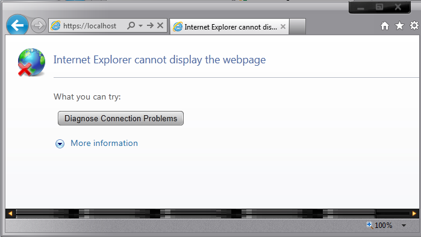
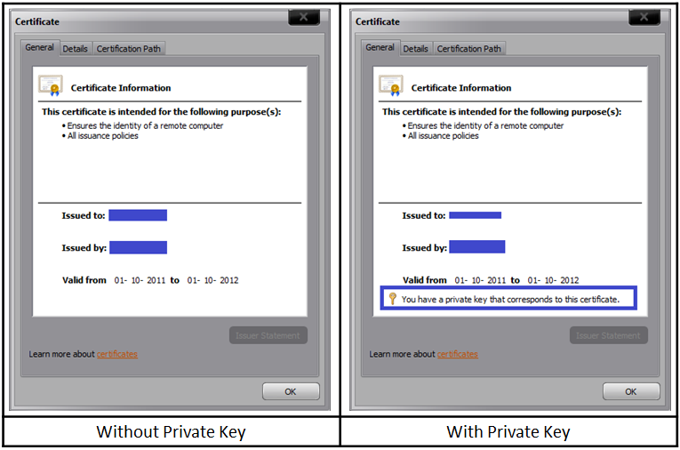
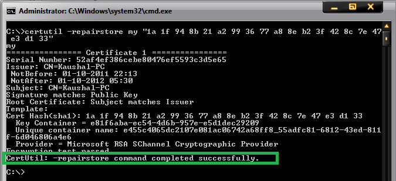
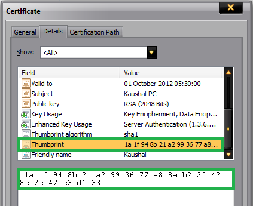
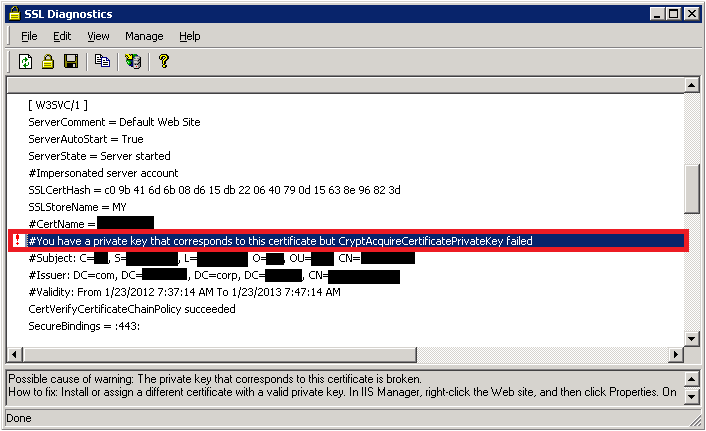
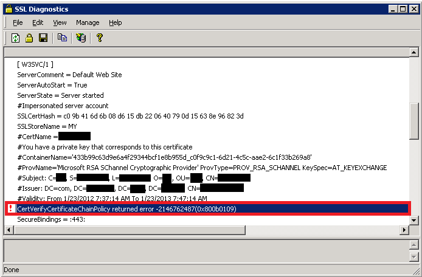
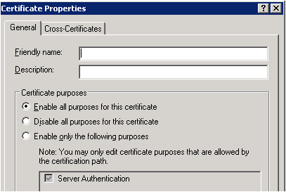
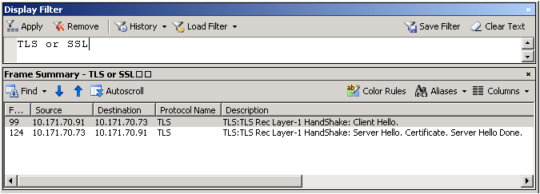
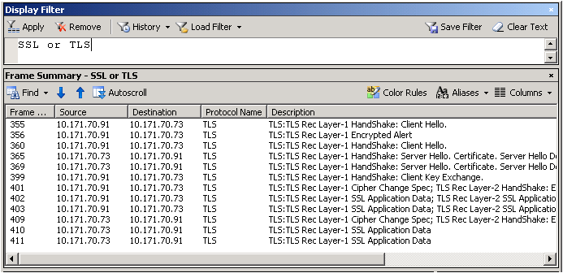

Troubleshooting SSL related issues (Server Certificate)
====================
by [Kaushal Kumar Panday](https://github.com/kaushalp)

#### Tools Used in this Troubleshooter:

- SSLDiag
- Network Monitor 3.4/Wireshark

This material is provided for informational purposes only. Microsoft makes no warranties, express or implied.

## Overview

This document will help you in troubleshooting SSL issues related to IIS only. Client Certificates troubleshooting will not be covered in this document. Server Certificates are meant for Server Authentication and we will be dealing only with Server Certificates in this document.

If the Client certificates section is set to "Require" and then you run into issues, then please don't refer this document. This is meant for troubleshooting SSL Server certificates issue only.

It is important to know that every certificate comprises of a public key (used for encryption) and a private key (used for decryption). The private key is known only to the server.

The default port for https is 443.

I am under the assumption the reader is well-versed in SSL Handshake and the Server Authentication process during the SSL handshake.

Description of the Secure Sockets Layer (SSL) Handshake:

[https://support.microsoft.com/kb/257591](https://support.microsoft.com/kb/257591)

Description of the Server Authentication Process during the SSL Handshake:

[https://support.microsoft.com/kb/257587](https://support.microsoft.com/kb/257587)

## Scenarios

The following error message is seen while browsing the website over https:

The first thing that has to be checked is whether the website is accessible over http. If yes, then we proceed with our troubleshooting. If not, then you need to have the website working on http first and that's a seperate issue (not covered in this troubleshooter).

Now let's assume the website is accessible over http and we get the above error when trying to browse over https. The problem is seen because the SSL handshake failed and hence the error message was seen. There could be many reasons. We will follow a step-by-step approach to solve this problem.

## Scenario 1

Check if the server certificate has the private key corresponding to it. Refer the below picture:

If private key is missing, then you need to get a certificate containing the private key, which is essentially a .PFX file. There is a command that we could try to run in order to associate the private key with the certificate:

[!code-console[Main](troubleshooting-ssl-related-issues-server-certificate/samples/sample1.cmd)]

If the association is successful, then you would see the following window:

Note: 1a 1f 94 8b 21 a2 99 36 77 a8 8e b2 3f 42 8c 7e 47 e3 d1 33 is the thumbprint of the certificate. Open the certificate and click on the details tab. Scroll down to find the thumbprint section. Select the thumbprint section and click on the text below. Do a "Ctrl+A" and then "Ctrl+C" to select and copy it. Below is a snapshot for your reference:

Note: This command doesn't succeed always. If this fails, then you need to get a certificate containing the private key from the CA. The file extension for a certificate containing private key is .pfx.

## Scenario 2

We went pass the first hurdle and now we have a server certificate containing the private key installed on the website. However, we still get the same error as above. The website is still not accessible over https.

The SSLDiag tool comes in handy here.

Windows Server 2003:

[Download X64](https://www.microsoft.com/download/en/details.aspx?displaylang=en&amp;id=5329)

[Download X86](https://www.microsoft.com/download/en/details.aspx?displaylang=en&amp;id=674)

For IIS 7 and IIS 7.5, use vijaysk's SSL Diagnostics tool. Below is the link:

[https://blogs.msdn.com/b/vijaysk/archive/2009/09/20/ssl-diagnostics-tool-for-iis-7.aspx](https://blogs.msdn.com/b/vijaysk/archive/2009/09/20/ssl-diagnostics-tool-for-iis-7.aspx)

Install the tool and run it on the server. If you have a certificate containing private key and still not able to access the website, then you may want to run this tool or check the system event logs for SChannel related warnings/errors.

While running the SSLDiag tool you may get the following error:

**You have a private key that corresponds to this certificate but CryptAcquireCertificatePrivateKey failed**

There will also be a SChannel warning in the system event logs as shown below:

| Event Type: Error |
| --- |
| Event Source: Schannel |
| Event Category: None |
| Event ID: 36870 |
| Date: 2/11/2012 |
| Time: 12:44:55 AM |
| User: N/A |
| Computer: |
| Description: A fatal error occurred when attempting to access the SSL server credential private key. The error code returned from the cryptographic module is 0x80090016. |

This event/error indicates that there was a problem acquiring certificate's private key. So let's try the below steps one by one:

- Firstly, verify the permissions on the machinekeys folder as per the KB Article: [https://support.microsoft.com/kb/278381](https://support.microsoft.com/kb/278381). All the private keys are stored within the machinekeys folder, so we need to ensure that we have necessary permissions.
- If the permissions are in place and if the issue is still not fixed. Then it must be a problem with the certificate. It may have been corrupted (You may see an error code of 0x8009001a in the SChannel event log).

    | Event Type: Error |
    | --- |
    | Event Source: Schannel |
    | Event Category: None |
    | Event ID: 36870 |
    | Date: 2/11/2012 |
    | Time: 12:44:55 AM |
    | User: N/A |
    | Computer: |
    | A fatal error occurred when attempting to access the SSL server credential private key. The error code returned from the cryptographic module is 0x8009001a. |
- We will test if the website works with a test certificate. Take a back-up of the existing certificate and then replace it with a self-signed certificate. Try accessing the website via https. If it works then the certificate used earlier was corrupted and it has to be replaced with a new working certificate.
- Sometimes the problem may not be with the certificate but with the issuer. You may see the following error in SSLDiag:

    

    **CertVerifyCertificateChainPolicy** will fail with **CERT\_E\_UNTRUSTEDROOT (0x800b0109)**, if the root CA certificate is not trusted root.

    To fix this add the CA's certificate to the "Trusted Root CA" store under My computer account on the server.
- You may also get the following error:

    **CertVerifyCertificateChainPolicy returned error -2146762480(0x800b0110).**

    If the above error is received then we need to check the usage type of the certificate. Open the certificate, click on the "Details" tab and then click on "Edit Properties…" button. Under General tab make sure "Enable all purposes for this certificate" is selected and most importantly "Server Authentication" should be present in the list.

    

## Scenario 3

The first 2 steps check the integrity of the certificate. Once we have confirmed that there are no issues with the certificate, a big problem is solved. But, what if the website is still not accessible over https. Check the HTTPS bindings of the website and determine what port and IP it is listening on. You could run the following command to ensure no other process is listening on the SSL port used by the website.

[!code-console[Main](troubleshooting-ssl-related-issues-server-certificate/samples/sample2.cmd)]

If there is another process listening on that port then check why that process is consuming that port. Try changing the IP-Port combination to check if the website is accessible or not.

## Scenario 4

By now we are sure that we have a proper working certificate installed on the website and there is no other process using the SSL port for this website. However, I still get **"Page cannot be displayed"** error while accessing over https. When a client connects and initiates an SSL negotiation, HTTP.sys looks in its SSL configuration for the "IP:Port" pair to which the client connected. The HTTP.sys SSL configuration must include a certificate hash and the name of the certificate store before the SSL negotiation will succeed. The problem may be with the HTTP.SYS SSL Listener.

- The Certificate hash registered with HTTP.SYS may be NULL or it may contain invalid GUID. Execute the following from a command prompt:

    [!code-console[Main](troubleshooting-ssl-related-issues-server-certificate/samples/sample3.cmd)]

    > [!NOTE]
    > httpcfg is part of Windows Support tools and is present on the installation disk. You could download it from here as well: [https://www.microsoft.com/download/en/details.aspx?id=7911](https://www.microsoft.com/download/en/details.aspx?id=7911)

    Below is a sample of a working and non-working scenario:

    | Working scenario: |
    | --- |
    | IP | 0.0.0.0:443 |
    | Hash |  |
    | Guid | **{00000000-0000-0000-0000-000000000000}** |
    | CertStoreName | MY |
    | CertCheckMode | 0 |
    | RevocationFreshnessTime | 0 |
    | UrlRetrievalTimeout | 0 |
    | SslCtlIdentifier | 0 |
    | SslCtlStoreName | 0 |
    | Flags | 0 |
    | Non-working scenario: |
    | IP | 0.0.0.0:443 |
    | Hash | c09b416d6b 8d615db22 64079d15638e96823d |
    | Guid | {4dc3e181-e14b-4a21-b022-59fc669b0914} |
    | CertStoreName | MY |
    | CertCheckMode | 0 |
    | RevocationFreshnessTime | 0 |
    | UrlRetrievalTimeout | 0 |
    | SslCtlIdentifier | 0 |
    | SslCtlStoreName | 0 |
    | Flags | 0 |

    The Hash value seen above is the Thumbprint of your SSL certificate. Notice, that the Guid is all zero in a non-working scenario. You may see the Hash either having some value or blank. Even if we remove the certificate from the web site, and then run "httpcfg query ssl", the website will still list Guid as all 0's. If you see the GUID as "{0000...............000}, then there is a problem.

    We need to remove this entry by running the command:

    [!code-console[Main](troubleshooting-ssl-related-issues-server-certificate/samples/sample4.cmd)]

 For e.g. 

    [!code-console[Main](troubleshooting-ssl-related-issues-server-certificate/samples/sample5.cmd)]
- Delete any entries in the IP Listen list.

    To determine whether any IP addresses are listed, open a command prompt, and then run the following command:

    [!code-console[Main](troubleshooting-ssl-related-issues-server-certificate/samples/sample6.cmd)]

    [!code-console[Main](troubleshooting-ssl-related-issues-server-certificate/samples/sample7.cmd)]

    If the IP Listen list is empty, the command returns the following string:

    [!code-console[Main](troubleshooting-ssl-related-issues-server-certificate/samples/sample8.cmd)]

    If the command returns a list of IP addresses, remove each IP address in the list by using the following command:

    [!code-console[Main](troubleshooting-ssl-related-issues-server-certificate/samples/sample9.cmd)]

    > [!NOTE]
    > restart IIS after this via command "net stop http /y"

## Scenario 5

After all this if you are still unable to browse the website on https, then capture a network trace either from the client or server. Filter the trace by "SSL or TLS" to look at SSL traffic.

Below is a network trace snapshot of a non-working scenario:

Working scenario:

Well, this is definitely now how you look at a network trace. You need to expand the frame details and see what protocol and cipher was chosen by the server. Select "Server Hello" from the description to get those details.

In the non-working scenario, the client was configured to use TLS 1.1 and TLS 1.2 only. However, the web server was IIS 6, which can support until TLS 1.0 and hence the handshake failed.

Do check the registry keys to determine what protocols are enabled or disabled. Here's the path:

[!code-console[Main](troubleshooting-ssl-related-issues-server-certificate/samples/sample10.cmd)]

The "Enabled" DWORD should be set to "1". If "0" then the protocol is disabled.

For e.g. SSL 2.0 is disabled by default.

## Scenario 6

If everything has been verified and if you are still running into issues accessing the website over https, then it most likely is some update which is causing the SSL handshake to fail.

Microsoft has released an update to the implementation of SSL in Windows:

[!code-console[Main](troubleshooting-ssl-related-issues-server-certificate/samples/sample11.cmd)]

There is potential for this update to impact customers using Internet Explorer, or using an application that uses Internet Explorer to perform HTTPS requests.

There were actually two changes made to address information disclosure vulnerability in SSL 3.0 / TLS 1.0. The MS12-006 update implements a new behavior in schannel.dll, which sends an extra record while using a common SSL chained-block cipher, when clients request that behavior. The other change was in Wininet.dll, part of the December Cumulative Update for Internet Explorer (MS11-099), so that IE will request the new behavior.

If a problem exists, it may manifest as a failure to connect to a server, or an incomplete request. Internet Explorer 9 is able to display an "Internet Explorer cannot display the webpage" error. Prior versions of IE may simply display a blank page.

Fiddler does not use the extra record when it captures and forwards HTTPS requests to the server. Therefore, if Fiddler is used to capture HTTPS traffic, the requests will succeed.

**Registry keys**

As documented in [https://support.microsoft.com/kb/2643584](https://support.microsoft.com/kb/2643584), there is a SendExtraRecord registry value, which can:

- Globally disable the new SSL behavior
- Globally enable it, or
- (Default) enable it for SChannel clients that opt in to the new behavior.

For Internet Explorer and for clients that consume IE components, there is a registry key in the FeatureControl section, **FEATURE\_SCH\_SEND\_AUX\_RECORD\_KB\_2618444**, which determines whether iexplore.exe or any other named application opts in to the new behavior. By default this is enabled for Internet Explorer, and disabled for other applications.

### Other Resources

- [Description of the Secure Sockets Layer (SSL) Handshake](https://support.microsoft.com/kb/257591)
- [Description of the Server Authentication Process During the SSL Handshake](https://support.microsoft.com/kb/257587)
- [Fixing the Beast](https://blogs.msdn.com/b/kaushal/archive/2012/01/21/fixing-the-beast.aspx?wa=wsignin1.0&amp;CommentPosted=true#commentmessage)
- [Taming the Beast (Browser Exploit Against SSL/TLS)](https://blogs.msdn.com/b/kaushal/archive/2011/10/03/taming-the-beast-browser-exploit-against-ssl-tls.aspx)
- [SSL CERTIFICATE FILE EXTENSIONS](https://blogs.msdn.com/b/kaushal/archive/2010/11/05/ssl-certificates.aspx)
- [Support for SSL/TLS protocols on Windows](https://blogs.msdn.com/b/kaushal/archive/2011/10/02/support-for-ssl-tls-protocols-on-windows.aspx)
- [Troubleshooting SSL related issues with IIS](https://blogs.msdn.com/b/saurabh_singh/archive/2007/09/05/troubleshooting-ssl-related-issues-with-iis.aspx)
- [PRB: Cannot visit SSL sites after you enable FIPS compliant cryptography](https://support.microsoft.com/?id=811834)
- [HTTP 1.1 host headers are not supported when you use SSL](https://support.microsoft.com/kb/187504/en-us)
- [Configuring SSL Host Headers (IIS 6.0)](https://www.microsoft.com/technet/prodtechnol/WindowsServer2003/Library/IIS/596b9108-b1a7-494d-885d-f8941b07554c.mspx?mfr=true)