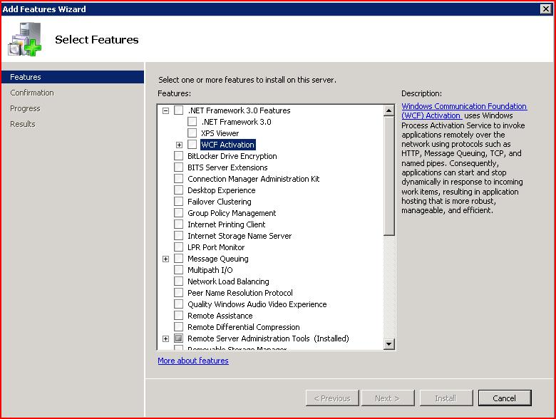

Windows Communication Framework (WCF)
====================
by [Walter Oliver](https://github.com/walterov)

Windows Communication Foundation (WCF) is a feature of Windows Server® 2008.

It can be activated by using the Server Manager's "Add Features Wizard". The Server Manager is a Microsoft Management Console plug-in found in the Control Panel. Use WCF as part of the Application Server Role for deployment of a Web Services application. See the [Application Server Role](http://technet2.microsoft.com/windowsserver2008/en/library/4b40220c-ae1e-494e-902a-1b41057661fa1033.mspx?mfr=true "Application Server Role") documentation for information.

The following dialog shows the "Add Feature Wizard" dialog in Server Manager used to activate WCF. See the highlighted item.

