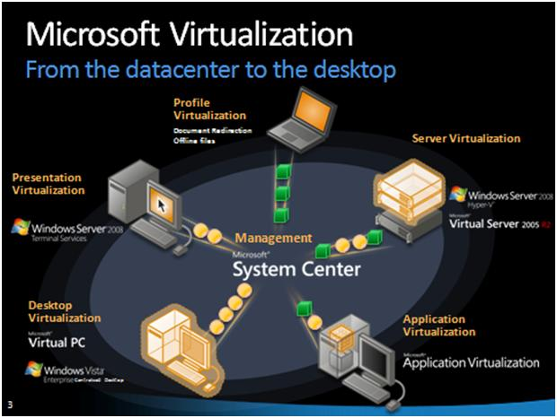
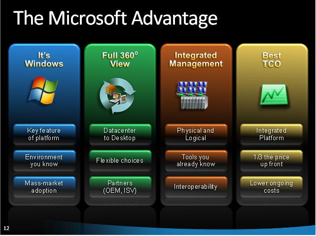
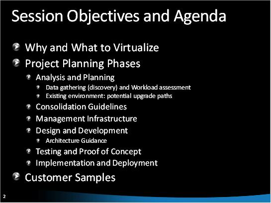
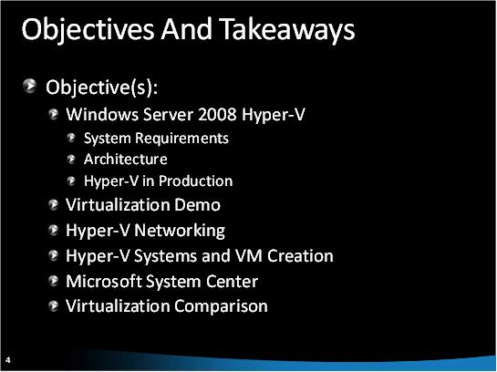
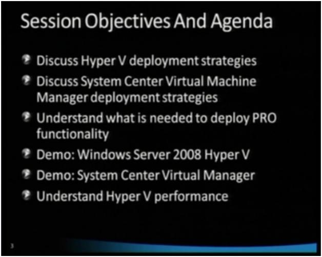
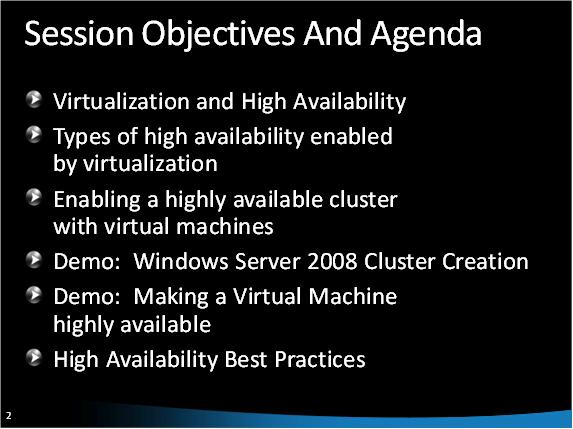
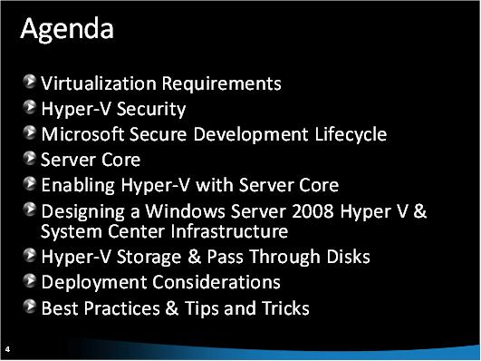

Hyper-V Guides
====================
by [Walter Oliver](https://github.com/walterov)

## Introduction

This article provides you with a set of guides, including tools, videos, and presentations to help you:

- Learn about Microsoft virtualization technologies.
- Make decisions about the right licenses for the right scenarios.
- Plan your Hyper-V deployment.
- Manage a virtual machines environment.
- Apply security best practices.

Hosters can take advantage of Hyper-V to implement a variety of scenarios, for example:

- Unmanaged dedicated server with Hyper-V
- Virtual dedicated server (VDS) for Web scenarios (using Windows Server guests in anonymous mode)
- Virtual dedicated server with line-of-business (LOB) scenarios (using Windows Server guests in authenticated mode)
- Use of virtualization in shared hosting scenarios
- Desktops as Hyper-V guests
- End customers running Microsoft products using the customers' own licenses on the guest OS

## Learn Hyper-V

The following [video](https://mediadl.microsoft.com/mediadl/IISNET/Media/HDA20-HyperV/Virtualization%20360-Microsoft%20Virtualization%20Strategy.wmv "video") provides an overview of Microsoft virtualization technologies and strategy, and explains why the technology has evolved to what it is now and where it is going in the future. It walks you through the various forms of virtualization: profile, presentation, desktop, application, server, and network.

This [download](https://download.microsoft.com/download/A/2/F/A2F199C0-672E-44E6-BF1D-878E233C3F08/ValueProp.zip "download") includes the slides that are presented in the video above. 

The following [download](https://download.microsoft.com/download/A/2/F/A2F199C0-672E-44E6-BF1D-878E233C3F08/ValueProp.zip "download") describes the value proposition for Hyper-V:

## Licensing Guide for Common Hosting Scenarios with Hyper-V

This [paper](https://download.microsoft.com/download/A/2/F/A2F199C0-672E-44E6-BF1D-878E233C3F08/HypeVLicensingWhitepaper.zip "paper") explains how to license different editions of Windows Server 2008 and SQL Server 2008 in a virtualized hosting environment that leverages the SPLA model. Additionally, it outlines the SPLA licensing implications of some common Hyper-V-based virtualized hosting scenarios.

This whitepaper also documents common hosting scenarios that use Windows Server® 2008 Hyper-V™ virtualization technology and Microsoft SQL Server® database management software with the Microsoft Services Provider License Agreement (SPLA). The SPLA has two licensing models – Per Processor and Per Subscriber (by using a Subscriber Access License, or SAL). Some products are available through both licensing models. In a virtual environment, there are no new restrictions on the number of instances running under the SAL licensing model. However, the per-processor model introduces new considerations, which are outlined in this whitepaper.

## Planning for Hyper-V

This [video](https://mediadl.microsoft.com/mediadl/IISNET/Media/HDA20-HyperV/Scalable%20Virtualized%20Infrastructure.wmv "video") provides a guide to planning your virtualization project:

### Microsoft Assessment and Planning Solution Accelerator (MAP)

After becoming familiarized with Hyper-V scenarios and license options, the next step in implementing Hyper-V is to plan the deployment of a virtualized environment. The [MAP tool](https://www.microsoft.com/MAP "MAP tool") is a powerful inventory, assessment, and reporting tool that can securely run in small or large IT environments without requiring the installation of agent software on any computers or devices. The data and analysis provided by this Solution Accelerator can significantly simplify the planning process.

This [download](https://download.microsoft.com/download/A/2/F/A2F199C0-672E-44E6-BF1D-878E233C3F08/IntroducingMicrosoftAssessmentandPlanningSolutionAccelerator.zip "download") provides an overview of the Microsoft Assessment and Planning Toolkit 3.1 (MAP). This tool provides planning support beyond just virtualization; it helps you analyze the different parts of your infrastructure and helps you determine which servers need to be consolidated. It offers recommendations for server and application virtualization and works with the Return on Investment (ROI) tool to generate ROI calculations.

This [download](https://download.microsoft.com/download/A/2/F/A2F199C0-672E-44E6-BF1D-878E233C3F08/Migration.zip "download") explains how you can take advantage of MAP to plan your migration projects.

### More on Capacity Planning

This [video](https://mediadl.microsoft.com/mediadl/IISNET/Media/HDA20-HyperV/Hyper-V%20Architecture,%20Scenarios%20&amp;%20Networking.wmv "video") provides a brief introduction to the MAP tool, Hyper-V architecture, system requirements, virtualization demo, Hyper-V systems and VM creation, and Microsoft System Center.

This [download](https://download.microsoft.com/download/A/2/F/A2F199C0-672E-44E6-BF1D-878E233C3F08/CapacityPlanning.zip "download") contains the slides for the video above and further documentation about capacity planning.

Review the [Planning and Design Guide](https://technet.microsoft.com/en-us/library/cc196387.aspx "Planning and Design Guide") for a comprehensive guide about Microsoft infrastructure products.

## Deploying Hyper-V

The following [video](https://www.microsoft.com/emea/spotlight/sessionh.aspx?videoid=999&amp;PUID=0003BFFD806C3741 "video") provides a guide to Hyper-V deployment. It includes hardware requirements, storage, networking, high availability, backup, and SVMM deployment best practices.

### High Availability

This [download](https://download.microsoft.com/download/A/2/F/A2F199C0-672E-44E6-BF1D-878E233C3F08/HighAvailability.zip "download") provides documentation about Hyper-V for high availability environments, including a step-by-step guide for setting up Hyper-V clusters.

This [video](https://mediadl.microsoft.com/mediadl/IISNET/Media/HDA20-HyperV/Virtualization%20and%20High%20Availability.wmv "video") walks through the various aspects of Hyper-V high availability, including demos for creating a cluster and virtual machines.

## Provisioning Virtual Machines, a Guide for Hosters

This [whitepaper](https://download.microsoft.com/download/A/2/F/A2F199C0-672E-44E6-BF1D-878E233C3F08/ProvisioningHyper-VVirtualMachineinHostingEnvironment.docx "whitepaper") discusses different approaches to provisioning and managing Microsoft Hyper-V virtual machines in hosting environments. It especially focuses on approaches for automating the processes of provisioning and managing, so hosting companies can construct their Hyper-V offers quickly and integrate them with their existing environment. This whitepaper is targeted toward hosting companies that offer or are planning to offer virtualization hosting solutions that use newly released Microsoft Hyper-V technology.

## Managing Hyper-V

Microsoft provides the tools that hosters need to make the most of their Hyper-V deployment:

- [Virtual Machine Management (VMM )2008](https://technet.microsoft.com/en-us/scvmm/default.aspx "Virtual Machine Management (VMM) 2008") is a comprehensive management solution for the virtualized datacenter, enabling increased physical server utilization, centralized management of virtual machine infrastructure, and rapid provisioning of new virtual machines by the administrator and by authorized end users.
- The [Offline Virtual Machine Servicing Tool](https://technet.microsoft.com/en-us/library/cc501231.aspx "Offline Virtual Machine Servicing Tool") allows hosters to keep their offline (or dormant) virtual machines updated with the latest patches. This video provides an overview of the tool and a guide about how to streamline the process of servicing offline virtual machines.
- The following [download](https://download.microsoft.com/download/A/2/F/A2F199C0-672E-44E6-BF1D-878E233C3F08/ManagingHyperV.zip "download") provides an overview about the automation facilities for virtualization management.

## Security

The following videos provide step-by-step guidance on how use the best security practices to enable Hyper-V in your environment:

- [Windows Server 2008 Hyper-V Security and Best Practices – Part I](https://mediadl.microsoft.com/mediadl/IISNET/Media/HDA20-HyperV/Windows%20Server%202008%20Hyper-V%20Security%20and%20Best%20Practices1.wmv "Windows Server 2008 Hyper-V Security and Best Practices - Part I")
- [Windows Server 2008 Hyper-V Security and Best Practices – Part II](https://mediadl.microsoft.com/mediadl/IISNET/Media/HDA20-HyperV/Windows%20Server%202008%20Hyper-V%20Security%20and%20Best%20Practices2.wmv "Windows Server 2008 Hyper-V Security and Best Practices - Part II") 

This [download](https://download.microsoft.com/download/A/2/F/A2F199C0-672E-44E6-BF1D-878E233C3F08/Security.zip "download") provides the slides for these videos.

## Conclusion

This article provides a map to the various guides, tools, videos, and presentations to guide you in all key aspects of Hyper-V: learning, licensing, planning, deploying, provisioning, managing, and securing your Hyper-V deployments.