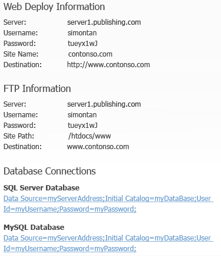

Create Welcome E-mails
====================
by [Crystal Hoyer](https://github.com/crystalhoyer)

## Welcome E-mail Structure

As customers sign up for your hosting service, you need to provision sites/users for them on your server and then send them their server credentials. One way to send them their credentials is over e-mail. With the changes you've made to support WebMatrix, we recommend the following additions to your welcome e-mails to make it simple for customers to begin publishing their new site:

- Information on how to install WebMatrix, to easily develop and publish websites to you
- Profile XML file containing credential information (including database connection strings pre-created for the user), easily importable into WebMatrix
- Credentials in the body of the e-mail formatted in a way consistent with WebMatrix's user interface
- Control panel information so that the user can configure settings that are not available inside WebMatrix

### Information on how to install WebMatrix

WebMatrix is a solution that provides simple and seamless publishing from a development environment to a live site. We recommend in your introduction email to customers that you **direct them to install WebMatrix** using this link:

[Install WebMatrix using Web Platform Installer](https://www.microsoft.com/web/gallery/install.aspx?appid=WebMatrix)

### Profile XML file containing credential information

We have created an XML schema that is **easily importable into WebMatrix** during your users' publishing process, rather than requiring them to manually enter information into a dialog box. To find out more about how to create this XML file, please refer to our article here : [Generate a Profile XML](generate-a-profile-xml-file.md). We recommend that you provide the customer's new credentials in this profile XML format **as an attachment** to their welcome e-mail.

We recommend that this **includes databases** pre-created for the user, so as to make their first publishing experience successful with minimal configuration/setup needed.

### Credentials formatted consistently with WebMatrix's interface

For those customers that do wish to type in their connection information rather than loading a Profile XML file, you should provide the credentials as follows. This will enable customers to easily map the information from the email they receive from you with the information they need to enter in WebMatrix to publish their site.

### Control Panel Information

You should also provide control panel access for your customers so that they can easily manage settings/databases/etc. on their remote server, as these are outside the realm of WebMatrix. One suggestion is to set up [WebsitePanel](http://www.websitepanel.net/ "WebsitePanel") and integrate it into your IIS-based offering.

## Template

We have created an HTML e-mail template you can customize for your customers. Given this and an attached publish Profile XML file, the path from sign-up to first publish is seamless for the end-user:

[HTML e-mail template](create-welcome-e-mails/_static/create-welcome-e-mails-960-hosting email1.zip)

There are several places in the template where you can add branding and other messages.

## Next Steps

That's it! You're ready to [apply to the Web Hosting Gallery](https://www.microsoft.com/web/hosting/hostingprovider/register "Apply to join the Web Hosting Gallery") and go for the Spotlight status!

Keep in mind that as you apply, you will need to provide a test account to the WebMatrix team using [Profile XML format](generate-a-profile-xml-file.md "Generating a Profile XML file"), as well as some **Control Panel access**. We'll be testing your servers by publishing our web applications to that test account, and will let you know if we encounter any problems.

Good luck!
  
  
[Discuss in IIS Forums](https://forums.iis.net/1157.aspx)